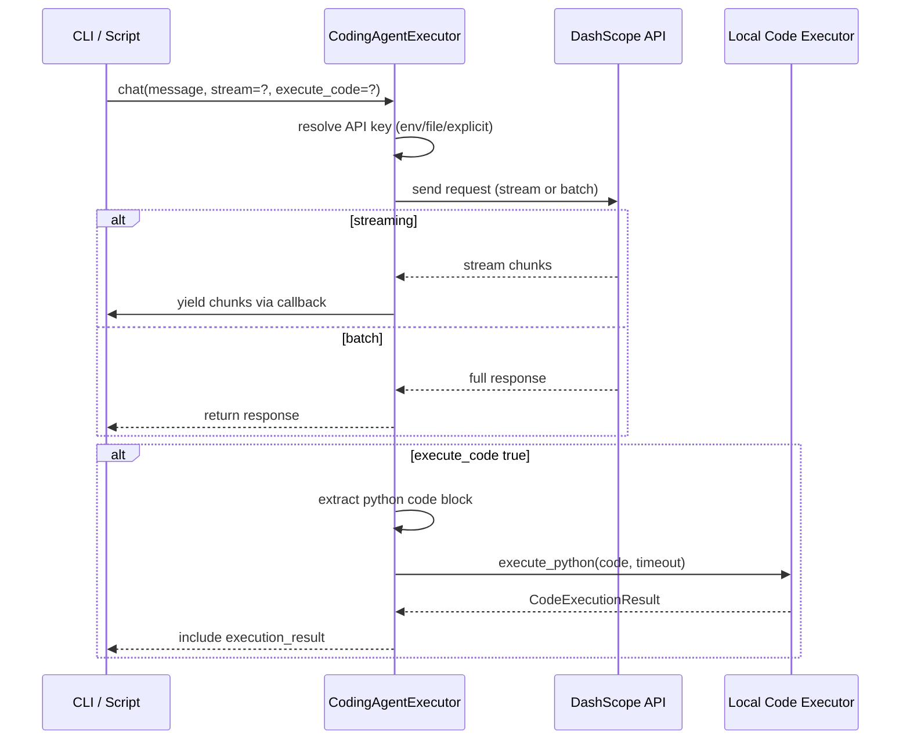
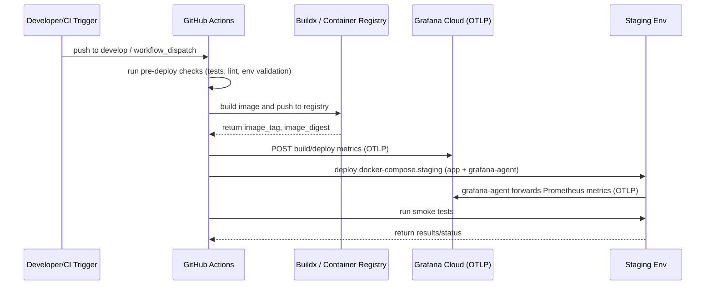
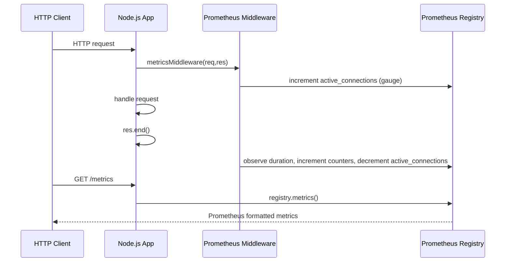

# 🤖 CodeRabbit Reviews for PR #23

**Title:** Merge/develop to main
**Author:** @deedk822-lang
**Status:** OPEN
**Base:** `main` → **Head:** `merge/develop-to-main`
**Created:** 2026-02-11 14:45 UTC
**Updated:** 2026-02-12 12:09 UTC
**Export Time:** 2026-02-12 12:42 UTC

---

## 📋 Summary (1 comment(s))

### Summary 1
*Posted: 2026-02-11 14:45 UTC*

<!-- This is an auto-generated comment: summarize by coderabbit.ai -->
<!-- walkthrough_start -->

<details>
<summary>📝 Walkthrough</summary>

## Walkthrough

Adds developer infra (linting, formatting, Dependabot, GitHub Actions CI/CD), Docker multi-stage build, Grafana/Prometheus monitoring, large backend refactors (models, middleware, DB, tracing, error handling), a Python CodingAgent package with examples/tests, frontend content updates, docs, and helper scripts.

## Changes

|Cohort / File(s)|Summary|
|---|---|
|**Container & Docker** <br> `Dockerfile`, `.dockerignore`|Add multi-stage Docker build (builder → production), non-root runtime, dumb-init, healthcheck; update Docker ignore rules to exclude node_modules, env variants, IDE files, tests, coverage, logs.|
|**Linting & Formatting** <br> `.eslintrc.js`, `.eslintignore`, `.prettierrc`|Add ESLint config with environment-specific overrides and Prettier config; add eslint ignore patterns.|
|**CI / CD / Dependabot** <br> `.github/workflows/ci.yml`, `.github/workflows/deploy-staging.yml`, `.github/workflows/security.yml`, `.github/dependabot.yml`, `.github/pull_request_template.md`, `.github/workflows/export-coderabbit-reviews.yml`|Introduce multi-job GitHub Actions workflows (Node/Python/frontend), CodeQL/Bandit/secret scans, staged deploy workflow that builds/pushes container images and sends OTLP metrics, Dependabot configuration, PR template, and a workflow to export CodeRabbit reviews.|
|**Monitoring & Grafana** <br> `grafana-agent-config.yaml`, `GRAFANA_CLOUD_SETUP.md`, `server/middleware/prometheus.js`|Add Grafana Agent OTLP config and onboarding doc; add Prometheus middleware, registry, /metrics endpoint, and helper counters for Stripe/checkout events.|
|**Python packaging & dependencies** <br> `pyproject.toml`, `requirements.in`, `requirements.txt`|Add Python packaging and tooling config (black/isort/mypy/pytest/coverage/flake8) and pinned dependency files for development and runtime.|
|**Python Agents & Tests** <br> `agents/coding_agent_executor.py`, `agents/coding_agent_example.py`, `agents/tests/*`, `agents/CODING_AGENT.md`, `agents/README.md`|Add CodingAgentExecutor class, AgentResponse/CodeExecutionResult dataclasses, local code execution sandbox, API-key resolution/fallback, create_agent/quick_chat helpers, rich CLI examples, documentation, and comprehensive unit tests.|
|**Backend Models** <br> `server/models/User.js`, `server/models/Transaction.js`|Major model refactors: streamlined User schema with new instance/static methods and hooks; Transaction schema expanded with detailed fields, virtuals, instance methods, statics, and indexes.|
|**Backend Middleware & Error Handling** <br> `server/middleware/auth.js`, `server/middleware/errorHandler.js`, `server/middleware/csrf.js`, `server/middleware/prometheus.js`|Consolidated auth flows and token handling, richer global error normalization, new CSRF middleware (token lifecycle + endpoint), and Prometheus metrics middleware with registry and helper functions.|
|**Database & Tracing** <br> `server/config/database.js`, `server/lib/tracing.js`|Consolidated MongoDB connection logic with options, events and graceful shutdown; minor tracer API formatting/signature adjustments.|
|**Diagnostics & Utilities** <br> `server/agents/auth-validator.js`, `server/agents/security-auditor.js`, `server/agents/diagnostic-runner.js`, `fix-conflicts.sh`|Simplified diagnostic runner and auditors; add fix-conflicts.sh to scan (and optionally naively fix) Git merge conflict markers.|
|**Frontend & Content** <br> `index.html`, `pricing.html`, `canceled.html`|Homepage rewrite; pricing page checkout flow refactor (fetch /config, create-checkout-session and improved client flow); canceled page simplified and externalized styles.|
|**Package & Scripts** <br> `package.json`|Move `main` to `server/server.js`, run npm scripts from `server` directory, remove root dependencies/devDependencies, and bump Node engine requirement.|
|**Tests & Config** <br> `server/jest.config.js`, `agents/tests/*`|Add explicit Jest server config with coverage thresholds; add comprehensive tests for the CodingAgent executor.|
|**Docs & Standards** <br> `PROFESSIONAL_STANDARDS_GAP_ANALYSIS.md`, `GRAFANA_CLOUD_SETUP.md`, `server/README.md`, `agents/CODING_AGENT.md`|Add gap-analysis and Grafana setup docs; update server README and agent documentation.|
|**Misc Config & Ignore** <br> `.gitignore`, `.dockerignore`, `.eslintignore`, `.prettierrc`, `.env.example`|Update git/docker ignore lists, add lint/format configs and .env example including DASHSCOPE_API_KEY. |

## Sequence Diagram(s)







## Estimated code review effort

🎯 5 (Critical) | ⏱️ ~120 minutes

## Possibly related PRs

- deedk822-lang/vaal-ai-empire-site#8: Overlaps agents changes (CodingAgentExecutor, examples, and agents README).

## Suggested labels

`codex`

</details>

<!-- walkthrough_end -->


<!-- pre_merge_checks_walkthrough_start -->

<details>
<summary>🚥 Pre-merge checks | ✅ 1 | ❌ 2</summary>

<details>
<summary>❌ Failed checks (1 warning, 1 inconclusive)</summary>

|     Check name    | Status         | Explanation                                                                                                                                                                           | Resolution                                                                                                                                                                                              |
| :---------------: | :------------- | :------------------------------------------------------------------------------------------------------------------------------------------------------------------------------------ | :------------------------------------------------------------------------------------------------------------------------------------------------------------------------------------------------------ |
| Description check | ⚠️ Warning     | The PR description is entirely the unfilled template with no substantive content, issue references, change summary, testing details, or checklist completions provided by the author. | Fill out all template sections: provide a detailed summary of changes, specify the type of change, describe testing performed, and complete the checklist items honestly.                               |
|    Title check    | ❓ Inconclusive | The title 'Merge/develop to main' is too vague and generic, describing only the branch operation without conveying the actual substantive changes made in the PR.                     | Replace with a descriptive title summarizing the main changes, such as 'Add comprehensive CI/CD, linting, and security infrastructure' or 'Introduce multi-language testing and deployment automation'. |

</details>
<details>
<summary>✅ Passed checks (1 passed)</summary>

|     Check name     | Status   | Explanation                                                                         |
| :----------------: | :------- | :---------------------------------------------------------------------------------- |
| Docstring Coverage | ✅ Passed | Docstring coverage is 97.83% which is sufficient. The required threshold is 80.00%. |

</details>

<sub>✏️ Tip: You can configure your own custom pre-merge checks in the settings.</sub>

</details>

<!-- pre_merge_checks_walkthrough_end -->

<!-- finishing_touch_checkbox_start -->

<details>
<summary>✨ Finishing touches</summary>

<details>
<summary>🧪 Generate unit tests (beta)</summary>

- [ ] <!-- {"checkboxId": "f47ac10b-58cc-4372-a567-0e02b2c3d479", "radioGroupId": "utg-output-choice-group-unknown_comment_id"} -->   Create PR with unit tests
- [ ] <!-- {"checkboxId": "07f1e7d6-8a8e-4e23-9900-8731c2c87f58", "radioGroupId": "utg-output-choice-group-unknown_comment_id"} -->   Post copyable unit tests in a comment
- [ ] <!-- {"checkboxId": "6ba7b810-9dad-11d1-80b4-00c04fd430c8", "radioGroupId": "utg-output-choice-group-unknown_comment_id"} -->   Commit unit tests in branch `merge/develop-to-main`

</details>

</details>

<!-- finishing_touch_checkbox_end -->

<!-- tips_start -->

---

Thanks for using [CodeRabbit](https://coderabbit.ai?utm_source=oss&utm_medium=github&utm_campaign=deedk822-lang/vaal-ai-empire-site&utm_content=23)! It's free for OSS, and your support helps us grow. If you like it, consider giving us a shout-out.

<details>
<summary>❤️ Share</summary>

- [X](https://twitter.com/intent/tweet?text=I%20just%20used%20%40coderabbitai%20for%20my%20code%20review%2C%20and%20it%27s%20fantastic%21%20It%27s%20free%20for%20OSS%20and%20offers%20a%20free%20trial%20for%20the%20proprietary%20code.%20Check%20it%20out%3A&url=https%3A//coderabbit.ai)
- [Mastodon](https://mastodon.social/share?text=I%20just%20used%20%40coderabbitai%20for%20my%20code%20review%2C%20and%20it%27s%20fantastic%21%20It%27s%20free%20for%20OSS%20and%20offers%20a%20free%20trial%20for%20the%20proprietary%20code.%20Check%20it%20out%3A%20https%3A%2F%2Fcoderabbit.ai)
- [Reddit](https://www.reddit.com/submit?title=Great%20tool%20for%20code%20review%20-%20CodeRabbit&text=I%20just%20used%20CodeRabbit%20for%20my%20code%20review%2C%20and%20it%27s%20fantastic%21%20It%27s%20free%20for%20OSS%20and%20offers%20a%20free%20trial%20for%20proprietary%20code.%20Check%20it%20out%3A%20https%3A//coderabbit.ai)
- [LinkedIn](https://www.linkedin.com/sharing/share-offsite/?url=https%3A%2F%2Fcoderabbit.ai&mini=true&title=Great%20tool%20for%20code%20review%20-%20CodeRabbit&summary=I%20just%20used%20CodeRabbit%20for%20my%20code%20review%2C%20and%20it%27s%20fantastic%21%20It%27s%20free%20for%20OSS%20and%20offers%20a%20free%20trial%20for%20proprietary%20code)

</details>

<sub>Comment `@coderabbitai help` to get the list of available commands and usage tips.</sub>

<!-- tips_end -->

<!-- internal state start -->


<!-- DwQgtGAEAqAWCWBnSTIEMB26CuAXA9mAOYCmGJATmriQCaQDG+Ats2bgFyQAOFk+AIwBWJBrngA3EsgEBPRvlqU0AgfFwA6NPEgQAfACgjoCEYDEZyAAUASpETZWaCrIPR1AGxJcAspVIA9EpSHvjckASQzNpYABS2kGYATADMAJSQkAYAqjYAMlywuLjciBwBAUTqsNgCGkzMQSR0ANYAHElJYB6YRAESaGgeYNpgJMzc8BQkYIjqJAHc2B4eAamZOYiUXEqtHV09GEQbAMr42BQMJJACVBgMsFxsFIHBJKHcYARg0fBYgEmEMGcpFwNzuDyeMVOuGo2DK/G4ZA2AGFptQ6OhOJAkgAGJIANjAeLAAEYSdASQAWDiUgCsHBSAE4AFobGwkCTwEgAd0o8Iw+HIkA8SBo9CyeRU735guuIsQYqMABFpAwKPBuOJBVxcLBrgklIg1RqtVgmBgYX9kJhINgMAAzeArDE0CY9GiQaYAR2w0nER3Q9kc0Rc/HtjFgvWk6Aw9G5CAeKEQDmuqEdAA86AAaCKyRFhiNRnM0BV/Y5KS0eRA5zD0NAKN0kU0R0QteWaSAAOXwKEbbAt1HggsgFe0VZzSBTnpI9soZCu1ZbDDboob3C8psX+D4Jf95abY+QvOmPAo+E5SloGnMlmRLGY6ii0kQaFIyAcThcBigGa4AEFaFoaZk0gO8lBsFQ1FBaZOR5JMU2QQAUAltbhaHRZA/gYDxsCULhvWwKZrm7JQNCEZA9AAXlxDQSUZDQcRQLAtgoKQKEWNBl1fEhSMQYd7W3SAfEFIh8CVAAhSAAHYNHTNdBzUEVcFkABuad1w464lF4UR0XoKxZCsJUADEkkgblqh4PNaHtSjKXo+jGOnH1CP7XBEA0P4Y3oaZSHIKgPXwlz2Hc3B01BTl60mT4GkmLxVOmZhz2uc1/V9MBBTGCgzz4e0z2YUDFBIABFPIYyGWQAC9rgVEhwk8rYGAudRZA0WRmA8ewe3tMcLmjBwKG6q5VIFD1dWoRhEAGnj0A8NFaHkOFozVPMCA0cQHyOE40FnABRH0hkgfi+HNBVMFwL54DYOT1V4jANEE58uPsGESxmjrjXEBgDrAkgINUR8YK5bl4N9I853QQDgK2K8NigQBeDcAXZ3IGyVD0QK8DIIBjkgeQI7rDsZIUkgZC2BhNCYSCfBGtcwdh2wVGAveXSIh7H6/qg6dYOB5xxEGtzr2/MBDAMEwoDIeh8HDNA8EIXzlDFBtXK4Xh+GEURxCkGR5CYJQqH+zRtF0IWRfAKA4FQVAbWl745f8jEGiVz00GBj8Q3kOQFF1zGDZ0fQjBN0wDA0WgqZaSh4CIAVpg4AwACJ44MCxID/ABJYgyHljFXeceRJcLI5pCMKAANoZByGBiOo+uChlmjSJg9D8PI+3a4SHTLCcLLRXh14fARDEQ78A8XXrVjQ6nWjXKWAiPVICVRu+AEAjh4UC026xAUlAAfUS2ha8XDBuGYMAlCXogNFCIgcw0KpcGv2/K5bnMbB2v8lR8HaNGYWhr7ICRf4wBIC+VMhgAKAQAKmAV9Dw18MCyAYFvc4JQ8A5iYKxLi18JBGkKtfeASg0DFj9IuWswp8BEEQAESBl97op3uNhQ0ZknS0C+hQegkZYwigDHjP+UxBSuVIdAyAAx1RnXcv7ROlg/weBoP5IcGBkCRF1JpUQPRZGCmQHnNu3BtwKwEksAQIoGCQHYOoLkiAjDdmMembRFAxSLFqIYkcKjnC03kWZcGu94COjoALPIfwlrsNILQLgABqKkAQiRGB2qWaICsdbV2xnBGcR0sR+FoPARwccE6CzAEYDQf98npjQI2GO8dY4SOTmnW2zNs6hjzg8KM5iDAl2tHPNAiBYAnCYIiWYiIGBePgEYvUaBdaK3YF5QM5djGAN4Rgfhwj4AqC8HPP8JwAASJxkQAHkrA7S3n+KwKct4AGkdoAE1HJKMgPkwBhTinrmuI6LwE4LRnj3v0gM9Ypn6MMWAQaXcw7yHMrqQM6kriwCHqMgY2FuJdh7G3UUAKSCyA0XwBUNcxC9XQCeBKSUJZ8CGDIjEAhkWCnoFaSgpoBY3mTtI+WciFE9iuUoLCLjNwFi0TojEeiHGDOmeIcQhdvxwqsTYuxPy+UstUa4sGJ5PHeKvEYPx5BkANILsEyAISUgRJxFEmJzN4mcyBsY+0KTfB0AycwLJ5Scl5OkJw8Qzdo7WoqandOfkanBhzgWNVb4jAtMmXBHaJxlWgkfieJ51xYj5MQA68NJAMgpRiF3bg1AZFuLxpG0e9B0nTDENuMxLMbipidcS+QwbQ33TgNcVNxRKBuLQZQSAm8SA70UPvTEnp8D4FBCQ5irEczpPRfAJepoAhLyYfwPASw3KQFiEOu+Nxl60DSIQhUARG1UFIFO5Bs7YibowZASBG0eKromUpSYgjTqfXQMmJs2aeC8qMbm9WBboyxAlQwVByYJzRDfIO6gaA0j3UsfaO0Yg5EHUNb66MPa9QUHMlsalrq6VqLcYo2eUq2UMo5dYrl+LH0GL5SYwVTSoCWM5bYug9iiPPucWh2V1x5VckVQYZVASowarCTiHVer1oGsKkapJpqdHmvSZkspRdA4xodZcHipSE5JzddUhWtTc7hhg002huA3nYAXIG4GFa/ignNI6IgFxXHj2WdG+1xm5NkWA5AHaeHbGtLmEcZZpmI4WebIIfu4VFlRHbV4QpYrFxkCWV3SKZ5/NgHMkoYUxmu5bFwPTRhuoY7CpsN286XgQgTJ4WeOZ4yUt7mQLEW4+BuTMRzC2nM0hcSdBzCIBUwHhXOZoLGeEtmLQcDzfecW2YeDYSqBgDgLaAj9dYINn+w3sCjY4NpYoXI2JTf7Jea8UArAjatFwOrp4myCooJt6wzhmIIk3FwUQ0QABqfI5HYjxEkHMu9a6dQuFcaAeZuLCrvCeONAYa5eEXJhehXcrDTGW5QHMxFuJkScgRaYAQHzJjLJNkgzlgJLhaIuXuC53IIt7SsKrmArg1kQLIe4ARnbaGgkzIpm5UHqKHtcOEh6SELPOKqwqYB9qKW1uonTMQ90xS8OmZqL20CyU4dGREOVwOmkl7JVNVBmDhdwAwDQbWoBbNYuqBheNEB9IGc+wi+b1TSBjpkKA/bKCUPAZQ+T0ylnXBbdM/+b0qur14sskhePnyFPUNea3kAyL28d2RLglXqtNr/oOpALvGCUqhC2sAE7pFWmnMOiD6jg+6CPQ7yBu5pokPAYXjQRvRBO4AFJ+ndxModieBRgDtItWgYBhFiKgCnUtPA031txgJFtba97A/j+u9Ps2D2kBe38AZGIs01jHp+6nd7+ZGHNsgXuF4+o6b06l6Ys3Ct8PYL00QJunMhuM8WyMnIBLAtgNYSHR3GI0CIGh89wImwYiB9cJKWU8FJ4BJbcKAcxo8atz0694lkMlNUMZUi1mV6N4DNEXNdE+BP1+VTEhVi5AIMQplKNxUn0nFWU0MuAAADV7ELAgxAMgxySNSAMgmTOzTXMiWgggqLVeMzHzB7PzdWQePgIzC0OdUHTuQHHLerQBerMKcWXHHbeRHMFXZiLZTUBlHMX/LcPXQA4hMeeNKwfvCgeRNrNjfxVVQJOgUJRkEkXjAwaJfjOJQTQGYTM1B6cTK1STW1IOW+GoAQJoREWMFQHtVqdqBTcpJTKpDOO2egNTH1MwrTV5dtfTesFUPwtCAQHtTg7zD/WIM5P8HwPIDIemcmLuZgZYcQB5YxJgCnGqNXGOKAQ+fKWIM8HtePPNAgUMWOAIWONILgXkEgNseQI0PUUfEgHMBIEUB8UEEkHENQxJY8RcHoElccRWR8NgZMJ6bSDMJfOsKIP4bcMAWtRMQotGd/c4cINAbgdcWQLuSIIYDqVNTiN8E7eoudEAlo19dogIEArono5ofo+wB4OgWuUYuwcYx8KYmsQCUxQUA6WOL44UKUGBewYpZKe8FYx6UbY4EhI4j0E4tLPGDabcdiDXWAE7KKOdfSXUQUN483eQDo749xPojwAYgE4Y4ExLCYyAcE56WsZwPSWQSkrABY6UCZB2NEtYjEk7AAcXUDWVqGThzzcXnTNzaNpM6O6IZL+MGMBOeXxnZMfFpBzCFKrEYg7nSQDFji8NqBGAVMQFjhzBfCulFNBFWJfAlOaRWBuFCGXGQEWkDAdmHF6L+K+iUHuD/ywCEn8PkHGhxEZA4BxAYgf0gFjgeBbnnVqkQDSFjmWNBA2PgEzAfWwR6QEHaQxBELmEFBAx7ENUvj5U034D4BrgtEumuBJVvyHAoFUkFCZIyPMw/zxmthYGZi0kG3uAWgZmkBgMkTgPZQw2URIOQPDAIO5XQKIJIzMSLhFSXNoBo0cSwwYyC3SQVV8RMPziCQsKSGsNsMugEwS0cOBmSVExcMtRdQ8JvmqFqHsRWC3nwj9C3ldHUhoC/mCRdTCPdUziiK9TqQ01iI3JLjwLgkjS4DfN1A/KWC/J/IVD/PGAAu4m/lXktAwA4NOn8NYUfQ9IwtBH/PdFhWrQiGwuopNPoT6nVhwzxhVCNHVBUKpJgG+wLGRDMLnUTJKIz3KIBOXDSNkjCE3DPXZGovoBTmTFBhzDWS9zWXaRgAQGQDEmaCwGgD9CGz0oVAKgdEyNcRzH4tbHbBzC6WmDIA6R7W0PoBLihIwAOm7BLBoVBEWi3x6HBUhT5BFL1HEvwFkhDBxyLXM0AN1OtghQoHchFUNQEhrKMTrOcFTHiPeR8XEVgJkXgNnOIOlXZRQLFWXMI0cTXOwJpR8EwC8TryMgnmTlcqZKqgoCVRPJgy40pHxEvP1XsNvNmJNWcLyCqxfIgFyU8PfJ8O5G3BaHtFCGqw3XgCCI8BCNdXCI9VU0gvU1PKFW0100SMgGlNwFlIEHlPZWRBTjMhmrmq93oP3SWrag8AyCEtKI1GWRV1uPeFD0EAfWHNjHnDMUyxt0oFYjAH6TnVh2mmLOXHFjSAMBDxsDtA0SwFqDtFS26HQlBETIjJEnElvUDH7UGRIHhvz2qp0zzP4LhRInhxJDaBkgmWonTBJqgBOBoFKC4DEpaCQXtKbDS0hvh0TOeK+gBNQQ4lnmH0oOkBeVOhWENOv1iCksgyep5sanVCUhwHSUXW5Fp0ppxtEjEjULtDooVEXHplCBGQUHQW3QVowG7LxlppkjhpD2c20S2GQGP2KyEIWRd0Hx3CITnR8C2U7ElK2XEi3lyBThzGrwAHVoAt4TgdpkQX5oBrLoAbAU5dl47E7k6Tlzl6sNctdmaCorbWd1x8ARkMQIp0ZRBzxKaQCzI9QsBzje5eBFkaBhUp415YwwadBYgjIitOt6AAhuSb1OaMyi7+b3xebuAmdYwXKDpnirQYQPSvEu10j7iWguJuhQ4eJhwEUTai61loA8ihEhg8FLNYgih2oEALQMgSFkQTgThT6RQijhxYgFRZAvAHVnqLI5cUc5gpBjEsoBJ2FaBOEiBhVuB+SIUMAe7yToHhwuILQFF/aAAyRLJso4J20m6gdUWSPGCkmByAFIGiaY4hmiEkHMEhkkJIIu1m9MjmoKrmlBewae6wBBrARM4WvUaW5ejqP6kM/paMEQs044OatAMONoRYfkv0OWoQxM8RyRw2rAKB3cHMM28uvkgUy25QbdPGahkkYVP+DvM+1+uIHaGZIreZUx1xbBqAG7Gx16G5IBNue5TzFgB5TrZ8Ohr6BtQTPGbRTrcQA6BqSHcrVmzi64QFRcapDqUJ+9OxyABxl+9CSAavE4IOqzd9YsuYIxCnAcWSTmuGqASfMGphudMSZdIRcOR0L6U0RJ5ImQ/gJiEGygOBhwBgfHIuv8OtCYWdSIU6WxNLeuzyXcA864SIViLxd2KpuaEwppXXZQWWmeZKWI1/fa64esGKaYRugB64I6k6s6nDC6q6igWa+a9LR/YS8QDGo4bAQ9a5+AWYGEbdIQH60Wh4MsHMYZaRR/MelWyHf4zAQio4LYnRrdBJMVMsAWHK+ldRBAzDJAoqxc1A0qjAiqsjOFcgKqmq2cIy+q5ZP8JqyqSgNqlVHarjFIHESkXjdwsavJS0qa66+aihLSUIWQZ518aFx61a0ClTLOLamIxpIwPahI6ML5OCA5uUv8G00585r3caZC7wgIaas5m6hatl/ADl06CUx65tZE+gWOZI9lotVmrlo4LMxMq5fiYncyAMdFffLFEhL6VNBSLAsoYVaAdUIgUgOK5px9DpItN4D4OdNuU04o7ckOBgDMiZVV+V7kLeIdA42AVSCLAxJaQUVW6YUcotXxq4DqP4fYs8d/Z8T0JGngJtON9V9He0KU0IYsjqD26xkRdN7nEy3shfASSe0YjhsFyUqgbqVyyALZaAPIKwaZWgbRYzAIJe0nH7LbaYE+Wqdl/hMe76gQK3fPRGtxOmJeC0bADGsZxM+sPWvG/EVhliImvPFmtmjCOhHCFEhLTm7mqmuHKe1LGe5tI+RgMWr5i91iRiGW1YNRgrSxk/L25wRZdN5+8+qlYVSpydJNfxPgN506tMlI5Gg7Jdsujlse7ouh+9FCSABD4edMGsPARuz6VJyIKV06u8AcZDyAdkKodFWQKQoXMQDCP9JjA8cmAhJdJhB9JYDpOuWeJDvyMFzlN23sLiP818CZa80gRNiOOvJBGdLvSAE4cWJ8cm6Notft7aTAesZEUIHCYd0d8d1DudARzD0p8TygfDkPKRbWlFMt+RVSE6PfTjiZV22dEdsdv5bcWJBWUmdUPTvGSfEeuECZDp/HW0dzTEyAfl+gdJzJ1NT+zR695GaTgzwd4z0zpyw5SAQFQ6PKVhtUe9E7Y1rV01l5ruKz9DppnuRdzV3DphxcOzwUAi6HGL8WH4JsMLjMzdqAZzUQPAYRpiOrgMJt8ZY9pxR0cgegXIPILLyUiI1J+sKNsOCgMGjx/AJDHV7l9qewQii4psRi0QzEpui4/9omiZesd/Qz1ykYXyUEOYFlZwOdLzDt+gPGfz8d0LwZGNkhJBGXd8W9uu1pvgVr/hWIR+tZes2lEdFQfL84egZEPIS6sFEgCFYeBzrLrTrrJxHD/hQHvTmjgdoz0CAr8zsdsFxstzRKMOY2nM3ynH/y47CentefZAGHkrF6aLubhbg6S+CZXLqntCDpNI3k6cWcbNq4E7O8CYHZuyyQCZ94cYAb+QERztxeKpkhPnoQ69bypnVgdQDr8EPURy93WZfhQAps7xOKyc2lXKmcplRF+c5F0VfDRH9Fps0jDcglzZ3AjVRgxllV5lqrVl5drVzl3V9qWg2IfA1F7cjAyNOG4w8ljq0JSkPEHquw+2Bwgah82xLgNZCOWAUa6TcPqtllz4sbtWlqHlkCyRda8CoMT8bazTDc9kVy1YuV9V0r6eLT1W5qTT3xkF44SIEfpqdWrpTAE7DrJp8mn1ptQszZseEZUuPvEFJ5GRD1kPYTx/P3ZYDwb8jHUGUEAUCue9hLW4UnK3qIGISXGqUApxEIMILLuC+gWtWARAMAeNLrWcAtAQ43IDAJTGjZZctSwxClkP3yiBluy0ZHEHGQYiRAEBUZUEDGRQHIxoAyIE7KK0yptss284eQNokMTyBIgebL6oW17glsQIDPCtnwFr5VYa2J2dkNuCIA1Uqod7SIJQWcDNZBAYNdgGF2egYoD81wF6iJWWSV5+kZ9KqPQFQ4H988k9crrP1kB7Y4I9RWYA3zH5WdEyKg2mmoRyy9cWITaZ4tLE1rPR0yYBODJc0gAIAiAx/TuKCDyxfUSEAoWBt1GXr+tKA2ULLoQ2HANQ1BGg4GKoxgbaDR+6tKzrOxWBdwxItYdQMo0n7EcEhoIRBq9woTCFww2kLYLfTBYaMRkHBYsnPXOjTAxUu9JurYi8QcRQQsQSSCODQAoo2sIeH6CVDKhMk5g5WWjuqSmTxIvQHUPQRZFiR4NKa1eNAAMBsomgJkAQjAAoTPBy5GIpiOQWZRwAEBJ8YLIzh0KQCqQdevtFoLqRfCzh1anNArNIX+o/9KA/9BlAT1ECAsjQwLMsCEPK6Q5Zgvjddm52SFHU8gJACRg+nrDRAMA9zDqPEI6Rp4SyURW4ed1rTppscqkNIiCgIBeA7glFeFMAyd5F1Gm/1HNneXJJ2AuysgHoXBAEYkCwAOIqznCC7jEjRypI2YtaWbCJkEgDsYKBMgcGwBtBUzdWt1CdA35xh7ZNgcuw0gyAzwFdN/o832IXBXaNaQGFzisGlA7BfA9UPIIEECAhBryPlA60xTTA5h0gEGl3F8ECRERygUMugDVD7dwe6ZKUutxFDcDGBVw4cKA3AYTIjhiYLSCChGRCA4QuAVyL7WrptCSEmIwRvIHZBcxZRGnY5M0DlE8xqhA8AoaI0prxCShakHRA+l+AMc3EHgv5IBkbZoieRd+JgfBk2YXF5hIiQChuViAUYU+O5SVEixwzMZSqW/OgBn1hb7l8qe5Bct7yowEY/eAqdcsKnLHwpKxGBNseyjrEEYGxK6HFoRTxaggg+jVcqC1QsRB0doRgMgquLJYcZ1UoSJIOEjABJBGQVfcashXjS8tW+YFSIh3zdhCsC4mLdkNj3JROou49Sf/FxGHokJnGc6XFFIF+5ldAB7YO+joQyp6Ys4UPAIBLWCzSBXxCicWnBEAG/9KaVIoRvFRdq1hSyveaEQPhNFngQIMw7FLzBqHhYwOntUEIvkgApwlQ0SAIBajaIddl0QQUUOqFHRyI10e4ADBTFjHzEyEi4eeDDTf60cjm8LWIF6QOi7gywZ6PtJCP5jJwQ+KAXvMIMLR4w2Y3sITPeVQJ/CsAWiQxI+GEEUCewtxL3PEj1hQQaRXMdyN/Gd5SJXeOGVsTWPhbFUfePKWjJgQD7Cpuw2LCpNVSnF1UGqRLecaS0z4bizymqEkLSG1S7iDxeSJbEdkuAnjKkZ4z1J3yvF+pmkgEVpFMghyHYVsPZbgnxAarRpIpK2S4BkE8ipdOw/BWJHYOIpoRSKR0YLimmmBy95wluVhg+HtJlgvARUbAD2hGIRAVA0dPBLqHUZbBoAKgXHOqAtB9TaAA0iIFQCdBlgle0QMAlQBhq4ATg9xP9s4DPDcg9C2bAibQC2T2h2MNCW/rBk0IG5gCxuWplk1zCIgPWUAEqVk3hCt1xp/Ux/CliLRtBdUUAaqmc1AFYAs0ysLCSQGjpUAziHgFzqNOMwTSQUH04VDkRPr/SepAgKGa9PO6RBaGBgSxNWTIR8oBIjZdaC2Rx68iBIFsQCVcFoCqRdQFsLfL1EQFlS00Xcb7tlLujZUpylk+FtZM944Y7JnY33quX969jyMsoScbVXxbeTiWC4/yaYU4yhIUgF5SJDYV6qF9+qIYkvliGGrchwpBgbidt0Qot9YpyXC8d6nqQwUDA9HViLOn+GCgh41QPlCoO1mUB6CNxCINNTj5RpJ8TaP3PtXqZRBXqrs1hh+3i5dwW0HAXECMA8CTByA90W8WzyglSj2yNwEsjJ23QkJPx4rTUGCOhj2AUUroYniOUQkQk4xXyDKE0Sv6FR4ci0Y7AVEmCy4vZD2BCYWkFrftwaEAfERRF7jvJFc56O4IgDl5T0vAYgDEM3RHDKk30FCLNHAJWYCc8elcggUBN56OAVRc+RdEXNgYlyrEY3ZsBXIUI6JIAlIJIHvO979Rup9YH5iChOGRAAgp82APkOk57xmAi8wir2ljn8oXAU7eRhZGRA+AlQRaRss2kEwgEeIUc8YElC3zSjoulWC2t0kLQkJbYfKZ4oM2IkXNPI3UCQAJDzhbMuuZ4Z0D/1rmBCYQtiVhj6EakwtWZcLdDO7znKFUuZKLEql2L5k9ihUFY2hbzMcnDicMx4JjIoHnysYk4HkkWTOLFm+TWq8NYwAKEOgXAlEx0LruwGFjsYpZm4zVLSCkakhJImsyUjYD/BGQ/wnYP8FvAx5bJsgSoLOtAGyBWAgKMU5TOt02oJTjZwrZKdvwlbAwo2jgdgJZnoKjhZpAYcXkOxM5o8HounZANphICPdmwVdf7pTSuQOMDoqcJzBMEIjoALihiVxFWkwxUwXFQhTdNaEuAIAaAmoqNOEs4E0AXOOYbxfWD/Cvd7AgBFhGCxUHN0z0jMvsgJFKXU8/FcPMsOcRbjTgqggoM9GT25zOgFSE7N+RbLHhk99WqxcyinACDIhv5fSmYpjgxB8SR+YTQdDHzaj89rBDQqXuXVIocR8czEuqVTEBLARiwZ4BxNIAhTc8AwkVNCKGQ2FYBwlMVExHUwexTNamlmf3HvGmCeUd0YPewV7j6XYoUSAyhWPEDyhNg9QcIQLhQGC4YhkcA3IHvUsFDmyXQPYf7mCyP6orDqlPHxQVxeThtPkFHZ5ZZhITixhlTiSsPFRThE5eIF3BhA6VEoXB3o94WsD6OhSwdiiCKvTmSvwDGZFw4SpQCKFYhscJkOTWsvtxMzqJACDGcydOSskUKCq2GWyTQvskrlHJGLDcsLOnGQBZxPk5qn5LkUUtQkVIRkPn2vJ9UEkKskTKX0gDqzNZtgLZEZGDQnAU4QdP8HkHjrQBtFSoP8DYCVAnAt4kpA5Psh0V5AzkLqk4OYr1mWKNqArGxdBTsWzyDqvQjxir3kRq9BIwA36SODSX8IBUXgegIABwCB1U6sfqurQ1nq71b6v9WBrg12i91eGpTiRrv4gAXAIZ440UHieXrAajxB9ATgWcWJadD0AnApeqeEljPgla3JEiqXBSWaRc14yVlKjm8TIB+1PA1mGrUGSgJSJEwHRGdBqVE0vghANSoAzqbBLR59WMWnYI0mDJHwxAi0Jyw9BYJ7olUmXjCFba/p7ibkenjXWmznCTRm4H5bsNXgVcPQNQh7PMDVz2k3GjyCeHRNaLbgBiXncQRhBWCejZEAYK4QGDGYpZ6Y1vNbDNkOoylpWsrZgdVh+Xb4tCPASMJnLA09xDg5WIyOcH8KdyOpZ9JSKMVwVYB2QhQlVIuCsDWyOkP9M+Zm0hwSDfi3ZESEMEXCPNyicM0qKRqsTQbysF1HttoxU2acdBc/XxjmGq7yAzWGJMSQVDdCLJjRXSTpW+p1Kdh14mnW9hsMYChAEuYIBIQGAMQXA6gGlFEl3TDR9z7Qu3NMYPNaTqQMAyQlOT8LNKltnF/CLhkw3bCLhDUBiUONb1caNgspDGYaAOI3mJ5oMazNKk/xIgsyXeZCxlJPLYXKqOxaBMqsRn5nYEsWxNdybiy8mEtxZBq9qmYUpaSRuq8sq8rEiVmWrjUqssTM+TpaBwkGbkaZaHRTjB19kkpHaJ2GgBRrJMfLKxXGsvG2LrxFiIkfOoHDNhEKw64KONqVCTbJS022bfNrwqGhjQagT5OjC7jlLxko3RqG0R4BVY5w9AD2EVF5AYAUgYAH6Dt22zRcq6SodpJ0m6TXADkKce6CqEpWHQfhyGl4jph+EbRjgwEbRPIilqexW4mYR7UxKfCJQXAg0p6Neji2eiWA8ACqLYxzDORlw3JAhTVFKAE7t0yWh5OVjFUpVIwi6Q1G3A3k46Mx6KRHX+0agKhp4DSincnCK71S5wxohSVwqOB3aLQD2mWHwH3SC4xBeiFxJBp04QpS4MxA/JNzEG9QMyLyXKhBhPUsqusUhaDYxFQUvL1EEhTkFY3GTe1314zAtg6CC4rDDhTYUgXmmtiqEJkhiOyrCkxmCZUqJ4OzGK1YwFaLJRWhFpQqVU7sVVPMhyeVWq2YsmF+GKsUYhIzyBStbiUcZck0rDzTUx5LPm1uNVtBTVXWxWfQENQ4iBttqkasNvGqjaKEL8N+B/AW2KZTxBs6ImtqSncT0lL0B7HjCuRgRbtFShXU9u1ru1rEKEusGPGmAcCuBPiDzaBEx7xcnoF2zis2Gv72CK+IoRwRbLaQdIzNPSbRBwrjCR9gYiZD7WQG+2/awA/24hClMDBGRYdBu8rp3Jn6N9iOdeCHGBoXD3KnMRSRsDIC9L7DBacENnNunQkGF4q800lSAeZ3uITw2JLFRsQ9lYBwdxXZFDbwd0QcW2OpcPZlRjCv5lAJuzhUoFakeYZgLpJ6NAePmb9DotxaGi0FAmEASupG+6H+GbRwRW6BaJSBnIxDYGSuvED7MlhYoBl1K44mYmCmuKzxtId+aLhtGvIdQRomzNIngDF2XUSuDo6FsO3QTLMrkKUErAgHtCzop4+UbtZdHKLqGi0GC5Xjj1V5SBBpbTG5V3Db3vwdoFUzTfIBuVzsRSIm7/IrEQNKbZVbM8hSVpskJ7ytaLehe6w3Lp6k9aqlPQKhz3RHGMB5bhSQszWeTRZTWoReuPkWBSQklIGlmADaB8ZzVvW5SYNUfJpIht2SelgYBb0boZdRALeKNq3hM6QsUDCxW33PG96E162rLDyDVqidKDb2YzLpJh2whF2YXR/BjzThAQ1eTEAiB6Gl2iM5duASfQJAYNALsez8yFPYFiqghhkoyObh4oLUHk3sUbYdJ8jHhaJWVvYMLEWh178BFwVRMFhV3RCdHXuAQKnS0C3gNJiJZXK5Fzse3bgTsAaBw542qjncUClusDPcHZSxAejraEkFvFZ3An2dM8M5Y4MU2Ngt4UxLeNekRTRsMgSgRKPIiFx7hRB/O0Fn/NgZ87ikAuwTBCbwA46xRuu1eKxBfCM5GAJO/KFURzm9w+mi4QE4WC/U/sVgrBuLUXxMlG7yDGseE6jlt0TIGDI9ckxpyTXitKlKWxsn5Dwh2hSTNhrwN0aQNeA0Tlp1tICOYBcBjMOYbqLKY4gtAo83aDqBRB1VSaE0ugPQLVqLQcmPQB+ooLyAr6gh0T5WEkIAGQCdIHYMVrQkOozpjwKwfGb2Daw4DfAaTL1MYEdoAADVyJWA8gwaeOinB8BFnvD0QC4l3DxghncAYZw/U4mpPop4CiB1NETyuQYEljQYAaBpCLQOALiO8+sAsabQOxaw3QfxGQd7NXA50yZ1M7vG6kMGgDtxMYDaeQC/zf+2uJjgKP0yKGhwyhqENpOe3X5kqdgxxZAC3g7wYgl5w6BczGicBumnTWqLOjtPhws9a5nMLHFuJ2lEemptTngCy7R1nAbiAIlocw3HARDuBu0MDmQAQA5zrppMPFyyoh5qqcou0ySj9buCDWhJ5A5QO3Ao6yUNZhXKxQEhBm5E/gs8DvlHhvRSRRtOCfeZQCu9RO+Jx/OizXOht24YOAMMZmVNq8hNrFtpuiaAbZR0zHCaFsKgDTXr+koIO4+TSOAFkYQ06snRiCekWHSLl69E/iq4vHBjeyAc4wFVrA5h4w4MaYHlj3Xrzsdw4YCKUQ04AQPRJtSrXkwuCDQWy2vHdVUIDA/GaAfx8ZCQkBM4nxolhz2GWB8sWgLTG87cGCw9jEG9MQcvg0QWROytnWguURHOnzOFnizAal1eWeLPKNTTRJ9E0YWbF5UFVuejRInoq3diEjLkhCsRe1AMF0TxJrE+0kGQBXcAsQNILQU8iS0GCrRnWCFa6PomNAUDMgjVeBiJXTQ5BRq0kC3gChSTCO1k0cA6tdWsAPVsgn1faOhXcAFp6DcNdkCjXyMtVlE3Iims2mt4KQYE4VHCuWWMAy1xyGtY2uiMtrO1xsHtYOtdgjrCpU69Bq3iUhLrgCPkK4juvdXwJvVjIW0aeuDWbTb1sa+IuOv1WyCjV2kMCaFOkns54wLeGKc1DA3VroN9a+Df6tHBnrQ1ka7DYmsnWGrZ1/EFvH8sgmcbNx5ZPjf22E2OjUN3a6TcOvjW6rY2Smz9ckhbwH8wJlg66fpsPWCbm1tm69Y5sfWub8Nnm4jbOttBLr28O8qLbxuPWBrr3F6w8hhuc24bX13m0ScZBbweLS0lU2rZgFM3kGENzW+wG1u9H9rZN7m99aJMkmyTpYaNhbbexW2xtLN4m9DeltWbZbBtsgo2XysPJ7bJAa0z9btMOmLQTp4W8uHdNDxIAXpoyD6YyBCxatK1hm9cB9sUI/bktnW4HfiuOTPOZ0cgulZyslnsrFZxPlWYjnHBr8iiM2r6fHH3X1b4tyG1rZJuO2oAKMcmNRgwI2Hkx5BIK4XZ7tY7FdLxneWPtl2vddjb/Ly62lG2U6CIy4Nq4n2HvuW3uzlvs08fOHFNgD7Zy8I5czEfJjg3Z1skTL4BV0rk+BV5KQN5Xx2/5vaKdVVJ/5EFwdYBLQ+TcTPdkpOldQLJLW6Acgvq0CBYsDnQBpEpAWqxrWDua3CLDV2fTVLLJ4ykhaQmsjW0TahsRXjsfR6NQMfimrbhjSUqANHI0jbE5gKWnCd2bm6H5pAlcDEHPaIDbHF79m9pP/xyaDzsl8wPJe2pMzCC5B0YGJabdo3yEMdFlzk9xT7QvQmMRnUgK5CzM6YI9vB0IfEdIxcAWHbDqe20XMqFRJ9cidkA4GkRgttjxj1HVsDnTrhoueocOU2nNq0BOjkwLeICi3iWH3HE8VBGiG8ur3IAtN9napAwKedVdmF0ZRCsUBlwvcgDldNCeknbMnD6awBuDrAAldgIQ8aRzzYHOvGpLj4QFDmBK6RpJOhE5tlB2WRzcpk8F6nQuYbpIgxFkF7XtaAGBOgXc/Iu8WVKbSFt6C3Z083Nx7W9RCuKcRhtQA6uiWwGu+NEEjtqwZQWTUzyR+vDNs47krANuKpZk0oql4o0gVHbQFGckoGgepymU3RFDqU8YdNtIKpC3gOjW0szkKwRbR2jPDcC1pHRGDtA44dh2Z37onf2FwTjLWBorlhC5BCFUAdocYWOFafCoU4fYdgBiCEnMqEsZF4cC6xUCzSlIw3YAxx1nQ4T4t4B3GGV04eigzoWeSxxOSLqT6M2CWTyN2trASUhs/5P5BPCEP0AZu78hEc2SQQikvAmAemFl3ZC67kAP0Qx4KGMelEKpuAEOCwwVC6w3+hODHVIW53Dh8ZYLcecvcVQ4FT7sL5gy6ep13OrHKmYfQJH9JYAYQiAcKrEF5CnUOK5xWPDaYTvm5FkiJR0GkVcqdN4Az1RutocQsgvmnkDv/HwGwMAvxkqAcC4vwwDsIyZ+FcZHoaOBouOsZt7nHfxxcTzvpIAqrLAxFDM8TDFoCi+2VMQ2isXgmBLd6UpoIvmZI3WfX+rEcUGf2rrFF4DSLqVuVTpJidYKFGdmnNea8egAM3phipIAlE8XIug3Scu3+k2O0DmE+IvRucTgLrFly9aunkAPQIygbPzcJY8YCZpqlI9CWBYR3pb9FwRuBCD6+8cVKLGPE1ORm0X3/Kc2BsAYLnqDRAZZHQe3Q3vtDqT5FPS+WSOO/2VT/YU+5ITujPRiePVz3HV3f4/WsQf8vLF6jFgwgmNpXH+XwBhxDCc2GffK6NdsuAL3TaSWu+K1psvAdEl8NBxucPGmXujh7NfbzH8i+YLcHBWQlVwvyn7zdnsKmNGeJkbDlFjEPqL4BRuxGAkcCx6+iaI8s0J2Ae8zB6uyWxpU/HsPVP7lX84ISLt1qRg1Ouka0+heRCQssD+xirbvKI5zLK1bkWFqR6q1ABM6cPyC2jhe7o+3A5387NtnB5PbwdvWIYl4IulYCIIhP9824cgpeaXmXn367we0DWBceAoKIrk4+YF+RSeOvAwX2UGARLJbwmVFEDQIl5eyFQPACXpL1nOqKY28omoKL+QEIQTAIP0wNLxoCg/cBMbxX2DwQAQ+IBcv3UnD62niTXXMnFXjd3Ij/JofcALXr9yPhIAUR07VYBNKNZDwufHJpMLXeQTptbAPA/np8OKW8CiD7STz5O56ZgA1w6vujhr4VGW+p3vTA3nMIKBxOvOuAyhU0EMAADayIW4i7jO9nf0UAAXRhyyg7vd3nbyF8zv+nzHWz9RCQCG/54RvjiMb4oHIJ3OdnU3mbw+/m/oo5Xj2+b2kRTtp2fTi3yZ9t4R8Df3vycV7hY+++/etsRBQH6HyDOtowhLbsH0zlwgLeIgHX471xSapnfjML3r02979PV1BXGAYV9Ihx/WA8fET0PlhB+EUBLnooBDb5+m/o+QvnP/73ynx/kEQQ816gIgBF/2h0fSoQZLgFu86YcwRLWQHd4l/c/KSofBt2rybdqnbrYPsX7KHevGfkwpngxyR6FfSBSitBccRiMAzjx3gpccgrF2fDLeyCOYMgpK6QRcB0UvvhgpK98FB+dMIfhW+oGVvzfjMUfkt+17YA7x4QN1agFH6zTAmfH5hW1aKHV8UAGfkAM7zr9+wLv4QZBT70bmx+Oe6ALvmEG7+Hjl/M3WIYP376wWQ+dMO3r86jmIq4BY4Uf/GadAmA7B0Q+MqP418Lc44uAfiBUGd5V9iB8/SP57wn7t8YBz+JjrECd6VoXfbfKH9n7gBL9QAjIzthgo4+cfwBXH4Xjx5GliDnEL/bj3bVv8TP5+7v6Pp/7T/u9O+Q+wqY/3LYm/Z+trW/zC91BYdhp9zve71e9ovAvBaBtaF4BjYs7Mz3YBF7L/yc8j/E/zIIAnEZwh8I/N/jLwYA4EHgD/TYPxr9aAOB3yMEHQo0lkjVTVA60rCUkBxB8QKox60a9BU361rVLEHL5HBLB3BtdwChC89H5S8z2t+jOKWsUSHHaiaQYTNR3YZtGDeiegl5e12UscoBqnGhWjXgICB+AmPy3g9rfCmTRrtEB1cF+GKmHuMiALgFjhDKNSz4AolDqBiUdoOJRPAW9DQBtRkHMvSCkzVZgMkc69dgOn9G9JoxG0eAohACBdwZW1tss3Ah0W1u9ZbQgp41cQKMAKHA6hUNogO4jZ5ceUZDGYerObgSddmNXgUIn0MABSdXwAUA9sWeIMHmBKaRAPl0LPSuUkCQHeLDB0iuErnMwZeWIB9V1kTZB2Q9kcHVzozkM9BNcNQRuxZ4jwd1xGl2AI6RUdCBWolIlH5BQPJ1mwXgMpoGnA7FyEZzP3GA8ZEMdVTRClB7FiAFzREnA9/ISDxZgyvT9miB0wOD2q8tzcviF1QwAES4g81OvHZUiiTyyHdBfK4PkBgIQjgGZ0bfKCxtNAYVDNZ+mOvDsomobiymCoMJjX35AjFZ35MHsLwCOBdQE7GTds1eJDTxwDQ90c05g2IAtMMXWPyxMcXDIAIYOGCZDGEJhY0E1ATsZd0x0MXB7AxCt4WX2J81/eJH4tFgxqXu4BAJYOqgrgVynVB9uRXnZNV/AYPBZksPTH2VhLSK0p82AF9gN4E8dNmI8UPHfj/4quQDEXUUGByzxhK/YlwmQBXVf339vcJDQewSEbxEb8TsNZHeAFhP+yNc68U5wADRtacF10OCFukoBuyeQOEd0edox0d7Pd0g6g5gkewIVx7CWzs9ITAlAX13gXOCwAKwS4Tnwigsj3bIjwCyHrAxmBp0rJHLD1zKsUDVZk4wKZMTjWZs8XAEQFAIQMFURt0bDXWNNmM5UeNxcUsC4RubNjRago9OVXZlSrDI1wxmFZPSq0GFNPSrI1mSIC3JM9D1zmBI4OY2jBwwgeRhh+xKQOCcy/WDHlw5ba0Ew8+AfejpNZQZAHz1RmMTkKhuHG4AoFC9Q8lrYmxSwD4VtVXVUQcijagJCR95dB1ppNZKgQLUNAK+hWpCHEQJW0jZUhxq12QRKC/ECwr/AOwlDWNHkBxgElGkk/gGXGehP6C5WaBe0MeH6cI0A0TE452a4w2DupERg4IwMD0jek84B+ifplQ9HQ/ox8e7jXANwZRA4oTQDNQagqUbc3NlitesE5c/ISACPoT6KCImZcTUy0LREGdSWkIDCEJiUhgcPUHO5ZHHklIo0ieaAjcs3YVB8BdiPgFcpOQTYOHBOEfYV/BYBK5DMDQwcpRiAsyZbgnlFgMLmhY7wotFboL7W8K9EPAe6C2RJFS9yrcNeb0UgIwoacFTFJ5B0h+wNPUhRbFGwnTxiM9PVsKz1U9RIyFkqAlBzPCIkRkEqMFZAvhYDlZNgOcIGjCTF8DxqDMD805qVX3cgOkYQJ71BWPvV2pszVKTggQRV6VJDiJPMjijDEfmEDYGLe4RAsepF4HO4X0Gkms4ZwaWGkRBTLKHGQqolUnxCmlNEgqjOCQqKf4zmAy2DC5KJzXuArmYAT5AflbJ2TFnZRj0Kh4QUqPShbaKMjHgMwe6D+wCZNsg89hUZJlg464L/BksR5fHTGcoHNdwOg4LCmnEZz4YVBVAFuDNgdAuo2A0VJuIc+BzBgAJ6OejgAHMAoh3oj6IogcwPQB+jfovQCitLebqO2553eAGZ5ZwQcNfFRlGIH/FtiTmgi9HkbmyDZv8AeByEWQ9BTgQd+GEUpcsmE7Fnc+TOuGs1x5eMAaow2bS27gsAK7RzhV8FLF55do6BQWiGqC9BJdyHWqHGjlXLrl0DjgUzC6iwqXqKiIIUarAJpTuREDSFwwWJE+YAwMHnwFwwY6NkhUAer2AphvbLwsCMiGFWSUi6VEFh1owVg1w0OUS9W5jVfGswnh/BB2SC5UpbQBPVqItLA9hPxLuD+VxYm+i5jBQeKIHheYv1irpoYQ0h+FOQTy2kUhCODEoBEMdKhhAB4M1zjCE5ZcDSx14VXkRds/X7lxlZiZoS3ZWY1zEnl0LJtDzh/cO9F+4J4B9ASg/gbfkiAcRTTGljX7Oggpon3JejEFlwrlwOh0nbCF8wGyO0GSFEyWWKE9pOJgFCBFRblGnQtDRA1vUpot4znpT1IMCfNkwAIC5FsIE8CNAIsbkLEQbCHMS486VIcN2i/wisM6wZzf5iQspFEyjVidtASAzBxmKK1dM0sLy3ItV9IiM1BTwPlQJpUo8MH4g7QFgOuiEonzjaZ3FA8CdAQcW/g4IEgg6D3M4IJ8WfiIMSWJMIcjaPWcjtPKhV08U+fTzbDDPGWyyYx7fKINjOOCvFgBE+IM0TxL43AAyAhJBWHGhe4fzDXpfg3yJcCwkfEDlldUJvSMBHuPLhe5T8b7lahike8PCD9ZSIMNkoKGIPsVMo4GGaVtjVLTcVcpWhKM56E+9UYTZAZhIyAGLJQEujlwrlXfA1QO/y4QwTWeCsDKkWJUmB7Am7gNDtwWALjEKeJ7lR4zOMJQs57ocMT/CvAb0SBoNNUwUXhUQmmNIQOjAwKHj+IE7EeUiVJsht0UaRzVZ1VhR/C4YGHJsik13sS4AXwyuZl3ChIOH2kOoNFLRR0U9FPIAMUjFSbROAvVTsGRA9kMiTF5Yk+tQSSkk/ZEOQugtxIs5YjHeK4JD8K9VjByVIKwiTT6Qg32Yck+JP0VDFLeH+4t4WbSVArALZEm1oARTwmME5XJhGAKOfaMoAEQ+RJ4ANQd4H8QuACHBYAIVEgGi480EgDV4JI7C1jgZEuqL79+CPRM5UAlWPVp5x2Jcj4A/gGdHJDwVJRGi5LXfMD74MQWOAGAhgTowv9sKQiCzJ8FEEDtiQEDwAhQFQGkH3lTIRMmCkFEkGWDiQaLdT6VMbagEfx4VAJTBZUOWa2RIkye5OGBRgZ5MXZm6WOFUgjoPROK0rkWZLG8Fk9c1EBlk1iCq5aokV0BUjk8ZVuSNk0oizJf3crjJR/iYFKpTDWUbSzJpgCkSw1EWbqBFdKUt5MI4dEhDF5JriBVTxT5kxZKJSVkuwThSbkpMmETnuNlPCMY9DmSgS3ImBI8inJAWVq0TwvyLKM3Am8j60nCeowtQoom1GaMC4tuAMjgiB8JSjog7vgMB2QbkDPAPQC1PTArU5lS81cXaeHrAImSZLKZWwdl34hBdIbGGROQbshwjlLegFiAgIycwwiAgOiNKhJ/B9C8BOBBgAGJJDRDwQj7DNcDTU9mZL11gsACFDYAs0noFkAkEIBXfCXQWeF9T8wZ9jwAaRfqLCp6YdjmcN0qYCJwj0dcSUMNjEZwBFA1+DNPKwqTfACdMcsHrhIRUxaaGwTZeSXQXApE3EwXDSyI10wwvEWcB/4dEa4UmCxgoCW2IUItQ3GFiyN/ngxh06ZFGx0dcGOQ05hG9UZMh0sFmRAvVT/XYVw4qZAYiNTccifigmW8yqwlo6iIxBhmIXHkBC1VMTbUqvOylA4j5WGPwACxDJQc0u4YAEvlDI/0xeZZ1cQOviQwJ0CjJUMZkO219QseGb96yTgUIoZgnHUTIHANkMUtgmDqE/EDoTOO5C0UAdJi5cov4UhJfMKWHHDCdJDV6glUiBMQJXI8q1iM6FdVS8iXJHyOcDpZVwIqMgo7rQNTajevU4DK+ahIMBZA0gAqFko9hKGMuEqAFsjDQ+gDQMNUIK1hIoeHiFeSewAzNsT6+WxKMyTsSYU1At8SFOnA8Eim1uImUqYTHMieXfV/kgrB/FXD4TWxOHl4NUMCrpkyCEV8zUGdBmeJEvRwNkNfKSkWVJp0+XnfQEFVZQ9wQOXcA4BtaYkjkZF0B1A4BNiOmRwTuDaSVjgapagA4BOaLMmwTVIWOFSyW9LMl30/gVBTDg4wCyFjh6QlICzIl6MLQLAWsjhljhyQognrlowKjJWobIvFCTIBs20k9JQ4erFBJXKOkzxlmyXOSxFEJCeSuQARfhVJSJARbMEZC0IbLwhgFD8PWSOQAMQBppALMkn9psy6D+BBwAMGDYwgfhHGyVs2eDWzpxEN1PSwDUOBQhB7DVFhwEcIKCEJdMieVjhKIB2hxB6IYzKTJKIaiFogwc1SBwlAoBKHGRwMNrTAT6wyIx4zVUvjPciUjOBOckj/LkBXgUHCghiArPJTLfZBQWgkBBoUX0FgEgrf30MzWCItDpyzMgBVYIf/fHJr0XA/30YySc10y4gKhCnLehnMq+Nczt+XfV9IyCBgGCyAOULK/Z8oCLNoJzQKQCbJ1TMoWiyAwfg2h5Ys3/nMQ8c93xGyvxcgnGzaCXggHhPIMglJz+cj8TRoFsh7NTkJxXXJXg7cw3KOzaoPOTMRjctWFNysAc3N5zlMsiHJyaoj/iPgmo13KWyds/bMbE2cvXMJyyAN7I0AW0HnIeIycjAAFyyCYHLppQcnEFoJIgNPKohQc6HKzy50N3D5M5EI+3qpo8znNjzQE+kNoIEoGIGQBc86hkzzE+MRRgwy89nOoCuc7fRCg/QDgBb1aCMXOk5zcjhhSAVrGqAto84YfIFJRrf2HGpRMhRTCQ6Aqlk1k9I7SMMjVM2NSiCxA+1JZjK0zt1nhjjGNMW4bNSJmxx2XbIEupEDTrD2ZQIR+kezrgc4yiyOILuEfA+nM024VRBR1hPAGLZiNgw2I9NG+g78+lO+QtIyWMaFy04VGE8FYTs1AKuYmXibTuADmjL8qU4owxA0TG+BK8gwNkMu0ZgAQFwAAQG4HwKi2K9KIAYY4SN7RaAey1BUjSDrhGR/0J0Xf1gILc11NtiKZBrT0qJYWtESVXDOdjTKHbXmo0XYagtp2CnsiERAsZ0VgBYgAAHI2jdtikKyC50OtFrgEQsTIJUDpBdxzEgnjaI45GczIk72a+KuAU4bfj9D22YazC5mY7czjYq01ZgDStDQ3z4gBCoui2QzQQxBaAu4DQDwLYGVfOvSQPDaBrRDgHznMKjCnYTFjJwP9nspuYARObAOPGaEpRWQnRCy4VffD2WRjDVwuJQ8AAgCbpIIgWILDNGZLDkcRwYEKn4sw2wre5m3M0B8dyLZzy2RUkotA3Rs/f1OXAkEbQRN87BGAqJojChQjOxGI1U3LJZhCZEPxYs6fnJp8wCyiaKtDK1lnhIcC4GPy3aPoqMKsuNSg4QN+CCmnNW4NES9ThTcosYBKi4cATjmo6AHwAxi5hl+CvpYXBiBrCpEkdJOlOtJzI7M3z1sTZgKKjmKHsM+L4gh4eajLR7NQF3Oh3uBJGaiMgUdDsEAcmIoh8H0FKCwVP07kDicqCwvi80f5GcGk8DMMQocBOI/XWjhPs5mCPTL0i+wfT1TEhELUpEDqG2xMAQJWOk21NKnrBEyAHO6R5o8lBOgS9AKRz8wkCJG3F9xYKOqNQow1PvIvAp8lNSpMcaigZCE9WDWgWAFhK702EzfI4Su+E2UkDMg1tMshhSsQFFLjuBpXBxCQpUudJeOQDB/tJ0EU3GAwWW7ODyhCAgGtkjgI6VNJLceDiqZ9S+AQsgcNTUA9MH0Yy3eAzkvuD4JSYEZEAw9sZEhzAS87ii31iImRwo5tweYiJo0dMFhwl/SrAHhz23dfDNgPTKIoZQ0XMSF8o3TDBjlBY8qaX5Twoe7HVMdePt0tLMYgfCy4kAR8l7ginDMuFAsy6+TyzFwmnzERD+GRh+SLsP3TGZtc1TSIYxmIdE3RSBFT2t43Yxsvzxp8eb1/lQtHt1KwywWMJBQxDUJICBSdCCOI8O4PoozKhyn8B6BJGSEGlxJzWEKIAppeNHCxOLB9mt45cN9xLQq4NcqiA8wEAKjK8yrIvoBOcS5N058C58BVZgLGsx6ByEAWExkuwyT2tzripQFUgnM0PU81yk7gs7cPTCQwDk8YI0v4QSEESQDBSNeeJpRwEkq0gT49THPVTsczyPbDvItyV4UGtcgLnF9VJB1a0xMxfMoSmA6TM8CIok1LcJooowFjLvRNaDCgN89vnUyd85GHHJkAHCQQl00sNBjKL+P7P5hQoLEFVzBRAYpIBtwEeESx7+C3HlN5Ea2UHsH0A+0LjIK65TOU5RWIDyA8gHwG+L2AdRnEBFIMxENIyEDEmRxBQdQALRGTBCqvhJHPnAlxVBRvjBYhcdNRVMnKsfjQMMyUYI2YNEPwm0BTK3smwB8hN9MshdwNoxLonTDcpIA2gMAjTKJwXiFsQYvEoRexryqDSOERVeCu7lTEQBmRAbsHaBGBYA1uDVEJybc0rT3wOZOvixQvHSYw58RIJfl6YnNDNpN1EsCMsEAZZDKF9uFygZlk8TyFJyfSf6gki4IXEkbtyse6MwLOTYyvR1DUByvY0PKuavElIhMcmUqjCWClRycUj3gxzmw1VWTCNVb8B1SyElIE61txKiotUZM3ksij6Ks1MDgQCAIE8MO9b+DYrBjO+I0yyq0bPv5BouLMakH0Y430s2IcPVXLZzRgoWBh0HpFuLJcP4HxCVE64HurP4drBmzmYGAuxgZRDqUGR9hM1gIURcybOp1xytniay3RYDVE1IAVGup0MasoqIVQyYZwLh+zKHj8z3iEVRiF+GUPO2zpqsIHkB3xTS2MRLBCJLBYEFOyMMyJLEPnHd0S+ChdgB0rgHZAFlb0Q40EiTuTbM59ecobIpKl4GX0IRWVg6Zj+ZAAsZ7dcDlBAHGepMXALGSdmftpTcwPWkx4E4G7cEi0Yz3zppMcEfE0Uf9K+rQyMaowKZiVMWKJoYhTjR0eZAHMN5QQfw2NFhlAKnQKHo52txLbIlJK9UdKoCkchZkjuTkQAgXTX4RSIhlFWqUK9av2TUw7mUqsNHXsRC8Dq8ivQdKQSTOr0PA4vguq6KzWVurWjGKhMYUmNonkwbUtTJerOKx1JmpLip5U8TLMB4OoADRHsGod1waZmKCRytF15d685pjtoM1b0PTUEsK5DmCTcrEBjpek5ZXO4GlIbGXqWYBDyS4rFB7HQZe6zuT0JkwVVjYRgdLuH3qamFqpx1sgc7B2CYOMxjMdOmcEIEQ3CjDVEB2EJAHyh16mGCJL+AUyL3MucbslRiTS/2lvwCZJEDtysuTetXrJVdtgGdig3fQPqa5HUWNE84Zeqzok6HaF6TQtPlwJpTjHukuB1jZgydAsUVenAsgKl/Soiay7HEh4QNX7PE9O0TlyMpZZQsDNsRoouk3qQMrAEA8sAfescZqQuvEhwLi/GtekEU3xPVZVIbynm5NkxHmMYKNU+3iZF0fsLKj7KWxAnMPwrhrBY3lQtCDxnPThxPr0zDpHPrqmdUHeVZgwRo/jFuSRuk4BAZaE1B4cSIGo1j+MeDeUoyPvGPrpKnXRmKosIsTCASxaqGFDXyyeKxQwSrLhvqm0O+oPqBGoyiEb/EERv1Mh6hVEcTBkLgH7xxTe+ssxEGKQPCagw7yF5o4DUeLi58RFAFYyNosxh2gcxVAF1BNpDAE7JJFIONtCZi1pEDKVCQBmCbvlR8yYA0aF+s5U1UT+uKDYmqxuxwfRBdNQbwwTCARyLQYalGwemf8hGVyURAGGoYaWbGmKDCHxpbp/G2byU8NOejhUckzC5hB5e44iXd1lse1nfyFUMeojz98ykIVLDfQBl/kRQWcDTS+fU5XOBW2S5TpMmAeDzh8WgDFTaYxmS+AxJ0tYGDmDVmpumA0kABJA39VYfzB5cjac0L/luYH1h8hUmay2kQ11Amjbcs8Gyxha+CD9E4dqMSeMbFJK3Bt0aQ8aZoxJAjb5u7R9hHhrxKQLHFCubVIaIlQBB6x5pYxs04XkoyHfdFtxblS4VEl8jEbAzrzM8GJzELLZYYlCxkxKQihYHjPltgaCKLuF/lYgJHM4xHIG5M+JK4QcPTrNPeVXQr9yHOriNBM3Cp/90Axsis8a68GzrqD6qEwZzAQZRsHDbQQaLVbYgda3yYjEUZwoh/TAAG9rkRL0gAAAXzIJASuwtnQ23GmGbBBIxpywLe/e13DTzmjlvcEvcMFtaRzQfpCsc0W2dEXrAOGgAnzshU2JhUOCViDSItgJU0Wd7mo2gyCaWn5oFhcfdVVQJyCSWilbU4r019bf5INscgmc1iGpwrWijnrrYOW1poIbIietVb1UOgiC4cjA8PgdiKkllIrS9cipoZi62kHZKpMs6porjU1wmrqQJVo3SQCgiVUGRaLYLVGTI8ZuqlKOKk2RZj2nKiK/CxRG0O3AASFs34KvcN/OM0km3dubgigw01GTV9FNQSwZErtXpNmEuJrc4VfPdo9tcYRGPvM0XWhE4LlLcHh5h3AK6E9kb4+sGKE/ILLjJdrQCjjKa+647EbJRnRarUE/wZwShN8OpFQmBxuRlGXp07Ehqxx4KntCGAgLNZvkt787FvRasuLZCObU2zNkhbh5MDpvROqghSF48yQvi7j/iPUDYAsuS7w8BGoaimTTOJPjo/ab0L5XVjnaft2nK/mQTBJASmlZnsD7AjGPabpAOpvgwg403jhMNOwNPvaOCDMRaoBxR8HqhAm5MCy5qqYzAnr4wlwDBpqARMEcaMzR5CzFRQuKkCrKW8ExzF+4uky4YtO/kVtqkan8Kf5X+esgfbaTYAg4ytRKxGvyM1TuKo8E5I9sC7z0WeHrNCAbgGo1rgC/LnRiOpRG7rmwHDqe0SEb/TH5iOzWm3AmQpRCmBWGD6kZge3FTChNRjAimfkEuLwDGBH7Y8yEJboq3IwBQOpTsRU8umDXXd6skBGbBGiO0Am7Cgz6AV80gHVqci0K9HIwrtq5I12qhMwWTcl58koyOqIkEkHxBDGDkvcDa9CutorN2hTMtb9tIIUb4hkxruOwT21hJjV2K1uovbtzK9vhIKo1BDL9GXeaqjISOpgXDi2W7hSdNubEHubphRB4GQyLBc3nlbh2zPCBLUAFXAxBs1J2UQBEgpEX9kYiVsHKxta23kd0okgj18Nn4NGFBJPm3gt7IVhbZBsAn6ScvktlKd4FJhJ03w3sEwtPkBzA8zR+gCBuwE4DaE/gfzAexe4XJS/1Vedyr45D5LFGjQH4UtDPQ9CDLgto5gKqD1I3ILczfDRs6OKScQUjiI6hJq91lDY3av0g8YxcRxMpa7HOXAUI2mZHsoo68fH2t5/hX2SK7E5RsiJKGulHvVYyC8SvDclEO0oJrZnGXG8h4WyDtxN5gO2Cw7NaITjGlZ0TNo04lQeYURBrm78P3Ma4zyEaDdlSCNyiABQBHm6YQ7GQYBMwyY2WRd9agkxaaDfW2bBf5DrLza/SZAtnZjRSQTKJ73Hnw05BWj1xgwuAF2h3l+oFyxpy8XDh2TA4e3xsvVuw1AmPdUe8TiIo2pauAj65bOdCbaq+1trc5A2jbsK1uMzap27DWgTIM9ccrn0ckHW8QUxKxQJ4FBsCCRyEe7rbZ7uahXuqyve7zEEPC2Rh4S/sla1+jTSWqfetognoeQD/trhm22dHX722jckFa+3ZhWz0SArgARb6+lpjMzWje/sENHewdv/71HE/q1bxBY0wwAi6JZtcQg/bdvBtkBjllQHn+sgIEUCjEisLqF8kkCZAIkEupXay6m7qtVnCOTK3azM77iCBAMbhybrPuoh1EDnw16sdTxjNtnIAxAPGjwtFKhuuDiZjfromYXADdC87H8QfkTJcnNIQbKcwCOltCLcaFDs0Thfsh2JUcAMAjoCs7fnNBxB5sFPNOU44GpMRIfbm4gLBvgkTJ/24/O0QU7DXu6l8ZJBDw0tef2TKxNnXrr8SzgD7Hm8pCkZA2gpCswZXV7mVhGK1ReKkvfKiPRpoMJanLADEVtBzHsotACGGFsJIsETjEGM04xCVyzjXzr9ZuENEXHwnBhUm/VqhsiIDRHuK4BQiTjPAGzVhwF1UlIeko6Unk6mRMHOzHE5+RiLDLLbMfEsATsFDo9kWbRuxZ6VKGjAH8dl024eBxOU8hYK8ZFIt1OxyHbl98c+N17NYDPsAac9ZqtPVtyXKFfBXIOEssHXiwTG1zIQn3E2jKIypRr6mAKDPJrfQUMlrbt+rbt36DWiqyNbD+9cnGoCKvI0oGKA6gdITyKihLO7UgDge7aISj4r5BqcYllW7dmrBSRE+BiUq+7nqu1N+6L3H0NFjrezAyiIaqcQCqgtkT3NBNp4RLwCBJqihGe6SACltGTRjdp2ajvcFnGARjgQFq7gSMhvjlAzKx4QJHjsP4H4hpCgfXuzU3RxzoApCqDSmDSR8kdiBfWiuU6Kc1amHYAlRwfxhAJgCcHCAA29boRDzi4DvsiiXb7yhKI/J0G5bcG3EAYhdLOwV9bdLLgCkKvfZMCkLA2k7B/LGkQM0XiMzB2vwpISwfhJQy0seE5HpuUNznYlHOsIiMNquPR+H+M2BJwr4Et0evFAzQcQ0cBiLAYN1J2wipBGZ2iWWO7mSqYgiQUgU6pqN12m1UuqYRu3DhHnQOKnYh1lC0BRH4R5/qeriHIQc4qxIqODrKosSgs9FLI/EXugQQdgvo4zMI0bR1Uei1OwzBQNoycBUC8mR2KtY1XtcgglIQkGa+uhFJOStDQ0BS6/2KJu4oRC9LgXH4St4v6LQtKvxHGX0xMmKamRIQnbsrQKKiuRtximPAMkw6MLQUd4vZr+QLmEuJoGSjXEDO6mBkKPLrWBx8jtUHukCUrGkRWkdqBsEuRHrGqx9EdCIIgs9p+67FL6XEiOxgMC8rHIZe2OKkELThN847EMiH1WIztxmlHRMcwhgqCyyO8yEcOvCjaXsbUvr9F679RPGrHdLkcckwmDH2SahIERPzJknvqcyPqUmACoDXTBRTs/R0lE34D9IiR9R/5LiPnYEqX8uSav0ALv2i/2ASDl6JG1WH7RE8Z8aVrUxDCAInN1IyPDHlUlyK2r9+2Mc1SatAupFhns38kjRDAC3P9zcBuDNsnMKSNC/HmSzoFZL0ZVduLHbuoCZ8Drq8aluqWsTQEYSPujEYEGnwzhPtT26s5inozM0KfqB6e6aCdkaq0VE0lF0c9N6hSRQZEfxa8IyhF0yIuIOQbYu3+LiY2GKtscMsgwBgdK6VPUWsRMpgZpyxTaUKt3AyaRMFujDywekL4S6JMrfoRylX38yRVEctvEuUXLs7jpPO8BLp+6FgDEkx4O90EAwQvqeqaLlSFHioA0YtocGd0GdCB7+fISG9IZiK4JIADpnHFnpykl0D9BEOqSpYZ6Uy8BargJD9iD5EAP8HMNKAbWvlCfKsVmXDwJIafeITKwIp1FTBbjt/UFYDj2cLkiH3V0QafCtJAVJ5DXMSxD9BsyKBignsv/x0jHlN5blnO4eUr/ZemEVrRkNBtU4GyrjK+Gox9sSxz9uk1rLcoB/3mWrdIRtvAlgBoduQUGqLtrtwkp8KaHbAQSvtUlSDbNrn7o3Iul3BSe/A1wAi6EuRf788dqeUGi6SafVhpp3RmJoQ8QadXi5Z58VIAxpqjDip1ZkFUVmIWWaatQVZjWZIA4AYCBSCi6B0uenXpmRG1qi6SWj+m7XQuBDwtprYDlmh3U6almoAYCG0LPZ4WaumOvDWIGwO3VsvqtwZ8btqgoZ2v3q1gRnVUEUwR3Mc6pJIAsaLGuS86ru7GjIKaMBbqkUB8IOQIYHuZG6iKfgnJS77uxG7FWih3DvcUUGtAPARKCMoTEUyy759uUmD5R6pGoVDK7BMRR0moMWIjMTcDH6lBToOTTGsSCAZemjppK6cYnk3eizUzKURC3ppNCXTzkch857CHRA1KVDQ+RXETFOrCOoKnNZxnW9VARDUJ4rNObMSLsYVBKJ1a1epyiMFvlbXasOvbshcTxSdipxmVrn0fZDPAnMhQbNsUglmGNkFoewGwxqF/WebKugdJqzLWlkhmXDTw0QfYT/dL55kWcAmNCWHJHEsXKmNJkrUGYfnMCzyFXnC5k6cKg0MerCpz0QXZvXh0pdNpx18F9ECJZEAY8Fkp85u5Tc4doUhc7l+xidznSCE94NME7IhFNPNjxmy2Pn2xxdidTm6R8XDAtOWBp7UcMUOtwXD4PAAnm4hoqQtBGPX2WAiapZlvGAzoIHidaOqYRYTjT5xcPDBrWK7I6gera/plx0tSpQHCz+9YZ7dPxgwEWYqAZZlbyFJysahLZ6TWj90NU02xctEATsjmiQI3DyMXOxiiaQXRlVCagiDoMRerNzS8RGEzdqmBOgHT+rFEcXE5mWVpBWSy7t8m05ksdSQq6kCbMzc5wIKWloWYubWpHwrfJbHfutseS7P6ckydETmukwwmOILCWfkOOcpa44HkCNq2Ct+eemZU35+wCgW7KkhHv5Z0ruc7CowRyDAWVom+0pp65lwVAThUEEFncZzO+bgld9WJefkRoQLkfikuWIfJRwWyfyyE50EAA45fTNtvyb0h0/lUgdR+rFNQWKEIC3DqoMRsJk8xM8yL0GpIQhOWO0vrMclwdHUGmoYxyj2uDO+mxdmyP9XTLRdVlpaW2B9huEG7JlddtgyAvWyAF9aIswNsRbRCtFYxX/WgNo/EI82zOzYlEaTmQX9l6wxr6BJkDyTioAZezWX4VgBsRX5AZFbMxUV/0ymQrAhlYoBWViOAyBd9b7lTsOVuCC5W4Vnle+4tzLTm7Tn50iZZVZw0+08hf56PuCS5FuibJgdSnTkG5TlQUQULBKnk0XqAllZisdctCNKKCDeHsBGgZoNYOSo3E0yNCXPLNZneNyp8ie7HmRSICPy/8ckZwW1Vr0phBnGMnpfsLlz4nbNFhCjLJ0ZUMFjGV+sZRaXRnSfUawB7eKjkoz/y+EwBFVu0ma09tu6McpmqrI/r8B9fCFcdboVhglhWNIcVfp7OrDuxgEq+yfJzmR0UpefzzSu1vP6sVMglLWrgCgA5p6eoVfRW/W+6CDbRInn0LWz+4tYlzs/bld5XSCnOwsW+Z2tZAkSlzpabXuZltYgqGCelbFWu19th7XOVwYA8AJ1iVZnyMlzVCSBk53cR8nmB1gKNTSxwpYYqDAW6ofBAILwCKrqcCjjgnKl21O3zfu5RsOLt61Jegi94z5ra0J5aNJXQe1vFf7X5RdRcnNs2tKZuKPGEBY7Sf7SilnhzQg6B0mXiSuC7hfWvBEDaZWwiEQBaEDIBFb0MWeHsiTsZe0J5aAH9aRAAcggDRddYaevg8kQEjMrhqN26wrkNAE21A31KElCOhupIEsr77gV+X6Z8upjawAq6ecGE22NsDzE2yC46cGGhNlaEroC59Kgt74PLkCgE16mlq5BQ5txCqnP1W9wG7202Se9qiy+yJOBSgkhCKASgZwsQFigBiUo6suVOW3jhrfRukrNw/wZfz55x+JnBgO6NJpNOs9BTHjHNSKDNER0bsl2AFhfH0SxmeEEFmT0+Jza+8x4EjIF5FwTRrwi+ODQArkG/d9M5jJ5bLezak+C1f0o+1JsHi2GqBg0lXK4PEkcKQ8W2qCsT5b2PQzGIAiaGwxRE5ajbs0ls3DMsUmXmpW1ghZ3EcJ5b0A8LFAIFAsh1BjJoA0JZyxtMJieymljKc4931xw3N0ii8w946hfXiu4LeT6TjoXYv6KgSqHuXVbhpStSZpjAsP8RPudViy4BV24lVRs/Sjek3y4HJpzBcQShizw76N6b23YdKoqgBpm5BVq388I7Y5bIgZqIAcwoM22MRfgDqBWCPG3PouEBoILkIU3hijOGbN2Q/neDjRe8dcMla8mlXm7BVNDh2IRaTyGx7E1La6KidqbZx1tGrxPoa4ywKspdemK+K48lXMxa3qkQScHuYsdwLAo3xYNjZOxpmwP3tmT55pYZl3F7TfhMA5Y8Y1DWJzRn296m3jtQ2VgbXgMnoEN0ql6diR9Z5A0qNFx9mRa1dfUHuySHF0GJmMTYnk/qxHi+a3C7qSQasMsnBMbh69LYkKGokle3jUEcpkJ36F9zY4ntoNYK4aQYOdjBZHuK8eC2PNtNF/ZAcDHCy3mIE7D13VfQ4rRcCSHKFF3PkC+a9FgoHeblsReEvrR6SN15auhGiFnDh7Q9ysa3NGNF4B7Qj6r3dYQ0Xa8YUXKKXigMHSLaHbkZ+fSNKhKWYdHfzw8E1nHOwPYbRadAcwflhi5xhKFtRkxNmsCZ3553ISZcW9ySpPH4m7tUc65Eub0R5UR1Mz3o0RfkRSwq9k+rRcSCD/P92nG/ItqhTK+DzSxstj2CcbUVBDwLllNhuv1d0CVbfoAHY9RnHJ3G6vfn0a9Idyzxx97eu0zreaNOM1pLJklwSFOzyCrped2MH53IC8cl33pKtF2B3gJCmpnNIgZ3Z23XGl3fGRPdk+r9LHGV3D4Nn91WNiQcdNAw/3cDhTkUpNmKQK4aTsO7FMbZAWwLHBa96SUm37xymnrAHg9nf6K3pJAHoPD9plDW89pz7hp3XENjag0XDefe2cKpZfctFcAPwH32gNtA6bBvO2eEv35ALJKCtmUJYeNXgwnkwYtstqiZ1d0qcfIlhwwGwdBQzweghBA1g/H3+XyqVSTRcxFHsM/Qni2xbSW1mYcNBVv1s3fgrSNhE1+Hfubm0JTbIq5HsiirTbszXvhimawqqZ+MamXExgZjTGscfft7CMWV0Z7AMCbA0H6+zOsi8O0ChFpuSVKvmeI2+FtgCMIp2wqekVWK1fRArLmeqBAkH18Z2fWYqHiBrBX2HiACAXaKGFzsjLX+lXI+Z0dqCRGS6ca3E95BgbpByxtiCaOn1tKkok0RJYvGdGx09rLnP15Ce3NQV92k9GxLLhAObgw5ifFZTRECFWGrx5fE415QqlTDCwHD4FchNfIrg48onYGDvn6wXdLSYMmUqVl2LaJCPtZydgLrom5vXmpDjfmhugaoMxbAxuGpNST2uXAwe6WMPrHMBV/CVmb3WvJ1QbskBbB5YMMGrB5dxDZDSgjj0cwsgBdllqJeuzNUqtjkSyjhEg8NcmszIEGXJPO5xMjJHYW/F0jhtRW3BX2lPb5l875VgZeUmmY5TXaQdjSoc5IpieMkKKh6kePyckmfhsFAKm7KCjpboaOhIABANjblOxQ1U+sRCIWgDVO3+EQoeP5pnNA15ClOuAHrxYHU/jq2i8Wnd0lCply33YYQSFQmsjornQ2EF9PeQYuAEQpIRl6s/H6RLpUEvEWWO3LV5mJTzwCjJElDlqonbImIqudF4GcE6UZ9+QylFiTzfZEtjD+6EJPj+8qjREwAJeJN6FPWID/ALiHU6H362IYB1PFjpEWmdcARjUfjRaYkj/B3W+rDREGRigCI2B9tiNoVmW5I/FZUDQ+eGP7T5xduImzkSyDHkdds+QAJN5s7MqeuIEpiLjDrJU4UTwSbYi5bBbAyTbYGYVov5/aFYeuO7s9gE0jFASThzFZymcyXj5Ys4VPs8LADn6XTvbMREt+TjNb1as1mI5bDsKyyY7CUMlVL37AjtI9T1uDD0jYtXjAs6LPhTxaYbZyzsoarOaz2MDrOHgBs8pwlJjjxbO2zgihWZWuv9ZJcY5/hTjmqB2do8muMYKVClUgc9f/GWB8KMfJ2Bope7aZj7XaRwxTcVPcgKlpbUQny5kY11MeEp/DmSLkuRL2SaLoqtzsODjo7Dxuj0tgAVSJEzGz9mmi1GOHOL/FIlSWOHTDpL5uE8hk1PMIU01XdFy+iF9HuZgCZw0aPnomROBebF9M5uO0A/zcyWSCRTHk7ozsDW0H5XlnvOGlPqjAVRMiIAGAJUCZlKmZaT+FcdBDWmUrAbIFVFdOQeB7RVLe6H76yVjS+jYxIrXf4uoOjcgma4y60Crc6hrmUEqiFIygQVhUbZazwbkVdejW8mjK5ksmZfbzZDWmPfSF0dL/FUma6cIq4UB9L3LoN5IROCpSvBQS4fURhUcMMLbyWK5DOUPQOCSCsRtvq99cnIVzd1BhUKRvx8jBcbkBPYQRAFj98aGgoWX5EqJDwxIrvpSNryVIuMGxcmlIdWtxkzyDFTuLvLL6OQUaM69HI9u0Ou1aQMU74geob5Sklt+W3qbRzQj1mFQCr9gqVOBAS5RaA0TEoa+xEQRbzmupEoBaE24y0QUmSvrn69YXgod65rpWEbCbwBcJvoo/Qgi0DfdWwb1diYYcJ8osQBNY3SCMBu+qvveNer4JXokWVnyFFAHOYsCey8EZo9y1tg+RJiv6b6YDPRwTKpJNqV++RM2uTag08nlnr6cNlZGieG9oBPr5U5+uZiJgARvsbpG/KKt+1CqiPyZr3hzW86qyaSQG2hgkpvX+adbxt71um9mO6L85MhVGLodrBUuL42+3MFL0MBb6rgI+yDtytRtqZv9b2i5+8q172z1vYruY/ovuLniET4RLkCD4u0qO2/VuxUR24CUeb+PzdvGbD25ZuFgb2+NvfbudHaQEL6iaMoYz4O5UlQ7zW5Fuxb765padby2xjuDbuO6NuCUxO9iBzQjO4dvs7qW9oBEblaXKKC7928aPnb59fjuy7hnIrvubPcNyNsLo8MoCj1xfLoDdUK7uor/Jm1Uovb1+9ZS8KEWd3kRxHN9eYvVjmpfWOSp9PoLRRsEJgTaMQOe5fBBlLUmiBPl+UoN6XsX2Q+rEwA+825fNqYLpgQtx4bvd1vHqaiIASQ+8ULqT37dW9SSobayS6Woxrenvxb1ISblkbTOzSnL4iUj7ArE5uQBoAPM07At4M5AQezkHwC/kjFDRU7AlQLZD0qLDuxtWg7gEOGYAxIZsuUcNmYj3S7cqoUybRaEU+Zwy9IbId1ggdevwYiv4glS5iKHigCVHBdAgGeAmDwfdfidueRrMESthoXr936EYu6l0uU6GXAui2QG6gFQbxxWh8AHXp5AO6pbcb9dI3IP+QbspsLUGQx0Mifjut5BgbwyU9Fv32LgeXndgf1cVnUk7TOwTAfX0uXC+grHU6KLo9x9gHzWtdUVA/nLjYx/FmQ8a0f17Lz0G6LLVL6qDkcH0V1Nr8/H1LcuCVSXk0pQsVN3q/mLI3y2cE7a7kWpK30wh4mRPSvjiLpZwaMFUrF0p2RVRdENBdUK2mGKFlAhCAA/hOjlYwbsrjT4pSwPRyM2TvKoPZen96UFssAlmkAFoDM19O7yF6f07c3B4ESH/GgYjBnk12Ee0AdWeM052IyE/KZ9E+yxUXwGcJsodKdaXahjigp3gR+DhVCirXwIJHL3gxIGG/UuYdymdnhyth6oeBxZZ/iaM6HHe2MksomnqoC4CgFUs7NK4xhci+vYrQXldNGj2jpLEVUpvuKL5tYQrs1qvFCSACqFlBEmeqUfiGH+sGdZIwCqNYNEXkgPxoSnrOBS7Ln72aZgFYRNfnxQPUjKgnBQJUbm6Oi2bGkrKAIwrIKcn13x15SAkPEd6ct8rBVdCH/NO4VCHuTclhzoQVWCMan6NMQAVQAiNmx+XsUB6ZVlUV+5fhZ5siH96dFmHulEye3VSwpNSoEOwDL+jqZO+CHScFrT7EJ7EKhmKTScOmwP8ESg0aGsBnwkwOTJsBen2rGaBS4E555BRI1u9y0SEG25459fQlKsLFY/PG0hZgUff+V4PYrWgRZOtGHyehOOEEfxFCqLkQAYnhDSLo0Df4MF44w1J5lXsn+iZPkLriBhVmhgMN5oA39d9HYKJzZnmSomQ08rvU00l1cQXkGOWbzflgdEFteTXfp4kEhhX2VBX/iayqu46wGWBIOjEHEWceMdup8QB2QZE1XXtENCjRh4X2MHResSd/d0s8nguMIfkQNh6H2mwf4O1MnTAuJtfenldcpopkOXoYj2sctwUah9IxBd6YV9d6H1wOva954P464xcuLIMsNEZF32MGXe2HoMEHNU4weydhqa8dL+AzX5+r34+QV99oAd3qZ6kaAcm6H2EPocOBmfu8f6nFxpuE9915GBYrONFtgm+eWRXU5S5vvDCAVoGOe3VGNMFfXs2Fnhd7obbvriNpZ5951KVfr5mvTOwe7QkMHYOkKKPhUilG7a+e4VIukCTqAxlIYyZ36lb6hRjGNUvarrbD+1MfcP7AkPnIJXKve9NBeP7Ra/hO++oHrfqKQt4V8Isytf83iKGc3x8VF0P0aOZ7gIHY+qUVnIk+ccqT8hWZPy8Dk/u5cRyU/ogFT69e1PmTobeaAJt76epbqO20/E+D1811FAQz/Znpjkz7M/yLCz8zOrP4dadZZPhgnk/HPl+7QAXPrXXcgk31LejREvHT4C+DPztunvBVWe4c+FSX24I/jWsfgwuYB+L6K/FPpL5S/InMwuHfR3x+My+tcfz8XnjRXL7Nz8v6UFM/qviL5oJSvyT5i/bPnPzIIEvnj9q+yTSAQW5aAd96F1ngFr50+pvwL9A2uv4z4K/evr++K/Ivom7pnhv4Pjs+qvrb5q++PivDPf3IDhcHBwOxb8T5lvzr+9zuvqsE2/uP8z4G/LPuMfVoKv8cXs/jvuRCc/kvqb/cgZv8D9+u/P+HUHBz3nn2C/Hvwr9++KyHb5TH9vyr7G++vwUH++NAFV6BFpC8gFwBAPtGnkLE+TH6GBof9b56/wv+H7e+ovj7+s/HW776O+Xvv79q+ifjwGkKuIAn7nRmfkn7Mydg2H4Z+Kf9612+0jJH7p+UfuH4wB0f5n+kKkAEH/Z/YgTn7y/Sfp7/J+7oBH7K/Pv7s+R/xvk7+U/JfqQvIA6AEd9mJZf+X7W/ufsL9R+Vfyn8F/yvjX6GOc/ej9eNGP4SGY/cKFLzY+Lfzj61/Gfvj/OcLELqS4BaKdsEHhg0zDkHmWIRPFTCxWz9CRWXeoG9W6tGqYFVeqwLhaxpwYdu2AJMN95QtBEBVDCyosLw8Pjm8L8EYXzKQSSHQd8QFIEqMqLu3B5+AgHJsXuEJ5e5imTZWihyaXdJ1t1gRIPUxJfyM+11l4O5nKBH7Cw7qTFFsp6eKS+utp5zD65hZM9XkwtZkj4/5RIhcIyF8dnMXBsdiZGyO97BXiMBzE5qR0W2dRpAmD/vk4ytcnRNf4lqdzDE7S6FSlNI4gF/7Rc+WkDqfClUaobP4oFvsZ+9O/tzJfRX+e3irqo4ncjlwt0AOgQo2PSJL1yiOOi6ShyD/AAQGOQZyGRA2om+WgBhi4qW2xq4VHO2zw0l0AdU0qGnQymN6kiSD+yssHaDneX2WmQjgH6AKm2kaQi3WiMp3vKf8jViXBRpOUiErg7tGh2VOwVcPYBtago0QAPD0RIZACOg+mBzCZgmRIyaRrKvg1kSVGllAHAKNcukltYUO01A8gH3mD6Ft2vziwypxU04kE0gBw4B2Cl/x9eMbW0BaxhVEkWlm4E20amBANZeRj0xmbkE2cx0xf2Pwkn4zQzIAjgGfooMD4eQ4FUeM6l+wlvRM0ywTHg8AORAegJUe0z3o4uQkXKxXHgQoo2ZETD1fwVZCHcEW2vuArAEANTwi66ajf+DexukVgM2SXfQl08WQUsc1y4ALBXwB0lmoB9UWUBoHEcAPokreIqhGgJuA+UuQO+qGwifq3TWtGABzoOifyBE8IFxGizUbgX+0MaMrBVMltWwK2+leUHQKk0FDVhKQRxWAnYARS9qzOiKE09uAzyDeU/j+6eNXwibcCw4L4EAYvTgsgabUhaR01mkkbhpaPohwO7m2P2jJlOB0t04wkrwmQoh1mCZu0PG4V3kQH+gdCnHmzeaQ3IOk8x2osbHdcUyArkC51nGukHJCRBy48Hp0UsH9nb2lwNPqRjV2Oz7QsgtjWE2Wlku4nJFMgz7wLI20GU8lOyk4WKA9gYD1xiYmxUBl9S8ShQKhcIc35Y8B1YQxjibAbG0Muy2j2eV9UFANIJd6dgiluIPgammiXkAXHmBBROzKY0yw44r9RMC26h6W0Lg5ynGApBtABtmTaDwsEwFy0nDTleGo3CAqhWf2/FGuBGgO76LvXHcEP3hALBWpGoVQNeTp0uozIIVcpGyS+0HXa++n076XaxlB0wHFB+6ASEg9nFB9Sja04oMlBPK2Xq103leZ6Di2VhwngHVjf2g9iGBpL1N8WgJGBgoEReYkkAgAQKiBFoHnQW2lwA4YOqucZX+2GAFma2FDcgfoN/2uAGTBqYPFMGYPJBz+ypBuAGk2XoLpBRILEOYmw6sWhQh+K31T8S70YO0OzRM0OzPQM30IegYMMBJJVusQWmbBBcRdoUwDLAbYNDB8iDzBV7yu+q3UrB50Vd82IIxK3oMlgDVFWeubmYoblQzUNT142nSjBaiZ23i8rSzMSgHzIl/264Ryx3BKaBNqIzVNQN6nGQRCnkqobDn27fh2eDAGTenxhDBQZRUYhwE1BqWDi0ccRuBdwLkQ4h0+BlIJ1ERYNk2i/A1uRN1QIue2fkbfx2C7zgAKcTBxegRR7QPaG+wmRkKe25FdO6RWQ2mOmYUFX2o+1c3SByGBQwEYyzqTYXMmYnwO6/ig8eIvwrk6Pxd6HkExu7AGzBU+zW6FrUV+FCHr+kX3ceigGR+lENq+1EPeCWYOxkKYIYh9NhC+FlQ2+rEMp+7ELrAcXzIIXENO+1EPzBRO0LBxYKYhZv1EhMezYhQ6wohzECohqn35Y9IK8SSkIV+KkJ6+YkPesEkM4hWkO4hqnw6oLoK+2sQHdB8oPuQla1N+1FxM+JkIw20nyiYz5ljW+/08SqqFUQ3CiPsZkM0hlAG0hrnxnBN/ichD32YhdfzUh4kI0hUkJkhyn2ohSb0fBNPnfoqUNNA4YOUhLkNUhx7TihBa2ChFAFChqXy0AkYIQB0YPasJgItAWUMMhOUOMhsUNMh8UMO+0kIshskKsh8GxtBz+ztBc9AdBz+0ihRnyMhT3xMhfwTPe5kJChk33O+GgBbB9YLHAjYLHA/UOEhtf2GhN7GrBhUPR+gPymhdYIHBT4I7BH6EOAC0Jh+MULyh71g3eRiDWhE0Ku+m0NjAvYPE820IbKQkMOhy0Js0q0IShrUOU+G0Mu+4gGu+B0Oihw0L+CE/1z0O1HIIUyCY+Dgw0A/3xu+SP1o2MxhOgp21KesWAfw6UAbKxZVSGFdygeXyzX4dZm7IQJWCcKunc8fAE1M2EKEq0KHYAXPzqhQ0IahwhDXgRvV7COR3WW450nkEEJS85Wgz4733K0ei05yDv3GiTvyOALvy/gbvykKOTU4+iUOiA5zmyhNf1chDUMcivdwL+uFxzGZFQXyJ6zlkjA1TmAE3IuE9wr4msiYqwUBohTY0EGzfzsUkgTSkhIQey9BG1hyDBohOgTnwXKSTO/mAdGW2RIEiqn3I2M2fmhjwCYGoF24cShCwq+noIWwCIAlkQeyHsDTa9aCBU7SC7WEaFVwyjzOYSdyIASQDO8YQAiw8AFf8OYB0qelX9cfaSEICtH8qrriMsypyZSSiT6AVUJzIZ4HxwXcAqwPwk5MKETEM3AEpAPbEMgJkHmUl/HmI6YHagZ6Dl6WcUc0+LX8IB8EcAUDDPQeZ0LQH6A4YJ8C6kkhEsgtyk+gChGHhg9kmqYkndan7x7ct/iHA1m24AZ6BKk3A3r8S8QVoFACcmZ6FHOFlUfkXbznQl8AuA2ADZufoDRwAOGOAQ8JA4qjD9AIwHdaQ4Cnhu4F24EgCRUCWFmqLK0UYMVTiqrpgSqOiGSqmtFSqfcJVoagheIGIKUgfNxIGLax9E8nxyqyiBSIJ2TZewmxo85xFgADNVoArlHUYFAFiEAgBSAqCEpQAyCZCnDipgbdGYc+VVfspVVoo9BBJkT9yLQJKCQs8TSignsNigpux3qsalyKyzTp2zFVEq7E0EwuMhTWuYnjktCLGe/o0ZSfFWGW5+DMaSzjHgzKBXSVsJ3YQSxvOInwPezNUdhUsQzqBEK/O2a1iOuay1S1kyBGfd0L+EsnGGnYGXEBgGiAbzAF8XlXwuoSBCktLCnuLd0WBCwGjYU0CYujfyxGaxxGMRsLggD9BsARkDHUUvQewgdzlQoNnGgRdxduG6EmgtbHhw4bRMQQsyM8JwH8R3B3YRZCnFaxDC6AcgA9AdI1/e+D1cBUaD1A6YC3MWE2iR0m29AR03teYUHVIhuAxBNYLnQM2mgA8aVfgSoACAOyGgA5ahOAGQCBCdHQvMW8BUoCoCgAFl0L46m0x0Nc0+W+8iGi6YHoSQFVRwkcEZQ29W2uXoHqApSLE2xnUDivHU92zFnOAjghOwrjWRAKyIQ8wty9AFSN4MVSNgGQ+BmctSOZBSDWfkFu392sQDzMP2iSRRkDAANIIEgjyIF6/iNeRsm2HU9eXQhvSP6R50AOwGYGGR1u0DkvsXa+50Hxk10DLKtTX9YKOAdiiPF48XDUJSC+zwBufCJgfEWnUyk0+OM4wDiCGA2RJcIdeGnBBA+yIGgZSIxwR03VIPKgY8Ogy5AJ6jMe4yD8RASK4agQyaaKSOKk7xzAyH+nnqZu1Za2hSOWgYEvMgKMGR9UhE6LARGROnWDcwqHLsFoGumSvCx6l9F56FAB/BVuy5AbG3VIcuBqkCiEuyRwBGAxQAQswEAJcGSg6hsKPBRU/F1RRAC2gu0D5wQELCwHNGz8ZKPtAP4L2RByLIAa71wATqJ/BzKL0UWyC2QxyBTgeyB0UHeiMAZIy0mrbAmC7FwBREqlFRvm0zAEqLBRCkmeRPhlVo4j0hSFEACAUGjYAFmxoAFEBzC3zGKA3AFs2IqgmRoqCmAtYRZoGIP64BazkAnu0poX4MFAFMjN2U4OuAEmw5uxmCbR29Tpaw4CpMtYHsOfKC3+axWXi/LmeRvqP9RgaK3gwaO8MeC1Ukj5wbC+rRfOO1T0RNWgvcuMMhRWjlHR2yHHRQaNyI3hi9MUhWFRMaNcRzqLE2zo1Zm0gicRsdyiRbiJ1yj1xUsCVhP8JSPJRFYPKRWeEqROCXLiF6O5+rryRwx6J4ger3vRjknNCXAFdRz6MORr6JOUpyI/R56J8y1Fx/RLiOiR/6LVcgGMcQwGJ3qnqLdRt1ggx0gEM+vsMvRxd2vRMSNvRUBXY8jh1zszM2xWQGl9aT6JPRt+wd29oFkAXqIn26GKYxdGJ9RW6IDRO6I/gWKxgx/7Br+8GMIx/6OL+JRjoGnWhHuuSzVhV6w4CmsIUySrA/ISFUgGOiF24XsH1gxkhxgy1D1h0UxlKiagyiyJT4kAwPYUV+hZSSZH76BCkUk+sHIiOMCLQxyEuydKVBAcmKZYarDr4BBGUxygFUxd5Hcgj1GQyCmhX4vrEw4CQDAchjyzhGcFmw7rVgARWGUsMxAThi3AUKVBzGQyDHp45bHrAVnHiu50V8KJ5FxSdgHTig/2ngCQGJkcWMvGEZhKGGnCkW4JXa4O6EDAOZQGiiYEZuFUSaAQeUPUPwC9qCjFP4FVxVIVmUI4aWBwkBjG9qQHC3wsgEZYPnGnh6IEmqQEI3kephwkU6WUOxJGro7MCxgJklY6CQDvss8H0xhyDRcd4BBUPFTsA9LxEe+amPkIZTf4ulhi8WwEvknWXPuVvGLADkImA3lSLokpEhSAVGLiwc3maIMBRI2Cz8SWXSDhRC29g2gDO88Iju8WXBI4DikzUP0lTc7MO+OJgRJoIeEtqCUlTq8LDxgnO1exlkWSsYUVk8T2Nxwb8QaoI1SnKfzR24hWIpUh4GscEqhdAzZDJ8mkHkRNQAwA+wlXooLhac6bBmIIYhoAVSLzwTnCTIliHMxHMCdegsTOQTYFqy3PBnMq9A8EpYUeQKC0Asogx2mWhnrgBkm9gamJ5Apklmwl8HfAy+0k4Gwz2U0lTakFaOlOMgygk40HBMoEPoIC4TziKcTDas6E8GvITN4z2MxUqBUjG5URBA1WP8S4cWN28gDYAfTTx6c6DSwkQCJgxuzMQ/vWVOJZHFEqEVpMwSlDCxDSnick1sCKPSpKRmOiINHBTg0ADWQ2QDEgnqh2gVgHjo2QGQevqguQDIhsAxYG2iduK3eOpBIQVnF0sxoW5OAXS1gViFMQiFSfSGUFs6sbwFgOpxUm3Fh4EwSnPEVExwk1/Tp003QDYsAHRwil2R2jUgkI/UA4IfPhtAhnXlCpwhDOXlGYg59k5Uc3niotFAU03SMGyruWZgaTRsy/rCP4IeIN0GKjoeepgNkUYj5gxbkvUtgByMmiJMmC6OVuuiNVuHYXwq+4UzGOF1BGRf0HuuIFPW4mIvWKOJ5KbAxkxvgWFgosAnYBYAHIVS3ixYlWdg0pQ82UuP1gWgF9gxsD/xTpC4281zvIdADl8BCj9gAcCgAOIFoA8ZCpYZRlpAaABSAzCFsagEAYA9oBxAtjUsItEBiq1kAYAOIEkglICZAlIBIAkkCMQfsFgJKQDQAbQEpAAgCSAtIC6obQHtAjIFoAXVCpAbQBSAtIFoJqgHO6aAFpASQDaAbQBiqSQDoADABJAzBJgJpsEYAbQEkgtIBIAIUhiqDABSAAgEpAtACmIJIA4gohMCitAFpAAgHjIgUT3EH0m3EMVRYaLBLUJUhIEAbQB4J+IEkgjICZAkkBJAkkCSAX0EZAZf3xAjIBCJtIAYAIUlnAuBPxAaAF8J+hIr0RsEMAsBOSBVwHjIF3VcJnQGsgkkEGA4RMsJTBJPWkkHtAmBOsglIBGQchJJAGICcJEAEYAgRLwRH0iYJRhJxAHEHtAMhPKJIyBxAVwEZAAgDEJXRNoAKQBIAjIEaJlfwwJCRLQJh0FoAjIDEJNBJ4JmBIEAnRJEJ9oFpAWhI8JMZBIAHhMAgtICmIExPtAaxJMJIxL/xeCMkgshOkJWhKSAgEE4JJdWiJtAEkgtAFOJKQBLqDADL+1LBuuchMWJ9oFoJIxNGJcBLwQCBNmISBO04lRNjRO8H8ADXna4yBNBAqBO9aJNFjgSAFsAqZV6B80nYA/GhqgtAFjgsA0R8UJPsoywFm+4BlsAqJM1cpbShJSAGcW+uBDIeJOdMBJMyA6yTwQ27G4kvqXksxxTxJe+BGIUJPSQtAG3Y7gFzCJAAZJOoCEOLJOpJS3VVAg4O5J00l9AWYChJskToAClAQgETDxJ8cDFJlJIXcnqKYY+/ltIXADO8kOPRWGpMpJnNBmBbAFlJHJM8wTDDtIWpKTIuljJJ6JMyAlpKTIGkiM4poH1J+XU8A1wCkKfgDqxRpSLQqYjPRjKC4Br4GpyMCgiIgyFWURESu0xwGKaVyHOxCIDSR8wy0MiuWRQG4K4mITEgmvfxPUazGiAFLiXS+oBsAkWRNJscHrimTllJJU0+WLTXcqe2I4SZOg3BtkU0w9pD0wmtUgAUhRLgOaUScN+Quo0yiVAmWXNqatTARQoyoADEWdGAkCkKupk/mNzEOAjQSLCF8OSG/tVWEg5FNAUQ2NJVpMpJC5llJsAUn4s5LnJOZJrocDWmAjJN5Jc5KTIG9zMWxxV1JJAFlJe2PKQVpIDa8pMtJkJJ3JyZCYYh5NlJ7FEMB2OBXJVpNhIqW3NJe3mzJNpNmyciHtJGZKcQQYMQsjcxDC+WxMo2CjooboDRggCxjaSZM80QTASqU4AaBLtXd20yzUwByi0elKn28x0Bi0q4FFwTYBwwAjze0Ly3exx2GfJlpLXJPuDzJpgQJYHUAWGHpCooaMFhx8iABk54CioV90rAWmMSk2EQukRFKZinFMDJOBRZ4KaALabAFmwWCzhMPQ2wpRlAg0eliXCuYRagpFPnJhUEXJSQyIAClKTI/WA3JR5LRJH5OvJe5KaoB5ORIspKLJP5I1J55I1JV5NXJOpMMppgW4kxgWLoSszUpr5LmuW5NFJn5MamtpJ/JNlKMCclidifU1QAgRI0AIhIAApCCdEwKy1sAKeChGFm5V9Its8TGtMV4KgAPpPRAcQEFSsydeSFyaYElyWWBHKXpShgAZS9SaYExPFOVTyZaSA2iTQHvOKTBTrYAHyYODZSfiA6icFIGiZJBDiXoSK/oUTCicQTAifiALujwS2gFYSS6mgAcQPaBOmF1QUgM0TGCV4TrIBwSUgJJBRAHuJgiV4SGAG0AVybHBFSbYADSVpSkyMQTkgWUZ8QHiAtCSITuCTQTgpCXUmQBYTBqZJBiyIYTlTvcTS/ttBaAocTGiZYTGQOwTS/ngibicWQSAJX8VqUVSjgPrMuIEEojev8FNqRZTKSdg5WbJPZ2bLIA8SaDSyKWPMhgL/4bSHiSaGBeSXya9c+pLqBbKT5TVSSKdTKajSkyKoEAgkEEJ7CMEoGDDTsyfDSPAIjTNwMjSDSNmT0adUAsaeJ4cacFI8aRqSissglnYoVFEorAByadeTKadTSGUMjT8aZSSGaZjTvKczTkaWzSXyeDT/bPZ4yaVwBYaZSSBacEdkabFV6acEcMabAAmacVSuAJeEzySTQyqWVTRidpAgSRVEcTMT1ujGPAASZOSIUotA5fN5Y+ahCTVqVVTpYNDAemJzi6APNJ1AHeA0aKiTaQMbS/8QOQ7aVsAHaa2h/iULAgAA= -->

<!-- internal state end -->

---

## 🔍 Code Review Comments (45 comment(s))

### 📄 `.github/workflows/export-coderabbit-reviews.yml`

#### General
*Posted: 2026-02-12 10:35 UTC*

**Code Context:**
```diff
@@ -0,0 +1,203 @@
+name: Export CodeRabbit Reviews to Kimi
+
+on:
+  pull_request:
+    types: [opened, synchronize, reopened]
+  issue_comment:
+    types: [created]
+
+jobs:
+  export-reviews:
+    if: github.event_name == 'pull_request' || contains(github.event.comment.user.login, 'coderabbit')
```

**Review:**
_⚠️ Potential issue_ | _🟡 Minor_

**Substring matching for 'coderabbit' may cause false positives.**

The condition `contains(github.event.comment.user.login, 'coderabbit')` and Python's `'coderabbit' in comment.user.login.lower()` use substring matching. This could match unintended usernames like `mycoderabbitfork` or `coderabbit-test`.

Consider using exact match or a more specific pattern.

<details>
<summary>Proposed fix for workflow condition (line 11)</summary>

```diff
-    if: github.event_name == 'pull_request' || contains(github.event.comment.user.login, 'coderabbit')
+    if: github.event_name == 'pull_request' || github.event.comment.user.login == 'coderabbitai[bot]'
```
</details>

<details>
<summary>Proposed fix for Python filtering</summary>

```diff
              for comment in pr.get_review_comments():
-                  if 'coderabbit' in comment.user.login.lower():
+                  if comment.user.login.lower() == 'coderabbitai[bot]':
                      review_comments.append(comment)
              
              issue_comments = []
              for comment in pr.get_issue_comments():
-                  if 'coderabbit' in comment.user.login.lower():
+                  if comment.user.login.lower() == 'coderabbitai[bot]':
                      issue_comments.append(comment)
```
</details>


Also applies to: 78-80, 83-85

<details>
<summary>🤖 Prompt for AI Agents</summary>

```
In @.github/workflows/export-coderabbit-reviews.yml at line 11, Replace
substring checks that match 'coderabbit' with exact-identity checks or explicit
pattern matching: update the workflow condition
contains(github.event.comment.user.login, 'coderabbit') to an exact comparison
of the login (e.g., github.event.comment.user.login == 'coderabbit' or compare
github.actor) and likewise replace Python uses of "'coderabbit' in
comment.user.login.lower()" with an equality check (comment.user.login.lower()
== 'coderabbit') or a precise regex if multiple allowed variants are needed;
apply the same change to the other occurrences referenced (the conditions around
lines 78-80 and 83-85).
```

</details>

<!-- fingerprinting:phantom:medusa:ocelot -->

<!-- This is an auto-generated comment by CodeRabbit -->

✅ Addressed in commits c4e6f9c to a8a550c

---

#### General
*Posted: 2026-02-12 10:35 UTC*

**Code Context:**
```diff
@@ -0,0 +1,203 @@
+name: Export CodeRabbit Reviews to Kimi
+
+on:
+  pull_request:
+    types: [opened, synchronize, reopened]
+  issue_comment:
+    types: [created]
+
+jobs:
+  export-reviews:
+    if: github.event_name == 'pull_request' || contains(github.event.comment.user.login, 'coderabbit')
+    runs-on: ubuntu-latest
+    permissions:
+      contents: write
+      pull-requests: read
+    
+    steps:
+      - name: Get PR number
+        id: get-pr
+        run: |
+          if [ "${{ github.event_name }}" == "issue_comment" ]; then
+            echo "pr_number=${{ github.event.issue.number }}" >> $GITHUB_OUTPUT
+          else
+            echo "pr_number=${{ github.event.pull_request.number }}" >> $GITHUB_OUTPUT
+          fi
+      
+      - name: Checkout merge/develop-to-main
+        uses: actions/checkout@v4
+        with:
+          ref: merge/develop-to-main
+          fetch-depth: 0
+      
+      - name: Set up Python
+        uses: actions/setup-python@v5
+        with:
+          python-version: '3.11'
+          cache: 'pip'
+          
+      - name: Install dependencies
+        run: |
+          pip install --upgrade pip
+          pip install pygithub python-dateutil
+      
+      - name: Export CodeRabbit Reviews
+        env:
+          GITHUB_TOKEN: ${{ secrets.GITHUB_TOKEN }}
+          REPO: ${{ github.repository }}
+          PR_NUMBER: ${{ steps.get-pr.outputs.pr_number }}
+        run: |
+          python3 << 'EOF'
+          import os
+          import sys
+          from datetime import datetime
+          from github import Github
+          
+          try:
+              g = Github(os.environ['GITHUB_TOKEN'])
+              repo = g.get_repo(os.environ['REPO'])
+              pr_number = int(os.environ['PR_NUMBER'])
+              pr = repo.get_pull(pr_number)
+              
+              output = [
+                  f"# 🤖 CodeRabbit Reviews for PR #{pr.number}",
+                  f"",
+                  f"**Title:** {pr.title}",
+                  f"**Author:** @{pr.user.login}",
+                  f"**Status:** {pr.state.upper()}",
+                  f"**Base:** `{pr.base.ref}` → **Head:** `{pr.head.ref}`",
+                  f"**Created:** {pr.created_at.strftime('%Y-%m-%d %H:%M UTC')}",
+                  f"**Updated:** {pr.updated_at.strftime('%Y-%m-%d %H:%M UTC')}",
+                  f"**Export Time:** {datetime.utcnow().strftime('%Y-%m-%d %H:%M UTC')}",
+                  f"",
+                  f"---",
+                  f""
+              ]
+              
+              review_comments = []
+              for comment in pr.get_review_comments():
+                  if 'coderabbit' in comment.user.login.lower():
+                      review_comments.append(comment)
+              
+              issue_comments = []
+              for comment in pr.get_issue_comments():
+                  if 'coderabbit' in comment.user.login.lower():
+                      issue_comments.append(comment)
+              
+              if issue_comments:
+                  output.append(f"## 📋 Summary ({len(issue_comments)} comment(s))")
+                  output.append("")
+                  for idx, comment in enumerate(issue_comments, 1):
+                      output.append(f"### Summary {idx}")
+                      output.append(f"*Posted: {comment.created_at.strftime('%Y-%m-%d %H:%M UTC')}*")
+                      output.append("")
+                      output.append(comment.body)
+                      output.append("")
+                      output.append("---")
+                      output.append("")
+              
+              if review_comments:
+                  output.append(f"## 🔍 Code Review Comments ({len(review_comments)} comment(s))")
+                  output.append("")
+                  
+                  by_file = {}
+                  for comment in review_comments:
+                      if comment.path not in by_file:
+                          by_file[comment.path] = []
+                      by_file[comment.path].append(comment)
+                  
+                  for file_path, comments in sorted(by_file.items()):
+                      output.append(f"### 📄 `{file_path}`")
+                      output.append("")
+                      
+                      for comment in sorted(comments, key=lambda c: c.position or 0):
+                          line_info = f"Line {comment.line}" if comment.line else "General"
+                          output.append(f"#### {line_info}")
+                          output.append(f"*Posted: {comment.created_at.strftime('%Y-%m-%d %H:%M UTC')}*")
+                          output.append("")
+                          
+                          if comment.diff_hunk:
+                              output.append("**Code Context:**")
+                              output.append("```diff")
+                              output.append(comment.diff_hunk)
+                              output.append("```")
+                              output.append("")
+                          
+                          output.append("**Review:**")
+                          output.append(comment.body)
+                          output.append("")
+                          output.append("---")
+                          output.append("")
+              
+              if not review_comments and not issue_comments:
+                  output.append("## ℹ️ No CodeRabbit Reviews Yet")
+                  output.append("")
+                  output.append("CodeRabbit hasn't posted any reviews on this PR yet.")
+                  output.append("")
+              
+              output.append("---")
+              output.append(f"*Generated by GitHub Actions on {datetime.utcnow().strftime('%Y-%m-%d at %H:%M UTC')}*")
+              
+              with open('.coderabbit-reviews.md', 'w', encoding='utf-8') as f:
+                  f.write('\n'.join(output))
+              
+              print(f"✅ Successfully exported {len(review_comments)} code comments and {len(issue_comments)} summaries")
+              sys.exit(0)
+              
+          except Exception as e:
+              print(f"❌ Error: {e}", file=sys.stderr)
+              sys.exit(1)
+          EOF
+      
+      - name: Validate export
+        run: |
+          if [ ! -f .coderabbit-reviews.md ]; then
+            echo "❌ ERROR: .coderabbit-reviews.md was not created"
+            exit 1
+          fi
+          
+          FILE_SIZE=$(stat -f%z .coderabbit-reviews.md 2>/dev/null || stat -c%s .coderabbit-reviews.md)
+          echo "✅ File created: .coderabbit-reviews.md (${FILE_SIZE} bytes)"
+          
+          if [ "$FILE_SIZE" -lt 50 ]; then
+            echo "⚠️  WARNING: File is suspiciously small"
+          fi
+      
+      - name: Commit and push changes
+        run: |
+          git config user.email "action@github.com"
+          git config user.name "Kimi Helper"
+          git add -f .coderabbit-reviews.md
+          
+          if git diff --cached --quiet; then
+            echo "ℹ️  No changes detected - file is already up to date"
+            exit 0
+          fi
+          
+          git commit -m "📝 Update CodeRabbit reviews for PR #${{ steps.get-pr.outputs.pr_number }}"
+          
+          MAX_RETRIES=3
+          RETRY=0
+          until git push origin merge/develop-to-main || [ $RETRY -eq $MAX_RETRIES ]; do
```

**Review:**
_⚠️ Potential issue_ | _🟠 Major_

**Push target branch should match checkout branch.**

The push target is hardcoded to `merge/develop-to-main`. If the hardcoded checkout branch is fixed (per earlier comment), this line should also be updated to use a dynamic reference.

<details>
<summary>🤖 Prompt for AI Agents</summary>

```
In @.github/workflows/export-coderabbit-reviews.yml at line 181, The push
command currently hardcodes the target branch ("git push origin
merge/develop-to-main") which will diverge from the dynamic checkout branch;
change that hardcoded branch to use the same dynamic branch variable used for
checkout (the same variable referenced elsewhere in the workflow) so the loop
uses the correct push target, keeping the surrounding retry loop (RETRY and
MAX_RETRIES) intact.
```

</details>

<!-- fingerprinting:phantom:medusa:ocelot -->

<!-- This is an auto-generated comment by CodeRabbit -->

✅ Addressed in commits c4e6f9c to c97b380

---

#### Line 29
*Posted: 2026-02-12 10:57 UTC*

**Code Context:**
```diff
@@ -0,0 +1,207 @@
+name: Export CodeRabbit Reviews to Kimi
+
+on:
+  pull_request:
+    types: [opened, synchronize, reopened]
+  issue_comment:
+    types: [created]
+
+jobs:
+  export-reviews:
+    if: github.event_name == 'pull_request' || github.event.comment.user.login == 'coderabbitai[bot]'
+    runs-on: ubuntu-latest
+    permissions:
+      contents: write
+      pull-requests: read
+    
+    steps:
+      - name: Get PR number
+        id: get-pr
+        run: |
+          if [ "${{ github.event_name }}" == "issue_comment" ]; then
+            echo "pr_number=${{ github.event.issue.number }}" >> $GITHUB_OUTPUT
+          else
+            echo "pr_number=${{ github.event.pull_request.number }}" >> $GITHUB_OUTPUT
+          fi
+      
+      - name: Set target branch
+        id: set-branch
+        run: echo "branch=merge/develop-to-main" >> $GITHUB_OUTPUT
```

**Review:**
_⚠️ Potential issue_ | _🟠 Major_

**Hardcoded target branch limits reusability and correctness for other PRs.**

The branch is always `merge/develop-to-main`, so the exported review file is committed there regardless of which PR triggers the workflow. If this workflow fires on a different PR (which it will, given the `pull_request` trigger), it'll push unrelated review data to the wrong branch.

Consider deriving the branch from the PR's head ref:

<details>
<summary>Proposed fix</summary>

```diff
      - name: Set target branch
        id: set-branch
-       run: echo "branch=merge/develop-to-main" >> $GITHUB_OUTPUT
+       run: echo "branch=${{ github.head_ref || github.event.pull_request.head.ref }}" >> $GITHUB_OUTPUT
```
</details>

<!-- suggestion_start -->

<details>
<summary>📝 Committable suggestion</summary>

> ‼️ **IMPORTANT**
> Carefully review the code before committing. Ensure that it accurately replaces the highlighted code, contains no missing lines, and has no issues with indentation. Thoroughly test & benchmark the code to ensure it meets the requirements.

```suggestion
      - name: Set target branch
        id: set-branch
        run: echo "branch=${{ github.head_ref || github.event.pull_request.head.ref }}" >> $GITHUB_OUTPUT
```

</details>

<!-- suggestion_end -->

<details>
<summary>🤖 Prompt for AI Agents</summary>

```
In @.github/workflows/export-coderabbit-reviews.yml around lines 27 - 29, The
workflow step with id "set-branch" hardcodes branch=merge/develop-to-main;
replace that hardcoded value with the PR head ref so the target branch is
derived from the triggering PR. Edit the run in the "set-branch" step to echo
the PR head ref into GITHUB_OUTPUT (for example using
github.event.pull_request.head.ref or github.head_ref) instead of the static
string, preserving the output variable name (branch) so downstream steps consume
the correct branch.
```

</details>

<!-- fingerprinting:phantom:medusa:phoenix -->

<!-- This is an auto-generated comment by CodeRabbit -->

---

#### Line 46
*Posted: 2026-02-12 10:57 UTC*

**Code Context:**
```diff
@@ -0,0 +1,207 @@
+name: Export CodeRabbit Reviews to Kimi
+
+on:
+  pull_request:
+    types: [opened, synchronize, reopened]
+  issue_comment:
+    types: [created]
+
+jobs:
+  export-reviews:
+    if: github.event_name == 'pull_request' || github.event.comment.user.login == 'coderabbitai[bot]'
+    runs-on: ubuntu-latest
+    permissions:
+      contents: write
+      pull-requests: read
+    
+    steps:
+      - name: Get PR number
+        id: get-pr
+        run: |
+          if [ "${{ github.event_name }}" == "issue_comment" ]; then
+            echo "pr_number=${{ github.event.issue.number }}" >> $GITHUB_OUTPUT
+          else
+            echo "pr_number=${{ github.event.pull_request.number }}" >> $GITHUB_OUTPUT
+          fi
+      
+      - name: Set target branch
+        id: set-branch
+        run: echo "branch=merge/develop-to-main" >> $GITHUB_OUTPUT
+      
+      - name: Checkout target branch
+        uses: actions/checkout@v4
+        with:
+          ref: ${{ steps.set-branch.outputs.branch }}
+          fetch-depth: 0
+      
+      - name: Set up Python
+        uses: actions/setup-python@v5
+        with:
+          python-version: '3.11'
+          cache: 'pip'
+          
+      - name: Install dependencies
+        run: |
+          pip install --upgrade pip
+          pip install pygithub python-dateutil
```

**Review:**
_⚠️ Potential issue_ | _🟡 Minor_

<details>
<summary>🧩 Analysis chain</summary>

🏁 Script executed:

```shell
cat -n .github/workflows/export-coderabbit-reviews.yml
```

Repository: deedk822-lang/vaal-ai-empire-site

Length of output: 9884

---

🌐 Web query:

`PyGithub latest version 2024 2025`

💡 Result:

- **Latest PyGithub version (as of Feb 12, 2026): `2.8.1`** — released **Sep 2, 2025** (PyPI + GitHub release tag). [1] [2]  
- **PyGithub releases during 2024–2025 (from PyPI):** `2.2.0` (Jan 30, 2024), `2.3.0` (Mar 24, 2024), `2.4.0` (Aug 26, 2024), `2.5.0` (Nov 6, 2024), `2.6.0` (Feb 15, 2025), `2.6.1` (Feb 21, 2025), `2.7.0` (Jul 31, 2025), `2.8.0` (Sep 2, 2025), `2.8.1` (Sep 2, 2025). [1]  

**Sources:** PyPI project page + GitHub releases page. [1] [2]

---


</details>

**Remove `python-dateutil`; pin `pygithub` to latest stable version.**

The Python script doesn't import `python-dateutil`. Removing it saves install time and reduces unnecessary dependencies. Pinning versions improves reproducibility.

<details>
<summary>Proposed fix</summary>

```diff
      - name: Install dependencies
        run: |
          pip install --upgrade pip
-         pip install pygithub python-dateutil
+         pip install pygithub==2.8.1
```
</details>

<!-- suggestion_start -->

<details>
<summary>📝 Committable suggestion</summary>

> ‼️ **IMPORTANT**
> Carefully review the code before committing. Ensure that it accurately replaces the highlighted code, contains no missing lines, and has no issues with indentation. Thoroughly test & benchmark the code to ensure it meets the requirements.

```suggestion
      - name: Install dependencies
        run: |
          pip install --upgrade pip
          pip install pygithub==2.8.1
```

</details>

<!-- suggestion_end -->

<details>
<summary>🤖 Prompt for AI Agents</summary>

```
In @.github/workflows/export-coderabbit-reviews.yml around lines 43 - 46, In the
"Install dependencies" step replace the unpinned pip install line so it removes
python-dateutil and pins PyGithub to a stable release; specifically change the
command "pip install pygithub python-dateutil" to something like "pip install
PyGithub==<latest-stable-version>" (remove the python-dateutil token and replace
pygithub with a fixed PyGithub==version) to avoid installing unused deps and
ensure reproducible installs.
```

</details>

<!-- fingerprinting:phantom:medusa:phoenix -->

<!-- This is an auto-generated comment by CodeRabbit -->

---

#### Line 195
*Posted: 2026-02-12 10:57 UTC*

**Code Context:**
```diff
@@ -0,0 +1,207 @@
+name: Export CodeRabbit Reviews to Kimi
+
+on:
+  pull_request:
+    types: [opened, synchronize, reopened]
+  issue_comment:
+    types: [created]
+
+jobs:
+  export-reviews:
+    if: github.event_name == 'pull_request' || github.event.comment.user.login == 'coderabbitai[bot]'
+    runs-on: ubuntu-latest
+    permissions:
+      contents: write
+      pull-requests: read
+    
+    steps:
+      - name: Get PR number
+        id: get-pr
+        run: |
+          if [ "${{ github.event_name }}" == "issue_comment" ]; then
+            echo "pr_number=${{ github.event.issue.number }}" >> $GITHUB_OUTPUT
+          else
+            echo "pr_number=${{ github.event.pull_request.number }}" >> $GITHUB_OUTPUT
+          fi
+      
+      - name: Set target branch
+        id: set-branch
+        run: echo "branch=merge/develop-to-main" >> $GITHUB_OUTPUT
+      
+      - name: Checkout target branch
+        uses: actions/checkout@v4
+        with:
+          ref: ${{ steps.set-branch.outputs.branch }}
+          fetch-depth: 0
+      
+      - name: Set up Python
+        uses: actions/setup-python@v5
+        with:
+          python-version: '3.11'
+          cache: 'pip'
+          
+      - name: Install dependencies
+        run: |
+          pip install --upgrade pip
+          pip install pygithub python-dateutil
+      
+      - name: Export CodeRabbit Reviews
+        env:
+          GITHUB_TOKEN: ${{ secrets.GITHUB_TOKEN }}
+          REPO: ${{ github.repository }}
+          PR_NUMBER: ${{ steps.get-pr.outputs.pr_number }}
+        run: |
+          python3 << 'EOF'
+          import os
+          import sys
+          from datetime import datetime
+          from github import Github
+          
+          try:
+              g = Github(os.environ['GITHUB_TOKEN'])
+              repo = g.get_repo(os.environ['REPO'])
+              pr_number = int(os.environ['PR_NUMBER'])
+              pr = repo.get_pull(pr_number)
+              
+              output = [
+                  f"# 🤖 CodeRabbit Reviews for PR #{pr.number}",
+                  f"",
+                  f"**Title:** {pr.title}",
+                  f"**Author:** @{pr.user.login}",
+                  f"**Status:** {pr.state.upper()}",
+                  f"**Base:** `{pr.base.ref}` → **Head:** `{pr.head.ref}`",
+                  f"**Created:** {pr.created_at.strftime('%Y-%m-%d %H:%M UTC')}",
+                  f"**Updated:** {pr.updated_at.strftime('%Y-%m-%d %H:%M UTC')}",
+                  f"**Export Time:** {datetime.utcnow().strftime('%Y-%m-%d %H:%M UTC')}",
+                  f"",
+                  f"---",
+                  f""
+              ]
+              
+              review_comments = []
+              for comment in pr.get_review_comments():
+                  if comment.user.login.lower() == 'coderabbitai[bot]':
+                      review_comments.append(comment)
+              
+              issue_comments = []
+              for comment in pr.get_issue_comments():
+                  if comment.user.login.lower() == 'coderabbitai[bot]':
+                      issue_comments.append(comment)
+              
+              if issue_comments:
+                  output.append(f"## 📋 Summary ({len(issue_comments)} comment(s))")
+                  output.append("")
+                  for idx, comment in enumerate(issue_comments, 1):
+                      output.append(f"### Summary {idx}")
+                      output.append(f"*Posted: {comment.created_at.strftime('%Y-%m-%d %H:%M UTC')}*")
+                      output.append("")
+                      output.append(comment.body)
+                      output.append("")
+                      output.append("---")
+                      output.append("")
+              
+              if review_comments:
+                  output.append(f"## 🔍 Code Review Comments ({len(review_comments)} comment(s))")
+                  output.append("")
+                  
+                  by_file = {}
+                  for comment in review_comments:
+                      if comment.path not in by_file:
+                          by_file[comment.path] = []
+                      by_file[comment.path].append(comment)
+                  
+                  for file_path, comments in sorted(by_file.items()):
+                      output.append(f"### 📄 `{file_path}`")
+                      output.append("")
+                      
+                      for comment in sorted(comments, key=lambda c: c.position or 0):
+                          line_info = f"Line {comment.line}" if comment.line else "General"
+                          output.append(f"#### {line_info}")
+                          output.append(f"*Posted: {comment.created_at.strftime('%Y-%m-%d %H:%M UTC')}*")
+                          output.append("")
+                          
+                          if comment.diff_hunk:
+                              output.append("**Code Context:**")
+                              output.append("```diff")
+                              output.append(comment.diff_hunk)
+                              output.append("```")
+                              output.append("")
+                          
+                          output.append("**Review:**")
+                          output.append(comment.body)
+                          output.append("")
+                          output.append("---")
+                          output.append("")
+              
+              if not review_comments and not issue_comments:
+                  output.append("## ℹ️ No CodeRabbit Reviews Yet")
+                  output.append("")
+                  output.append("CodeRabbit hasn't posted any reviews on this PR yet.")
+                  output.append("")
+              
+              output.append("---")
+              output.append(f"*Generated by GitHub Actions on {datetime.utcnow().strftime('%Y-%m-%d at %H:%M UTC')}*")
+              
+              with open('.coderabbit-reviews.md', 'w', encoding='utf-8') as f:
+                  f.write('\n'.join(output))
+              
+              print(f"✅ Successfully exported {len(review_comments)} code comments and {len(issue_comments)} summaries")
+              sys.exit(0)
+              
+          except Exception as e:
+              print(f"❌ Error: {e}", file=sys.stderr)
+              sys.exit(1)
+          EOF
+      
+      - name: Validate export
+        run: |
+          if [ ! -f .coderabbit-reviews.md ]; then
+            echo "❌ ERROR: .coderabbit-reviews.md was not created"
+            exit 1
+          fi
+          
+          FILE_SIZE=$(stat -f%z .coderabbit-reviews.md 2>/dev/null || stat -c%s .coderabbit-reviews.md)
+          echo "✅ File created: .coderabbit-reviews.md (${FILE_SIZE} bytes)"
+          
+          if [ "$FILE_SIZE" -lt 50 ]; then
+            echo "⚠️  WARNING: File is suspiciously small"
+          fi
+      
+      - name: Commit and push changes
+        run: |
+          git config user.email "action@github.com"
+          git config user.name "Kimi Helper"
+          git add -f .coderabbit-reviews.md
+          
+          if git diff --cached --quiet; then
+            echo "ℹ️  No changes detected - file is already up to date"
+            exit 0
+          fi
+          
+          git commit -m "📝 Update CodeRabbit reviews for PR #${{ steps.get-pr.outputs.pr_number }}"
+          
+          MAX_RETRIES=3
+          RETRY=0
+          until git push origin ${{ steps.set-branch.outputs.branch }} || [ $RETRY -eq $MAX_RETRIES ]; do
+            RETRY=$((RETRY+1))
+            echo "⚠️  Push failed, retrying ($RETRY/$MAX_RETRIES)..."
+            sleep 2
+            git pull --rebase origin ${{ steps.set-branch.outputs.branch }}
+          done
+          
+          if [ $RETRY -eq $MAX_RETRIES ]; then
+            echo "❌ Failed to push after $MAX_RETRIES attempts"
+            exit 1
+          fi
```

**Review:**
_⚠️ Potential issue_ | _🟡 Minor_

**Retry loop doesn't handle rebase conflicts.**

If `git pull --rebase` on line 189 encounters merge conflicts (e.g., concurrent workflow runs editing `.coderabbit-reviews.md`), the rebase will leave the working tree in a conflicted state. Subsequent push attempts will fail with the same error, exhausting all retries without a meaningful recovery.

Consider aborting the rebase on failure and retrying with a fresh checkout:

<details>
<summary>Proposed fix</summary>

```diff
          until git push origin ${{ steps.set-branch.outputs.branch }} || [ $RETRY -eq $MAX_RETRIES ]; do
            RETRY=$((RETRY+1))
            echo "⚠️  Push failed, retrying ($RETRY/$MAX_RETRIES)..."
            sleep 2
-           git pull --rebase origin ${{ steps.set-branch.outputs.branch }}
+           git pull --rebase origin ${{ steps.set-branch.outputs.branch }} || {
+             echo "⚠️  Rebase conflict, aborting and retrying..."
+             git rebase --abort
+             git pull --rebase origin ${{ steps.set-branch.outputs.branch }}
+           }
          done
```
</details>

<details>
<summary>🤖 Prompt for AI Agents</summary>

```
In @.github/workflows/export-coderabbit-reviews.yml around lines 183 - 195, The
retry loop around git push (using MAX_RETRIES, RETRY and
steps.set-branch.outputs.branch) doesn't handle rebase conflicts; update the
loop so that if git pull --rebase fails (non-zero exit) you run git rebase
--abort to clean the conflicted state, then fetch and reset to the remote branch
(e.g., git fetch origin && git reset --hard origin/${{
steps.set-branch.outputs.branch }}) or re-checkout a fresh copy before retrying
the push, and ensure the retry counter increments and the script exits with
failure after MAX_RETRIES.
```

</details>

<!-- fingerprinting:phantom:medusa:phoenix -->

<!-- This is an auto-generated comment by CodeRabbit -->

---

#### Line 207
*Posted: 2026-02-12 10:57 UTC*

**Code Context:**
```diff
@@ -0,0 +1,207 @@
+name: Export CodeRabbit Reviews to Kimi
+
+on:
+  pull_request:
+    types: [opened, synchronize, reopened]
+  issue_comment:
+    types: [created]
+
+jobs:
+  export-reviews:
+    if: github.event_name == 'pull_request' || github.event.comment.user.login == 'coderabbitai[bot]'
+    runs-on: ubuntu-latest
+    permissions:
+      contents: write
+      pull-requests: read
+    
+    steps:
+      - name: Get PR number
+        id: get-pr
+        run: |
+          if [ "${{ github.event_name }}" == "issue_comment" ]; then
+            echo "pr_number=${{ github.event.issue.number }}" >> $GITHUB_OUTPUT
+          else
+            echo "pr_number=${{ github.event.pull_request.number }}" >> $GITHUB_OUTPUT
+          fi
+      
+      - name: Set target branch
+        id: set-branch
+        run: echo "branch=merge/develop-to-main" >> $GITHUB_OUTPUT
+      
+      - name: Checkout target branch
+        uses: actions/checkout@v4
+        with:
+          ref: ${{ steps.set-branch.outputs.branch }}
+          fetch-depth: 0
+      
+      - name: Set up Python
+        uses: actions/setup-python@v5
+        with:
+          python-version: '3.11'
+          cache: 'pip'
+          
+      - name: Install dependencies
+        run: |
+          pip install --upgrade pip
+          pip install pygithub python-dateutil
+      
+      - name: Export CodeRabbit Reviews
+        env:
+          GITHUB_TOKEN: ${{ secrets.GITHUB_TOKEN }}
+          REPO: ${{ github.repository }}
+          PR_NUMBER: ${{ steps.get-pr.outputs.pr_number }}
+        run: |
+          python3 << 'EOF'
+          import os
+          import sys
+          from datetime import datetime
+          from github import Github
+          
+          try:
+              g = Github(os.environ['GITHUB_TOKEN'])
+              repo = g.get_repo(os.environ['REPO'])
+              pr_number = int(os.environ['PR_NUMBER'])
+              pr = repo.get_pull(pr_number)
+              
+              output = [
+                  f"# 🤖 CodeRabbit Reviews for PR #{pr.number}",
+                  f"",
+                  f"**Title:** {pr.title}",
+                  f"**Author:** @{pr.user.login}",
+                  f"**Status:** {pr.state.upper()}",
+                  f"**Base:** `{pr.base.ref}` → **Head:** `{pr.head.ref}`",
+                  f"**Created:** {pr.created_at.strftime('%Y-%m-%d %H:%M UTC')}",
+                  f"**Updated:** {pr.updated_at.strftime('%Y-%m-%d %H:%M UTC')}",
+                  f"**Export Time:** {datetime.utcnow().strftime('%Y-%m-%d %H:%M UTC')}",
+                  f"",
+                  f"---",
+                  f""
+              ]
+              
+              review_comments = []
+              for comment in pr.get_review_comments():
+                  if comment.user.login.lower() == 'coderabbitai[bot]':
+                      review_comments.append(comment)
+              
+              issue_comments = []
+              for comment in pr.get_issue_comments():
+                  if comment.user.login.lower() == 'coderabbitai[bot]':
+                      issue_comments.append(comment)
+              
+              if issue_comments:
+                  output.append(f"## 📋 Summary ({len(issue_comments)} comment(s))")
+                  output.append("")
+                  for idx, comment in enumerate(issue_comments, 1):
+                      output.append(f"### Summary {idx}")
+                      output.append(f"*Posted: {comment.created_at.strftime('%Y-%m-%d %H:%M UTC')}*")
+                      output.append("")
+                      output.append(comment.body)
+                      output.append("")
+                      output.append("---")
+                      output.append("")
+              
+              if review_comments:
+                  output.append(f"## 🔍 Code Review Comments ({len(review_comments)} comment(s))")
+                  output.append("")
+                  
+                  by_file = {}
+                  for comment in review_comments:
+                      if comment.path not in by_file:
+                          by_file[comment.path] = []
+                      by_file[comment.path].append(comment)
+                  
+                  for file_path, comments in sorted(by_file.items()):
+                      output.append(f"### 📄 `{file_path}`")
+                      output.append("")
+                      
+                      for comment in sorted(comments, key=lambda c: c.position or 0):
+                          line_info = f"Line {comment.line}" if comment.line else "General"
+                          output.append(f"#### {line_info}")
+                          output.append(f"*Posted: {comment.created_at.strftime('%Y-%m-%d %H:%M UTC')}*")
+                          output.append("")
+                          
+                          if comment.diff_hunk:
+                              output.append("**Code Context:**")
+                              output.append("```diff")
+                              output.append(comment.diff_hunk)
+                              output.append("```")
+                              output.append("")
+                          
+                          output.append("**Review:**")
+                          output.append(comment.body)
+                          output.append("")
+                          output.append("---")
+                          output.append("")
+              
+              if not review_comments and not issue_comments:
+                  output.append("## ℹ️ No CodeRabbit Reviews Yet")
+                  output.append("")
+                  output.append("CodeRabbit hasn't posted any reviews on this PR yet.")
+                  output.append("")
+              
+              output.append("---")
+              output.append(f"*Generated by GitHub Actions on {datetime.utcnow().strftime('%Y-%m-%d at %H:%M UTC')}*")
+              
+              with open('.coderabbit-reviews.md', 'w', encoding='utf-8') as f:
+                  f.write('\n'.join(output))
+              
+              print(f"✅ Successfully exported {len(review_comments)} code comments and {len(issue_comments)} summaries")
+              sys.exit(0)
+              
+          except Exception as e:
+              print(f"❌ Error: {e}", file=sys.stderr)
+              sys.exit(1)
+          EOF
+      
+      - name: Validate export
+        run: |
+          if [ ! -f .coderabbit-reviews.md ]; then
+            echo "❌ ERROR: .coderabbit-reviews.md was not created"
+            exit 1
+          fi
+          
+          FILE_SIZE=$(stat -f%z .coderabbit-reviews.md 2>/dev/null || stat -c%s .coderabbit-reviews.md)
+          echo "✅ File created: .coderabbit-reviews.md (${FILE_SIZE} bytes)"
+          
+          if [ "$FILE_SIZE" -lt 50 ]; then
+            echo "⚠️  WARNING: File is suspiciously small"
+          fi
+      
+      - name: Commit and push changes
+        run: |
+          git config user.email "action@github.com"
+          git config user.name "Kimi Helper"
+          git add -f .coderabbit-reviews.md
+          
+          if git diff --cached --quiet; then
+            echo "ℹ️  No changes detected - file is already up to date"
+            exit 0
+          fi
+          
+          git commit -m "📝 Update CodeRabbit reviews for PR #${{ steps.get-pr.outputs.pr_number }}"
+          
+          MAX_RETRIES=3
+          RETRY=0
+          until git push origin ${{ steps.set-branch.outputs.branch }} || [ $RETRY -eq $MAX_RETRIES ]; do
+            RETRY=$((RETRY+1))
+            echo "⚠️  Push failed, retrying ($RETRY/$MAX_RETRIES)..."
+            sleep 2
+            git pull --rebase origin ${{ steps.set-branch.outputs.branch }}
+          done
+          
+          if [ $RETRY -eq $MAX_RETRIES ]; then
+            echo "❌ Failed to push after $MAX_RETRIES attempts"
+            exit 1
+          fi
+          
+          echo "✅ Successfully committed and pushed changes"
+      
+      - name: Summary
+        if: always()
+        run: |
+          echo "### 📊 Workflow Summary" >> $GITHUB_STEP_SUMMARY
+          echo "" >> $GITHUB_STEP_SUMMARY
+          echo "- **PR Number:** #${{ steps.get-pr.outputs.pr_number }}" >> $GITHUB_STEP_SUMMARY
+          echo "- **Target Branch:** \`merge/develop-to-main\`" >> $GITHUB_STEP_SUMMARY
+          echo "- **Export File:** \`.coderabbit-reviews.md\`" >> $GITHUB_STEP_SUMMARY
+          echo "- **Status:** ${{ job.status }}" >> $GITHUB_STEP_SUMMARY
```

**Review:**
_⚠️ Potential issue_ | _🟡 Minor_

**Summary step hardcodes the branch name instead of using the step output.**

Line 205 uses the literal string `merge/develop-to-main` while the rest of the workflow references `${{ steps.set-branch.outputs.branch }}`. This will become stale if the set-branch step is updated.

<details>
<summary>Proposed fix</summary>

```diff
-         echo "- **Target Branch:** \`merge/develop-to-main\`" >> $GITHUB_STEP_SUMMARY
+         echo "- **Target Branch:** \`${{ steps.set-branch.outputs.branch }}\`" >> $GITHUB_STEP_SUMMARY
```
</details>

<!-- suggestion_start -->

<details>
<summary>📝 Committable suggestion</summary>

> ‼️ **IMPORTANT**
> Carefully review the code before committing. Ensure that it accurately replaces the highlighted code, contains no missing lines, and has no issues with indentation. Thoroughly test & benchmark the code to ensure it meets the requirements.

```suggestion
      - name: Summary
        if: always()
        run: |
          echo "### 📊 Workflow Summary" >> $GITHUB_STEP_SUMMARY
          echo "" >> $GITHUB_STEP_SUMMARY
          echo "- **PR Number:** #${{ steps.get-pr.outputs.pr_number }}" >> $GITHUB_STEP_SUMMARY
          echo "- **Target Branch:** \`${{ steps.set-branch.outputs.branch }}\`" >> $GITHUB_STEP_SUMMARY
          echo "- **Export File:** \`.coderabbit-reviews.md\`" >> $GITHUB_STEP_SUMMARY
          echo "- **Status:** ${{ job.status }}" >> $GITHUB_STEP_SUMMARY
```

</details>

<!-- suggestion_end -->

<details>
<summary>🤖 Prompt for AI Agents</summary>

```
In @.github/workflows/export-coderabbit-reviews.yml around lines 199 - 207, The
Summary step currently hardcodes the target branch string; update the echo that
writes "- **Target Branch:** `merge/develop-to-main`" to use the branch output
from the set-branch step instead, i.e. replace the literal with "${{
steps.set-branch.outputs.branch }}" so the summary uses the dynamic value
produced by the set-branch step.
```

</details>

<!-- fingerprinting:phantom:medusa:phoenix -->

<!-- This is an auto-generated comment by CodeRabbit -->

---

### 📄 `.github/workflows/security.yml`

#### General
*Posted: 2026-02-11 17:00 UTC*

**Code Context:**
```diff
@@ -1,38 +1,224 @@
-name: Security Scanning
+name: Security Scan
 
 on:
   push:
-    branches: [ main, master ]
+    branches: [main, master, develop]
+    paths-ignore:
+      - '**.md'
+      - 'docs/**'
   pull_request:
-    branches: [ main, master ]
+    branches: [main, master, develop]
+    paths-ignore:
+      - '**.md'
+      - 'docs/**'
   schedule:
-    - cron: '0 0 * * 1'
+    # Run every Monday at 9 AM UTC
+    - cron: '0 9 * * 1'
+
+# Cancel redundant runs
+concurrency:
+  group: ${{ github.workflow }}-${{ github.ref }}
+  cancel-in-progress: true
 
 jobs:
-  security-scan:
+  # ============================================
+  # Node.js Security Audit
+  # ============================================
+  npm-security:
+    name: NPM Security Audit
+    runs-on: ubuntu-latest
+    timeout-minutes: 10
+    permissions:
+      contents: read
+
+    steps:
+      - name: Checkout code
+        uses: actions/checkout@v6
+
+      - name: Setup Node.js
+        uses: actions/setup-node@v6
+        with:
+          node-version: '18'
+
+      - name: Run npm audit (Root)
+        run: npm audit --audit-level=high || true
+        continue-on-error: true
+
+      - name: Run npm audit (Server)
+        working-directory: ./server
+        run: npm audit --audit-level=high || true
+        continue-on-error: true
+
+  # ============================================
+  # Python Security Scan
+  # ============================================
+  python-security:
+    name: Python Security Scan
+    runs-on: ubuntu-latest
+    timeout-minutes: 10
+    permissions:
+      contents: read
+
+    steps:
+      - name: Checkout code
+        uses: actions/checkout@v6
+
+      - name: Setup Python
+        uses: actions/setup-python@v6
+        with:
+          python-version: '3.11'
+
+      - name: Install security tools
+        run: |
+          python -m pip install --upgrade pip
+          pip install bandit
+
+      - name: Run Bandit (Python SAST)
+        run: |
+          if [ -d agents/ ]; then
+            bandit -r agents/ -f json -o bandit-report.json -ll || \
+            bandit -r agents/ -ll || \
+            echo "⚠️ Bandit completed"
+          else
+            echo "No agents/ directory to scan"
+          fi
+        continue-on-error: true
+
+      - name: Upload Bandit Report
+        uses: actions/upload-artifact@v4
+        if: always()
+        with:
+          name: bandit-security-report
+          path: bandit-report.json
+          retention-days: 7
+          if-no-files-found: ignore
+
+  # ============================================
+  # CodeQL Analysis (GitHub)
+  # ============================================
+  codeql:
+    name: CodeQL Analysis
     runs-on: ubuntu-latest
+    timeout-minutes: 20
+    # Skip CodeQL on fork PRs as they can't write security events
+    if: |
+      github.event_name != 'pull_request' || 
+      github.event.pull_request.head.repo.full_name == github.repository
+    permissions:
+      actions: read
+      contents: read
+      security-events: write
+
+    strategy:
+      fail-fast: false
+      matrix:
+        language: ['javascript', 'python']
+
+    steps:
+      - name: Checkout code
+        uses: actions/checkout@v6
+        with:
+          fetch-depth: 0
+
+      - name: Initialize CodeQL
+        uses: github/codeql-action/init@v4
+        with:
+          languages: ${{ matrix.language }}
+          queries: security-extended,security-and-quality
+        continue-on-error: true
+
+      - name: Autobuild
+        uses: github/codeql-action/autobuild@v4
+        continue-on-error: true
+
+      - name: Perform CodeQL Analysis
+        uses: github/codeql-action/analyze@v4
+        with:
+          category: "/language:${{matrix.language}}"
+        continue-on-error: true
```

**Review:**
_⚠️ Potential issue_ | _🟠 Major_

**`continue-on-error: true` on every CodeQL step silently swallows all failures.**

With `continue-on-error` on init, autobuild, *and* analyze, CodeQL could be completely broken and the workflow would still report green. Consider removing it from at least the `analyze` step so genuine analysis failures surface.


<details>
<summary>Suggested fix</summary>

```diff
       - name: Perform CodeQL Analysis
         uses: github/codeql-action/analyze@v4
         with:
           category: "/language:${{matrix.language}}"
-        continue-on-error: true
```
</details>

<!-- suggestion_start -->

<details>
<summary>📝 Committable suggestion</summary>

> ‼️ **IMPORTANT**
> Carefully review the code before committing. Ensure that it accurately replaces the highlighted code, contains no missing lines, and has no issues with indentation. Thoroughly test & benchmark the code to ensure it meets the requirements.

```suggestion
      - name: Initialize CodeQL
        uses: github/codeql-action/init@v4
        with:
          languages: ${{ matrix.language }}
          queries: security-extended,security-and-quality
        continue-on-error: true

      - name: Autobuild
        uses: github/codeql-action/autobuild@v4
        continue-on-error: true

      - name: Perform CodeQL Analysis
        uses: github/codeql-action/analyze@v4
        with:
          category: "/language:${{matrix.language}}"
```

</details>

<!-- suggestion_end -->

<details>
<summary>🤖 Prompt for AI Agents</summary>

```
In @.github/workflows/security.yml around lines 123 - 138, The workflow
currently sets continue-on-error: true on all CodeQL steps which hides failures;
remove the continue-on-error: true line from the "Perform CodeQL Analysis" step
(uses: github/codeql-action/analyze@v4) so analysis failures fail the job and
surface as red, and optionally remove or restrict continue-on-error for
"Initialize CodeQL" and "Autobuild" steps if you want genuine setup/build errors
to fail the run as well; keep the step names ("Initialize CodeQL", "Autobuild",
"Perform CodeQL Analysis") and the continue-on-error YAML key as anchors when
locating the lines to change.
```

</details>

<!-- fingerprinting:phantom:poseidon:phoenix -->

<!-- This is an auto-generated comment by CodeRabbit -->

✅ Addressed in commit d02523b

---

#### Line 191
*Posted: 2026-02-12 12:09 UTC*

**Code Context:**
```diff
@@ -1,38 +1,223 @@
-name: Security Scanning
+name: Security Scan
 
 on:
   push:
-    branches: [ main, master ]
+    branches: [main, master, develop]
+    paths-ignore:
+      - '**.md'
+      - 'docs/**'
   pull_request:
-    branches: [ main, master ]
+    branches: [main, master, develop]
+    paths-ignore:
+      - '**.md'
+      - 'docs/**'
   schedule:
-    - cron: '0 0 * * 1'
+    # Run every Monday at 9 AM UTC
+    - cron: '0 9 * * 1'
+
+# Cancel redundant runs
+concurrency:
+  group: ${{ github.workflow }}-${{ github.ref }}
+  cancel-in-progress: true
 
 jobs:
-  security-scan:
+  # ============================================
+  # Node.js Security Audit
+  # ============================================
+  npm-security:
+    name: NPM Security Audit
+    runs-on: ubuntu-latest
+    timeout-minutes: 10
+    permissions:
+      contents: read
+
+    steps:
+      - name: Checkout code
+        uses: actions/checkout@v6
+
+      - name: Setup Node.js
+        uses: actions/setup-node@v6
+        with:
+          node-version: '18'
+
+      - name: Run npm audit (Root)
+        run: npm audit --audit-level=high || true
+        continue-on-error: true
+
+      - name: Run npm audit (Server)
+        working-directory: ./server
+        run: npm audit --audit-level=high || true
+        continue-on-error: true
+
+  # ============================================
+  # Python Security Scan
+  # ============================================
+  python-security:
+    name: Python Security Scan
+    runs-on: ubuntu-latest
+    timeout-minutes: 10
+    permissions:
+      contents: read
+
+    steps:
+      - name: Checkout code
+        uses: actions/checkout@v6
+
+      - name: Setup Python
+        uses: actions/setup-python@v6
+        with:
+          python-version: '3.11'
+
+      - name: Install security tools
+        run: |
+          python -m pip install --upgrade pip
+          pip install bandit
+
+      - name: Run Bandit (Python SAST)
+        run: |
+          if [ -d agents/ ]; then
+            bandit -r agents/ -f json -o bandit-report.json -ll || \
+            bandit -r agents/ -ll || \
+            echo "⚠️ Bandit completed"
+          else
+            echo "No agents/ directory to scan"
+          fi
+        continue-on-error: true
+
+      - name: Upload Bandit Report
+        uses: actions/upload-artifact@v4
+        if: always()
+        with:
+          name: bandit-security-report
+          path: bandit-report.json
+          retention-days: 7
+          if-no-files-found: ignore
+
+  # ============================================
+  # CodeQL Analysis (GitHub)
+  # ============================================
+  codeql:
+    name: CodeQL Analysis
     runs-on: ubuntu-latest
+    timeout-minutes: 20
+    # Skip CodeQL on fork PRs as they can't write security events
+    if: |
+      github.event_name != 'pull_request' || 
+      github.event.pull_request.head.repo.full_name == github.repository
+    permissions:
+      actions: read
+      contents: read
+      security-events: write
+
+    strategy:
+      fail-fast: false
+      matrix:
+        language: ['javascript', 'python']
+
+    steps:
+      - name: Checkout code
+        uses: actions/checkout@v6
+        with:
+          fetch-depth: 0
+
+      - name: Initialize CodeQL
+        uses: github/codeql-action/init@v4
+        with:
+          languages: ${{ matrix.language }}
+          queries: security-extended,security-and-quality
+        continue-on-error: true
+
+      - name: Autobuild
+        uses: github/codeql-action/autobuild@v4
+        continue-on-error: true
+
+      - name: Perform CodeQL Analysis
+        uses: github/codeql-action/analyze@v4
+        with:
+          category: "/language:${{matrix.language}}"
+
+  # ============================================
+  # Secret Scanning
+  # ============================================
+  secret-scan:
+    name: Secret Scanning
+    runs-on: ubuntu-latest
+    timeout-minutes: 10
+    permissions:
+      contents: read
+
+    steps:
+      - name: Checkout code
+        uses: actions/checkout@v6
+        with:
+          fetch-depth: 0
+
+      - name: Run GitLeaks
+        uses: gitleaks/gitleaks-action@v2
+        env:
+          GITHUB_TOKEN: ${{ secrets.GITHUB_TOKEN }}
+        continue-on-error: true
+
+      - name: Manual secret patterns check
+        shell: bash
+        run: |
+          echo "Checking for common secret patterns..."
+          
+          # Create regex patterns file
+          cat > /tmp/secret_patterns.txt << 'PATTERNS'
+sk_live_[a-zA-Z0-9]{24,}
+AKIA[0-9A-Z]{16}
+ghp_[a-zA-Z0-9]{36}
+glpat-[a-zA-Z0-9\-]{20}
+PATTERNS
+          
+          found=0
+          while IFS= read -r pattern; do
+            # Trim leading/trailing whitespace
+            pattern=$(echo "$pattern" | sed 's/^[[:space:]]*//;s/[[:space:]]*$//')
+            [ -z "$pattern" ] && continue
+            
+            matches=$(grep -rE "$pattern" \
+              --include="*.js" \
+              --include="*.py" \
+              --include="*.json" \
+              --include="*.yml" \
+              --include="*.yaml" \
+              . 2>/dev/null | grep -v "node_modules" | grep -v ".git" | grep -v "package-lock" || true)
+            
+            if [ -n "$matches" ]; then
+              echo "⚠️  Potential matches for pattern: $pattern"
+              echo "$matches"
+              found=1
```

**Review:**
_⚠️ Potential issue_ | _🟠 Major_

**Secret matches are printed to the workflow log — this leaks the secrets.**

When the grep finds a match, the full match (including the secret value) is echoed to stdout, which is persisted in the publicly-visible workflow log. Instead, report only the file name and line number, or a count of matches.


<details>
<summary>Proposed fix — print file:line only, not the matched content</summary>

```diff
             matches=$(grep -rE "$pattern" \
+              -l \
               --include="*.js" \
               --include="*.py" \
               --include="*.json" \
               --include="*.yml" \
               --include="*.yaml" \
               . 2>/dev/null | grep -v "node_modules" | grep -v ".git" | grep -v "package-lock" || true)
             
             if [ -n "$matches" ]; then
               echo "⚠️  Potential matches for pattern: $pattern"
-              echo "$matches"
+              echo "$matches"   # Now lists only file paths, not secret values
               found=1
             fi
```

Alternatively, use `grep -c` or `wc -l` to report only the count.
</details>

<details>
<summary>🤖 Prompt for AI Agents</summary>

```
In @.github/workflows/security.yml around lines 188 - 191, The workflow
currently echoes the full variable "$matches" inside the if block
(pattern/matches/found), leaking secret values; change the logic so it does not
print matched content — instead obtain and echo only file:line (e.g., use grep
-n or similar to capture filenames and line numbers) or print a count of matches
(grep -c or wc -l) and leave out "$matches" entirely, and set found=1 as before;
update the echo lines that reference "$pattern" and "$matches" to report only
the file:line or count to avoid logging secret values.
```

</details>

<!-- fingerprinting:phantom:poseidon:phoenix -->

<!-- This is an auto-generated comment by CodeRabbit -->

---

#### Line 200
*Posted: 2026-02-11 14:56 UTC*

**Code Context:**
```diff
@@ -1,38 +1,222 @@
-name: Security Scanning
+name: Security Scan
 
 on:
   push:
-    branches: [ main, master ]
+    branches: [main, master, develop]
+    paths-ignore:
+      - '**.md'
+      - 'docs/**'
   pull_request:
-    branches: [ main, master ]
+    branches: [main, master, develop]
+    paths-ignore:
+      - '**.md'
+      - 'docs/**'
   schedule:
-    - cron: '0 0 * * 1'
+    # Run every Monday at 9 AM UTC
+    - cron: '0 9 * * 1'
+
+# Cancel redundant runs
+concurrency:
+  group: ${{ github.workflow }}-${{ github.ref }}
+  cancel-in-progress: true
 
 jobs:
-  security-scan:
+  # ============================================
+  # Node.js Security Audit
+  # ============================================
+  npm-security:
+    name: NPM Security Audit
+    runs-on: ubuntu-latest
+    timeout-minutes: 10
+    permissions:
+      contents: read
+
+    steps:
+      - name: Checkout code
+        uses: actions/checkout@v6
+
+      - name: Setup Node.js
+        uses: actions/setup-node@v6
+        with:
+          node-version: '18'
+
+      - name: Run npm audit (Root)
+        run: npm audit --audit-level=high || true
+        continue-on-error: true
+
+      - name: Run npm audit (Server)
+        working-directory: ./server
+        run: npm audit --audit-level=high || true
+        continue-on-error: true
+
+  # ============================================
+  # Python Security Scan
+  # ============================================
+  python-security:
+    name: Python Security Scan
+    runs-on: ubuntu-latest
+    timeout-minutes: 10
+    permissions:
+      contents: read
+
+    steps:
+      - name: Checkout code
+        uses: actions/checkout@v6
+
+      - name: Setup Python
+        uses: actions/setup-python@v6
+        with:
+          python-version: '3.11'
+
+      - name: Install security tools
+        run: |
+          python -m pip install --upgrade pip
+          pip install bandit
+
+      - name: Run Bandit (Python SAST)
+        run: |
+          if [ -d agents/ ]; then
+            bandit -r agents/ -f json -o bandit-report.json -ll || \
+            bandit -r agents/ -ll || \
+            echo "⚠️ Bandit completed"
+          else
+            echo "No agents/ directory to scan"
+          fi
+        continue-on-error: true
+
+      - name: Upload Bandit Report
+        uses: actions/upload-artifact@v4
+        if: always()
+        with:
+          name: bandit-security-report
+          path: bandit-report.json
+          retention-days: 7
+          if-no-files-found: ignore
+
+  # ============================================
+  # CodeQL Analysis (GitHub)
+  # ============================================
+  codeql:
+    name: CodeQL Analysis
     runs-on: ubuntu-latest
+    timeout-minutes: 20
+    # Skip CodeQL on fork PRs as they can't write security events
+    if: |
+      github.event_name != 'pull_request' || 
+      github.event.pull_request.head.repo.full_name == github.repository
+    permissions:
+      actions: read
+      contents: read
+      security-events: write
+
+    strategy:
+      fail-fast: false
+      matrix:
+        language: ['javascript', 'python']
+
+    steps:
+      - name: Checkout code
+        uses: actions/checkout@v6
+        with:
+          fetch-depth: 0
+
+      - name: Initialize CodeQL
+        uses: github/codeql-action/init@v4
+        with:
+          languages: ${{ matrix.language }}
+          queries: security-extended,security-and-quality
+        continue-on-error: true
+
+      - name: Autobuild
+        uses: github/codeql-action/autobuild@v4
+        continue-on-error: true
+
+      - name: Perform CodeQL Analysis
+        uses: github/codeql-action/analyze@v4
+        with:
+          category: "/language:${{matrix.language}}"
+        continue-on-error: true
+
+  # ============================================
+  # Secret Scanning
+  # ============================================
+  secret-scan:
+    name: Secret Scanning
+    runs-on: ubuntu-latest
+    timeout-minutes: 10
+    permissions:
+      contents: read
+
+    steps:
+      - name: Checkout code
+        uses: actions/checkout@v6
+        with:
+          fetch-depth: 0
+
+      - name: Run GitLeaks
+        uses: gitleaks/gitleaks-action@v2
+        env:
+          GITHUB_TOKEN: ${{ secrets.GITHUB_TOKEN }}
+        continue-on-error: true
+
+      - name: Manual secret patterns check
+        shell: bash
+        run: |
+          echo "Checking for common secret patterns..."
+          
+          # Create regex patterns file
+          cat > /tmp/secret_patterns.txt << 'PATTERNS'
+          sk_live_[a-zA-Z0-9]{24,}
+          AKIA[0-9A-Z]{16}
+          ghp_[a-zA-Z0-9]{36}
+          glpat-[a-zA-Z0-9\-]{20}
+          PATTERNS
+          
+          found=0
+          while IFS= read -r pattern; do
+            [ -z "$pattern" ] && continue
+            
+            matches=$(grep -rE "$pattern" \
+              --include="*.js" \
+              --include="*.py" \
+              --include="*.json" \
+              --include="*.yml" \
+              --include="*.yaml" \
+              . 2>/dev/null | grep -v "node_modules" | grep -v ".git" | grep -v "package-lock" || true)
+            
+            if [ -n "$matches" ]; then
+              echo "⚠️  Potential matches for pattern: $pattern"
+              echo "$matches"
+              found=1
+            fi
+          done < /tmp/secret_patterns.txt
+          
+          if [ $found -eq 1 ]; then
+            echo "⚠️  Potential secrets found. Please review."
+          else
+            echo "✅ No obvious secrets found in code"
+          fi
+        continue-on-error: true
```

**Review:**
_⚠️ Potential issue_ | _🔴 Critical_

**Heredoc patterns contain leading whitespace — secret scan will never match anything.**

The heredoc content (lines 169-173) inherits indentation from the YAML `run: |` block, so each pattern is prefixed with spaces (e.g. `"          sk_live_[a-zA-Z0-9]{24,}"`). The `grep -rE "$pattern"` on line 179 will look for those spaces in source files, producing zero matches.

Strip the whitespace from patterns when reading, or de-indent the heredoc.


<details>
<summary>Proposed fix — trim leading/trailing whitespace from each pattern</summary>

```diff
           while IFS= read -r pattern; do
-            [ -z "$pattern" ] && continue
+            pattern="$(echo "$pattern" | xargs)"
+            [ -z "$pattern" ] && continue
```

Or de-indent the heredoc content:

```diff
           cat > /tmp/secret_patterns.txt << 'PATTERNS'
-          sk_live_[a-zA-Z0-9]{24,}
-          AKIA[0-9A-Z]{16}
-          ghp_[a-zA-Z0-9]{36}
-          glpat-[a-zA-Z0-9\-]{20}
-          PATTERNS
+sk_live_[a-zA-Z0-9]{24,}
+AKIA[0-9A-Z]{16}
+ghp_[a-zA-Z0-9]{36}
+glpat-[a-zA-Z0-9\-]{20}
+PATTERNS
```
</details>

<!-- suggestion_start -->

<details>
<summary>📝 Committable suggestion</summary>

> ‼️ **IMPORTANT**
> Carefully review the code before committing. Ensure that it accurately replaces the highlighted code, contains no missing lines, and has no issues with indentation. Thoroughly test & benchmark the code to ensure it meets the requirements.

```suggestion
      - name: Manual secret patterns check
        shell: bash
        run: |
          echo "Checking for common secret patterns..."
          
          # Create regex patterns file
          cat > /tmp/secret_patterns.txt << 'PATTERNS'
          sk_live_[a-zA-Z0-9]{24,}
          AKIA[0-9A-Z]{16}
          ghp_[a-zA-Z0-9]{36}
          glpat-[a-zA-Z0-9\-]{20}
          PATTERNS
          
          found=0
          while IFS= read -r pattern; do
            pattern="$(echo "$pattern" | xargs)"
            [ -z "$pattern" ] && continue
            
            matches=$(grep -rE "$pattern" \
              --include="*.js" \
              --include="*.py" \
              --include="*.json" \
              --include="*.yml" \
              --include="*.yaml" \
              . 2>/dev/null | grep -v "node_modules" | grep -v ".git" | grep -v "package-lock" || true)
            
            if [ -n "$matches" ]; then
              echo "⚠️  Potential matches for pattern: $pattern"
              echo "$matches"
              found=1
            fi
          done < /tmp/secret_patterns.txt
          
          if [ $found -eq 1 ]; then
            echo "⚠️  Potential secrets found. Please review."
          else
            echo "✅ No obvious secrets found in code"
          fi
        continue-on-error: true
```

</details>

<!-- suggestion_end -->

<details>
<summary>🤖 Prompt for AI Agents</summary>

```
In @.github/workflows/security.yml around lines 162 - 199, The heredoc written
to /tmp/secret_patterns.txt is indented by the YAML run block so each pattern
contains leading spaces and never matches; update the writer or the reader to
remove indentation by either de-indenting the heredoc contents or trimming
whitespace when reading patterns: in the while loop that reads
/tmp/secret_patterns.txt, apply shell trimming (e.g., strip leading/trailing
spaces from the variable 'pattern' before using it) and skip empty lines, then
use the trimmed 'pattern' in the grep command so grep -rE "$pattern" will match
real secrets.
```

</details>

<!-- fingerprinting:phantom:medusa:phoenix -->

<!-- This is an auto-generated comment by CodeRabbit -->

✅ Addressed in commit c875e53

---

### 📄 `.gitignore`

#### General
*Posted: 2026-02-11 14:56 UTC*

**Code Context:**
```diff
@@ -1,7 +1,148 @@
+# ============================================
+# Dependencies
+# ============================================
 node_modules/
-coverage/
-.env
+server/node_modules/
 *.log
+npm-debug.log*
+yarn-debug.log*
+yarn-error.log*
+package-lock.json
+yarn.lock
```

**Review:**
_⚠️ Potential issue_ | _🔴 Critical_

**Do not ignore lock files — they ensure reproducible builds.**

Ignoring `package-lock.json` and `yarn.lock` means every `npm install` / `yarn install` (including in CI and Docker) can resolve different dependency versions, leading to "works on my machine" bugs and non-deterministic builds. The Dockerfile in this very PR runs `npm ci`, which **requires** `package-lock.json` to exist and will fail without it.

<details>
<summary>Proposed fix</summary>

```diff
-package-lock.json
-yarn.lock
```
</details>

<!-- suggestion_start -->

<details>
<summary>📝 Committable suggestion</summary>

> ‼️ **IMPORTANT**
> Carefully review the code before committing. Ensure that it accurately replaces the highlighted code, contains no missing lines, and has no issues with indentation. Thoroughly test & benchmark the code to ensure it meets the requirements.

```suggestion

```

</details>

<!-- suggestion_end -->

<details>
<summary>🤖 Prompt for AI Agents</summary>

```
In @.gitignore around lines 10 - 11, Remove the entries "package-lock.json" and
"yarn.lock" from .gitignore so lockfiles are tracked; ensure package-lock.json
(and/or yarn.lock if used) is committed to the repo (required by the
Dockerfile's npm ci) and update any CI/Docker steps to use the committed
lockfile(s) for reproducible installs.
```

</details>

<!-- fingerprinting:phantom:medusa:phoenix -->

<!-- This is an auto-generated comment by CodeRabbit -->

✅ Addressed in commit c875e53

---

#### General
*Posted: 2026-02-11 14:56 UTC*

**Code Context:**
```diff
@@ -1,7 +1,148 @@
+# ============================================
+# Dependencies
+# ============================================
 node_modules/
-coverage/
-.env
+server/node_modules/
 *.log
+npm-debug.log*
+yarn-debug.log*
+yarn-error.log*
+package-lock.json
+yarn.lock
+
+# ============================================
+# Python
+# ============================================
 __pycache__/
+*.py[cod]
+*$py.class
+*.so
+.Python
+build/
+develop-eggs/
+dist/
+downloads/
+eggs/
+.eggs/
+lib/
+lib64/
+parts/
+sdist/
+var/
+wheels/
+*.egg-info/
+.installed.cfg
+*.egg
+MANIFEST
 .pytest_cache/
+.coverage
+.coverage.*
+htmlcov/
+.tox/
+.nox/
+.hypothesis/
+.mypy_cache/
+.dmypy.json
+dmypy.json
+
+# ============================================
+# Environment Variables
+# ============================================
+.env
+.env.*
+!.env.example
+.env.local
+.env.development.local
+.env.test.local
+.env.production.local
+.envrc
+.venv
+venv/
+ENV/
+env/
+
+# ============================================
+# IDE / Editors
+# ============================================
+.idea/
+.vscode/
+*.swp
+*.swo
+*~
+.DS_Store
+Thumbs.db
+*.sublime-project
+*.sublime-workspace
+.project
+.classpath
+.settings/
+*.suo
+*.ntvs*
+*.njsproj
+*.sln
+*.sw?
+
+# ============================================
+# Build / Distribution
+# ============================================
+dist/
+build/
+out/
+.next/
+.nuxt/
+.cache/
+.parcel-cache/
 .eslintcache
+.stylelintcache
+
+# ============================================
+# Testing
+# ============================================
+coverage/
+.nyc_output/
+*.lcov
+
+# ============================================
+# Data / Uploads (large files)
+# ============================================
+uploads/
+temp/
+tmp/
+*.tmp
+*.temp
+*.csv
+*.xlsx
+*.xls
+*.db
+*.sqlite
+*.sqlite3
+
+# ============================================
+# Logs
+# ============================================
+logs/
+*.log
+log/
+
+# ============================================
+# Docker
+# ============================================
+.dockerignore
+Dockerfile*
+docker-compose*
+!docker-compose.yml
+!docker-compose.example.yml
```

**Review:**
_⚠️ Potential issue_ | _🔴 Critical_

**Docker configuration files should be version-controlled.**

This section ignores `Dockerfile*`, `docker-compose*`, and `.dockerignore`, then re-includes only the compose files. The `Dockerfile` added in this same PR would be ignored by git. These are essential infrastructure-as-code files that must be tracked.

<details>
<summary>Proposed fix — only ignore transient Docker artifacts, not config</summary>

```diff
 # ============================================
 # Docker
 # ============================================
-.dockerignore
-Dockerfile*
-docker-compose*
-!docker-compose.yml
-!docker-compose.example.yml
+# Docker override files (local only)
+docker-compose.override.yml
```
</details>

<!-- suggestion_start -->

<details>
<summary>📝 Committable suggestion</summary>

> ‼️ **IMPORTANT**
> Carefully review the code before committing. Ensure that it accurately replaces the highlighted code, contains no missing lines, and has no issues with indentation. Thoroughly test & benchmark the code to ensure it meets the requirements.

```suggestion
# ============================================
# Docker
# ============================================
# Docker override files (local only)
docker-compose.override.yml
```

</details>

<!-- suggestion_end -->

<details>
<summary>🤖 Prompt for AI Agents</summary>

```
In @.gitignore around lines 127 - 134, The .gitignore currently ignores Docker
config files (Dockerfile*, docker-compose*, .dockerignore) which will prevent
the Dockerfile added in this PR from being tracked; update the .gitignore by
removing or narrowing the patterns that hide Dockerfile* and .dockerignore and
stop blanket-ignoring docker-compose* (leave the existing negations
!docker-compose.yml and !docker-compose.example.yml intact), and instead add
explicit transient ignores (e.g., docker-compose.override.yml, *-local.yml, .env
files) so only runtime/dev artifacts are excluded while Dockerfile,
.dockerignore, and primary compose files are version-controlled.
```

</details>

<!-- fingerprinting:phantom:medusa:phoenix -->

<!-- This is an auto-generated comment by CodeRabbit -->

---

#### General
*Posted: 2026-02-12 10:35 UTC*

**Code Context:**
```diff
@@ -1,7 +1,155 @@
+# ============================================
+# Dependencies
+# ============================================
 node_modules/
-coverage/
-.env
+server/node_modules/
 *.log
+npm-debug.log*
+yarn-debug.log*
+yarn-error.log*
+
+
+# ============================================
+# Python
+# ============================================
 __pycache__/
+*.py[cod]
+*$py.class
+*.so
+.Python
+build/
+develop-eggs/
+dist/
+downloads/
+eggs/
+.eggs/
+lib/
```

**Review:**
_⚠️ Potential issue_ | _🟡 Minor_

**Broad `lib/` pattern may ignore legitimate source code.**

The pattern `lib/` is commonly used for source code directories in many projects (e.g., Ruby, PHP, some Node.js structures). If this repository or future contributions use `lib/` for tracked code, those files will be silently ignored.

Consider narrowing this to Python-specific contexts or removing it if not needed.

<details>
<summary>🤖 Prompt for AI Agents</summary>

```
In @.gitignore at line 26, The .gitignore currently has a broad lib/ entry which
may unintentionally ignore legitimate source directories; update the ignore rule
to be more specific (for example limit to Python build artifacts or virtualenvs)
by replacing or narrowing the lib/ pattern referenced in the .gitignore (the
literal "lib/") to a Python-specific pattern (e.g., patterns that match
virtualenv folders or compiled libs) or remove it entirely if not needed so that
true source lib/ folders are not ignored.
```

</details>

<!-- fingerprinting:phantom:medusa:ocelot -->

<!-- This is an auto-generated comment by CodeRabbit -->

✅ Addressed in commits c4e6f9c to a8a550c

---

#### Line 19
*Posted: 2026-02-12 10:57 UTC*

**Code Context:**
```diff
@@ -1,7 +1,158 @@
+# ============================================
+# Dependencies
+# ============================================
 node_modules/
-coverage/
-.env
+server/node_modules/
 *.log
+npm-debug.log*
+yarn-debug.log*
+yarn-error.log*
+
+
+# ============================================
+# Python
+# ============================================
 __pycache__/
+*.py[cod]
+*$py.class
+*.so
+.Python
```

**Review:**
_⚠️ Potential issue_ | _🟡 Minor_

**Remove duplicate ignore patterns.**

The following patterns appear multiple times in the Python section:
- `.Python` appears at lines 19 and 29
- `*.egg-info/` appears at lines 28 and 35


<details>
<summary>🧹 Proposed fix to remove duplicates</summary>

```diff
 *.so
 .Python
 build/
 develop-eggs/
 dist/
 downloads/
 eggs/
 .eggs/
 # Python build artifacts (narrowed from broad lib/ pattern)
 build/lib/
 *.egg-info/
-.Python
 lib64/
 parts/
 sdist/
 var/
 wheels/
-*.egg-info/
 .installed.cfg
 *.egg
 MANIFEST
```
</details>


Also applies to: 28-29, 35-35

<details>
<summary>🤖 Prompt for AI Agents</summary>

```
In @.gitignore at line 19, Remove duplicate ignore patterns in the .gitignore
Python section by keeping a single `.Python` entry and a single `*.egg-info/`
entry; locate duplicates by searching for the literal strings `.Python` and
`*.egg-info/` in the Python section, delete the extra occurrences, and tidy
surrounding blank lines so the section remains readable and contains only one
instance of each pattern.
```

</details>

<!-- fingerprinting:phantom:triton:puma -->

<!-- This is an auto-generated comment by CodeRabbit -->

---

#### Line 139
*Posted: 2026-02-12 10:57 UTC*

**Code Context:**
```diff
@@ -1,7 +1,158 @@
+# ============================================
+# Dependencies
+# ============================================
 node_modules/
-coverage/
-.env
+server/node_modules/
 *.log
+npm-debug.log*
+yarn-debug.log*
+yarn-error.log*
+
+
+# ============================================
+# Python
+# ============================================
 __pycache__/
+*.py[cod]
+*$py.class
+*.so
+.Python
+build/
+develop-eggs/
+dist/
+downloads/
+eggs/
+.eggs/
+# Python build artifacts (narrowed from broad lib/ pattern)
+build/lib/
+*.egg-info/
+.Python
+lib64/
+parts/
+sdist/
+var/
+wheels/
+*.egg-info/
+.installed.cfg
+*.egg
+MANIFEST
 .pytest_cache/
+.coverage
+.coverage.*
+htmlcov/
+.tox/
+.nox/
+.hypothesis/
+.mypy_cache/
+.dmypy.json
+dmypy.json
+
+# ============================================
+# Environment Variables
+# ============================================
+.env
+.env.*
+!.env.example
+.env.local
+.env.development.local
+.env.test.local
+.env.production.local
+.envrc
+.venv
+venv/
+ENV/
+env/
+
+# ============================================
+# IDE / Editors
+# ============================================
+.idea/
+.vscode/
+*.swp
+*.swo
+*~
+.DS_Store
+Thumbs.db
+*.sublime-project
+*.sublime-workspace
+.project
+.classpath
+.settings/
+*.suo
+*.ntvs*
+*.njsproj
+*.sln
+*.sw?
+
+# ============================================
+# Build / Distribution
+# ============================================
+dist/
+build/
+out/
+.next/
+.nuxt/
+.cache/
+.parcel-cache/
 .eslintcache
+.stylelintcache
+
+# ============================================
+# Testing
+# ============================================
+coverage/
+.nyc_output/
+*.lcov
+
+# ============================================
+# Data / Uploads (large files)
+# ============================================
+uploads/
+temp/
+tmp/
+*.tmp
+*.temp
+*.csv
+*.xlsx
+*.xls
+*.db
+*.sqlite
+*.sqlite3
+
+# ============================================
+# Logs
+# ============================================
+logs/
+*.log
+log/
+
+# ============================================
+# Docker
+# ============================================
+# Only ignore transient/dev Docker files
+.dockerignore
+docker-compose.override.yml
+docker-compose.*.yml
+docker-compose-local.yml
+*-local.yml
+.env
+.env.*
```

**Review:**
_⚠️ Potential issue_ | _🟡 Minor_

**Remove duplicate `.env` patterns.**

Lines 138-139 duplicate the `.env` and `.env.*` patterns already specified in the Environment Variables section (lines 53-54). These redundant entries should be removed to improve maintainability.


<details>
<summary>🧹 Proposed fix to remove duplicates</summary>

```diff
 docker-compose-local.yml
 *-local.yml
-.env
-.env.*
 
 # ============================================
```
</details>

<!-- suggestion_start -->

<details>
<summary>📝 Committable suggestion</summary>

> ‼️ **IMPORTANT**
> Carefully review the code before committing. Ensure that it accurately replaces the highlighted code, contains no missing lines, and has no issues with indentation. Thoroughly test & benchmark the code to ensure it meets the requirements.

```suggestion
docker-compose-local.yml
*-local.yml

# ============================================
```

</details>

<!-- suggestion_end -->

<details>
<summary>🤖 Prompt for AI Agents</summary>

```
In @.gitignore around lines 138 - 139, Remove the duplicate .env entries: locate
the repeated patterns ".env" and ".env.*" in the .gitignore (the duplicates at
lines shown in the comment) and delete that redundant block so only the original
Environment Variables entries remain; ensure the single pair of patterns ".env"
and ".env.*" still exists in the earlier Environment Variables section and run a
quick git status to confirm no unintended removals.
```

</details>

<!-- fingerprinting:phantom:triton:puma -->

<!-- This is an auto-generated comment by CodeRabbit -->

---

### 📄 `Dockerfile`

#### General
*Posted: 2026-02-11 14:56 UTC*

**Code Context:**
```diff
@@ -1,23 +1,58 @@
-# Use Node.js for the frontend/server
-FROM node:20-slim AS base
+# Vaal AI Empire - Staging Server
+# Multi-stage build for production optimization
+
+# ============================================
+# Build Stage
+# ============================================
+FROM node:20-alpine AS builder
+
 WORKDIR /app
 
-# Install system dependencies for native modules
-RUN apt-get update && apt-get install -y \
-    python3 \
-    make \
-    g++ \
-    && rm -rf /var/lib/apt/lists/*
+# Copy package files
+COPY server/package*.json ./
+
+# Install all dependencies (including devDependencies for build if needed)
+RUN npm ci
+
+# Copy source code
+COPY server/ ./
+
+# ============================================
+# Production Stage
+# ============================================
+FROM node:20-alpine AS production
+
+# Install dumb-init for proper signal handling
+RUN apk add --no-cache dumb-init
+
+# Create app directory
+WORKDIR /app
+
+# Create non-root user for security
+RUN addgroup -g 1001 -S nodejs && \
+    adduser -S nodejs -u 1001
+
+# Copy package files
+COPY server/package*.json ./
+
+# Install production dependencies only
+RUN npm ci --only=production && npm cache clean --force
+
+# Copy application code from builder
+COPY --from=builder --chown=nodejs:nodejs /app ./
```

**Review:**
_⚠️ Potential issue_ | _🔴 Critical_

**Production `node_modules` is overwritten by the builder stage copy.**

Line 39 installs production-only dependencies, but Line 42 then copies the **entire** `/app` directory from the builder stage — including its `node_modules` with devDependencies. This negates the `--only=production` install and bloats the production image with dev packages.

Either selectively copy only source files from the builder (excluding `node_modules`), or reverse the order so the prod install happens last.

<details>
<summary>Proposed fix — copy only source, not node_modules</summary>

```diff
 # Copy package files
 COPY server/package*.json ./
 
 # Install production dependencies only
-RUN npm ci --only=production && npm cache clean --force
+RUN npm ci --omit=dev && npm cache clean --force
 
 # Copy application code from builder (exclude node_modules)
-COPY --from=builder --chown=nodejs:nodejs /app ./
+COPY --from=builder --chown=nodejs:nodejs /app/server.js /app/config /app/middleware /app/models /app/routes /app/controllers ./
```

Alternatively, add a `.dockerignore`-style approach by restructuring the builder to only produce build artifacts, or use a more targeted copy. A simpler approach if there's no actual build step:

```diff
-COPY --from=builder --chown=nodejs:nodejs /app ./
+COPY --chown=nodejs:nodejs server/ ./
```

This removes the need for the builder stage entirely if no compilation/transpilation occurs.
</details>

<details>
<summary>🤖 Prompt for AI Agents</summary>

```
In `@Dockerfile` around lines 35 - 42, The final stage currently runs RUN npm ci
--only=production but then COPY --from=builder --chown=nodejs:nodejs /app ./
which overwrites node_modules with the builder's full /app (including dev deps);
fix by changing the final COPY to only pull production artifacts (e.g. COPY
--from=builder --chown=nodejs:nodejs /app/dist ./ or COPY --from=builder
--chown=nodejs:nodejs /app/src ./ and any static assets) or explicitly copy
package*.json then run RUN npm ci --only=production and avoid copying
/app/node_modules from the builder (i.e. do not use COPY --from=builder /app
./). Ensure the Dockerfile replaces the problematic COPY --from=builder
--chown=nodejs:nodejs /app ./ with targeted copies that exclude node_modules so
the PROD install from RUN npm ci --only=production is preserved.
```

</details>

<!-- fingerprinting:phantom:medusa:phoenix -->

<!-- This is an auto-generated comment by CodeRabbit -->

✅ Addressed in commit c875e53

---

### 📄 `agents/coding_agent_example.py`

#### Line 80
*Posted: 2026-02-12 10:57 UTC*

**Code Context:**
```diff
@@ -1,34 +1,339 @@
 #!/usr/bin/env python3
-"""Runnable examples for coding_agent_executor.py."""
+"""
+Vaal AI Empire - Coding Agent Executor Examples
+
+This file demonstrates various ways to use the CodingAgentExecutor.
+
+Usage:
+    python coding_agent_example.py <number>
+    
+    # Run without API key (fallback mode)
+    python coding_agent_example.py --fallback 3
+"""
 
 from __future__ import annotations
 
 import argparse
+import os
+import sys
+from coding_agent_executor import create_agent, quick_chat
+
+# Make sure to set your DASHSCOPE_API_KEY environment variable
+# export DASHSCOPE_API_KEY=your_api_key_here
+
+
+def example_1_basic_chat():
+    """Example 1: Basic chat with streaming"""
+    print("=" * 60)
+    print("Example 1: Basic Chat")
+    print("=" * 60)
+    
+    agent = create_agent()
+    
+    response = agent.chat(
+        "Write a Python function to calculate Fibonacci numbers",
+        stream=True
+    )
+    
+    print(f"\n\nCode blocks found: {len(response.code_blocks)}")
+    for i, block in enumerate(response.code_blocks):
+        print(f"  Block {i+1}: {block['language']}")
+
+
+def example_2_no_streaming():
+    """Example 2: Non-streaming response"""
+    print("\n" + "=" * 60)
+    print("Example 2: Non-Streaming Response")
+    print("=" * 60)
+    
+    agent = create_agent()
+    
+    response = agent.chat(
+        "Explain Python list comprehensions with 3 examples",
+        stream=False
+    )
+    
+    print(response.content)
+
+
+def example_3_code_execution():
+    """Example 3: Chat with automatic code execution"""
+    print("\n" + "=" * 60)
+    print("Example 3: Code Generation + Execution")
+    print("=" * 60)
+    
+    agent = create_agent()
+    
+    response = agent.chat(
+        "Write a Python script that calculates the first 10 prime numbers",
+        stream=False,
+        execute_code=True
+    )
+    
+    print(response.content)
+    
+    if response.execution_result:
+        result = response.execution_result
+        print(f"\n--- Execution Result ---")
+        print(f"Success: {result.success}")
+        print(f"Time: {result.execution_time_ms:.2f}ms")
+        print(f"Output:\n{result.stdout}")
```

**Review:**
_⚠️ Potential issue_ | _🟡 Minor_

**Remove extraneous `f` prefix on strings without placeholders.**

Lines 77 and 245 use f-strings but contain no interpolation expressions. Per Ruff F541.

<details>
<summary>Fix</summary>

```diff
-        print(f"\n--- Execution Result ---")
+        print("\n--- Execution Result ---")
```

Apply the same fix at Line 245.
</details>

<!-- suggestion_start -->

<details>
<summary>📝 Committable suggestion</summary>

> ‼️ **IMPORTANT**
> Carefully review the code before committing. Ensure that it accurately replaces the highlighted code, contains no missing lines, and has no issues with indentation. Thoroughly test & benchmark the code to ensure it meets the requirements.

```suggestion
    if response.execution_result:
        result = response.execution_result
        print("\n--- Execution Result ---")
        print(f"Success: {result.success}")
        print(f"Time: {result.execution_time_ms:.2f}ms")
        print(f"Output:\n{result.stdout}")
```

</details>

<!-- suggestion_end -->

<details>
<summary>🧰 Tools</summary>

<details>
<summary>🪛 Ruff (0.15.0)</summary>

[error] 77-77: f-string without any placeholders

Remove extraneous `f` prefix

(F541)

</details>

</details>

<details>
<summary>🤖 Prompt for AI Agents</summary>

```
In `@agents/coding_agent_example.py` around lines 75 - 80, The prints that use an
unnecessary f-string should be changed to plain strings to satisfy Ruff F541:
locate the block that checks response.execution_result (referencing
response.execution_result and result.execution_time_ms / result.stdout) and
replace print(f"--- Execution Result ---") and any other prints with no
interpolation with print("...") (do the same for the other occurrence around
line 245 referenced in the comment); ensure only prints that actually
interpolate variables keep the f-prefix.
```

</details>

<!-- fingerprinting:phantom:medusa:phoenix -->

<!-- This is an auto-generated comment by CodeRabbit -->

---

#### Line 135
*Posted: 2026-02-11 14:56 UTC*

**Code Context:**
```diff
@@ -1,34 +1,340 @@
 #!/usr/bin/env python3
-"""Runnable examples for coding_agent_executor.py."""
+"""
+Vaal AI Empire - Coding Agent Executor Examples
+
+This file demonstrates various ways to use the CodingAgentExecutor.
+
+Usage:
+    python coding_agent_example.py <number>
+    
+    # Run without API key (fallback mode)
+    python coding_agent_example.py --fallback 3
+"""
 
 from __future__ import annotations
 
 import argparse
+import os
+import sys
+from coding_agent_executor import CodingAgentExecutor, create_agent, quick_chat
+
+# Make sure to set your DASHSCOPE_API_KEY environment variable
+# export DASHSCOPE_API_KEY=your_api_key_here
+
+
+def example_1_basic_chat():
+    """Example 1: Basic chat with streaming"""
+    print("=" * 60)
+    print("Example 1: Basic Chat")
+    print("=" * 60)
+    
+    agent = create_agent()
+    
+    response = agent.chat(
+        "Write a Python function to calculate Fibonacci numbers",
+        stream=True
+    )
+    
+    print(f"\n\nCode blocks found: {len(response.code_blocks)}")
+    for i, block in enumerate(response.code_blocks):
+        print(f"  Block {i+1}: {block['language']}")
+
+
+def example_2_no_streaming():
+    """Example 2: Non-streaming response"""
+    print("\n" + "=" * 60)
+    print("Example 2: Non-Streaming Response")
+    print("=" * 60)
+    
+    agent = create_agent()
+    
+    response = agent.chat(
+        "Explain Python list comprehensions with 3 examples",
+        stream=False
+    )
+    
+    print(response.content)
+
+
+def example_3_code_execution():
+    """Example 3: Chat with automatic code execution"""
+    print("\n" + "=" * 60)
+    print("Example 3: Code Generation + Execution")
+    print("=" * 60)
+    
+    agent = create_agent()
+    
+    response = agent.chat(
+        "Write a Python script that calculates the first 10 prime numbers",
+        stream=False,
+        execute_code=True
+    )
+    
+    print(response.content)
+    
+    if response.execution_result:
+        result = response.execution_result
+        print(f"\n--- Execution Result ---")
+        print(f"Success: {result.success}")
+        print(f"Time: {result.execution_time_ms:.2f}ms")
+        print(f"Output:\n{result.stdout}")
+
+
+def example_4_conversation():
+    """Example 4: Multi-turn conversation with context"""
+    print("\n" + "=" * 60)
+    print("Example 4: Conversation Context")
+    print("=" * 60)
+    
+    agent = create_agent()
+    
+    # First message
+    print("\n👤 User: Create a Python class for a Bank Account")
+    print("\n🤖 Assistant:")
+    agent.chat("Create a Python class for a Bank Account", stream=True)
+    
+    # Follow-up with context
+    print("\n\n👤 User: Now add a method to transfer money between accounts")
+    print("\n🤖 Assistant:")
+    agent.chat("Now add a method to transfer money between accounts", stream=True)
+    
+    # Check conversation length
+    print(f"\n\nConversation messages: {len(agent.messages)}")
+
+
+def example_5_custom_system_prompt():
+    """Example 5: Custom system prompt"""
+    print("\n" + "=" * 60)
+    print("Example 5: Custom System Prompt")
+    print("=" * 60)
+    
+    custom_prompt = """You are a Python expert focused on data science.
+Always use type hints, docstrings, and include example usage.
+Prefer pandas and numpy for data operations."""
+    
+    agent = create_agent(system_prompt=custom_prompt)
+    
+    response = agent.chat(
+        "Write a function to calculate moving averages",
+        stream=False
+    )
+    
+    print(response.content)
 
-from coding_agent_executor import CodingAgentExecutor
 
+def example_6_quick_chat():
+    """Example 6: Quick one-off chat"""
+    print("\n" + "=" * 60)
+    print("Example 6: Quick Chat")
+    print("=" * 60)
+    
+    response = quick_chat(
+        "What are Python decorators?",
+        stream=False
+    )
+    
+    print(response)
```

**Review:**
_⚠️ Potential issue_ | _🔴 Critical_

**Bug: `stream=False` kwarg will be passed to `CodingAgentExecutor.__init__` and raise `TypeError`.**

`quick_chat` forwards all `**kwargs` to `create_agent`, which forwards them to `CodingAgentExecutor()`. Since `CodingAgentExecutor.__init__` has no `stream` parameter, this call will crash with `TypeError: __init__() got an unexpected keyword argument 'stream'`.

Either remove the `stream=False` kwarg (since `quick_chat` already hardcodes `stream=False` in `agent.chat()`), or fix `quick_chat` to separate chat kwargs from agent kwargs.

<details>
<summary>🐛 Proposed fix</summary>

```diff
     response = quick_chat(
         "What are Python decorators?",
-        stream=False
     )
```
</details>

<!-- suggestion_start -->

<details>
<summary>📝 Committable suggestion</summary>

> ‼️ **IMPORTANT**
> Carefully review the code before committing. Ensure that it accurately replaces the highlighted code, contains no missing lines, and has no issues with indentation. Thoroughly test & benchmark the code to ensure it meets the requirements.

```suggestion
    response = quick_chat(
        "What are Python decorators?"
    )
    
    print(response)
```

</details>

<!-- suggestion_end -->

<details>
<summary>🤖 Prompt for AI Agents</summary>

```
In `@agents/coding_agent_example.py` around lines 131 - 136, The call to
quick_chat passes stream=False which is forwarded through create_agent into
CodingAgentExecutor.__init__ (which has no stream parameter) causing a
TypeError; fix by removing stream=False from the quick_chat invocation (since
quick_chat already uses agent.chat(stream=False)), or modify quick_chat to split
kwargs so only agent construction kwargs are passed to create_agent and
chat-specific kwargs (like stream) are passed to agent.chat(); locate
quick_chat, create_agent and CodingAgentExecutor.__init__ to implement the
change and ensure agent.chat(...) receives stream while
CodingAgentExecutor.__init__ does not get unexpected kwargs.
```

</details>

<!-- fingerprinting:phantom:medusa:phoenix -->

<!-- This is an auto-generated comment by CodeRabbit -->

✅ Addressed in commit c875e53

---

### 📄 `agents/coding_agent_executor.py`

#### General
*Posted: 2026-02-11 14:56 UTC*

**Code Context:**
```diff
@@ -1,141 +1,804 @@
-#!/usr/bin/env python3
-"""Simple coding-agent style CLI with optional code execution."""
+"""
+Vaal AI Empire - Coding Agent Executor
+Powered by Qwen3-Coder-Plus via DashScope API
+
+This module provides a coding agent that can:
+- Generate, analyze, and refactor code
+- Execute Python code safely in a sandboxed environment
+- Stream responses for real-time feedback
+- Maintain conversation context
+
+Usage:
+    export DASHSCOPE_API_KEY=your_key_here
+    
+    # Interactive mode
+    python agents/coding_agent_executor.py -i
+    
+    # Single message
+    python agents/coding_agent_executor.py -m "Write a Python web scraper"
+    
+    # With code execution
+    python agents/coding_agent_executor.py -m "Calculate pi" -e
+    
+    # Load key from file (safer than CLI args)
+    python agents/coding_agent_executor.py -m "Hello" --api-key-file ~/.dashscope_key
+"""
 
 from __future__ import annotations
 
 import argparse
-import math
 import os
+import sys
+import json
+import re
+import subprocess
+import tempfile
 import textwrap
 from pathlib import Path
-from typing import Optional
-from dataclasses import dataclass
+from typing import Iterator, Dict, List, Optional, Callable, Any
+from dataclasses import dataclass, field
+from datetime import datetime
+
+from openai import OpenAI
+from dotenv import load_dotenv
+
+# Load environment variables
+load_dotenv()
 
 
 @dataclass
-class AgentResult:
-    response: str
-    executed: bool = False
+class CodeExecutionResult:
+    """Result of code execution"""
+    success: bool
+    stdout: str
+    stderr: str
+    exit_code: int
+    execution_time_ms: float
+    files_created: List[str] = field(default_factory=list)
 
 
-class CodingAgentExecutor:
-    """A lightweight local coding assistant for demos and examples."""
+@dataclass
+class AgentResponse:
+    """Response from the coding agent"""
+    content: str
+    role: str = "assistant"
+    timestamp: datetime = field(default_factory=datetime.now)
+    code_blocks: List[Dict[str, str]] = field(default_factory=list)
+    execution_result: Optional[CodeExecutionResult] = None
+
+
+def load_api_key_from_file(api_key_file: Optional[str]) -> Optional[str]:
+    """Load API key from file path if provided."""
+    if not api_key_file:
+        return None
+    
+    key_path = Path(api_key_file).expanduser()
+    if not key_path.exists():
+        raise FileNotFoundError(f"API key file not found: {key_path}")
+    
+    key = key_path.read_text(encoding="utf-8").strip()
+    return key or None
 
-    def __init__(self, api_key: Optional[str] = None) -> None:
-        self.api_key = self._resolve_api_key(api_key)
 
-    @staticmethod
-    def _resolve_api_key(api_key: Optional[str]) -> Optional[str]:
-        """Resolve API key from explicit value first, then DASHSCOPE_API_KEY."""
+class CodingAgentExecutor:
+    """
+    Coding Agent Executor using Qwen3-Coder-Plus via DashScope API.
+    
+    Features:
+    - Streaming responses for real-time feedback
+    - Code extraction and execution
+    - Conversation memory
+    - Safe sandboxed execution
+    - Local fallback mode when API key is not available
+    """
+    
+    DEFAULT_SYSTEM_PROMPT = """You are an expert coding assistant powered by Qwen3-Coder-Plus. 
+Your capabilities include:
+
+1. **Code Generation**: Write clean, efficient, well-documented code
+2. **Code Review**: Analyze code for bugs, security issues, and improvements
+3. **Refactoring**: Restructure code for better readability and performance
+4. **Debugging**: Identify and fix errors in code
+5. **Explanation**: Explain complex concepts clearly with examples
+
+Guidelines:
+- Always provide complete, runnable code examples
+- Include comments explaining key logic
+- Follow best practices and coding standards
+- When suggesting fixes, explain WHY the fix works
+- For Python code, follow PEP 8 style guidelines
+- Warn about any security considerations
+
+When writing code, wrap it in appropriate markdown code blocks with language specified."""
+
+    def __init__(
+        self,
+        api_key: Optional[str] = None,
+        api_key_file: Optional[str] = None,
+        base_url: str = "https://dashscope-intl.aliyuncs.com/compatible-mode/v1",
+        model: str = "qwen3-coder-plus",
+        system_prompt: Optional[str] = None,
+        temperature: float = 0.7,
+        top_p: float = 0.8,
+        max_tokens: Optional[int] = None,
+        enable_code_execution: bool = True,
+        execution_timeout: int = 30,
+        fallback_mode: bool = False
+    ):
+        """
+        Initialize the Coding Agent Executor.
+        
+        Args:
+            api_key: DashScope API key (defaults to DASHSCOPE_API_KEY env var)
+            api_key_file: Path to file containing API key (safer than CLI args)
+            base_url: API base URL
+            model: Model name to use
+            system_prompt: Custom system prompt
+            temperature: Sampling temperature (0-2)
+            top_p: Nucleus sampling parameter
+            max_tokens: Maximum tokens to generate
+            enable_code_execution: Whether to enable code execution
+            execution_timeout: Timeout for code execution in seconds
+            fallback_mode: If True, run in local fallback mode when no API key
+        """
+        # Resolve API key from multiple sources
+        self.api_key = self._resolve_api_key(api_key, api_key_file)
+        self.fallback_mode = fallback_mode and not self.api_key
+        
+        if not self.api_key and not self.fallback_mode:
+            raise ValueError(
+                "API key is required. Set DASHSCOPE_API_KEY environment variable, "
+                "pass api_key parameter, use --api-key-file, or enable fallback_mode."
+            )
+        
+        self.client = None
+        if self.api_key:
+            self.client = OpenAI(
+                api_key=self.api_key,
+                base_url=base_url
+            )
+        
+        self.model = model
+        self.system_prompt = system_prompt or self.DEFAULT_SYSTEM_PROMPT
+        self.temperature = temperature
+        self.top_p = top_p
+        self.max_tokens = max_tokens
+        self.enable_code_execution = enable_code_execution
+        self.execution_timeout = execution_timeout
+        
+        # Conversation history
+        self.messages: List[Dict[str, str]] = [
+            {"role": "system", "content": self.system_prompt}
+        ]
+        
+        # Statistics
+        self.total_requests = 0
+        self.total_tokens_used = 0
+    
+    def _resolve_api_key(
+        self, 
+        api_key: Optional[str], 
+        api_key_file: Optional[str]
+    ) -> Optional[str]:
+        """Resolve API key from multiple sources in priority order."""
+        # 1. Explicit API key
         if api_key and api_key.strip():
             return api_key.strip()
-
+        
+        # 2. API key from file
+        if api_key_file:
+            return load_api_key_from_file(api_key_file)
+        
+        # 3. Environment variable
         env_key = os.getenv("DASHSCOPE_API_KEY", "").strip()
-        return env_key or None
-
+        if env_key:
+            return env_key
+        
+        return None
+    
     @property
     def has_api_key(self) -> bool:
-        return bool(self.api_key)
-
-    def _build_scraper_snippet(self) -> str:
-        return textwrap.dedent(
-            """\
-            Here's a Python web scraper starter using `requests` + `BeautifulSoup`:
-
-            ```python
-            import requests
-            from bs4 import BeautifulSoup
-
-            url = "https://example.com"
-            response = requests.get(url, timeout=10)
-            response.raise_for_status()
-
-            soup = BeautifulSoup(response.text, "html.parser")
-            titles = [h2.get_text(strip=True) for h2 in soup.select("h2")]
-
-            for idx, title in enumerate(titles, start=1):
-                print(f"{idx}. {title}")
-            ```
-
-            Tip: Respect robots.txt and website terms before scraping.
-            """
-        ).strip()
-
-    def _execute_known_task(self, message: str) -> str:
+        """Check if API key is configured."""
+        return bool(self.api_key and self.client)
+    
+    def _generate_fallback_response(self, message: str) -> str:
+        """Generate a local fallback response when API is unavailable."""
         normalized = message.lower().strip()
-        if "calculate pi" in normalized:
-            return f"Calculated π = {math.pi}"
-        return "No known executable task detected."
-
-    def respond(self, message: str, execute: bool = False) -> AgentResult:
-        if "web scraper" in message.lower():
-            base_response = self._build_scraper_snippet()
+        
+        if "web scraper" in normalized or "scrape" in normalized:
+            return textwrap.dedent(
+                """\
+                Here's a Python web scraper using `requests` + `BeautifulSoup`:
+
+                ```python
+                import requests
+                from bs4 import BeautifulSoup
+
+                def scrape_website(url):
+                    try:
+                        response = requests.get(url, timeout=10)
+                        response.raise_for_status()
+                        
+                        soup = BeautifulSoup(response.text, "html.parser")
+                        
+                        # Extract all headings
+                        headings = [h.get_text(strip=True) for h in soup.find_all(["h1", "h2", "h3"])]
+                        
+                        # Extract all paragraphs
+                        paragraphs = [p.get_text(strip=True) for p in soup.find_all("p")[:5]]
+                        
+                        return {
+                            "headings": headings,
+                            "paragraphs": paragraphs,
+                            "title": soup.title.string if soup.title else None
+                        }
+                    except requests.RequestException as e:
+                        print(f"Error fetching {url}: {e}")
+                        return None
+
+                # Example usage
+                if __name__ == "__main__":
+                    result = scrape_website("https://example.com")
+                    if result:
+                        print(f"Title: {result['title']}")
+                        for h in result['headings'][:5]:
+                            print(f"Heading: {h}")
+                ```
+
+                Tip: Always respect robots.txt and website terms of service. Consider adding delays between requests to be polite.
+                """
+            ).strip()
+        
+        elif "factorial" in normalized:
+            return textwrap.dedent(
+                """\
+                Here's a Python function to calculate factorial:
+
+                ```python
+def factorial(n):
+                    \"\"\"Calculate factorial of n.\"\"\"
+                    if n < 0:
+                        raise ValueError("Factorial not defined for negative numbers")
+                    if n == 0 or n == 1:
+                        return 1
+                    return n * factorial(n - 1)
+
+                # Iterative version (better for large numbers)
+                def factorial_iterative(n):
+                    \"\"\"Calculate factorial iteratively.\"\"\"
+                    if n < 0:
+                        raise ValueError("Factorial not defined for negative numbers")
+                    result = 1
+                    for i in range(2, n + 1):
+                        result *= i
+                    return result
+
+                # Example usage
+                print(factorial(5))  # 120
+                print(factorial_iterative(5))  # 120
+                ```
+                """
+            ).strip()
+        
+        elif "fibonacci" in normalized:
+            return textwrap.dedent(
+                """\
+                Here's a Python function to generate Fibonacci numbers:
+
+                ```python
+def fibonacci(n):
+                    \"\"\"Generate first n Fibonacci numbers.\"\"\"
+                    if n <= 0:
+                        return []
+                    elif n == 1:
+                        return [0]
+                    
+                    fibs = [0, 1]
+                    for i in range(2, n):
+                        fibs.append(fibs[i-1] + fibs[i-2])
+                    return fibs
+
+                # Generator version (memory efficient)
+                def fibonacci_generator(limit=None):
+                    \"\"\"Generate Fibonacci sequence.\"\"\"
+                    a, b = 0, 1
+                    count = 0
+                    while limit is None or count < limit:
+                        yield a
+                        a, b = b, a + b
+                        count += 1
+
+                # Example usage
+                print(fibonacci(10))
+                print(list(fibonacci_generator(10)))
+                ```
+                """
+            ).strip()
```

**Review:**
_⚠️ Potential issue_ | _🔴 Critical_

**Bug: Broken indentation in fallback response templates for factorial and fibonacci.**

The `textwrap.dedent` calls won't produce valid Python code. For example, in the factorial template (line 258), `def factorial(n):` has zero leading whitespace while subsequent lines have ~20 spaces. Since `textwrap.dedent` strips the *common* leading whitespace (which is 0 here), the result preserves the deep indentation on all lines except the `def` line, producing malformed output.

The same issue affects the fibonacci template at line 289.

<details>
<summary>🐛 Proposed fix for the factorial template (apply same pattern to fibonacci)</summary>

```diff
         elif "factorial" in normalized:
             return textwrap.dedent(
                 """\
                 Here's a Python function to calculate factorial:
 
                 ```python
-def factorial(n):
+                def factorial(n):
                     \"\"\"Calculate factorial of n.\"\"\"
                     if n < 0:
                         raise ValueError("Factorial not defined for negative numbers")
```

Alternatively, avoid `textwrap.dedent` altogether and use a raw multi-line string with no leading whitespace.
</details>

<!-- suggestion_start -->

<details>
<summary>📝 Committable suggestion</summary>

> ‼️ **IMPORTANT**
> Carefully review the code before committing. Ensure that it accurately replaces the highlighted code, contains no missing lines, and has no issues with indentation. Thoroughly test & benchmark the code to ensure it meets the requirements.

```suggestion
elif "factorial" in normalized:
            return textwrap.dedent(
                """\
                Here's a Python function to calculate factorial:
```

</details>

<!-- suggestion_end -->

<details>
<summary>🤖 Prompt for AI Agents</summary>

```
In `@agents/coding_agent_executor.py` around lines 252 - 316, The fallback
response templates for factorial and fibonacci use textwrap.dedent but the first
code lines ("def factorial(n):" and "def fibonacci(n):") have no leading spaces
while subsequent lines do, so dedent leaves the inner lines over-indented and
produces invalid Python; fix by making the code block indentation consistent
(indent the def lines to match the other lines inside the triple-quoted string)
or remove textwrap.dedent and use a raw multi-line string with no leading
whitespace; update the templates surrounding the textwrap.dedent calls for the
factorial and fibonacci branches in agents/coding_agent_executor.py accordingly
(references: the factorial template block and fibonacci template block).
```

</details>

<!-- fingerprinting:phantom:medusa:phoenix -->

<!-- This is an auto-generated comment by CodeRabbit -->

✅ Addressed in commit c875e53

---

#### Line 43
*Posted: 2026-02-12 10:57 UTC*

**Code Context:**
```diff
@@ -1,141 +1,796 @@
-#!/usr/bin/env python3
-"""Simple coding-agent style CLI with optional code execution."""
+"""
+Vaal AI Empire - Coding Agent Executor
+Powered by Qwen3-Coder-Plus via DashScope API
+
+This module provides a coding agent that can:
+- Generate, analyze, and refactor code
+- Execute Python code safely in a sandboxed environment
+- Stream responses for real-time feedback
+- Maintain conversation context
+
+Usage:
+    export DASHSCOPE_API_KEY=your_key_here
+    
+    # Interactive mode
+    python agents/coding_agent_executor.py -i
+    
+    # Single message
+    python agents/coding_agent_executor.py -m "Write a Python web scraper"
+    
+    # With code execution
+    python agents/coding_agent_executor.py -m "Calculate pi" -e
+    
+    # Load key from file (safer than CLI args)
+    python agents/coding_agent_executor.py -m "Hello" --api-key-file ~/.dashscope_key
+"""
 
 from __future__ import annotations
 
 import argparse
-import math
 import os
+import sys
+
+import re
+import subprocess
+import tempfile
 import textwrap
 from pathlib import Path
-from typing import Optional
-from dataclasses import dataclass
+from typing import Iterator, Dict, List, Optional, Callable, Any
+from dataclasses import dataclass, field
+from datetime import datetime
+
+from openai import OpenAI
+from dotenv import load_dotenv
```

**Review:**
_⚠️ Potential issue_ | _🟠 Major_

**Top-level `from openai import OpenAI` prevents fallback mode from working without the package.**

If `openai` is not installed, importing this module will fail with `ModuleNotFoundError`, even when the user only wants fallback mode (no API key/client). A lazy import would let fallback mode work without the `openai` dependency.

<details>
<summary>Suggested fix</summary>

```diff
-from openai import OpenAI
-from dotenv import load_dotenv
+try:
+    from openai import OpenAI
+except ImportError:
+    OpenAI = None  # type: ignore[misc,assignment]
+
+try:
+    from dotenv import load_dotenv
+except ImportError:
+    def load_dotenv() -> None:  # type: ignore[misc]
+        pass
```

Then guard the client creation (already at Line 155) with an additional `if OpenAI is not None:` check, and raise a clear error if the user requests non-fallback mode without the package installed.
</details>

<details>
<summary>🤖 Prompt for AI Agents</summary>

```
In `@agents/coding_agent_executor.py` around lines 42 - 43, Replace the top-level
hard import "from openai import OpenAI" with a safe/lazy import pattern so the
module can load when openai is not installed (e.g., try/except ImportError and
set OpenAI = None on failure) and then update the client creation path that uses
OpenAI (the code that instantiates the OpenAI client) to first check "if OpenAI
is not None:" before creating the client; if the user requested non-fallback
mode but OpenAI is None, raise a clear error indicating the openai package is
required instead of letting an import error happen at module import time.
```

</details>

<!-- fingerprinting:phantom:medusa:phoenix -->

<!-- This is an auto-generated comment by CodeRabbit -->

---

#### Line 190
*Posted: 2026-02-12 10:57 UTC*

**Code Context:**
```diff
@@ -1,141 +1,796 @@
-#!/usr/bin/env python3
-"""Simple coding-agent style CLI with optional code execution."""
+"""
+Vaal AI Empire - Coding Agent Executor
+Powered by Qwen3-Coder-Plus via DashScope API
+
+This module provides a coding agent that can:
+- Generate, analyze, and refactor code
+- Execute Python code safely in a sandboxed environment
+- Stream responses for real-time feedback
+- Maintain conversation context
+
+Usage:
+    export DASHSCOPE_API_KEY=your_key_here
+    
+    # Interactive mode
+    python agents/coding_agent_executor.py -i
+    
+    # Single message
+    python agents/coding_agent_executor.py -m "Write a Python web scraper"
+    
+    # With code execution
+    python agents/coding_agent_executor.py -m "Calculate pi" -e
+    
+    # Load key from file (safer than CLI args)
+    python agents/coding_agent_executor.py -m "Hello" --api-key-file ~/.dashscope_key
+"""
 
 from __future__ import annotations
 
 import argparse
-import math
 import os
+import sys
+
+import re
+import subprocess
+import tempfile
 import textwrap
 from pathlib import Path
-from typing import Optional
-from dataclasses import dataclass
+from typing import Iterator, Dict, List, Optional, Callable, Any
+from dataclasses import dataclass, field
+from datetime import datetime
+
+from openai import OpenAI
+from dotenv import load_dotenv
+
+# Load environment variables
+load_dotenv()
 
 
 @dataclass
-class AgentResult:
-    response: str
-    executed: bool = False
+class CodeExecutionResult:
+    """Result of code execution"""
+    success: bool
+    stdout: str
+    stderr: str
+    exit_code: int
+    execution_time_ms: float
+    files_created: List[str] = field(default_factory=list)
 
 
-class CodingAgentExecutor:
-    """A lightweight local coding assistant for demos and examples."""
+@dataclass
+class AgentResponse:
+    """Response from the coding agent"""
+    content: str
+    role: str = "assistant"
+    timestamp: datetime = field(default_factory=datetime.now)
+    code_blocks: List[Dict[str, str]] = field(default_factory=list)
+    execution_result: Optional[CodeExecutionResult] = None
+
+
+def load_api_key_from_file(api_key_file: Optional[str]) -> Optional[str]:
+    """Load API key from file path if provided."""
+    if not api_key_file:
+        return None
+    
+    key_path = Path(api_key_file).expanduser()
+    if not key_path.exists():
+        raise FileNotFoundError(f"API key file not found: {key_path}")
+    
+    key = key_path.read_text(encoding="utf-8").strip()
+    return key or None
 
-    def __init__(self, api_key: Optional[str] = None) -> None:
-        self.api_key = self._resolve_api_key(api_key)
 
-    @staticmethod
-    def _resolve_api_key(api_key: Optional[str]) -> Optional[str]:
-        """Resolve API key from explicit value first, then DASHSCOPE_API_KEY."""
+class CodingAgentExecutor:
+    """
+    Coding Agent Executor using Qwen3-Coder-Plus via DashScope API.
+    
+    Features:
+    - Streaming responses for real-time feedback
+    - Code extraction and execution
+    - Conversation memory
+    - Safe sandboxed execution
+    - Local fallback mode when API key is not available
+    """
+    
+    DEFAULT_SYSTEM_PROMPT = """You are an expert coding assistant powered by Qwen3-Coder-Plus. 
+Your capabilities include:
+
+1. **Code Generation**: Write clean, efficient, well-documented code
+2. **Code Review**: Analyze code for bugs, security issues, and improvements
+3. **Refactoring**: Restructure code for better readability and performance
+4. **Debugging**: Identify and fix errors in code
+5. **Explanation**: Explain complex concepts clearly with examples
+
+Guidelines:
+- Always provide complete, runnable code examples
+- Include comments explaining key logic
+- Follow best practices and coding standards
+- When suggesting fixes, explain WHY the fix works
+- For Python code, follow PEP 8 style guidelines
+- Warn about any security considerations
+
+When writing code, wrap it in appropriate markdown code blocks with language specified."""
+
+    def __init__(
+        self,
+        api_key: Optional[str] = None,
+        api_key_file: Optional[str] = None,
+        base_url: str = "https://dashscope-intl.aliyuncs.com/compatible-mode/v1",
+        model: str = "qwen3-coder-plus",
+        system_prompt: Optional[str] = None,
+        temperature: float = 0.7,
+        top_p: float = 0.8,
+        max_tokens: Optional[int] = None,
+        enable_code_execution: bool = True,
+        execution_timeout: int = 30,
+        fallback_mode: bool = False
+    ):
+        """
+        Initialize the Coding Agent Executor.
+        
+        Args:
+            api_key: DashScope API key (defaults to DASHSCOPE_API_KEY env var)
+            api_key_file: Path to file containing API key (safer than CLI args)
+            base_url: API base URL
+            model: Model name to use
+            system_prompt: Custom system prompt
+            temperature: Sampling temperature (0-2)
+            top_p: Nucleus sampling parameter
+            max_tokens: Maximum tokens to generate
+            enable_code_execution: Whether to enable code execution
+            execution_timeout: Timeout for code execution in seconds
+            fallback_mode: If True, run in local fallback mode when no API key
+        """
+        # Resolve API key from multiple sources
+        self.api_key = self._resolve_api_key(api_key, api_key_file)
+        self.fallback_mode = fallback_mode and not self.api_key
+        
+        if not self.api_key and not self.fallback_mode:
+            raise ValueError(
+                "API key is required. Set DASHSCOPE_API_KEY environment variable, "
+                "pass api_key parameter, use --api-key-file, or enable fallback_mode."
+            )
+        
+        self.client = None
+        if self.api_key:
+            self.client = OpenAI(
+                api_key=self.api_key,
+                base_url=base_url
+            )
+        
+        self.model = model
+        self.system_prompt = system_prompt or self.DEFAULT_SYSTEM_PROMPT
+        self.temperature = temperature
+        self.top_p = top_p
+        self.max_tokens = max_tokens
+        self.enable_code_execution = enable_code_execution
+        self.execution_timeout = execution_timeout
+        
+        # Conversation history
+        self.messages: List[Dict[str, str]] = [
+            {"role": "system", "content": self.system_prompt}
+        ]
+        
+        # Statistics
+        self.total_requests = 0
+        self.total_tokens_used = 0
+    
+    def _resolve_api_key(
+        self, 
+        api_key: Optional[str], 
+        api_key_file: Optional[str]
+    ) -> Optional[str]:
+        """Resolve API key from multiple sources in priority order."""
+        # 1. Explicit API key
         if api_key and api_key.strip():
             return api_key.strip()
-
+        
+        # 2. API key from file
+        if api_key_file:
+            return load_api_key_from_file(api_key_file)
```

**Review:**
_⚠️ Potential issue_ | _🟡 Minor_

**`_resolve_api_key` skips the env-var fallback when `api_key_file` is provided but the file is empty.**

If `api_key_file` is set, Line 190 returns immediately (even if `load_api_key_from_file` returns `None` for an empty file). The environment variable check at Line 193 is never reached.

<details>
<summary>Fix: fall through when key file yields nothing</summary>

```diff
         # 2. API key from file
         if api_key_file:
-            return load_api_key_from_file(api_key_file)
+            file_key = load_api_key_from_file(api_key_file)
+            if file_key:
+                return file_key
```
</details>

<!-- suggestion_start -->

<details>
<summary>📝 Committable suggestion</summary>

> ‼️ **IMPORTANT**
> Carefully review the code before committing. Ensure that it accurately replaces the highlighted code, contains no missing lines, and has no issues with indentation. Thoroughly test & benchmark the code to ensure it meets the requirements.

```suggestion
        # 2. API key from file
        if api_key_file:
            file_key = load_api_key_from_file(api_key_file)
            if file_key:
                return file_key
```

</details>

<!-- suggestion_end -->

<details>
<summary>🤖 Prompt for AI Agents</summary>

```
In `@agents/coding_agent_executor.py` around lines 188 - 190, The _resolve_api_key
function prematurely returns when api_key_file is set even if
load_api_key_from_file(api_key_file) returns None; change the logic so you
capture the result (e.g., key = load_api_key_from_file(api_key_file)) and only
return if key is truthy, otherwise fall through to the environment variable
check and any other fallbacks; ensure you still reference api_key_file and
load_api_key_from_file and preserve existing env-var handling.
```

</details>

<!-- fingerprinting:phantom:medusa:phoenix -->

<!-- This is an auto-generated comment by CodeRabbit -->

---

#### Line 379
*Posted: 2026-02-11 17:00 UTC*

**Code Context:**
```diff
@@ -1,141 +1,796 @@
-#!/usr/bin/env python3
-"""Simple coding-agent style CLI with optional code execution."""
+"""
+Vaal AI Empire - Coding Agent Executor
+Powered by Qwen3-Coder-Plus via DashScope API
+
+This module provides a coding agent that can:
+- Generate, analyze, and refactor code
+- Execute Python code safely in a sandboxed environment
+- Stream responses for real-time feedback
+- Maintain conversation context
+
+Usage:
+    export DASHSCOPE_API_KEY=your_key_here
+    
+    # Interactive mode
+    python agents/coding_agent_executor.py -i
+    
+    # Single message
+    python agents/coding_agent_executor.py -m "Write a Python web scraper"
+    
+    # With code execution
+    python agents/coding_agent_executor.py -m "Calculate pi" -e
+    
+    # Load key from file (safer than CLI args)
+    python agents/coding_agent_executor.py -m "Hello" --api-key-file ~/.dashscope_key
+"""
 
 from __future__ import annotations
 
 import argparse
-import math
 import os
+import sys
+import json
+import re
+import subprocess
+import tempfile
 import textwrap
 from pathlib import Path
-from typing import Optional
-from dataclasses import dataclass
+from typing import Iterator, Dict, List, Optional, Callable, Any
+from dataclasses import dataclass, field
+from datetime import datetime
+
+from openai import OpenAI
+from dotenv import load_dotenv
+
+# Load environment variables
+load_dotenv()
 
 
 @dataclass
-class AgentResult:
-    response: str
-    executed: bool = False
+class CodeExecutionResult:
+    """Result of code execution"""
+    success: bool
+    stdout: str
+    stderr: str
+    exit_code: int
+    execution_time_ms: float
+    files_created: List[str] = field(default_factory=list)
 
 
-class CodingAgentExecutor:
-    """A lightweight local coding assistant for demos and examples."""
+@dataclass
+class AgentResponse:
+    """Response from the coding agent"""
+    content: str
+    role: str = "assistant"
+    timestamp: datetime = field(default_factory=datetime.now)
+    code_blocks: List[Dict[str, str]] = field(default_factory=list)
+    execution_result: Optional[CodeExecutionResult] = None
+
+
+def load_api_key_from_file(api_key_file: Optional[str]) -> Optional[str]:
+    """Load API key from file path if provided."""
+    if not api_key_file:
+        return None
+    
+    key_path = Path(api_key_file).expanduser()
+    if not key_path.exists():
+        raise FileNotFoundError(f"API key file not found: {key_path}")
+    
+    key = key_path.read_text(encoding="utf-8").strip()
+    return key or None
 
-    def __init__(self, api_key: Optional[str] = None) -> None:
-        self.api_key = self._resolve_api_key(api_key)
 
-    @staticmethod
-    def _resolve_api_key(api_key: Optional[str]) -> Optional[str]:
-        """Resolve API key from explicit value first, then DASHSCOPE_API_KEY."""
+class CodingAgentExecutor:
+    """
+    Coding Agent Executor using Qwen3-Coder-Plus via DashScope API.
+    
+    Features:
+    - Streaming responses for real-time feedback
+    - Code extraction and execution
+    - Conversation memory
+    - Safe sandboxed execution
+    - Local fallback mode when API key is not available
+    """
+    
+    DEFAULT_SYSTEM_PROMPT = """You are an expert coding assistant powered by Qwen3-Coder-Plus. 
+Your capabilities include:
+
+1. **Code Generation**: Write clean, efficient, well-documented code
+2. **Code Review**: Analyze code for bugs, security issues, and improvements
+3. **Refactoring**: Restructure code for better readability and performance
+4. **Debugging**: Identify and fix errors in code
+5. **Explanation**: Explain complex concepts clearly with examples
+
+Guidelines:
+- Always provide complete, runnable code examples
+- Include comments explaining key logic
+- Follow best practices and coding standards
+- When suggesting fixes, explain WHY the fix works
+- For Python code, follow PEP 8 style guidelines
+- Warn about any security considerations
+
+When writing code, wrap it in appropriate markdown code blocks with language specified."""
+
+    def __init__(
+        self,
+        api_key: Optional[str] = None,
+        api_key_file: Optional[str] = None,
+        base_url: str = "https://dashscope-intl.aliyuncs.com/compatible-mode/v1",
+        model: str = "qwen3-coder-plus",
+        system_prompt: Optional[str] = None,
+        temperature: float = 0.7,
+        top_p: float = 0.8,
+        max_tokens: Optional[int] = None,
+        enable_code_execution: bool = True,
+        execution_timeout: int = 30,
+        fallback_mode: bool = False
+    ):
+        """
+        Initialize the Coding Agent Executor.
+        
+        Args:
+            api_key: DashScope API key (defaults to DASHSCOPE_API_KEY env var)
+            api_key_file: Path to file containing API key (safer than CLI args)
+            base_url: API base URL
+            model: Model name to use
+            system_prompt: Custom system prompt
+            temperature: Sampling temperature (0-2)
+            top_p: Nucleus sampling parameter
+            max_tokens: Maximum tokens to generate
+            enable_code_execution: Whether to enable code execution
+            execution_timeout: Timeout for code execution in seconds
+            fallback_mode: If True, run in local fallback mode when no API key
+        """
+        # Resolve API key from multiple sources
+        self.api_key = self._resolve_api_key(api_key, api_key_file)
+        self.fallback_mode = fallback_mode and not self.api_key
+        
+        if not self.api_key and not self.fallback_mode:
+            raise ValueError(
+                "API key is required. Set DASHSCOPE_API_KEY environment variable, "
+                "pass api_key parameter, use --api-key-file, or enable fallback_mode."
+            )
+        
+        self.client = None
+        if self.api_key:
+            self.client = OpenAI(
+                api_key=self.api_key,
+                base_url=base_url
+            )
+        
+        self.model = model
+        self.system_prompt = system_prompt or self.DEFAULT_SYSTEM_PROMPT
+        self.temperature = temperature
+        self.top_p = top_p
+        self.max_tokens = max_tokens
+        self.enable_code_execution = enable_code_execution
+        self.execution_timeout = execution_timeout
+        
+        # Conversation history
+        self.messages: List[Dict[str, str]] = [
+            {"role": "system", "content": self.system_prompt}
+        ]
+        
+        # Statistics
+        self.total_requests = 0
+        self.total_tokens_used = 0
+    
+    def _resolve_api_key(
+        self, 
+        api_key: Optional[str], 
+        api_key_file: Optional[str]
+    ) -> Optional[str]:
+        """Resolve API key from multiple sources in priority order."""
+        # 1. Explicit API key
         if api_key and api_key.strip():
             return api_key.strip()
-
+        
+        # 2. API key from file
+        if api_key_file:
+            return load_api_key_from_file(api_key_file)
+        
+        # 3. Environment variable
         env_key = os.getenv("DASHSCOPE_API_KEY", "").strip()
-        return env_key or None
-
+        if env_key:
+            return env_key
+        
+        return None
+    
     @property
     def has_api_key(self) -> bool:
-        return bool(self.api_key)
-
-    def _build_scraper_snippet(self) -> str:
-        return textwrap.dedent(
-            """\
-            Here's a Python web scraper starter using `requests` + `BeautifulSoup`:
-
-            ```python
-            import requests
-            from bs4 import BeautifulSoup
-
-            url = "https://example.com"
-            response = requests.get(url, timeout=10)
-            response.raise_for_status()
-
-            soup = BeautifulSoup(response.text, "html.parser")
-            titles = [h2.get_text(strip=True) for h2 in soup.select("h2")]
-
-            for idx, title in enumerate(titles, start=1):
-                print(f"{idx}. {title}")
-            ```
-
-            Tip: Respect robots.txt and website terms before scraping.
-            """
-        ).strip()
-
-    def _execute_known_task(self, message: str) -> str:
+        """Check if API key is configured."""
+        return bool(self.api_key and self.client)
+    
+    def _generate_fallback_response(self, message: str) -> str:
+        """Generate a local fallback response when API is unavailable."""
         normalized = message.lower().strip()
-        if "calculate pi" in normalized:
-            return f"Calculated π = {math.pi}"
-        return "No known executable task detected."
-
-    def respond(self, message: str, execute: bool = False) -> AgentResult:
-        if "web scraper" in message.lower():
-            base_response = self._build_scraper_snippet()
+        
+        if "web scraper" in normalized or "scrape" in normalized:
+            return textwrap.dedent(
+                """\
+                Here's a Python web scraper using `requests` + `BeautifulSoup`:
+
+                ```python
+                import requests
+                from bs4 import BeautifulSoup
+
+                def scrape_website(url):
+                    try:
+                        response = requests.get(url, timeout=10)
+                        response.raise_for_status()
+                        
+                        soup = BeautifulSoup(response.text, "html.parser")
+                        
+                        # Extract all headings
+                        headings = [h.get_text(strip=True) for h in soup.find_all(["h1", "h2", "h3"])]
+                        
+                        # Extract all paragraphs
+                        paragraphs = [p.get_text(strip=True) for p in soup.find_all("p")[:5]]
+                        
+                        return {
+                            "headings": headings,
+                            "paragraphs": paragraphs,
+                            "title": soup.title.string if soup.title else None
+                        }
+                    except requests.RequestException as e:
+                        print(f"Error fetching {url}: {e}")
+                        return None
+
+                # Example usage
+                if __name__ == "__main__":
+                    result = scrape_website("https://example.com")
+                    if result:
+                        print(f"Title: {result['title']}")
+                        for h in result['headings'][:5]:
+                            print(f"Heading: {h}")
+                ```
+
+                Tip: Always respect robots.txt and website terms of service. Consider adding delays between requests to be polite.
+                """
+            ).strip()
+        
+        elif "factorial" in normalized:
+            return (
+                "Here's a Python function to calculate factorial:\n\n"
+                "```python\n"
+                "def factorial(n):\n"
+                "    \"\"\"Calculate factorial of n.\"\"\"\n"
+                "    if n < 0:\n"
+                '        raise ValueError("Factorial not defined for negative numbers")\n'
+                "    if n == 0 or n == 1:\n"
+                "        return 1\n"
+                "    return n * factorial(n - 1)\n"
+                "\n"
+                "# Iterative version (better for large numbers)\n"
+                "def factorial_iterative(n):\n"
+                "    \"\"\"Calculate factorial iteratively.\"\"\"\n"
+                "    if n < 0:\n"
+                '        raise ValueError("Factorial not defined for negative numbers")\n'
+                "    result = 1\n"
+                "    for i in range(2, n + 1):\n"
+                "        result *= i\n"
+                "    return result\n"
+                "\n"
+                "# Example usage\n"
+                "print(factorial(5))  # 120\n"
+                "print(factorial_iterative(5))  # 120\n"
+                "```"
+            )
+        elif "fibonacci" in normalized:
+            return (
+                "Here's a Python function to generate Fibonacci numbers:\n\n"
+                "```python\n"
+                "def fibonacci(n):\n"
+                "    \"\"\"Generate first n Fibonacci numbers.\"\"\"\n"
+                "    if n <= 0:\n"
+                "        return []\n"
+                "    elif n == 1:\n"
+                "        return [0]\n"
+                "    \n"
+                "    fibs = [0, 1]\n"
+                "    for i in range(2, n):\n"
+                "        fibs.append(fibs[i-1] + fibs[i-2])\n"
+                "    return fibs\n"
+                "\n"
+                "# Generator version (memory efficient)\n"
+                "def fibonacci_generator(limit=None):\n"
+                "    \"\"\"Generate Fibonacci sequence.\"\"\"\n"
+                "    a, b = 0, 1\n"
+                "    count = 0\n"
+                "    while limit is None or count < limit:\n"
+                "        yield a\n"
+                "        a, b = b, a + b\n"
+                "        count += 1\n"
+                "\n"
+                "# Example usage\n"
+                "print(fibonacci(10))\n"
+                "print(list(fibonacci_generator(10)))\n"
+                "```"
+            )
+        return f"I received your request: {message}\n\n[Note: Running in local fallback mode. Set DASHSCOPE_API_KEY for AI-powered responses.]"
+
+    def chat(
+        self,
+        message: str,
+        stream: bool = True,
+        execute_code: bool = False,
+        on_chunk: Optional[Callable[[str], None]] = None
+    ) -> AgentResponse:
+        """
+        Send a message to the coding agent and get a response.
+        
+        Args:
+            message: User message
+            stream: Whether to stream the response
+            execute_code: Whether to automatically execute extracted Python code
+            on_chunk: Callback function for streaming chunks
+            
+        Returns:
+            AgentResponse with content and metadata
+        """
+        # Add user message to history
+        self.messages.append({"role": "user", "content": message})
+        
+        # Handle fallback mode
+        if self.fallback_mode or not self.client:
+            content = self._generate_fallback_response(message)
+            if not self.has_api_key:
+                content = (
+                    "[Note] DASHSCOPE_API_KEY is not set; running in local fallback mode.\n\n"
+                    f"{content}"
+                )
+            
+            code_blocks = self._extract_code_blocks(content)
+            
+            # Execute code if requested
+            execution_result = None
+            if execute_code and self.enable_code_execution and code_blocks:
+                python_code = self._get_python_code(code_blocks)
+                if python_code:
+                    execution_result = self.execute_python(python_code)
+            
+            self.messages.append({"role": "assistant", "content": content})
+            
+            return AgentResponse(
+                content=content,
+                code_blocks=code_blocks,
+                execution_result=execution_result
+            )
+        
+        # Build completion parameters
+        params = {
+            "model": self.model,
+            "messages": self.messages,
+            "stream": stream,
+            "temperature": self.temperature,
+            "top_p": self.top_p,
+        }
+        
+        if self.max_tokens:
+            params["max_tokens"] = self.max_tokens
+        
+        # Get completion
+        completion = self.client.chat.completions.create(**params)
+        
+        if stream:
+            content = self._handle_streaming_response(completion, on_chunk)
         else:
-            base_response = f"I received your request: {message}"
-
-        if not self.has_api_key:
-            base_response = (
-                "[Note] DASHSCOPE_API_KEY is not set; running in local fallback mode.\n\n"
-                f"{base_response}"
+            content = completion.choices[0].message.content
+            self.total_tokens_used += completion.usage.total_tokens if completion.usage else 0
```

**Review:**
_⚠️ Potential issue_ | _🟠 Major_

**`content` may be `None` when the API returns a refusal or empty response.**

`completion.choices[0].message.content` can be `None` (e.g., on content-filter refusals). Downstream code (e.g., `_extract_code_blocks`, string concatenation) will then raise `TypeError`.

<details>
<summary>Proposed fix</summary>

```diff
-            content = completion.choices[0].message.content
+            content = completion.choices[0].message.content or ""
```
</details>

<details>
<summary>🤖 Prompt for AI Agents</summary>

```
In `@agents/coding_agent_executor.py` around lines 375 - 379, The code assumes
completion.choices[0].message.content is always a string but it can be None
(e.g., content-filter refusals); update the logic in
agents/coding_agent_executor.py where content is set (the else branch and the
streaming branch that calls _handle_streaming_response) to coerce None to an
empty string (e.g., content = completion.choices[0].message.content or ""),
ensure total_tokens_used is still incremented when completion.usage exists, and
make sure downstream calls like _extract_code_blocks receive a string not None;
adjust _handle_streaming_response if it can return None to return "" instead.
```

</details>

<!-- fingerprinting:phantom:poseidon:phoenix -->

<!-- This is an auto-generated comment by CodeRabbit -->

---

#### Line 499
*Posted: 2026-02-11 17:00 UTC*

**Code Context:**
```diff
@@ -1,141 +1,796 @@
-#!/usr/bin/env python3
-"""Simple coding-agent style CLI with optional code execution."""
+"""
+Vaal AI Empire - Coding Agent Executor
+Powered by Qwen3-Coder-Plus via DashScope API
+
+This module provides a coding agent that can:
+- Generate, analyze, and refactor code
+- Execute Python code safely in a sandboxed environment
+- Stream responses for real-time feedback
+- Maintain conversation context
+
+Usage:
+    export DASHSCOPE_API_KEY=your_key_here
+    
+    # Interactive mode
+    python agents/coding_agent_executor.py -i
+    
+    # Single message
+    python agents/coding_agent_executor.py -m "Write a Python web scraper"
+    
+    # With code execution
+    python agents/coding_agent_executor.py -m "Calculate pi" -e
+    
+    # Load key from file (safer than CLI args)
+    python agents/coding_agent_executor.py -m "Hello" --api-key-file ~/.dashscope_key
+"""
 
 from __future__ import annotations
 
 import argparse
-import math
 import os
+import sys
+import json
+import re
+import subprocess
+import tempfile
 import textwrap
 from pathlib import Path
-from typing import Optional
-from dataclasses import dataclass
+from typing import Iterator, Dict, List, Optional, Callable, Any
+from dataclasses import dataclass, field
+from datetime import datetime
+
+from openai import OpenAI
+from dotenv import load_dotenv
+
+# Load environment variables
+load_dotenv()
 
 
 @dataclass
-class AgentResult:
-    response: str
-    executed: bool = False
+class CodeExecutionResult:
+    """Result of code execution"""
+    success: bool
+    stdout: str
+    stderr: str
+    exit_code: int
+    execution_time_ms: float
+    files_created: List[str] = field(default_factory=list)
 
 
-class CodingAgentExecutor:
-    """A lightweight local coding assistant for demos and examples."""
+@dataclass
+class AgentResponse:
+    """Response from the coding agent"""
+    content: str
+    role: str = "assistant"
+    timestamp: datetime = field(default_factory=datetime.now)
+    code_blocks: List[Dict[str, str]] = field(default_factory=list)
+    execution_result: Optional[CodeExecutionResult] = None
+
+
+def load_api_key_from_file(api_key_file: Optional[str]) -> Optional[str]:
+    """Load API key from file path if provided."""
+    if not api_key_file:
+        return None
+    
+    key_path = Path(api_key_file).expanduser()
+    if not key_path.exists():
+        raise FileNotFoundError(f"API key file not found: {key_path}")
+    
+    key = key_path.read_text(encoding="utf-8").strip()
+    return key or None
 
-    def __init__(self, api_key: Optional[str] = None) -> None:
-        self.api_key = self._resolve_api_key(api_key)
 
-    @staticmethod
-    def _resolve_api_key(api_key: Optional[str]) -> Optional[str]:
-        """Resolve API key from explicit value first, then DASHSCOPE_API_KEY."""
+class CodingAgentExecutor:
+    """
+    Coding Agent Executor using Qwen3-Coder-Plus via DashScope API.
+    
+    Features:
+    - Streaming responses for real-time feedback
+    - Code extraction and execution
+    - Conversation memory
+    - Safe sandboxed execution
+    - Local fallback mode when API key is not available
+    """
+    
+    DEFAULT_SYSTEM_PROMPT = """You are an expert coding assistant powered by Qwen3-Coder-Plus. 
+Your capabilities include:
+
+1. **Code Generation**: Write clean, efficient, well-documented code
+2. **Code Review**: Analyze code for bugs, security issues, and improvements
+3. **Refactoring**: Restructure code for better readability and performance
+4. **Debugging**: Identify and fix errors in code
+5. **Explanation**: Explain complex concepts clearly with examples
+
+Guidelines:
+- Always provide complete, runnable code examples
+- Include comments explaining key logic
+- Follow best practices and coding standards
+- When suggesting fixes, explain WHY the fix works
+- For Python code, follow PEP 8 style guidelines
+- Warn about any security considerations
+
+When writing code, wrap it in appropriate markdown code blocks with language specified."""
+
+    def __init__(
+        self,
+        api_key: Optional[str] = None,
+        api_key_file: Optional[str] = None,
+        base_url: str = "https://dashscope-intl.aliyuncs.com/compatible-mode/v1",
+        model: str = "qwen3-coder-plus",
+        system_prompt: Optional[str] = None,
+        temperature: float = 0.7,
+        top_p: float = 0.8,
+        max_tokens: Optional[int] = None,
+        enable_code_execution: bool = True,
+        execution_timeout: int = 30,
+        fallback_mode: bool = False
+    ):
+        """
+        Initialize the Coding Agent Executor.
+        
+        Args:
+            api_key: DashScope API key (defaults to DASHSCOPE_API_KEY env var)
+            api_key_file: Path to file containing API key (safer than CLI args)
+            base_url: API base URL
+            model: Model name to use
+            system_prompt: Custom system prompt
+            temperature: Sampling temperature (0-2)
+            top_p: Nucleus sampling parameter
+            max_tokens: Maximum tokens to generate
+            enable_code_execution: Whether to enable code execution
+            execution_timeout: Timeout for code execution in seconds
+            fallback_mode: If True, run in local fallback mode when no API key
+        """
+        # Resolve API key from multiple sources
+        self.api_key = self._resolve_api_key(api_key, api_key_file)
+        self.fallback_mode = fallback_mode and not self.api_key
+        
+        if not self.api_key and not self.fallback_mode:
+            raise ValueError(
+                "API key is required. Set DASHSCOPE_API_KEY environment variable, "
+                "pass api_key parameter, use --api-key-file, or enable fallback_mode."
+            )
+        
+        self.client = None
+        if self.api_key:
+            self.client = OpenAI(
+                api_key=self.api_key,
+                base_url=base_url
+            )
+        
+        self.model = model
+        self.system_prompt = system_prompt or self.DEFAULT_SYSTEM_PROMPT
+        self.temperature = temperature
+        self.top_p = top_p
+        self.max_tokens = max_tokens
+        self.enable_code_execution = enable_code_execution
+        self.execution_timeout = execution_timeout
+        
+        # Conversation history
+        self.messages: List[Dict[str, str]] = [
+            {"role": "system", "content": self.system_prompt}
+        ]
+        
+        # Statistics
+        self.total_requests = 0
+        self.total_tokens_used = 0
+    
+    def _resolve_api_key(
+        self, 
+        api_key: Optional[str], 
+        api_key_file: Optional[str]
+    ) -> Optional[str]:
+        """Resolve API key from multiple sources in priority order."""
+        # 1. Explicit API key
         if api_key and api_key.strip():
             return api_key.strip()
-
+        
+        # 2. API key from file
+        if api_key_file:
+            return load_api_key_from_file(api_key_file)
+        
+        # 3. Environment variable
         env_key = os.getenv("DASHSCOPE_API_KEY", "").strip()
-        return env_key or None
-
+        if env_key:
+            return env_key
+        
+        return None
+    
     @property
     def has_api_key(self) -> bool:
-        return bool(self.api_key)
-
-    def _build_scraper_snippet(self) -> str:
-        return textwrap.dedent(
-            """\
-            Here's a Python web scraper starter using `requests` + `BeautifulSoup`:
-
-            ```python
-            import requests
-            from bs4 import BeautifulSoup
-
-            url = "https://example.com"
-            response = requests.get(url, timeout=10)
-            response.raise_for_status()
-
-            soup = BeautifulSoup(response.text, "html.parser")
-            titles = [h2.get_text(strip=True) for h2 in soup.select("h2")]
-
-            for idx, title in enumerate(titles, start=1):
-                print(f"{idx}. {title}")
-            ```
-
-            Tip: Respect robots.txt and website terms before scraping.
-            """
-        ).strip()
-
-    def _execute_known_task(self, message: str) -> str:
+        """Check if API key is configured."""
+        return bool(self.api_key and self.client)
+    
+    def _generate_fallback_response(self, message: str) -> str:
+        """Generate a local fallback response when API is unavailable."""
         normalized = message.lower().strip()
-        if "calculate pi" in normalized:
-            return f"Calculated π = {math.pi}"
-        return "No known executable task detected."
-
-    def respond(self, message: str, execute: bool = False) -> AgentResult:
-        if "web scraper" in message.lower():
-            base_response = self._build_scraper_snippet()
+        
+        if "web scraper" in normalized or "scrape" in normalized:
+            return textwrap.dedent(
+                """\
+                Here's a Python web scraper using `requests` + `BeautifulSoup`:
+
+                ```python
+                import requests
+                from bs4 import BeautifulSoup
+
+                def scrape_website(url):
+                    try:
+                        response = requests.get(url, timeout=10)
+                        response.raise_for_status()
+                        
+                        soup = BeautifulSoup(response.text, "html.parser")
+                        
+                        # Extract all headings
+                        headings = [h.get_text(strip=True) for h in soup.find_all(["h1", "h2", "h3"])]
+                        
+                        # Extract all paragraphs
+                        paragraphs = [p.get_text(strip=True) for p in soup.find_all("p")[:5]]
+                        
+                        return {
+                            "headings": headings,
+                            "paragraphs": paragraphs,
+                            "title": soup.title.string if soup.title else None
+                        }
+                    except requests.RequestException as e:
+                        print(f"Error fetching {url}: {e}")
+                        return None
+
+                # Example usage
+                if __name__ == "__main__":
+                    result = scrape_website("https://example.com")
+                    if result:
+                        print(f"Title: {result['title']}")
+                        for h in result['headings'][:5]:
+                            print(f"Heading: {h}")
+                ```
+
+                Tip: Always respect robots.txt and website terms of service. Consider adding delays between requests to be polite.
+                """
+            ).strip()
+        
+        elif "factorial" in normalized:
+            return (
+                "Here's a Python function to calculate factorial:\n\n"
+                "```python\n"
+                "def factorial(n):\n"
+                "    \"\"\"Calculate factorial of n.\"\"\"\n"
+                "    if n < 0:\n"
+                '        raise ValueError("Factorial not defined for negative numbers")\n'
+                "    if n == 0 or n == 1:\n"
+                "        return 1\n"
+                "    return n * factorial(n - 1)\n"
+                "\n"
+                "# Iterative version (better for large numbers)\n"
+                "def factorial_iterative(n):\n"
+                "    \"\"\"Calculate factorial iteratively.\"\"\"\n"
+                "    if n < 0:\n"
+                '        raise ValueError("Factorial not defined for negative numbers")\n'
+                "    result = 1\n"
+                "    for i in range(2, n + 1):\n"
+                "        result *= i\n"
+                "    return result\n"
+                "\n"
+                "# Example usage\n"
+                "print(factorial(5))  # 120\n"
+                "print(factorial_iterative(5))  # 120\n"
+                "```"
+            )
+        elif "fibonacci" in normalized:
+            return (
+                "Here's a Python function to generate Fibonacci numbers:\n\n"
+                "```python\n"
+                "def fibonacci(n):\n"
+                "    \"\"\"Generate first n Fibonacci numbers.\"\"\"\n"
+                "    if n <= 0:\n"
+                "        return []\n"
+                "    elif n == 1:\n"
+                "        return [0]\n"
+                "    \n"
+                "    fibs = [0, 1]\n"
+                "    for i in range(2, n):\n"
+                "        fibs.append(fibs[i-1] + fibs[i-2])\n"
+                "    return fibs\n"
+                "\n"
+                "# Generator version (memory efficient)\n"
+                "def fibonacci_generator(limit=None):\n"
+                "    \"\"\"Generate Fibonacci sequence.\"\"\"\n"
+                "    a, b = 0, 1\n"
+                "    count = 0\n"
+                "    while limit is None or count < limit:\n"
+                "        yield a\n"
+                "        a, b = b, a + b\n"
+                "        count += 1\n"
+                "\n"
+                "# Example usage\n"
+                "print(fibonacci(10))\n"
+                "print(list(fibonacci_generator(10)))\n"
+                "```"
+            )
+        return f"I received your request: {message}\n\n[Note: Running in local fallback mode. Set DASHSCOPE_API_KEY for AI-powered responses.]"
+
+    def chat(
+        self,
+        message: str,
+        stream: bool = True,
+        execute_code: bool = False,
+        on_chunk: Optional[Callable[[str], None]] = None
+    ) -> AgentResponse:
+        """
+        Send a message to the coding agent and get a response.
+        
+        Args:
+            message: User message
+            stream: Whether to stream the response
+            execute_code: Whether to automatically execute extracted Python code
+            on_chunk: Callback function for streaming chunks
+            
+        Returns:
+            AgentResponse with content and metadata
+        """
+        # Add user message to history
+        self.messages.append({"role": "user", "content": message})
+        
+        # Handle fallback mode
+        if self.fallback_mode or not self.client:
+            content = self._generate_fallback_response(message)
+            if not self.has_api_key:
+                content = (
+                    "[Note] DASHSCOPE_API_KEY is not set; running in local fallback mode.\n\n"
+                    f"{content}"
+                )
+            
+            code_blocks = self._extract_code_blocks(content)
+            
+            # Execute code if requested
+            execution_result = None
+            if execute_code and self.enable_code_execution and code_blocks:
+                python_code = self._get_python_code(code_blocks)
+                if python_code:
+                    execution_result = self.execute_python(python_code)
+            
+            self.messages.append({"role": "assistant", "content": content})
+            
+            return AgentResponse(
+                content=content,
+                code_blocks=code_blocks,
+                execution_result=execution_result
+            )
+        
+        # Build completion parameters
+        params = {
+            "model": self.model,
+            "messages": self.messages,
+            "stream": stream,
+            "temperature": self.temperature,
+            "top_p": self.top_p,
+        }
+        
+        if self.max_tokens:
+            params["max_tokens"] = self.max_tokens
+        
+        # Get completion
+        completion = self.client.chat.completions.create(**params)
+        
+        if stream:
+            content = self._handle_streaming_response(completion, on_chunk)
         else:
-            base_response = f"I received your request: {message}"
-
-        if not self.has_api_key:
-            base_response = (
-                "[Note] DASHSCOPE_API_KEY is not set; running in local fallback mode.\n\n"
-                f"{base_response}"
+            content = completion.choices[0].message.content
+            self.total_tokens_used += completion.usage.total_tokens if completion.usage else 0
+        
+        # Extract code blocks
+        code_blocks = self._extract_code_blocks(content)
+        
+        # Execute code if requested and enabled
+        execution_result = None
+        if execute_code and self.enable_code_execution and code_blocks:
+            python_code = self._get_python_code(code_blocks)
+            if python_code:
+                execution_result = self.execute_python(python_code)
+        
+        # Add assistant response to history
+        self.messages.append({"role": "assistant", "content": content})
+        
+        self.total_requests += 1
+        
+        return AgentResponse(
+            content=content,
+            code_blocks=code_blocks,
+            execution_result=execution_result
+        )
+    
+    def respond(
+        self,
+        message: str,
+        execute: bool = False,
+        stream: bool = False
+    ) -> AgentResponse:
+        """
+        Simple interface for getting a response (alias for chat with different defaults).
+        
+        Args:
+            message: User message
+            execute: Whether to execute extracted code
+            stream: Whether to stream (default False for simpler interface)
+            
+        Returns:
+            AgentResponse
+        """
+        return self.chat(message, stream=stream, execute_code=execute)
+    
+    def _handle_streaming_response(
+        self,
+        completion: Iterator,
+        on_chunk: Optional[Callable[[str], None]] = None
+    ) -> str:
+        """Handle streaming response from API."""
+        content_parts = []
+        
+        for chunk in completion:
+            delta = chunk.choices[0].delta
+            if delta.content:
+                content_parts.append(delta.content)
+                if on_chunk:
+                    on_chunk(delta.content)
+                else:
+                    print(delta.content, end="", flush=True)
+        
+        if not on_chunk:
+            print()  # New line after streaming
+            
+        return "".join(content_parts)
+    
+    def _extract_code_blocks(self, content: str) -> List[Dict[str, str]]:
+        """Extract code blocks from markdown content."""
+        pattern = r'```(\w+)?\n(.*?)```'
+        matches = re.findall(pattern, content, re.DOTALL)
+        
+        code_blocks = []
+        for lang, code in matches:
+            code_blocks.append({
+                "language": lang.strip() if lang else "text",
+                "code": code.strip()
+            })
+        
+        return code_blocks
+    
+    def _get_python_code(self, code_blocks: List[Dict[str, str]]) -> Optional[str]:
+        """Extract Python code from code blocks."""
+        for block in code_blocks:
+            if block["language"].lower() in ("python", "py"):
+                return block["code"]
+        return None
+    
+    def execute_python(self, code: str, timeout: Optional[int] = None) -> CodeExecutionResult:
+        """
+        Execute Python code in a sandboxed environment.
+        
+        Args:
+            code: Python code to execute
+            timeout: Execution timeout in seconds
+            
+        Returns:
+            CodeExecutionResult with output and status
+        """
+        if not self.enable_code_execution:
+            return CodeExecutionResult(
+                success=False,
+                stdout="",
+                stderr="Code execution is disabled",
+                exit_code=-1,
+                execution_time_ms=0
             )
-
-        if execute:
-            execution_output = self._execute_known_task(message)
-            combined = f"{base_response}\n\nExecution Result:\n{execution_output}"
-            return AgentResult(response=combined, executed=True)
-
-        return AgentResult(response=base_response, executed=False)
-
-
-def run_interactive(executor: CodingAgentExecutor, execute: bool = False) -> None:
-    print("Coding Agent interactive mode. Type 'exit' to quit.")
-    while True:
+        
+        timeout = timeout or self.execution_timeout
+        start_time = datetime.now()
+        
+        # Create temporary file for the code
+        with tempfile.NamedTemporaryFile(mode='w', suffix='.py', delete=False) as f:
+            f.write(code)
+            temp_file = f.name
+        
         try:
-            user_input = input("you> ").strip()
-        except EOFError:
-            print()
-            break
-        except KeyboardInterrupt:
-            print("\nInterrupted. Exiting interactive mode.")
-            break
-
-        if user_input.lower() in {"exit", "quit"}:
-            break
-
-        result = executor.respond(user_input, execute=execute)
-        print(f"agent> {result.response}\n")
-
-
-def load_api_key_from_file(api_key_file: Optional[str]) -> Optional[str]:
-    """Load API key from file path if provided."""
-    if not api_key_file:
-        return None
-
-    key_path = Path(api_key_file).expanduser()
-    key = key_path.read_text(encoding="utf-8").strip()
-    return key or None
+            # Run the code with timeout
+            result = subprocess.run(
+                [sys.executable, temp_file],
+                capture_output=True,
+                text=True,
+                timeout=timeout
+            )
```

**Review:**
_⚠️ Potential issue_ | _🟠 Major_

**Docstring claims "sandboxed" execution but there is no actual sandboxing.**

`execute_python` runs code via `subprocess.run([sys.executable, temp_file])` with only a timeout guard. There is no filesystem isolation, network restriction, or privilege drop. The docstring and class-level comments describe this as "sandboxed," which is misleading and could give users a false sense of security when executing LLM-generated code.

At minimum, update the documentation to reflect that this is **not** a true sandbox. For real sandboxing, consider running inside a container, using `nsjail`, `bubblewrap`, or at least restricting with `seccomp`/`AppArmor`.

<details>
<summary>🧰 Tools</summary>

<details>
<summary>🪛 Ruff (0.15.0)</summary>

[error] 494-494: `subprocess` call: check for execution of untrusted input

(S603)

</details>

</details>

<details>
<summary>🤖 Prompt for AI Agents</summary>

```
In `@agents/coding_agent_executor.py` around lines 464 - 499, The execute_python
function's docstring incorrectly calls execution "sandboxed" while it only uses
subprocess.run with a timeout; update the execute_python docstring and any
class-level comments to explicitly state this is NOT a secure sandbox (it's only
time-limited), and mention potential real sandboxing approaches (containers,
nsjail, bubblewrap, seccomp/AppArmor) as recommendations; locate the text in the
execute_python docstring and any class-level description around
enable_code_execution/execution_timeout and change wording to avoid implying
filesystem/network/privilege isolation.
```

</details>

<!-- fingerprinting:phantom:poseidon:phoenix -->

<!-- This is an auto-generated comment by CodeRabbit -->

---

#### Line 519
*Posted: 2026-02-12 10:57 UTC*

**Code Context:**
```diff
@@ -1,141 +1,796 @@
-#!/usr/bin/env python3
-"""Simple coding-agent style CLI with optional code execution."""
+"""
+Vaal AI Empire - Coding Agent Executor
+Powered by Qwen3-Coder-Plus via DashScope API
+
+This module provides a coding agent that can:
+- Generate, analyze, and refactor code
+- Execute Python code safely in a sandboxed environment
+- Stream responses for real-time feedback
+- Maintain conversation context
+
+Usage:
+    export DASHSCOPE_API_KEY=your_key_here
+    
+    # Interactive mode
+    python agents/coding_agent_executor.py -i
+    
+    # Single message
+    python agents/coding_agent_executor.py -m "Write a Python web scraper"
+    
+    # With code execution
+    python agents/coding_agent_executor.py -m "Calculate pi" -e
+    
+    # Load key from file (safer than CLI args)
+    python agents/coding_agent_executor.py -m "Hello" --api-key-file ~/.dashscope_key
+"""
 
 from __future__ import annotations
 
 import argparse
-import math
 import os
+import sys
+
+import re
+import subprocess
+import tempfile
 import textwrap
 from pathlib import Path
-from typing import Optional
-from dataclasses import dataclass
+from typing import Iterator, Dict, List, Optional, Callable, Any
+from dataclasses import dataclass, field
+from datetime import datetime
+
+from openai import OpenAI
+from dotenv import load_dotenv
+
+# Load environment variables
+load_dotenv()
 
 
 @dataclass
-class AgentResult:
-    response: str
-    executed: bool = False
+class CodeExecutionResult:
+    """Result of code execution"""
+    success: bool
+    stdout: str
+    stderr: str
+    exit_code: int
+    execution_time_ms: float
+    files_created: List[str] = field(default_factory=list)
 
 
-class CodingAgentExecutor:
-    """A lightweight local coding assistant for demos and examples."""
+@dataclass
+class AgentResponse:
+    """Response from the coding agent"""
+    content: str
+    role: str = "assistant"
+    timestamp: datetime = field(default_factory=datetime.now)
+    code_blocks: List[Dict[str, str]] = field(default_factory=list)
+    execution_result: Optional[CodeExecutionResult] = None
+
+
+def load_api_key_from_file(api_key_file: Optional[str]) -> Optional[str]:
+    """Load API key from file path if provided."""
+    if not api_key_file:
+        return None
+    
+    key_path = Path(api_key_file).expanduser()
+    if not key_path.exists():
+        raise FileNotFoundError(f"API key file not found: {key_path}")
+    
+    key = key_path.read_text(encoding="utf-8").strip()
+    return key or None
 
-    def __init__(self, api_key: Optional[str] = None) -> None:
-        self.api_key = self._resolve_api_key(api_key)
 
-    @staticmethod
-    def _resolve_api_key(api_key: Optional[str]) -> Optional[str]:
-        """Resolve API key from explicit value first, then DASHSCOPE_API_KEY."""
+class CodingAgentExecutor:
+    """
+    Coding Agent Executor using Qwen3-Coder-Plus via DashScope API.
+    
+    Features:
+    - Streaming responses for real-time feedback
+    - Code extraction and execution
+    - Conversation memory
+    - Safe sandboxed execution
+    - Local fallback mode when API key is not available
+    """
+    
+    DEFAULT_SYSTEM_PROMPT = """You are an expert coding assistant powered by Qwen3-Coder-Plus. 
+Your capabilities include:
+
+1. **Code Generation**: Write clean, efficient, well-documented code
+2. **Code Review**: Analyze code for bugs, security issues, and improvements
+3. **Refactoring**: Restructure code for better readability and performance
+4. **Debugging**: Identify and fix errors in code
+5. **Explanation**: Explain complex concepts clearly with examples
+
+Guidelines:
+- Always provide complete, runnable code examples
+- Include comments explaining key logic
+- Follow best practices and coding standards
+- When suggesting fixes, explain WHY the fix works
+- For Python code, follow PEP 8 style guidelines
+- Warn about any security considerations
+
+When writing code, wrap it in appropriate markdown code blocks with language specified."""
+
+    def __init__(
+        self,
+        api_key: Optional[str] = None,
+        api_key_file: Optional[str] = None,
+        base_url: str = "https://dashscope-intl.aliyuncs.com/compatible-mode/v1",
+        model: str = "qwen3-coder-plus",
+        system_prompt: Optional[str] = None,
+        temperature: float = 0.7,
+        top_p: float = 0.8,
+        max_tokens: Optional[int] = None,
+        enable_code_execution: bool = True,
+        execution_timeout: int = 30,
+        fallback_mode: bool = False
+    ):
+        """
+        Initialize the Coding Agent Executor.
+        
+        Args:
+            api_key: DashScope API key (defaults to DASHSCOPE_API_KEY env var)
+            api_key_file: Path to file containing API key (safer than CLI args)
+            base_url: API base URL
+            model: Model name to use
+            system_prompt: Custom system prompt
+            temperature: Sampling temperature (0-2)
+            top_p: Nucleus sampling parameter
+            max_tokens: Maximum tokens to generate
+            enable_code_execution: Whether to enable code execution
+            execution_timeout: Timeout for code execution in seconds
+            fallback_mode: If True, run in local fallback mode when no API key
+        """
+        # Resolve API key from multiple sources
+        self.api_key = self._resolve_api_key(api_key, api_key_file)
+        self.fallback_mode = fallback_mode and not self.api_key
+        
+        if not self.api_key and not self.fallback_mode:
+            raise ValueError(
+                "API key is required. Set DASHSCOPE_API_KEY environment variable, "
+                "pass api_key parameter, use --api-key-file, or enable fallback_mode."
+            )
+        
+        self.client = None
+        if self.api_key:
+            self.client = OpenAI(
+                api_key=self.api_key,
+                base_url=base_url
+            )
+        
+        self.model = model
+        self.system_prompt = system_prompt or self.DEFAULT_SYSTEM_PROMPT
+        self.temperature = temperature
+        self.top_p = top_p
+        self.max_tokens = max_tokens
+        self.enable_code_execution = enable_code_execution
+        self.execution_timeout = execution_timeout
+        
+        # Conversation history
+        self.messages: List[Dict[str, str]] = [
+            {"role": "system", "content": self.system_prompt}
+        ]
+        
+        # Statistics
+        self.total_requests = 0
+        self.total_tokens_used = 0
+    
+    def _resolve_api_key(
+        self, 
+        api_key: Optional[str], 
+        api_key_file: Optional[str]
+    ) -> Optional[str]:
+        """Resolve API key from multiple sources in priority order."""
+        # 1. Explicit API key
         if api_key and api_key.strip():
             return api_key.strip()
-
+        
+        # 2. API key from file
+        if api_key_file:
+            return load_api_key_from_file(api_key_file)
+        
+        # 3. Environment variable
         env_key = os.getenv("DASHSCOPE_API_KEY", "").strip()
-        return env_key or None
-
+        if env_key:
+            return env_key
+        
+        return None
+    
     @property
     def has_api_key(self) -> bool:
-        return bool(self.api_key)
-
-    def _build_scraper_snippet(self) -> str:
-        return textwrap.dedent(
-            """\
-            Here's a Python web scraper starter using `requests` + `BeautifulSoup`:
-
-            ```python
-            import requests
-            from bs4 import BeautifulSoup
-
-            url = "https://example.com"
-            response = requests.get(url, timeout=10)
-            response.raise_for_status()
-
-            soup = BeautifulSoup(response.text, "html.parser")
-            titles = [h2.get_text(strip=True) for h2 in soup.select("h2")]
-
-            for idx, title in enumerate(titles, start=1):
-                print(f"{idx}. {title}")
-            ```
-
-            Tip: Respect robots.txt and website terms before scraping.
-            """
-        ).strip()
-
-    def _execute_known_task(self, message: str) -> str:
+        """Check if API key is configured."""
+        return bool(self.api_key and self.client)
+    
+    def _generate_fallback_response(self, message: str) -> str:
+        """Generate a local fallback response when API is unavailable."""
         normalized = message.lower().strip()
-        if "calculate pi" in normalized:
-            return f"Calculated π = {math.pi}"
-        return "No known executable task detected."
-
-    def respond(self, message: str, execute: bool = False) -> AgentResult:
-        if "web scraper" in message.lower():
-            base_response = self._build_scraper_snippet()
+        
+        if "web scraper" in normalized or "scrape" in normalized:
+            return textwrap.dedent(
+                """\
+                Here's a Python web scraper using `requests` + `BeautifulSoup`:
+
+                ```python
+                import requests
+                from bs4 import BeautifulSoup
+
+                def scrape_website(url):
+                    try:
+                        response = requests.get(url, timeout=10)
+                        response.raise_for_status()
+                        
+                        soup = BeautifulSoup(response.text, "html.parser")
+                        
+                        # Extract all headings
+                        headings = [h.get_text(strip=True) for h in soup.find_all(["h1", "h2", "h3"])]
+                        
+                        # Extract all paragraphs
+                        paragraphs = [p.get_text(strip=True) for p in soup.find_all("p")[:5]]
+                        
+                        return {
+                            "headings": headings,
+                            "paragraphs": paragraphs,
+                            "title": soup.title.string if soup.title else None
+                        }
+                    except requests.RequestException as e:
+                        print(f"Error fetching {url}: {e}")
+                        return None
+
+                # Example usage
+                if __name__ == "__main__":
+                    result = scrape_website("https://example.com")
+                    if result:
+                        print(f"Title: {result['title']}")
+                        for h in result['headings'][:5]:
+                            print(f"Heading: {h}")
+                ```
+
+                Tip: Always respect robots.txt and website terms of service. Consider adding delays between requests to be polite.
+                """
+            ).strip()
+        
+        elif "factorial" in normalized:
+            return (
+                "Here's a Python function to calculate factorial:\n\n"
+                "```python\n"
+                "def factorial(n):\n"
+                "    \"\"\"Calculate factorial of n.\"\"\"\n"
+                "    if n < 0:\n"
+                '        raise ValueError("Factorial not defined for negative numbers")\n'
+                "    if n == 0 or n == 1:\n"
+                "        return 1\n"
+                "    return n * factorial(n - 1)\n"
+                "\n"
+                "# Iterative version (better for large numbers)\n"
+                "def factorial_iterative(n):\n"
+                "    \"\"\"Calculate factorial iteratively.\"\"\"\n"
+                "    if n < 0:\n"
+                '        raise ValueError("Factorial not defined for negative numbers")\n'
+                "    result = 1\n"
+                "    for i in range(2, n + 1):\n"
+                "        result *= i\n"
+                "    return result\n"
+                "\n"
+                "# Example usage\n"
+                "print(factorial(5))  # 120\n"
+                "print(factorial_iterative(5))  # 120\n"
+                "```"
+            )
+        elif "fibonacci" in normalized:
+            return (
+                "Here's a Python function to generate Fibonacci numbers:\n\n"
+                "```python\n"
+                "def fibonacci(n):\n"
+                "    \"\"\"Generate first n Fibonacci numbers.\"\"\"\n"
+                "    if n <= 0:\n"
+                "        return []\n"
+                "    elif n == 1:\n"
+                "        return [0]\n"
+                "    \n"
+                "    fibs = [0, 1]\n"
+                "    for i in range(2, n):\n"
+                "        fibs.append(fibs[i-1] + fibs[i-2])\n"
+                "    return fibs\n"
+                "\n"
+                "# Generator version (memory efficient)\n"
+                "def fibonacci_generator(limit=None):\n"
+                "    \"\"\"Generate Fibonacci sequence.\"\"\"\n"
+                "    a, b = 0, 1\n"
+                "    count = 0\n"
+                "    while limit is None or count < limit:\n"
+                "        yield a\n"
+                "        a, b = b, a + b\n"
+                "        count += 1\n"
+                "\n"
+                "# Example usage\n"
+                "print(fibonacci(10))\n"
+                "print(list(fibonacci_generator(10)))\n"
+                "```"
+            )
+        return f"I received your request: {message}\n\n[Note: Running in local fallback mode. Set DASHSCOPE_API_KEY for AI-powered responses.]"
+
+    def chat(
+        self,
+        message: str,
+        stream: bool = True,
+        execute_code: bool = False,
+        on_chunk: Optional[Callable[[str], None]] = None
+    ) -> AgentResponse:
+        """
+        Send a message to the coding agent and get a response.
+        
+        Args:
+            message: User message
+            stream: Whether to stream the response
+            execute_code: Whether to automatically execute extracted Python code
+            on_chunk: Callback function for streaming chunks
+            
+        Returns:
+            AgentResponse with content and metadata
+        """
+        # Add user message to history
+        self.messages.append({"role": "user", "content": message})
+        
+        # Handle fallback mode
+        if self.fallback_mode or not self.client:
+            content = self._generate_fallback_response(message)
+            if not self.has_api_key:
+                content = (
+                    "[Note] DASHSCOPE_API_KEY is not set; running in local fallback mode.\n\n"
+                    f"{content}"
+                )
+            
+            code_blocks = self._extract_code_blocks(content)
+            
+            # Execute code if requested
+            execution_result = None
+            if execute_code and self.enable_code_execution and code_blocks:
+                python_code = self._get_python_code(code_blocks)
+                if python_code:
+                    execution_result = self.execute_python(python_code)
+            
+            self.messages.append({"role": "assistant", "content": content})
+            
+            return AgentResponse(
+                content=content,
+                code_blocks=code_blocks,
+                execution_result=execution_result
+            )
+        
+        # Build completion parameters
+        params = {
+            "model": self.model,
+            "messages": self.messages,
+            "stream": stream,
+            "temperature": self.temperature,
+            "top_p": self.top_p,
+        }
+        
+        if self.max_tokens:
+            params["max_tokens"] = self.max_tokens
+        
+        # Get completion
+        completion = self.client.chat.completions.create(**params)
+        
+        if stream:
+            content = self._handle_streaming_response(completion, on_chunk)
         else:
-            base_response = f"I received your request: {message}"
-
-        if not self.has_api_key:
-            base_response = (
-                "[Note] DASHSCOPE_API_KEY is not set; running in local fallback mode.\n\n"
-                f"{base_response}"
+            content = completion.choices[0].message.content
+            self.total_tokens_used += completion.usage.total_tokens if completion.usage else 0
+        
+        # Extract code blocks
+        code_blocks = self._extract_code_blocks(content)
+        
+        # Execute code if requested and enabled
+        execution_result = None
+        if execute_code and self.enable_code_execution and code_blocks:
+            python_code = self._get_python_code(code_blocks)
+            if python_code:
+                execution_result = self.execute_python(python_code)
+        
+        # Add assistant response to history
+        self.messages.append({"role": "assistant", "content": content})
+        
+        self.total_requests += 1
+        
+        return AgentResponse(
+            content=content,
+            code_blocks=code_blocks,
+            execution_result=execution_result
+        )
+    
+    def respond(
+        self,
+        message: str,
+        execute: bool = False,
+        stream: bool = False
+    ) -> AgentResponse:
+        """
+        Simple interface for getting a response (alias for chat with different defaults).
+        
+        Args:
+            message: User message
+            execute: Whether to execute extracted code
+            stream: Whether to stream (default False for simpler interface)
+            
+        Returns:
+            AgentResponse
+        """
+        return self.chat(message, stream=stream, execute_code=execute)
+    
+    def _handle_streaming_response(
+        self,
+        completion: Iterator,
+        on_chunk: Optional[Callable[[str], None]] = None
+    ) -> str:
+        """Handle streaming response from API."""
+        content_parts = []
+        
+        for chunk in completion:
+            delta = chunk.choices[0].delta
+            if delta.content:
+                content_parts.append(delta.content)
+                if on_chunk:
+                    on_chunk(delta.content)
+                else:
+                    print(delta.content, end="", flush=True)
+        
+        if not on_chunk:
+            print()  # New line after streaming
+            
+        return "".join(content_parts)
+    
+    def _extract_code_blocks(self, content: str) -> List[Dict[str, str]]:
+        """Extract code blocks from markdown content."""
+        pattern = r'```(\w+)?\n(.*?)```'
+        matches = re.findall(pattern, content, re.DOTALL)
+        
+        code_blocks = []
+        for lang, code in matches:
+            code_blocks.append({
+                "language": lang.strip() if lang else "text",
+                "code": code.strip()
+            })
+        
+        return code_blocks
+    
+    def _get_python_code(self, code_blocks: List[Dict[str, str]]) -> Optional[str]:
+        """Extract Python code from code blocks."""
+        for block in code_blocks:
+            if block["language"].lower() in ("python", "py"):
+                return block["code"]
+        return None
+    
+    def execute_python(self, code: str, timeout: Optional[int] = None) -> CodeExecutionResult:
+        """
+        Execute Python code in a sandboxed environment.
+        
+        Args:
+            code: Python code to execute
+            timeout: Execution timeout in seconds
+            
+        Returns:
+            CodeExecutionResult with output and status
+        """
+        if not self.enable_code_execution:
+            return CodeExecutionResult(
+                success=False,
+                stdout="",
+                stderr="Code execution is disabled",
+                exit_code=-1,
+                execution_time_ms=0
             )
-
-        if execute:
-            execution_output = self._execute_known_task(message)
-            combined = f"{base_response}\n\nExecution Result:\n{execution_output}"
-            return AgentResult(response=combined, executed=True)
-
-        return AgentResult(response=base_response, executed=False)
-
-
-def run_interactive(executor: CodingAgentExecutor, execute: bool = False) -> None:
-    print("Coding Agent interactive mode. Type 'exit' to quit.")
-    while True:
+        
+        timeout = timeout or self.execution_timeout
+        start_time = datetime.now()
+        
+        # Create temporary file for the code
+        with tempfile.NamedTemporaryFile(mode='w', suffix='.py', delete=False) as f:
+            f.write(code)
+            temp_file = f.name
+        
         try:
-            user_input = input("you> ").strip()
-        except EOFError:
-            print()
-            break
-        except KeyboardInterrupt:
-            print("\nInterrupted. Exiting interactive mode.")
-            break
-
-        if user_input.lower() in {"exit", "quit"}:
-            break
-
-        result = executor.respond(user_input, execute=execute)
-        print(f"agent> {result.response}\n")
-
-
-def load_api_key_from_file(api_key_file: Optional[str]) -> Optional[str]:
-    """Load API key from file path if provided."""
-    if not api_key_file:
-        return None
-
-    key_path = Path(api_key_file).expanduser()
-    key = key_path.read_text(encoding="utf-8").strip()
-    return key or None
+            # Run the code with timeout
+            result = subprocess.run(
+                [sys.executable, temp_file],
+                capture_output=True,
+                text=True,
+                timeout=timeout
+            )
+            
+            execution_time = (datetime.now() - start_time).total_seconds() * 1000
+            
+            return CodeExecutionResult(
+                success=result.returncode == 0,
+                stdout=result.stdout,
+                stderr=result.stderr,
+                exit_code=result.returncode,
+                execution_time_ms=execution_time,
+                files_created=[temp_file]
+            )
+            
+        except subprocess.TimeoutExpired:
+            return CodeExecutionResult(
+                success=False,
+                stdout="",
+                stderr=f"Execution timed out after {timeout} seconds",
+                exit_code=-1,
+                execution_time_ms=timeout * 1000,
+                files_created=[temp_file]
```

**Review:**
_⚠️ Potential issue_ | _🟡 Minor_

**`files_created` contains a path that is deleted in the `finally` block.**

Lines 509, 519, and 528 include `temp_file` in `files_created`, but the `finally` block at Line 533 unconditionally deletes it. Callers inspecting `files_created` will find stale paths. Either remove the path after cleanup or skip cleanup when you report it.

<details>
<summary>🤖 Prompt for AI Agents</summary>

```
In `@agents/coding_agent_executor.py` around lines 503 - 519, The
CodeExecutionResult is returning files_created containing temp_file while the
finally block unconditionally deletes that file, leaving callers with a stale
path; update the executor around the CodeExecutionResult returns (the blocks
constructing CodeExecutionResult in this function) and the finally cleanup to
either (A) remove temp_file from files_created after the finally cleanup
completes, or (B) avoid deleting temp_file when you intend to report it by
conditionally skipping deletion if files_created will include it; locate symbols
CodeExecutionResult, temp_file, the except subprocess.TimeoutExpired and success
return branches, and the finally block to implement the chosen approach so
callers only see valid existing paths in files_created.
```

</details>

<!-- fingerprinting:phantom:medusa:phoenix -->

<!-- This is an auto-generated comment by CodeRabbit -->

---

#### Line 595
*Posted: 2026-02-12 10:57 UTC*

**Code Context:**
```diff
@@ -1,141 +1,796 @@
-#!/usr/bin/env python3
-"""Simple coding-agent style CLI with optional code execution."""
+"""
+Vaal AI Empire - Coding Agent Executor
+Powered by Qwen3-Coder-Plus via DashScope API
+
+This module provides a coding agent that can:
+- Generate, analyze, and refactor code
+- Execute Python code safely in a sandboxed environment
+- Stream responses for real-time feedback
+- Maintain conversation context
+
+Usage:
+    export DASHSCOPE_API_KEY=your_key_here
+    
+    # Interactive mode
+    python agents/coding_agent_executor.py -i
+    
+    # Single message
+    python agents/coding_agent_executor.py -m "Write a Python web scraper"
+    
+    # With code execution
+    python agents/coding_agent_executor.py -m "Calculate pi" -e
+    
+    # Load key from file (safer than CLI args)
+    python agents/coding_agent_executor.py -m "Hello" --api-key-file ~/.dashscope_key
+"""
 
 from __future__ import annotations
 
 import argparse
-import math
 import os
+import sys
+
+import re
+import subprocess
+import tempfile
 import textwrap
 from pathlib import Path
-from typing import Optional
-from dataclasses import dataclass
+from typing import Iterator, Dict, List, Optional, Callable, Any
+from dataclasses import dataclass, field
+from datetime import datetime
+
+from openai import OpenAI
+from dotenv import load_dotenv
+
+# Load environment variables
+load_dotenv()
 
 
 @dataclass
-class AgentResult:
-    response: str
-    executed: bool = False
+class CodeExecutionResult:
+    """Result of code execution"""
+    success: bool
+    stdout: str
+    stderr: str
+    exit_code: int
+    execution_time_ms: float
+    files_created: List[str] = field(default_factory=list)
 
 
-class CodingAgentExecutor:
-    """A lightweight local coding assistant for demos and examples."""
+@dataclass
+class AgentResponse:
+    """Response from the coding agent"""
+    content: str
+    role: str = "assistant"
+    timestamp: datetime = field(default_factory=datetime.now)
+    code_blocks: List[Dict[str, str]] = field(default_factory=list)
+    execution_result: Optional[CodeExecutionResult] = None
+
+
+def load_api_key_from_file(api_key_file: Optional[str]) -> Optional[str]:
+    """Load API key from file path if provided."""
+    if not api_key_file:
+        return None
+    
+    key_path = Path(api_key_file).expanduser()
+    if not key_path.exists():
+        raise FileNotFoundError(f"API key file not found: {key_path}")
+    
+    key = key_path.read_text(encoding="utf-8").strip()
+    return key or None
 
-    def __init__(self, api_key: Optional[str] = None) -> None:
-        self.api_key = self._resolve_api_key(api_key)
 
-    @staticmethod
-    def _resolve_api_key(api_key: Optional[str]) -> Optional[str]:
-        """Resolve API key from explicit value first, then DASHSCOPE_API_KEY."""
+class CodingAgentExecutor:
+    """
+    Coding Agent Executor using Qwen3-Coder-Plus via DashScope API.
+    
+    Features:
+    - Streaming responses for real-time feedback
+    - Code extraction and execution
+    - Conversation memory
+    - Safe sandboxed execution
+    - Local fallback mode when API key is not available
+    """
+    
+    DEFAULT_SYSTEM_PROMPT = """You are an expert coding assistant powered by Qwen3-Coder-Plus. 
+Your capabilities include:
+
+1. **Code Generation**: Write clean, efficient, well-documented code
+2. **Code Review**: Analyze code for bugs, security issues, and improvements
+3. **Refactoring**: Restructure code for better readability and performance
+4. **Debugging**: Identify and fix errors in code
+5. **Explanation**: Explain complex concepts clearly with examples
+
+Guidelines:
+- Always provide complete, runnable code examples
+- Include comments explaining key logic
+- Follow best practices and coding standards
+- When suggesting fixes, explain WHY the fix works
+- For Python code, follow PEP 8 style guidelines
+- Warn about any security considerations
+
+When writing code, wrap it in appropriate markdown code blocks with language specified."""
+
+    def __init__(
+        self,
+        api_key: Optional[str] = None,
+        api_key_file: Optional[str] = None,
+        base_url: str = "https://dashscope-intl.aliyuncs.com/compatible-mode/v1",
+        model: str = "qwen3-coder-plus",
+        system_prompt: Optional[str] = None,
+        temperature: float = 0.7,
+        top_p: float = 0.8,
+        max_tokens: Optional[int] = None,
+        enable_code_execution: bool = True,
+        execution_timeout: int = 30,
+        fallback_mode: bool = False
+    ):
+        """
+        Initialize the Coding Agent Executor.
+        
+        Args:
+            api_key: DashScope API key (defaults to DASHSCOPE_API_KEY env var)
+            api_key_file: Path to file containing API key (safer than CLI args)
+            base_url: API base URL
+            model: Model name to use
+            system_prompt: Custom system prompt
+            temperature: Sampling temperature (0-2)
+            top_p: Nucleus sampling parameter
+            max_tokens: Maximum tokens to generate
+            enable_code_execution: Whether to enable code execution
+            execution_timeout: Timeout for code execution in seconds
+            fallback_mode: If True, run in local fallback mode when no API key
+        """
+        # Resolve API key from multiple sources
+        self.api_key = self._resolve_api_key(api_key, api_key_file)
+        self.fallback_mode = fallback_mode and not self.api_key
+        
+        if not self.api_key and not self.fallback_mode:
+            raise ValueError(
+                "API key is required. Set DASHSCOPE_API_KEY environment variable, "
+                "pass api_key parameter, use --api-key-file, or enable fallback_mode."
+            )
+        
+        self.client = None
+        if self.api_key:
+            self.client = OpenAI(
+                api_key=self.api_key,
+                base_url=base_url
+            )
+        
+        self.model = model
+        self.system_prompt = system_prompt or self.DEFAULT_SYSTEM_PROMPT
+        self.temperature = temperature
+        self.top_p = top_p
+        self.max_tokens = max_tokens
+        self.enable_code_execution = enable_code_execution
+        self.execution_timeout = execution_timeout
+        
+        # Conversation history
+        self.messages: List[Dict[str, str]] = [
+            {"role": "system", "content": self.system_prompt}
+        ]
+        
+        # Statistics
+        self.total_requests = 0
+        self.total_tokens_used = 0
+    
+    def _resolve_api_key(
+        self, 
+        api_key: Optional[str], 
+        api_key_file: Optional[str]
+    ) -> Optional[str]:
+        """Resolve API key from multiple sources in priority order."""
+        # 1. Explicit API key
         if api_key and api_key.strip():
             return api_key.strip()
-
+        
+        # 2. API key from file
+        if api_key_file:
+            return load_api_key_from_file(api_key_file)
+        
+        # 3. Environment variable
         env_key = os.getenv("DASHSCOPE_API_KEY", "").strip()
-        return env_key or None
-
+        if env_key:
+            return env_key
+        
+        return None
+    
     @property
     def has_api_key(self) -> bool:
-        return bool(self.api_key)
-
-    def _build_scraper_snippet(self) -> str:
-        return textwrap.dedent(
-            """\
-            Here's a Python web scraper starter using `requests` + `BeautifulSoup`:
-
-            ```python
-            import requests
-            from bs4 import BeautifulSoup
-
-            url = "https://example.com"
-            response = requests.get(url, timeout=10)
-            response.raise_for_status()
-
-            soup = BeautifulSoup(response.text, "html.parser")
-            titles = [h2.get_text(strip=True) for h2 in soup.select("h2")]
-
-            for idx, title in enumerate(titles, start=1):
-                print(f"{idx}. {title}")
-            ```
-
-            Tip: Respect robots.txt and website terms before scraping.
-            """
-        ).strip()
-
-    def _execute_known_task(self, message: str) -> str:
+        """Check if API key is configured."""
+        return bool(self.api_key and self.client)
+    
+    def _generate_fallback_response(self, message: str) -> str:
+        """Generate a local fallback response when API is unavailable."""
         normalized = message.lower().strip()
-        if "calculate pi" in normalized:
-            return f"Calculated π = {math.pi}"
-        return "No known executable task detected."
-
-    def respond(self, message: str, execute: bool = False) -> AgentResult:
-        if "web scraper" in message.lower():
-            base_response = self._build_scraper_snippet()
+        
+        if "web scraper" in normalized or "scrape" in normalized:
+            return textwrap.dedent(
+                """\
+                Here's a Python web scraper using `requests` + `BeautifulSoup`:
+
+                ```python
+                import requests
+                from bs4 import BeautifulSoup
+
+                def scrape_website(url):
+                    try:
+                        response = requests.get(url, timeout=10)
+                        response.raise_for_status()
+                        
+                        soup = BeautifulSoup(response.text, "html.parser")
+                        
+                        # Extract all headings
+                        headings = [h.get_text(strip=True) for h in soup.find_all(["h1", "h2", "h3"])]
+                        
+                        # Extract all paragraphs
+                        paragraphs = [p.get_text(strip=True) for p in soup.find_all("p")[:5]]
+                        
+                        return {
+                            "headings": headings,
+                            "paragraphs": paragraphs,
+                            "title": soup.title.string if soup.title else None
+                        }
+                    except requests.RequestException as e:
+                        print(f"Error fetching {url}: {e}")
+                        return None
+
+                # Example usage
+                if __name__ == "__main__":
+                    result = scrape_website("https://example.com")
+                    if result:
+                        print(f"Title: {result['title']}")
+                        for h in result['headings'][:5]:
+                            print(f"Heading: {h}")
+                ```
+
+                Tip: Always respect robots.txt and website terms of service. Consider adding delays between requests to be polite.
+                """
+            ).strip()
+        
+        elif "factorial" in normalized:
+            return (
+                "Here's a Python function to calculate factorial:\n\n"
+                "```python\n"
+                "def factorial(n):\n"
+                "    \"\"\"Calculate factorial of n.\"\"\"\n"
+                "    if n < 0:\n"
+                '        raise ValueError("Factorial not defined for negative numbers")\n'
+                "    if n == 0 or n == 1:\n"
+                "        return 1\n"
+                "    return n * factorial(n - 1)\n"
+                "\n"
+                "# Iterative version (better for large numbers)\n"
+                "def factorial_iterative(n):\n"
+                "    \"\"\"Calculate factorial iteratively.\"\"\"\n"
+                "    if n < 0:\n"
+                '        raise ValueError("Factorial not defined for negative numbers")\n'
+                "    result = 1\n"
+                "    for i in range(2, n + 1):\n"
+                "        result *= i\n"
+                "    return result\n"
+                "\n"
+                "# Example usage\n"
+                "print(factorial(5))  # 120\n"
+                "print(factorial_iterative(5))  # 120\n"
+                "```"
+            )
+        elif "fibonacci" in normalized:
+            return (
+                "Here's a Python function to generate Fibonacci numbers:\n\n"
+                "```python\n"
+                "def fibonacci(n):\n"
+                "    \"\"\"Generate first n Fibonacci numbers.\"\"\"\n"
+                "    if n <= 0:\n"
+                "        return []\n"
+                "    elif n == 1:\n"
+                "        return [0]\n"
+                "    \n"
+                "    fibs = [0, 1]\n"
+                "    for i in range(2, n):\n"
+                "        fibs.append(fibs[i-1] + fibs[i-2])\n"
+                "    return fibs\n"
+                "\n"
+                "# Generator version (memory efficient)\n"
+                "def fibonacci_generator(limit=None):\n"
+                "    \"\"\"Generate Fibonacci sequence.\"\"\"\n"
+                "    a, b = 0, 1\n"
+                "    count = 0\n"
+                "    while limit is None or count < limit:\n"
+                "        yield a\n"
+                "        a, b = b, a + b\n"
+                "        count += 1\n"
+                "\n"
+                "# Example usage\n"
+                "print(fibonacci(10))\n"
+                "print(list(fibonacci_generator(10)))\n"
+                "```"
+            )
+        return f"I received your request: {message}\n\n[Note: Running in local fallback mode. Set DASHSCOPE_API_KEY for AI-powered responses.]"
+
+    def chat(
+        self,
+        message: str,
+        stream: bool = True,
+        execute_code: bool = False,
+        on_chunk: Optional[Callable[[str], None]] = None
+    ) -> AgentResponse:
+        """
+        Send a message to the coding agent and get a response.
+        
+        Args:
+            message: User message
+            stream: Whether to stream the response
+            execute_code: Whether to automatically execute extracted Python code
+            on_chunk: Callback function for streaming chunks
+            
+        Returns:
+            AgentResponse with content and metadata
+        """
+        # Add user message to history
+        self.messages.append({"role": "user", "content": message})
+        
+        # Handle fallback mode
+        if self.fallback_mode or not self.client:
+            content = self._generate_fallback_response(message)
+            if not self.has_api_key:
+                content = (
+                    "[Note] DASHSCOPE_API_KEY is not set; running in local fallback mode.\n\n"
+                    f"{content}"
+                )
+            
+            code_blocks = self._extract_code_blocks(content)
+            
+            # Execute code if requested
+            execution_result = None
+            if execute_code and self.enable_code_execution and code_blocks:
+                python_code = self._get_python_code(code_blocks)
+                if python_code:
+                    execution_result = self.execute_python(python_code)
+            
+            self.messages.append({"role": "assistant", "content": content})
+            
+            return AgentResponse(
+                content=content,
+                code_blocks=code_blocks,
+                execution_result=execution_result
+            )
+        
+        # Build completion parameters
+        params = {
+            "model": self.model,
+            "messages": self.messages,
+            "stream": stream,
+            "temperature": self.temperature,
+            "top_p": self.top_p,
+        }
+        
+        if self.max_tokens:
+            params["max_tokens"] = self.max_tokens
+        
+        # Get completion
+        completion = self.client.chat.completions.create(**params)
+        
+        if stream:
+            content = self._handle_streaming_response(completion, on_chunk)
         else:
-            base_response = f"I received your request: {message}"
-
-        if not self.has_api_key:
-            base_response = (
-                "[Note] DASHSCOPE_API_KEY is not set; running in local fallback mode.\n\n"
-                f"{base_response}"
+            content = completion.choices[0].message.content
+            self.total_tokens_used += completion.usage.total_tokens if completion.usage else 0
+        
+        # Extract code blocks
+        code_blocks = self._extract_code_blocks(content)
+        
+        # Execute code if requested and enabled
+        execution_result = None
+        if execute_code and self.enable_code_execution and code_blocks:
+            python_code = self._get_python_code(code_blocks)
+            if python_code:
+                execution_result = self.execute_python(python_code)
+        
+        # Add assistant response to history
+        self.messages.append({"role": "assistant", "content": content})
+        
+        self.total_requests += 1
+        
+        return AgentResponse(
+            content=content,
+            code_blocks=code_blocks,
+            execution_result=execution_result
+        )
+    
+    def respond(
+        self,
+        message: str,
+        execute: bool = False,
+        stream: bool = False
+    ) -> AgentResponse:
+        """
+        Simple interface for getting a response (alias for chat with different defaults).
+        
+        Args:
+            message: User message
+            execute: Whether to execute extracted code
+            stream: Whether to stream (default False for simpler interface)
+            
+        Returns:
+            AgentResponse
+        """
+        return self.chat(message, stream=stream, execute_code=execute)
+    
+    def _handle_streaming_response(
+        self,
+        completion: Iterator,
+        on_chunk: Optional[Callable[[str], None]] = None
+    ) -> str:
+        """Handle streaming response from API."""
+        content_parts = []
+        
+        for chunk in completion:
+            delta = chunk.choices[0].delta
+            if delta.content:
+                content_parts.append(delta.content)
+                if on_chunk:
+                    on_chunk(delta.content)
+                else:
+                    print(delta.content, end="", flush=True)
+        
+        if not on_chunk:
+            print()  # New line after streaming
+            
+        return "".join(content_parts)
+    
+    def _extract_code_blocks(self, content: str) -> List[Dict[str, str]]:
+        """Extract code blocks from markdown content."""
+        pattern = r'```(\w+)?\n(.*?)```'
+        matches = re.findall(pattern, content, re.DOTALL)
+        
+        code_blocks = []
+        for lang, code in matches:
+            code_blocks.append({
+                "language": lang.strip() if lang else "text",
+                "code": code.strip()
+            })
+        
+        return code_blocks
+    
+    def _get_python_code(self, code_blocks: List[Dict[str, str]]) -> Optional[str]:
+        """Extract Python code from code blocks."""
+        for block in code_blocks:
+            if block["language"].lower() in ("python", "py"):
+                return block["code"]
+        return None
+    
+    def execute_python(self, code: str, timeout: Optional[int] = None) -> CodeExecutionResult:
+        """
+        Execute Python code in a sandboxed environment.
+        
+        Args:
+            code: Python code to execute
+            timeout: Execution timeout in seconds
+            
+        Returns:
+            CodeExecutionResult with output and status
+        """
+        if not self.enable_code_execution:
+            return CodeExecutionResult(
+                success=False,
+                stdout="",
+                stderr="Code execution is disabled",
+                exit_code=-1,
+                execution_time_ms=0
             )
-
-        if execute:
-            execution_output = self._execute_known_task(message)
-            combined = f"{base_response}\n\nExecution Result:\n{execution_output}"
-            return AgentResult(response=combined, executed=True)
-
-        return AgentResult(response=base_response, executed=False)
-
-
-def run_interactive(executor: CodingAgentExecutor, execute: bool = False) -> None:
-    print("Coding Agent interactive mode. Type 'exit' to quit.")
-    while True:
+        
+        timeout = timeout or self.execution_timeout
+        start_time = datetime.now()
+        
+        # Create temporary file for the code
+        with tempfile.NamedTemporaryFile(mode='w', suffix='.py', delete=False) as f:
+            f.write(code)
+            temp_file = f.name
+        
         try:
-            user_input = input("you> ").strip()
-        except EOFError:
-            print()
-            break
-        except KeyboardInterrupt:
-            print("\nInterrupted. Exiting interactive mode.")
-            break
-
-        if user_input.lower() in {"exit", "quit"}:
-            break
-
-        result = executor.respond(user_input, execute=execute)
-        print(f"agent> {result.response}\n")
-
-
-def load_api_key_from_file(api_key_file: Optional[str]) -> Optional[str]:
-    """Load API key from file path if provided."""
-    if not api_key_file:
-        return None
-
-    key_path = Path(api_key_file).expanduser()
-    key = key_path.read_text(encoding="utf-8").strip()
-    return key or None
+            # Run the code with timeout
+            result = subprocess.run(
+                [sys.executable, temp_file],
+                capture_output=True,
+                text=True,
+                timeout=timeout
+            )
+            
+            execution_time = (datetime.now() - start_time).total_seconds() * 1000
+            
+            return CodeExecutionResult(
+                success=result.returncode == 0,
+                stdout=result.stdout,
+                stderr=result.stderr,
+                exit_code=result.returncode,
+                execution_time_ms=execution_time,
+                files_created=[temp_file]
+            )
+            
+        except subprocess.TimeoutExpired:
+            return CodeExecutionResult(
+                success=False,
+                stdout="",
+                stderr=f"Execution timed out after {timeout} seconds",
+                exit_code=-1,
+                execution_time_ms=timeout * 1000,
+                files_created=[temp_file]
+            )
+        except Exception as e:
+            return CodeExecutionResult(
+                success=False,
+                stdout="",
+                stderr=str(e),
+                exit_code=-1,
+                execution_time_ms=(datetime.now() - start_time).total_seconds() * 1000,
+                files_created=[temp_file]
+            )
+        finally:
+            # Cleanup
+            try:
+                os.unlink(temp_file)
+            except Exception:
+                pass
+    
+    def clear_history(self):
+        """Clear conversation history except system prompt."""
+        self.messages = [{"role": "system", "content": self.system_prompt}]
+    
+    def get_stats(self) -> Dict[str, Any]:
+        """Get usage statistics."""
+        return {
+            "total_requests": self.total_requests,
+            "total_tokens_used": self.total_tokens_used,
+            "conversation_length": len(self.messages)
+        }
+    
+    def interactive_session(self):
+        """Start an interactive coding session."""
+        print("=" * 60)
+        print("🚀 Vaal AI Empire - Coding Agent Executor")
+        print(f"🤖 Model: {self.model}")
+        print("=" * 60)
+        print("Commands:")
+        print("  /exit     - End session")
+        print("  /clear    - Clear conversation history")
+        print("  /run      - Execute last Python code")
+        print("  /stats    - Show usage statistics")
+        print("=" * 60)
+        print()
+        
+        last_code = None
+        
+        while True:
+            try:
+                user_input = input("\n👤 You: ").strip()
+                
+                if not user_input:
+                    continue
+                
+                # Handle commands
+                if user_input == "/exit":
+                    print("\n👋 Goodbye!")
+                    break
+                elif user_input == "/clear":
+                    self.clear_history()
+                    print("\n🧹 Conversation history cleared.")
+                    continue
+                elif user_input == "/run":
+                    if last_code:
+                        print("\n⚙️  Executing code...")
+                        result = self.execute_python(last_code)
+                        print(f"\n{'✅' if result.success else '❌'} Execution {'successful' if result.success else 'failed'}")
+                        print(f"⏱️  Time: {result.execution_time_ms:.2f}ms")
+                        if result.stdout:
+                            print(f"\n📤 Output:\n{result.stdout}")
+                        if result.stderr:
+                            print(f"\n📛 Error:\n{result.stderr}")
+                    else:
+                        print("\n⚠️ No code to execute. Generate some code first!")
+                    continue
+                elif user_input == "/stats":
+                    stats = self.get_stats()
+                    print(f"\n📊 Statistics:")
```

**Review:**
_⚠️ Potential issue_ | _🟡 Minor_

**f-strings without placeholders (Ruff F541).**

Line 595: `print(f"\n📊 Statistics:")`  
Line 786: `print(f"⚙️  Code Execution Result:")`

Remove the `f` prefix on both.


Also applies to: 786-786

<details>
<summary>🧰 Tools</summary>

<details>
<summary>🪛 Ruff (0.15.0)</summary>

[error] 595-595: f-string without any placeholders

Remove extraneous `f` prefix

(F541)

</details>

</details>

<details>
<summary>🤖 Prompt for AI Agents</summary>

```
In `@agents/coding_agent_executor.py` at line 595, Remove the unnecessary f-string
prefixes on the two print statements that have no placeholders; replace
print(f"\n📊 Statistics:") and print(f"⚙️  Code Execution Result:") with regular
string prints (i.e., print("\n📊 Statistics:") and print("⚙️  Code Execution
Result:")) in agents/coding_agent_executor.py where those prints occur (search
for the exact strings to locate them inside the code execution/reporting logic).
```

</details>

<!-- fingerprinting:phantom:medusa:phoenix -->

<!-- This is an auto-generated comment by CodeRabbit -->

---

### 📄 `agents/tests/test_coding_agent.py`

#### Line 11
*Posted: 2026-02-12 10:57 UTC*

**Code Context:**
```diff
@@ -1,19 +1,241 @@
+"""Tests for the coding agent executor."""
+
+import os
 import pytest
-import asyncio
-
-@pytest.mark.asyncio
-async def test_agent_initialization():
-    """Test if the agent can be initialized properly."""
-    assert True
-
-@pytest.mark.asyncio
-async def test_agent_response():
-    """Test if the agent provides a valid response."""
-    assert True
-
-# Adding placeholders for the 15 test cases mentioned in the screenshot
-@pytest.mark.parametrize("test_id", range(1, 16))
-@pytest.mark.asyncio
-async def test_placeholder(test_id):
-    """Placeholder for test case {{test_id}}."""
-    assert True
+from unittest.mock import patch
+
+# Skip tests if no API key
+pytestmark = pytest.mark.skipif(
+    not os.getenv("DASHSCOPE_API_KEY"),
+    reason="DASHSCOPE_API_KEY not set"
+)
```

**Review:**
_⚠️ Potential issue_ | _🟠 Major_

**Module-level skip guard prevents all unit tests from running in CI without the API key.**

Most tests in this file (code-block extraction, dataclass construction, `execute_python`, `clear_history`, `get_stats`) use a fake `"test-key"` and never call the remote API. Skipping them all when `DASHSCOPE_API_KEY` is absent means you get zero test coverage in typical CI environments.

Consider narrowing the skip to only the tests that actually hit the API, and let the rest run unconditionally:

<details>
<summary>Proposed approach</summary>

```diff
-# Skip tests if no API key
-pytestmark = pytest.mark.skipif(
-    not os.getenv("DASHSCOPE_API_KEY"),
-    reason="DASHSCOPE_API_KEY not set"
-)
+# Mark for tests that require a live API key
+requires_api_key = pytest.mark.skipif(
+    not os.getenv("DASHSCOPE_API_KEY"),
+    reason="DASHSCOPE_API_KEY not set"
+)
```

Then apply `@requires_api_key` only to test classes/methods that genuinely need the live API.
</details>

<details>
<summary>🤖 Prompt for AI Agents</summary>

```
In `@agents/tests/test_coding_agent.py` around lines 7 - 11, Remove the
module-level pytestmark skip (the top-level pytestmark variable) so tests run in
CI; instead add a small marker/decorator (e.g., requires_api_key) that checks
os.getenv("DASHSCOPE_API_KEY") and apply that decorator only to the tests or
test classes that actually call the live API (the tests that hit execute_python,
clear_history, get_stats or any test that needs a real key). Leave tests that
use a fake "test-key" (code-block extraction, dataclass construction, and other
non-network tests) unmarked so they run unconditionally; ensure the new
decorator is imported/defined in agents/tests/test_coding_agent.py and used on
the specific test functions/classes that require the API.
```

</details>

<!-- fingerprinting:phantom:medusa:phoenix -->

<!-- This is an auto-generated comment by CodeRabbit -->

---

#### Line 19
*Posted: 2026-02-12 10:57 UTC*

**Code Context:**
```diff
@@ -1,19 +1,241 @@
+"""Tests for the coding agent executor."""
+
+import os
 import pytest
-import asyncio
-
-@pytest.mark.asyncio
-async def test_agent_initialization():
-    """Test if the agent can be initialized properly."""
-    assert True
-
-@pytest.mark.asyncio
-async def test_agent_response():
-    """Test if the agent provides a valid response."""
-    assert True
-
-# Adding placeholders for the 15 test cases mentioned in the screenshot
-@pytest.mark.parametrize("test_id", range(1, 16))
-@pytest.mark.asyncio
-async def test_placeholder(test_id):
-    """Placeholder for test case {{test_id}}."""
-    assert True
+from unittest.mock import patch
+
+# Skip tests if no API key
+pytestmark = pytest.mark.skipif(
+    not os.getenv("DASHSCOPE_API_KEY"),
+    reason="DASHSCOPE_API_KEY not set"
+)
+
+
+class TestCodingAgentExecutor:
+    """Test cases for CodingAgentExecutor."""
+
+    def test_initialization_requires_api_key(self):
+        """Test that initialization fails without API key."""
+        from coding_agent_executor import CodingAgentExecutor
```

**Review:**
_⚠️ Potential issue_ | _🔴 Critical_

<details>
<summary>🧩 Analysis chain</summary>

🏁 Script executed:

```shell
# First, explore the repo structure
git ls-files | grep -E "(conftest|pyproject|setup)" | head -20
```

Repository: deedk822-lang/vaal-ai-empire-site

Length of output: 132

---

🏁 Script executed:

```shell
# Check for conftest.py files
fd conftest.py
```

Repository: deedk822-lang/vaal-ai-empire-site

Length of output: 59

---

🏁 Script executed:

```shell
# Find and read the test file to verify the import pattern
fd test_coding_agent.py -exec wc -l {} \;
```

Repository: deedk822-lang/vaal-ai-empire-site

Length of output: 263

---

🏁 Script executed:

```shell
# Check pyproject.toml content
fd pyproject.toml -exec cat {} \;
```

Repository: deedk822-lang/vaal-ai-empire-site

Length of output: 264

---

🏁 Script executed:

```shell
#!/bin/bash
# Find test file
find . -name "test_coding_agent.py" -type f
```

Repository: deedk822-lang/vaal-ai-empire-site

Length of output: 112

---

🏁 Script executed:

```shell
#!/bin/bash
# Read the test file to check imports
find . -name "test_coding_agent.py" -type f | head -1 | xargs cat -n | head -250
```

Repository: deedk822-lang/vaal-ai-empire-site

Length of output: 9508

---

🏁 Script executed:

```shell
#!/bin/bash
# Check if conftest.py exists
find . -name "conftest.py" -type f
```

Repository: deedk822-lang/vaal-ai-empire-site

Length of output: 59

---

🏁 Script executed:

```shell
#!/bin/bash
# Read pyproject.toml
cat pyproject.toml
```

Repository: deedk822-lang/vaal-ai-empire-site

Length of output: 2487

---

🏁 Script executed:

```shell
#!/bin/bash
# Find the coding_agent_executor module
find . -name "coding_agent_executor.py" -o -name "coding_agent_executor" -type d
```

Repository: deedk822-lang/vaal-ai-empire-site

Length of output: 110

---

🏁 Script executed:

```shell
#!/bin/bash
# Check the agents directory structure
tree -L 2 agents/ || find agents/ -type f -o -type d | head -30
```

Repository: deedk822-lang/vaal-ai-empire-site

Length of output: 557

---

🏁 Script executed:

```shell
#!/bin/bash
# Check if __init__.py files exist
find agents/ -name "__init__.py"
```

Repository: deedk822-lang/vaal-ai-empire-site

Length of output: 101

---

🏁 Script executed:

```shell
#!/bin/bash
# Check if conftest.py exists at repo root
ls -la conftest.py 2>&1
```

Repository: deedk822-lang/vaal-ai-empire-site

Length of output: 135

---

🏁 Script executed:

```shell
#!/bin/bash
# Double-check agents directory for __init__.py
ls -la agents/__init__.py 2>&1
```

Repository: deedk822-lang/vaal-ai-empire-site

Length of output: 142

---

🏁 Script executed:

```shell
#!/bin/bash
# Check if there's any pytest configuration that modifies sys.path
grep -r "sys.path" . --include="*.py" | grep -E "(conftest|setup|pytest)" | head -20
```

Repository: deedk822-lang/vaal-ai-empire-site

Length of output: 59

---


</details>

**Move imports to module level and establish proper package structure.**

Every test method re-imports `CodingAgentExecutor`, `AgentResponse`, `CodeExecutionResult`, and `create_agent`, adding unnecessary noise. More critically, the bare module name `coding_agent_executor` will not resolve—there is no `agents/__init__.py` (making `agents/` a non-package), no `conftest.py` to configure sys.path, and no pythonpath setup in `pyproject.toml`. The `testpaths` configuration only specifies where to find tests, not what to add to `sys.path`.

**Solution:** Either create `agents/__init__.py` and use relative imports (e.g., `from .coding_agent_executor import ...`), or create a `conftest.py` in the test directory to add the parent directory to sys.path. Then move all imports to the top of the file.

<details>
<summary>🤖 Prompt for AI Agents</summary>

```
In `@agents/tests/test_coding_agent.py` at line 19, Tests repeatedly import
CodingAgentExecutor, AgentResponse, CodeExecutionResult, and create_agent inside
test functions and use a bare module import (coding_agent_executor) that won't
resolve because agents/ is not a package; move those imports to the top of
agents/tests/test_coding_agent.py and fix module resolution by either turning
agents/ into a package (add agents/__init__.py and switch to relative imports
like from .coding_agent_executor import CodingAgentExecutor, AgentResponse,
CodeExecutionResult, create_agent) or add a conftest.py in the tests folder that
appends the project parent directory to sys.path before tests run so the
top-level imports resolve. Ensure you update import statements to reference the
chosen package path and remove per-test re-imports.
```

</details>

<!-- fingerprinting:phantom:medusa:phoenix -->

<!-- This is an auto-generated comment by CodeRabbit -->

---

### 📄 `fix-conflicts.sh`

#### General
*Posted: 2026-02-11 14:56 UTC*

**Code Context:**
```diff
@@ -0,0 +1,158 @@
+#!/usr/bin/env bash
+# Vaal AI Empire - Merge Conflict Detection & Resolution Helper
+# Usage: ./fix-conflicts.sh [directory] [--fix]
+#   directory: Directory to scan (default: current directory)
+#   --fix: Attempt to remove conflict markers (use with caution!)
+
+set -euo pipefail
+
+# Colors for output
+RED='\033[0;31m'
+GREEN='\033[0;32m'
+YELLOW='\033[1;33m'
+NC='\033[0m' # No Color
+
+# Configuration
+TARGET_DIR="${1:-.}"
+FIX_MODE=false
+
+# Check for --fix flag
+if [[ "${2:-}" == "--fix" ]] || [[ "$TARGET_DIR" == "--fix" ]]; then
+    FIX_MODE=true
+    TARGET_DIR="${1:-.}"
+fi
```

**Review:**
_⚠️ Potential issue_ | _🔴 Critical_

**Argument parsing bug: `./fix-conflicts.sh --fix` sets TARGET_DIR to `"--fix"` instead of `"."`.**

When invoked as `./fix-conflicts.sh --fix` (no directory argument), `$1` is `--fix`. Line 16 sets `TARGET_DIR="--fix"`. The second branch of line 20 matches, but line 22 re-assigns `TARGET_DIR="${1:-.}"` which is still `--fix`. The script then fails at line 26 because directory `--fix` doesn't exist.


<details>
<summary>Proposed fix</summary>

```diff
-# Configuration
-TARGET_DIR="${1:-.}"
-FIX_MODE=false
-
-# Check for --fix flag
-if [[ "${2:-}" == "--fix" ]] || [[ "$TARGET_DIR" == "--fix" ]]; then
-    FIX_MODE=true
-    TARGET_DIR="${1:-.}"
-fi
+# Configuration
+FIX_MODE=false
+TARGET_DIR="."
+
+# Parse arguments
+for arg in "$@"; do
+    if [[ "$arg" == "--fix" ]]; then
+        FIX_MODE=true
+    elif [[ -d "$arg" ]]; then
+        TARGET_DIR="$arg"
+    fi
+done
```
</details>

<details>
<summary>🤖 Prompt for AI Agents</summary>

```
In `@fix-conflicts.sh` around lines 16 - 23, The script incorrectly sets
TARGET_DIR from $1 before parsing flags so invoking ./fix-conflicts.sh --fix
makes TARGET_DIR="--fix"; fix by parsing the --fix flag first and then assigning
TARGET_DIR from the first non-flag argument (or default "."); specifically,
update the logic around TARGET_DIR and FIX_MODE so that when [[ "${1:-}" ==
"--fix" ]] you set FIX_MODE=true and set TARGET_DIR="${2:-.}", and when [[
"${2:-}" == "--fix" ]] set FIX_MODE=true and keep TARGET_DIR="${1:-.}"; ensure
the conditional that toggles FIX_MODE references these branches and that
TARGET_DIR is always the non-flag positional argument or "." (use symbols
TARGET_DIR and FIX_MODE and the existing flag-check conditionals).
```

</details>

<!-- fingerprinting:phantom:medusa:phoenix -->

<!-- This is an auto-generated comment by CodeRabbit -->

✅ Addressed in commit c875e53

---

#### Line 45
*Posted: 2026-02-11 17:00 UTC*

**Code Context:**
```diff
@@ -0,0 +1,162 @@
+#!/usr/bin/env bash
+# Vaal AI Empire - Merge Conflict Detection & Resolution Helper
+# Usage: ./fix-conflicts.sh [directory] [--fix]
+#   directory: Directory to scan (default: current directory)
+#   --fix: Attempt to remove conflict markers (use with caution!)
+
+set -euo pipefail
+
+# Colors for output
+RED='\033[0;31m'
+GREEN='\033[0;32m'
+YELLOW='\033[1;33m'
+NC='\033[0m' # No Color
+
+# Configuration - parse flags first
+FIX_MODE=false
+TARGET_DIR="."
+
+# Check for --fix flag and parse arguments
+if [[ "${1:-}" == "--fix" ]]; then
+    FIX_MODE=true
+    TARGET_DIR="${2:-.}"
+elif [[ "${2:-}" == "--fix" ]]; then
+    FIX_MODE=true
+    TARGET_DIR="${1:-.}"
+elif [[ -n "${1:-}" && "${1:-}" != "--fix" ]]; then
+    TARGET_DIR="$1"
+fi
+
+# Ensure target directory exists
+if [[ ! -d "$TARGET_DIR" ]]; then
+    echo -e "${RED}Error: Directory '$TARGET_DIR' not found${NC}"
+    exit 1
+fi
+
+echo "🔍 Scanning for merge conflicts in: $TARGET_DIR"
+echo ""
+
+# Define conflict patterns
+CONFLICT_PATTERNS=(
+    '^<<<<<<< '          # Git conflict start
+    '^=======$'          # Git conflict separator
+    '^>>>>>>> '          # Git conflict end
+    '^[a-z-]+/[^/]+$'    # General branch pattern (e.g., feat/name, fix/name)
+)
```

**Review:**
_⚠️ Potential issue_ | _🟠 Major_

**Overly broad pattern will cause false positives on legitimate files.**

The regex `'^[a-z-]+/[^/]+$'` matches any line consisting of a lowercase-word/name pattern — this will flag lines like `text/html`, `application/json`, `node/http`, MIME types in config files, paths in imports, etc. This makes the scan extremely noisy on real codebases.

If the intent is to catch leftover branch names from conflict markers (e.g., a bare `feature/my-branch` line), consider either removing this pattern entirely (the three standard conflict markers are sufficient) or narrowing it significantly.


<details>
<summary>Proposed fix — drop the branch-name pattern</summary>

```diff
 CONFLICT_PATTERNS=(
     '^<<<<<<< '          # Git conflict start
     '^=======$'          # Git conflict separator
     '^>>>>>>> '          # Git conflict end
-    '^[a-z-]+/[^/]+$'    # General branch pattern (e.g., feat/name, fix/name)
 )
```
</details>

<!-- suggestion_start -->

<details>
<summary>📝 Committable suggestion</summary>

> ‼️ **IMPORTANT**
> Carefully review the code before committing. Ensure that it accurately replaces the highlighted code, contains no missing lines, and has no issues with indentation. Thoroughly test & benchmark the code to ensure it meets the requirements.

```suggestion
# Define conflict patterns
CONFLICT_PATTERNS=(
    '^<<<<<<< '          # Git conflict start
    '^=======$'          # Git conflict separator
    '^>>>>>>> '          # Git conflict end
)
```

</details>

<!-- suggestion_end -->

<details>
<summary>🤖 Prompt for AI Agents</summary>

```
In `@fix-conflicts.sh` around lines 39 - 45, The CONFLICT_PATTERNS array includes
an overly broad regex '^[a-z-]+/[^/]+$' that will produce false positives (e.g.,
MIME types, import paths); remove that pattern from the CONFLICT_PATTERNS
definition or replace it with a much stricter one scoped to known branch-name
formats, and keep only the three standard Git conflict markers ('^<<<<<<< ',
'^=======$', '^>>>>>>> ') in the CONFLICT_PATTERNS variable so scans do not flag
legitimate file contents.
```

</details>

<!-- fingerprinting:phantom:poseidon:phoenix -->

<!-- This is an auto-generated comment by CodeRabbit -->

---

#### Line 162
*Posted: 2026-02-11 14:56 UTC*

**Code Context:**
```diff
@@ -0,0 +1,158 @@
+#!/usr/bin/env bash
+# Vaal AI Empire - Merge Conflict Detection & Resolution Helper
+# Usage: ./fix-conflicts.sh [directory] [--fix]
+#   directory: Directory to scan (default: current directory)
+#   --fix: Attempt to remove conflict markers (use with caution!)
+
+set -euo pipefail
+
+# Colors for output
+RED='\033[0;31m'
+GREEN='\033[0;32m'
+YELLOW='\033[1;33m'
+NC='\033[0m' # No Color
+
+# Configuration
+TARGET_DIR="${1:-.}"
+FIX_MODE=false
+
+# Check for --fix flag
+if [[ "${2:-}" == "--fix" ]] || [[ "$TARGET_DIR" == "--fix" ]]; then
+    FIX_MODE=true
+    TARGET_DIR="${1:-.}"
+fi
+
+# Ensure target directory exists
+if [[ ! -d "$TARGET_DIR" ]]; then
+    echo -e "${RED}Error: Directory '$TARGET_DIR' not found${NC}"
+    exit 1
+fi
+
+echo "🔍 Scanning for merge conflicts in: $TARGET_DIR"
+echo ""
+
+# Define conflict patterns
+CONFLICT_PATTERNS=(
+    '^<<<<<<< '          # Git conflict start
+    '^=======$'          # Git conflict separator
+    '^>>>>>>> '          # Git conflict end
+    '^ feature/'         # Feature branch markers
+    '^ main$'            # Main branch markers
+    '^[a-z-]+/[^/]+$'    # General branch pattern (e.g., feat/name, fix/name)
+)
+
+# Find files with conflicts
+FOUND_CONFLICTS=false
+CONFLICT_FILES=()
+
+# Function to check if a file has conflicts
+check_file() {
+    local file="$1"
+    local has_conflict=false
+    
+    for pattern in "${CONFLICT_PATTERNS[@]}"; do
+        if grep -qE "$pattern" "$file" 2>/dev/null; then
+            has_conflict=true
+            break
+        fi
+    done
+    
+    if $has_conflict; then
+        echo "$file"
+        return 0
+    fi
+    return 1
+}
+
+export -f check_file
+export CONFLICT_PATTERNS
+
+# Find all text files and check for conflicts
+echo "Scanning files..."
+while IFS= read -r file; do
+    if check_file "$file"; then
+        FOUND_CONFLICTS=true
+        CONFLICT_FILES+=("$file")
+    fi
+done < <(find "$TARGET_DIR" -type f \
+    ! -path '*/node_modules/*' \
+    ! -path '*/.git/*' \
+    ! -path '*/__pycache__/*' \
+    ! -name '*.png' ! -name '*.jpg' ! -name '*.jpeg' \
+    ! -name '*.gif' ! -name '*.ico' ! -name '*.svg' \
+    ! -name '*.woff' ! -name '*.woff2' ! -name '*.ttf' \
+    ! -name '*.eot' ! -name '*.otf' ! -name '*.mp4' \
+    ! -name '*.webm' ! -name '*.mp3' ! -name '*.pdf' \
+    ! -name '*.zip' ! -name '*.tar.gz' 2>/dev/null)
+
+if ! $FOUND_CONFLICTS; then
+    echo -e "${GREEN}✅ No merge conflict markers found!${NC}"
+    exit 0
+fi
+
+echo ""
+echo -e "${RED}❌ Found merge conflicts in the following files:${NC}"
+echo ""
+
+for file in "${CONFLICT_FILES[@]}"; do
+    echo -e "${YELLOW}  • $file${NC}"
+    
+    # Show the specific conflict lines
+    for pattern in "${CONFLICT_PATTERNS[@]}"; do
+        if grep -nE "$pattern" "$file" 2>/dev/null | head -3; then
+            echo "    ..."
+            break
+        fi
+    done
+    echo ""
+done
+
+echo "Total files with conflicts: ${#CONFLICT_FILES[@]}"
+echo ""
+
+# If fix mode is enabled, attempt to fix
+if $FIX_MODE; then
+    echo -e "${YELLOW}⚠️  FIX MODE ENABLED${NC}"
+    echo "This will remove conflict markers but may NOT produce correct results!"
+    echo "Manual review is strongly recommended after running this."
+    echo ""
+    
+    read -p "Are you sure you want to proceed? (yes/no): " confirm
+    if [[ "$confirm" != "yes" ]]; then
+        echo "Aborted."
+        exit 0
+    fi
+    
+    FIXED_COUNT=0
+    for file in "${CONFLICT_FILES[@]}"; do
+        echo "Processing: $file"
+        
+        # Create backup
+        cp "$file" "$file.backup"
+        
+        # Remove conflict markers (naive approach - removes lines with markers)
+        # This is NOT a complete solution but helps clean up
+        sed -i.bak '/^<<<<<<< /d' "$file"
+        sed -i.bak '/^=======$/d' "$file"
+        sed -i.bak '/^>>>>>>> /d' "$file"
+        sed -i.bak '/^ feature\//d' "$file"
+        sed -i.bak '/^ main$/d' "$file"
+        
+        # Remove .bak files created by sed
+        rm -f "$file.bak"
+        
+        FIXED_COUNT=$((FIXED_COUNT + 1))
+    done
+    
+    echo ""
+    echo -e "${GREEN}✅ Processed $FIXED_COUNT files${NC}"
+    echo -e "${YELLOW}⚠️  IMPORTANT: Backups created with .backup extension${NC}"
+    echo -e "${YELLOW}⚠️  Please review all changes before committing!${NC}"
+else
+    echo -e "${RED}Please resolve conflicts manually or run with --fix flag (use with caution!)${NC}"
+    echo ""
+    echo "To attempt automatic cleanup (requires manual review after):"
+    echo "  ./fix-conflicts.sh --fix"
+fi
+
+exit 1
```

**Review:**
_⚠️ Potential issue_ | _🔴 Critical_

**Fix mode always exits with code 1, even after successful resolution.**

After the `if $FIX_MODE` block processes files and prints success (line 148), execution falls through to line 158 (`exit 1`). The script should exit 0 after a successful fix.

Also, the `sed` removals on lines 138-139 (`^ feature/` and `^ main$`) will delete legitimate code lines that happen to match these patterns.


<details>
<summary>Proposed fix</summary>

```diff
     echo -e "${YELLOW}⚠️  IMPORTANT: Backups created with .backup extension${NC}"
     echo -e "${YELLOW}⚠️  Please review all changes before committing!${NC}"
+    exit 0
 else
     echo -e "${RED}Please resolve conflicts manually or run with --fix flag (use with caution!)${NC}"
```

And remove the dangerous branch-marker sed lines:

```diff
         sed -i.bak '/^<<<<<<< /d' "$file"
         sed -i.bak '/^=======$/d' "$file"
         sed -i.bak '/^>>>>>>> /d' "$file"
-        sed -i.bak '/^ feature\//d' "$file"
-        sed -i.bak '/^ main$/d' "$file"
```
</details>

<!-- suggestion_start -->

<details>
<summary>📝 Committable suggestion</summary>

> ‼️ **IMPORTANT**
> Carefully review the code before committing. Ensure that it accurately replaces the highlighted code, contains no missing lines, and has no issues with indentation. Thoroughly test & benchmark the code to ensure it meets the requirements.

```suggestion
# If fix mode is enabled, attempt to fix
if $FIX_MODE; then
    echo -e "${YELLOW}⚠️  FIX MODE ENABLED${NC}"
    echo "This will remove conflict markers but may NOT produce correct results!"
    echo "Manual review is strongly recommended after running this."
    echo ""
    
    read -p "Are you sure you want to proceed? (yes/no): " confirm
    if [[ "$confirm" != "yes" ]]; then
        echo "Aborted."
        exit 0
    fi
    
    FIXED_COUNT=0
    for file in "${CONFLICT_FILES[@]}"; do
        echo "Processing: $file"
        
        # Create backup
        cp "$file" "$file.backup"
        
        # Remove conflict markers (naive approach - removes lines with markers)
        # This is NOT a complete solution but helps clean up
        sed -i.bak '/^<<<<<<< /d' "$file"
        sed -i.bak '/^=======$/d' "$file"
        sed -i.bak '/^>>>>>>> /d' "$file"
        
        # Remove .bak files created by sed
        rm -f "$file.bak"
        
        FIXED_COUNT=$((FIXED_COUNT + 1))
    done
    
    echo ""
    echo -e "${GREEN}✅ Processed $FIXED_COUNT files${NC}"
    echo -e "${YELLOW}⚠️  IMPORTANT: Backups created with .backup extension${NC}"
    echo -e "${YELLOW}⚠️  Please review all changes before committing!${NC}"
    exit 0
else
    echo -e "${RED}Please resolve conflicts manually or run with --fix flag (use with caution!)${NC}"
    echo ""
    echo "To attempt automatic cleanup (requires manual review after):"
    echo "  ./fix-conflicts.sh --fix"
fi

exit 1
```

</details>

<!-- suggestion_end -->

<details>
<summary>🤖 Prompt for AI Agents</summary>

```
In `@fix-conflicts.sh` around lines 113 - 158, When FIX_MODE is true the script
still falls through to exit 1; update the control flow so that after processing
CONFLICT_FILES and printing the success messages the script exits 0 (replace or
add an exit 0 immediately after the success echo block that references
FIXED_COUNT), and remove the two dangerous sed commands that delete lines
matching '^ feature/' and '^ main$' (the sed invocations currently targeting
those patterns alongside the conflict-marker removals) to avoid deleting
legitimate code; keep the remaining conflict-marker sed lines and the backup
copy logic (cp "$file" "$file.backup") intact.
```

</details>

<!-- fingerprinting:phantom:medusa:phoenix -->

<!-- This is an auto-generated comment by CodeRabbit -->

✅ Addressed in commit c875e53

---

### 📄 `grafana-agent-config.yaml`

#### General
*Posted: 2026-02-11 14:56 UTC*

**Code Context:**
```diff
@@ -0,0 +1,43 @@
+# Grafana Agent Configuration
+# Scrapes metrics from the Vaal AI Empire app and pushes to Grafana Cloud via OTLP
+
+server:
+  log_level: info
+
+# OTLP Configuration for Grafana Cloud
+otelcol.auth.basic "grafana_cloud" {
+  username = env("GRAFANA_CLOUD_INSTANCE_ID")
+  password = env("GRAFANA_CLOUD_API_KEY")
+}
+
+otelcol.exporter.otlp "grafana_cloud" {
+  client {
+    endpoint = env("GRAFANA_CLOUD_OTLP_ENDPOINT")
+    auth     = otelcol.auth.basic.grafana_cloud.handler
+  }
+}
+
+# Metrics Pipeline
+otelcol.receiver.prometheus "default" {
+  output {
+    metrics = [otelcol.exporter.otlp.grafana_cloud.input]
+  }
+}
+
+prometheus.scrape "vaal_ai_empire" {
+  targets = [
+    {"__address__" = "localhost:4242"},
+  ]
+  forward_to = [otelcol.receiver.prometheus.default.receiver]
+  scrape_interval = "15s"
+  metrics_path = "/metrics"
+  job_name = "vaal-ai-empire-app"
+}
+
+# Default metrics (CPU, memory, etc.)
+prometheus.exporter.self "default" {}
+prometheus.scrape "agent" {
+  targets    = prometheus.exporter.self.default.targets
+  forward_to = [otelcol.receiver.prometheus.default.receiver]
+  job_name   = "grafana-agent"
+}
```

**Review:**
_⚠️ Potential issue_ | _🔴 Critical_

<details>
<summary>🧩 Analysis chain</summary>

🌐 Web query:

`Grafana Alloy configuration syntax logging block 2025`

💡 Result:

In Grafana Alloy, `logging` is an **optional top-level (configuration) block** that is **unlabeled** and can be defined **only once per config file**. It controls Alloy’s own log output. [1][3]

**Syntax**
```alloy
logging {
  level    = "info"   // "error" | "warn" | "info" | "debug"
  format   = "logfmt" // "logfmt" | "json"
  write_to = [loki.process.alloy_logs.receiver] // optional: forward Alloy logs to receivers
}
```
`level` defaults to `"info"`, `format` defaults to `"logfmt"`, and `write_to` defaults to an empty list (no forwarding). [1]

Alloy writes logs to `stderr`; when run under systemd you typically view them via journald. [1]  

**Sources:** Grafana Alloy docs for the `logging` block and config blocks list. [1][3]

---

🏁 Script executed:

```shell
# Check if grafana-agent-config.yaml exists and read it
if [ -f "grafana-agent-config.yaml" ]; then
    echo "=== grafana-agent-config.yaml content ==="
    cat -n grafana-agent-config.yaml
else
    echo "File not found: grafana-agent-config.yaml"
fi
```

Repository: deedk822-lang/vaal-ai-empire-site

Length of output: 1529

---

🏁 Script executed:

```shell
# Find and check deploy-staging.yml for the grafana agent command
fd -t f "deploy-staging.yml" --exec cat -n {} \;
```

Repository: deedk822-lang/vaal-ai-empire-site

Length of output: 59

---

🏁 Script executed:

```shell
# Search for deployment files mentioning grafana or agent
fd -t f -e yml -e yaml | xargs grep -l "grafana.*agent" 2>/dev/null | head -10
```

Repository: deedk822-lang/vaal-ai-empire-site

Length of output: 102

---

🏁 Script executed:

```shell
# Also search for any docker-compose files
fd -t f "docker-compose" -e yml -e yaml --exec echo "=== {} ===" \; --exec cat -n {} \;
```

Repository: deedk822-lang/vaal-ai-empire-site

Length of output: 59

---

🏁 Script executed:

```shell
# List all YAML files in the repository
echo "=== All YAML/YML files ==="
fd -t f -e yml -e yaml

echo ""
echo "=== Searching for references to grafana-agent-config.yaml ==="
rg -l "grafana-agent-config" --type-add 'config:*.{yml,yaml,toml,json,sh}' -t config
```

Repository: deedk822-lang/vaal-ai-empire-site

Length of output: 192

---

🏁 Script executed:

```shell
# Check if there are any docker or deployment related files
fd -t f "deploy" -e yml -e yaml -e sh
fd -t f "docker" -e yml -e yaml
```

Repository: deedk822-lang/vaal-ai-empire-site

Length of output: 59

---

🌐 Web query:

`Grafana Agent static mode vs Flow mode configuration 2025`

💡 Result:

## Grafana Agent **Static mode** vs **Flow mode** (configuration focus, as of 2025)

### Status in 2025
- **Grafana Agent (both Static and Flow) reached EOL on Nov 1, 2025**; Grafana recommends migrating to **Grafana Alloy** for continued fixes/support. [1][4]

### Configuration model
- **Static mode**: single **YAML** config organized by “subsystems” (metrics/logs/traces/integrations) plus some **CLI flags**; reload via `/-/reload` or SIGHUP. [2][5]
- **Flow mode**: **component-based pipeline** configuration (Grafana Agent Flow config / “River” style), where components’ outputs feed other components; designed for composability and reuse. [3]

### Operational / usability differences
- **Static mode**: closer to “bundled” behavior (Prometheus-style metrics + Promtail-style logs + OTel collector-style traces wrapped together). [1]
- **Flow mode**: built for **debuggability** and “configuration-as-code” style; also absorbed much of the Kubernetes/operator-style dynamic discovery (for example, Prometheus Operator CRDs like `ServiceMonitor`/`PodMonitor` are supported natively in Flow). [3][6]

### Migration / compatibility
- Grafana provided tooling to **convert Static YAML → Flow config**, and Flow can also **run a Static config** using `--config.format=static` (on-the-fly conversion). [7]
- Flow mode itself is effectively superseded by **Grafana Alloy** (Flow was the foundation; Alloy uses `.alloy` configs). [4]

**Bottom line (2025 reality):** Static = YAML subsystems; Flow = component pipelines. But since both are **EOL after Nov 1, 2025**, the practical choice for new or updated deployments is to move to **Grafana Alloy** rather than start fresh in Agent Static/Flow. [1][4]

**Sources:**  
[1] Grafana Agent Static mode docs (EOL notice)  
[2] Configure static mode (YAML + flags, reload)  
[3] Grafana Agent Flow mode docs (component-based model)  
[4] Grafana blog: Agent → Alloy (Flow deprecation context)  
[5] Static mode overview (subsystems)  
[6] Migration note: Operator functionality/CRDs supported in Flow  
[7] Static → Flow migration / `--config.format=static`

---


</details>

**Configuration mixes incompatible YAML and River syntax.**

Lines 4-5 use YAML (`server:\n  log_level: info`), while lines 8-43 use Grafana Alloy River syntax (`otelcol.auth.basic "grafana_cloud" { ... }`). This file won't parse in either Grafana Agent static mode (pure YAML) or Flow/Alloy mode (pure River syntax).

For **Grafana Alloy** (recommended, as Grafana Agent reached EOL Nov 2025), replace the YAML block with River syntax:

<details>
<summary>Suggested fix</summary>

```diff
-server:
-  log_level: info
+logging {
+  level = "info"
+}
```
</details>

If targeting legacy **static mode**, rewrite the entire file in YAML format using `metrics`/`integrations` blocks.

<!-- suggestion_start -->

<details>
<summary>📝 Committable suggestion</summary>

> ‼️ **IMPORTANT**
> Carefully review the code before committing. Ensure that it accurately replaces the highlighted code, contains no missing lines, and has no issues with indentation. Thoroughly test & benchmark the code to ensure it meets the requirements.

```suggestion
# Grafana Agent Configuration
# Scrapes metrics from the Vaal AI Empire app and pushes to Grafana Cloud via OTLP

logging {
  level = "info"
}

# OTLP Configuration for Grafana Cloud
otelcol.auth.basic "grafana_cloud" {
  username = env("GRAFANA_CLOUD_INSTANCE_ID")
  password = env("GRAFANA_CLOUD_API_KEY")
}

otelcol.exporter.otlp "grafana_cloud" {
  client {
    endpoint = env("GRAFANA_CLOUD_OTLP_ENDPOINT")
    auth     = otelcol.auth.basic.grafana_cloud.handler
  }
}

# Metrics Pipeline
otelcol.receiver.prometheus "default" {
  output {
    metrics = [otelcol.exporter.otlp.grafana_cloud.input]
  }
}

prometheus.scrape "vaal_ai_empire" {
  targets = [
    {"__address__" = "localhost:4242"},
  ]
  forward_to = [otelcol.receiver.prometheus.default.receiver]
  scrape_interval = "15s"
  metrics_path = "/metrics"
  job_name = "vaal-ai-empire-app"
}

# Default metrics (CPU, memory, etc.)
prometheus.exporter.self "default" {}
prometheus.scrape "agent" {
  targets    = prometheus.exporter.self.default.targets
  forward_to = [otelcol.receiver.prometheus.default.receiver]
  job_name   = "grafana-agent"
}
```

</details>

<!-- suggestion_end -->

<details>
<summary>🧰 Tools</summary>

<details>
<summary>🪛 YAMLlint (1.38.0)</summary>

[error] 11-11: syntax error: could not find expected ':'

(syntax)

</details>

</details>

<details>
<summary>🤖 Prompt for AI Agents</summary>

```
In `@grafana-agent-config.yaml` around lines 1 - 43, The file mixes YAML ("server:
log_level: info") with Grafana Alloy River blocks (otelcol.auth.basic,
otelcol.exporter.otlp, prometheus.scrape), which breaks parsing; fix by making
the file a single syntax: for Alloy/River mode convert the YAML server block
into River syntax (replace the YAML server stanza with a River-style server
block and use River string/value syntax consistent with otelcol.* and
prometheus.* blocks) and ensure all config keys (e.g., server,
otelcol.auth.basic "grafana_cloud", otelcol.exporter.otlp "grafana_cloud",
prometheus.scrape "vaal_ai_empire") follow River conventions; alternatively, if
you must target legacy static YAML mode, rewrite the entire file into YAML using
the metrics/integrations structure and remove all River constructs.
```

</details>

<!-- fingerprinting:phantom:medusa:phoenix -->

<!-- This is an auto-generated comment by CodeRabbit -->

✅ Addressed in commit c875e53

---

### 📄 `package.json`

#### General
*Posted: 2026-02-11 14:56 UTC*

**Code Context:**
```diff
@@ -27,24 +22,25 @@
   "author": "Vaal AI Empire",
   "license": "MIT",
   "dependencies": {
-    "express": "^4.18.2",
-    "cors": "^2.8.5",
-    "helmet": "^7.1.0",
-    "express-rate-limit": "^7.1.5",
-    "mongodb": "^6.3.0",
-    "stripe": "^14.10.0",
     "@sendgrid/mail": "^8.1.0",
-    "dotenv": "^16.3.1",
     "cohere-ai": "^7.6.0",
-    "hnswlib-node": "^3.0.0"
+    "cors": "^2.8.5",
+    "dotenv": "^16.3.1",
+    "express": "^4.18.2",
+    "express-rate-limit": "^7.1.5",
+    "helmet": "^8.1.0",
+    "hnswlib-node": "^3.0.0",
+    "mongodb": "^7.1.0",
```

**Review:**
_⚠️ Potential issue_ | _🔴 Critical_

<details>
<summary>🧩 Analysis chain</summary>

🌐 Web query:

`mongodb node driver version 7 breaking changes migration guide`

💡 Result:

### MongoDB Node.js driver v7 (mongodb@7) — breaking changes & migration checklist

**Read/track breaking changes (official):**
- MongoDB docs: “Upgrade Driver Versions” → “Version 7.0 Breaking Changes” [1]

#### 1) Runtime / dependency requirements
- **Node.js minimum is now 20.19.0** (TS target updated to ES2023) [2]
- Driver now uses **`bson@7.0.0`** (+ other v7 peer deps like `mongodb-client-encryption`, `@mongodb-js/kerberos`, `@mongodb-js/zstd`, and `mongodb-connection-string-url`) [1][2]
  - Review **BSON v7** breaking changes too (example: some older `ObjectId` construction patterns removed; Node 16/18 support removed in BSON v7 prerelease notes) [3]

#### 2) AWS auth changes (MONGODB-AWS)
- **`@aws-sdk/credential-providers` is now required** for `MONGODB-AWS` authentication [1][2]
- **URI-encoded AWS credentials in the connection string no longer work**; credential fetching is handled by the AWS SDK [1]

#### 3) Change streams
- `collection.watch()` **no longer filters `$changeStream` stage options**; invalid options now error from the server (previously could be ignored) [1][4]

#### 4) Cursor behavior
- **Default cursor `getMore` batchSize=1000 removed**; set `batchSize()` explicitly if you relied on it [1][4]

#### 5) Streams API
- `cursor.stream({ transform })` / `changeStream.stream({ transform })` **transform option removed**; use `cursor.stream().map(...)` instead [1][5]

#### 6) Options/APIs removed or no longer public
- **`MONGODB-CR` auth mechanism removed** [1][5]
- **Internal client metadata fields removed from public API** (e.g., `MongoClient.options.metadata`, `extendedMetadata`, etc.) [1][5]
- **`CommandOptions.noResponse` removed** (was never meant to be public) [5]
- **Assorted deprecated removals** include `useNewUrlParser`, `useUnifiedTopology`, some GridFS legacy fields, `FindOptions<TSchema>` generic, etc. [5]

#### Recommended migration path
1. **Upgrade to v6.21.x first**, then to v7 (MongoDB team recommendation) [2]  
2. Ensure CI/runtime is **Node 20.19.0+** [2]  
3. Audit for the items above (AWS auth, stream transforms, cursor batchSize assumptions, removed options/auth mechanisms). [1][5]

**Sources:** MongoDB driver upgrade guide [1], MongoDB v7.0.0 announcement/release notes [2][4][5], BSON v7 release notes (GitHub) [3].

---

🌐 Web query:

`helmet npm version 8 breaking changes migration`

💡 Result:

## Helmet v8 (8.0.0+) breaking changes & migration notes

**Latest 8.x:** `helmet@8.1.0` (published 2025-03-17). ([npmjs.com](https://www.npmjs.com/package/helmet?activeTab=versions&utm_source=openai))

### 1) Node.js requirement
- **Breaking:** Helmet v8 requires **Node.js >= 18** (drops Node 16/17). ([app.unpkg.com](https://app.unpkg.com/helmet%408.1.0/files/CHANGELOG.md))  
**Migrate:** upgrade your runtime (local/dev/CI/prod) to Node 18+ before bumping Helmet.

### 2) HSTS default max-age changed
- **Breaking:** `Strict-Transport-Security` default **max-age is now 365 days** (was 180). ([app.unpkg.com](https://app.unpkg.com/helmet%408.1.0/files/CHANGELOG.md))  
**Migrate:** if you depended on the old default, set it explicitly:
```js
app.use(helmet({ strictTransportSecurity: { maxAge: 15552000 } })); // 180 days in seconds
```

### 3) CSP: unquoted directive values now error
- **Breaking:** `Content-Security-Policy` now **throws** if a directive value that should be quoted isn’t (e.g. `self` must be `"'self'"`). ([app.unpkg.com](https://app.unpkg.com/helmet%408.1.0/files/CHANGELOG.md))  
**Migrate:** ensure CSP directive arrays contain correctly-quoted keywords:
```js
app.use(helmet({
  contentSecurityPolicy: {
    directives: {
      defaultSrc: ["'self'"],   // not: ["self"]
      scriptSrc:  ["'self'"],
    }
  }
}));
```

### 4) CSP defaults are no longer mutable via reference
- **Breaking:** `helmet.contentSecurityPolicy.getDefaultDirectives()` now returns a **deep copy**, so mutating the returned object won’t affect shared state the way it may have before. ([app.unpkg.com](https://app.unpkg.com/helmet%408.1.0/files/CHANGELOG.md))  
**Migrate:** treat the returned directives as your own copy and pass the modified object back into Helmet (don’t rely on mutation side-effects).

### 5) HSTS option typo handling
- **Breaking:** `Strict-Transport-Security` now **throws** if `includeSubDomains` is misspelled (previously only warned). ([app.unpkg.com](https://app.unpkg.com/helmet%408.1.0/files/CHANGELOG.md))  
**Migrate:** verify option names carefully (especially `includeSubDomains`).

Citations:

- 1: https://www.npmjs.com/package/helmet?activeTab=versions&utm_source=openai
- 2: https://app.unpkg.com/helmet%408.1.0/files/CHANGELOG.md
- 3: https://app.unpkg.com/helmet%408.1.0/files/CHANGELOG.md
- 4: https://app.unpkg.com/helmet%408.1.0/files/CHANGELOG.md
- 5: https://app.unpkg.com/helmet%408.1.0/files/CHANGELOG.md
- 6: https://app.unpkg.com/helmet%408.1.0/files/CHANGELOG.md

---

🏁 Script executed:

```shell
cat -n package.json | head -50
```

Repository: deedk822-lang/vaal-ai-empire-site

Length of output: 1758

---

🏁 Script executed:

```shell
# Check for Node.js version requirement
grep -A 2 -B 2 "engines" package.json
```

Repository: deedk822-lang/vaal-ai-empire-site

Length of output: 170

---

🏁 Script executed:

```shell
# Search for MongoDB connection and usage patterns
rg "mongodb|MongoClient|connect|Db\(" --type js -A 3 | head -100
```

Repository: deedk822-lang/vaal-ai-empire-site

Length of output: 4820

---

🏁 Script executed:

```shell
# Search for helmet usage and configuration
rg "helmet|require.*helmet" --type js -A 5 | head -80
```

Repository: deedk822-lang/vaal-ai-empire-site

Length of output: 1822

---


</details>

**Node.js version requirement incompatible with MongoDB 7.x — critical fix required.**

MongoDB 7.x requires Node.js ≥ 20.19.0, but `package.json` specifies `"node": ">=18.0.0"`. Additionally, `server/config/database.js` uses deprecated connection options (`useNewUrlParser: true`) that MongoDB 7.x removes. These must be fixed:

1. Update `package.json` engines to `"node": ">=20.19.0"`
2. Remove deprecated options from database config (`useNewUrlParser` and `useUnifiedTopology` are no longer needed)

Helmet 8.x is compatible (Node ≥ 18 is satisfied once MongoDB requirement is met); default configuration works, though HSTS `max-age` now defaults to 365 days instead of 180.

<details>
<summary>🤖 Prompt for AI Agents</summary>

```
In `@package.json` around lines 31 - 33, Update the Node engine requirement in
package.json to "node": ">=20.19.0" to match MongoDB 7.x, and in
server/config/database.js remove the deprecated MongoClient connection options
useNewUrlParser and useUnifiedTopology from the MongoClient.connect/connection
configuration (locate the code that builds the options object or calls
MongoClient.connect in server/config/database.js) so the driver uses current
defaults; ensure no other code depends on those options.
```

</details>

<!-- fingerprinting:phantom:medusa:phoenix -->

<!-- This is an auto-generated comment by CodeRabbit -->

---

#### General
*Posted: 2026-02-11 15:03 UTC*

**Code Context:**
```diff
@@ -2,16 +2,17 @@
   "name": "vaal-ai-empire",
   "version": "1.0.0",
   "description": "South Africa's first autonomous AI empire - Built in the Vaal Triangle",
-  "main": "server.js",
+  "main": "server/server.js",
   "scripts": {
-    "start": "node server.js",
-    "dev": "nodemon server.js",
-    "test:agents": "python agents/ag2/orchestrator.py",
-    "test": "jest --config server/jest.config.js",
-    "test:watch": "jest --config server/jest.config.js --watch",
-    "lint": "eslint . --ext .js",
-    "lint:fix": "eslint . --ext .js --fix",
-    "format": "prettier --write \"**/*.js\""
+    "start": "cd server && npm start",
+    "dev": "cd server && npm run dev",
+    "test": "cd server && npm test",
+    "test:watch": "cd server && npm run test:watch",
+    "lint": "cd server && npm run lint",
+    "lint:fix": "cd server && npm run lint:fix",
+    "format": "cd server && npm run format",
+    "format:check": "cd server && npm run format:check",
+    "test:agents": "python agents/ag2/orchestrator.py"
```

**Review:**
_⚠️ Potential issue_ | _🟡 Minor_

**`python` may not resolve on all platforms — prefer `python3`.**

On many Linux distributions (Ubuntu/Debian), `python` is not symlinked by default; only `python3` is available. This will cause `test:agents` to fail in CI or on developer machines without the `python-is-python3` package.

<details>
<summary>♻️ Suggested change</summary>

```diff
-    "test:agents": "python agents/ag2/orchestrator.py"
+    "test:agents": "python3 agents/ag2/orchestrator.py"
```
</details>

<!-- suggestion_start -->

<details>
<summary>📝 Committable suggestion</summary>

> ‼️ **IMPORTANT**
> Carefully review the code before committing. Ensure that it accurately replaces the highlighted code, contains no missing lines, and has no issues with indentation. Thoroughly test & benchmark the code to ensure it meets the requirements.

```suggestion
    "test:agents": "python3 agents/ag2/orchestrator.py"
```

</details>

<!-- suggestion_end -->

<details>
<summary>🤖 Prompt for AI Agents</summary>

```
In `@package.json` at line 15, Update the npm script named "test:agents" to call
python3 instead of python so it runs reliably on systems where python isn't
symlinked; locate the "test:agents" entry in package.json (currently "python
agents/ag2/orchestrator.py") and replace the command with "python3
agents/ag2/orchestrator.py".
```

</details>

<!-- fingerprinting:phantom:poseidon:phoenix -->

<!-- This is an auto-generated comment by CodeRabbit -->

✅ Addressed in commit c875e53

---

### 📄 `requirements.in`

#### General
*Posted: 2026-02-11 17:00 UTC*

**Code Context:**
```diff
@@ -0,0 +1,53 @@
+# Vaal AI Empire - Python Dependencies (Source)
+# Generate locked requirements.txt with: pip-compile requirements.in --output-file=requirements.txt
+
+# Multi-Agent Framework
+ag2[openai]>=0.10.0
+
+# LLM API Client (for Coding Agent Executor)
+openai>=1.0.0
+
+# Web Scraping & Document Processing
+beautifulsoup4>=4.12.0
+PyPDF2>=3.0.0
```

**Review:**
_⚠️ Potential issue_ | _🟠 Major_

<details>
<summary>🧩 Analysis chain</summary>

🏁 Script executed:

```shell
# Check for PyPDF2 imports in the codebase
rg -rn 'from PyPDF2|import PyPDF2' --type=py
```

Repository: deedk822-lang/vaal-ai-empire-site

Length of output: 59

---

🏁 Script executed:

```shell
# Also check if pypdf is already imported anywhere
rg -rn 'from pypdf|import pypdf' --type=py
```

Repository: deedk822-lang/vaal-ai-empire-site

Length of output: 59

---

🏁 Script executed:

```shell
# List all Python files to understand the codebase structure
fd -e py | head -20
```

Repository: deedk822-lang/vaal-ai-empire-site

Length of output: 333

---

🌐 Web query:

`PyPDF2 deprecation pypdf successor 2024 2025`

💡 Result:

- **PyPDF2 is effectively end-of-life as a “name”:** the PyPI project page states that **PyPDF2 `3.0.x` will be the last PyPDF2 release** and that development **continues as `pypdf` (starting with `pypdf==3.1.0`)**. [1]  
- **PyPDF2 hasn’t released since 2022:** PyPI release history shows the latest PyPDF2 versions are **3.0.0 / 3.0.1 (Dec 2022)**. [2]  
- **`pypdf` is the actively maintained successor (2024–2025 and beyond):** PyPI release history shows major ongoing releases, e.g. **5.0.0 (Sep 2024)** and **6.0.0 (Aug 2025)**, with continued releases into **Jan 2026**. [3]  
- **Downstream ecosystems treated PyPDF2 as deprecated/removed:** Debian bug reports explicitly say **“pypdf2 is deprecated”** and request packages **move to `python3-pypdf`**, noting `pypdf2` was **removed from Debian “Trixie”**. [4]

**What to do (migration):**
- Replace dependency: `PyPDF2` → `pypdf`
- Update imports (typical): `from PyPDF2 import PdfReader` → `from pypdf import PdfReader` (same idea for `PdfWriter`, etc.). [3]  

**Sources:**  
[1] PyPI “pypdf2” project note about PyPDF2 3.0.x being last and continuing as pypdf  
[2] PyPI “PyPDF2” release history (last releases in Dec 2022)  
[3] PyPI “pypdf” release history (active releases through 2024–2026)  
[4] Debian bug tracker: “pypdf2 is deprecated… move … to python3-pypdf”

---

🌐 Web query:

`PyPDF2 3.0.0 final release last version`

💡 Result:

- **PyPDF2 3.0.0** was released on **December 22, 2022**. [2]  
- **The last (latest) PyPDF2 release on PyPI is 3.0.1**, released **December 31, 2022**—so **3.0.0 is not the final PyPDF2 version**. [1]  
- The maintainers indicated PyPDF2 would have a “last release (+ potentially bugfix-releases)” and then effectively continue under the renamed package **`pypdf`**. [3]  

**Answer:** The final/latest **PyPDF2** version is **3.0.1**, not 3.0.0. [1]  

Sources: [1] PyPI release history, [2] GitHub release announcement/discussion, [3] Maintainer note about moving to `pypdf`.

---


</details>

**Replace deprecated `PyPDF2` with `pypdf`.**

PyPDF2 has been deprecated in favor of `pypdf`, which has more features and a cleaner interface. PyPDF2 3.0.1 (released December 31, 2022) was the final release, and the package no longer receives updates. Development continues as `pypdf` (starting with version 3.1.0), which is actively maintained with releases through 2025–2026.

No `PyPDF2` imports were found in the codebase, so only the dependency in requirements.in needs to be updated.

<details>
<summary>Proposed fix</summary>

```diff
-PyPDF2>=3.0.0
+pypdf>=4.0.0
```
</details>

<!-- suggestion_start -->

<details>
<summary>📝 Committable suggestion</summary>

> ‼️ **IMPORTANT**
> Carefully review the code before committing. Ensure that it accurately replaces the highlighted code, contains no missing lines, and has no issues with indentation. Thoroughly test & benchmark the code to ensure it meets the requirements.

```suggestion
pypdf>=4.0.0
```

</details>

<!-- suggestion_end -->

<details>
<summary>🤖 Prompt for AI Agents</summary>

```
In `@requirements.in` at line 12, Replace the deprecated dependency declaration
"PyPDF2>=3.0.0" in requirements.in with the maintained package "pypdf" (e.g.,
"pypdf>=3.1.0") so the project installs the actively maintained PDF library;
update any packaging/installation docs or CI steps that reference PyPDF2 if
present and run a dependency install to ensure no other changes are needed.
```

</details>

<!-- fingerprinting:phantom:poseidon:phoenix -->

<!-- This is an auto-generated comment by CodeRabbit -->

✅ Addressed in commit d02523b

---

### 📄 `requirements.txt`

#### General
*Posted: 2026-02-11 15:03 UTC*

**Code Context:**
```diff
@@ -1,38 +1,53 @@
 # Vaal AI Empire - Python Dependencies
-# AG2 Multi-Agent Framework
+# Install: pip install -r requirements.txt
+
+# Multi-Agent Framework
 ag2[openai]>=0.10.0
 
-# Standard Libraries
-numpy>=1.24.0
+# LLM API Client (for Coding Agent Executor)
+openai>=1.0.0
+
+# Web Scraping & Document Processing
+beautifulsoup4>=4.12.0
+PyPDF2>=3.0.0
+requests>=2.32.4  # CVE-2024-35195, CVE-2024-47081
+lxml>=5.1.0
+
+# Data Processing
 pandas>=2.0.0
+numpy>=1.24.0
 
-# Environment Management
+# Utilities
 python-dotenv>=1.0.0
+pydantic>=2.5.0
+python-dateutil>=2.8.0
 
 # Async Support
 aiohttp>=3.9.0
 
 # JSON/Data Handling
 orjson>=3.9.0
 
-# Web Scraping (for SARS Monitor)
-beautifulsoup4>=4.12.0
-requests>=2.31.0
-lxml>=5.1.0
-
-# PDF Parsing (for SARS documents)
-PyPDF2>=3.0.0
+# Logging & Monitoring
+loguru>=0.7.0
 
 # Testing & Linting
 pytest>=7.4.0
 pytest-asyncio>=0.21.0
-black
-isort
-flake8
-bandit
-safety
-
-# Utilities
-pydantic>=2.5.3
-python-dateutil>=2.8.2
-loguru>=0.7.2
+pytest-cov>=4.1.0
+
+# Code Quality
+flake8>=6.1.0
+black>=23.0.0
+isort>=5.12.0
+bandit>=1.7.0
+mypy>=1.0.0
+
+# Security
+safety>=2.3.0
+
+# Security Updates (transitive dependencies)
+cryptography>=42.0.5  # CVE-2024-26130, PVE-2024-65647
+idna>=3.7  # CVE-2024-3651
+urllib3>=2.6.3  # CVE-2024-37891, CVE-2025-66471, CVE-2025-66418, CVE-2025-50181, CVE-2026-21441
```

**Review:**
_⚠️ Potential issue_ | _🟡 Minor_

<details>
<summary>🧩 Analysis chain</summary>

🌐 Web query:

`Python production dependency pinning best practices requirements.txt vs constraints.txt vs pip-compile`

💡 Result:

## What each file/tool is *for*

### `requirements.txt` (pip “requirements file”)
- Tells pip **what to install** (top-level requirements), optionally with version ranges or exact pins.
- Common in apps/services where you deploy an environment from a known list.

### `constraints.txt` (pip “constraints file”)
- Tells pip **which versions are allowed/forced**, but **does not cause installation** of anything listed in it. You apply it with `pip install -c constraints.txt ...`.  
- Useful to enforce org-wide pins/blocks (e.g., “always use urllib3==X” or “never use badpkg<Y”) across many projects without having to list those packages as direct requirements.  
- Constraints are a **subset** of requirements-file syntax (e.g., must name a package; can’t be editable; can’t specify extras). [1]

### `pip-compile` (from `pip-tools`)
- Takes a **human-maintained** input file (commonly `requirements.in`) and produces a fully pinned, transitive-closure lock file (commonly `requirements.txt`), i.e., “what to install” + exact versions.
- Supports **layering**: e.g., compile prod first, then compile dev while using prod’s compiled `requirements.txt` as a constraint (`-c requirements.txt`) so dev stays compatible with prod. [2]

## Production pinning best-practice workflow (common pattern)
1. Maintain **top-level intent** in one or more `*.in` files (e.g., `requirements.in`, `dev-requirements.in`).
2. Generate pinned, reviewable lock files with `pip-compile`:
   - `pip-compile requirements.in` → `requirements.txt`
   - `pip-compile dev-requirements.in` where the dev `.in` begins with `-c requirements.txt` (layering) [2]
3. Deploy using the compiled output:
   - Install exactly those pins (often via `pip-sync` for “make the environment match the lock”). [2]
4. Use `constraints.txt` when you need **global/version-policy enforcement** across multiple requirement sets or projects (e.g., “pin/ban these transitive deps everywhere”)—without turning those into direct requirements. [1]

**Rule of thumb**
- Use `requirements.txt` (compiled) as the **exact, reproducible install set** for an environment.
- Use `constraints.txt` as a **policy overlay** to control versions across installs.
- Use `pip-compile` to **generate and update** pinned requirements in a controlled, reviewable way. [1][2]

## Sources
[1] pip documentation: Constraints Files semantics and limitations (install with `-c`; do not trigger installation; subset of syntax) ([pradyunsg-pip.readthedocs.io](https://pradyunsg-pip.readthedocs.io/en/stable/user_guide/?utm_source=openai))  
[2] pip-tools documentation (PyPI): `pip-compile`, layered requirements using `-c requirements.txt`, and `pip-sync` ([pypi.org](https://pypi.org/project/pip-tools/?utm_source=openai))

Citations:

- 1: https://pradyunsg-pip.readthedocs.io/en/stable/user_guide/?utm_source=openai
- 2: https://pypi.org/project/pip-tools/?utm_source=openai

---

🌐 Web query:

`cryptography CVE-2024-26130 vulnerability`

💡 Result:

**CVE-2024-26130 (Python `cryptography`) — what it is**  
A **NULL pointer dereference** in `cryptography`’s PKCS#12 handling can **crash the Python process (DoS)** when `pkcs12.serialize_key_and_certificates()` is called with (1) a certificate whose public key **doesn’t match** the provided private key **and** (2) an `encryption_algorithm` that sets `hmac_hash` (via `PrivateFormat.PKCS12.encryption_builder().hmac_hash(...)`). This is fixed so a `ValueError` is raised instead. [1][2]

**Affected / fixed versions**  
- **Affected:** `cryptography` **>= 38.0.0 and < 42.0.4** [1][2][3]  
- **Fixed:** **upgrade to `cryptography` 42.0.4 or later** [1][2][3]

**Severity**  
- **CVSS v3.1:** **7.5 (High)**, availability impact (DoS). [1][3]

**Who is impacted (examples of downstream products)**  
Vendors have published bulletins indicating impact in products that bundle/use `cryptography`, including **IBM Process Mining** and some **Oracle Communications Cloud Native Core** components. [4][5]

**Mitigation**  
- **Primary:** upgrade `cryptography` to **>= 42.0.4** (or update the affected vendor product to a build that includes the fix). [2][4][5]  
- **Workaround (if you can’t upgrade immediately):** ensure your code never calls `serialize_key_and_certificates()` with a mismatched key/cert pair, especially when using PKCS#12 encryption settings that override `hmac_hash`. [1][2]

**Sources**  
[1] NVD CVE record (CVE-2024-26130) ([nvd.nist.gov](https://nvd.nist.gov/vuln/detail/cve-2024-26130))  
[2] GitHub Security Advisory (pyca/cryptography GHSA-6vqw-3v5j-54x4) ([github.com](https://github.com/pyca/cryptography/security/advisories/GHSA-6vqw-3v5j-54x4))  
[3] INCIBE-CERT advisory ([incibe.es](https://www.incibe.es/en/incibe-cert/early-warning/vulnerabilities/cve-2024-26130))  
[4] IBM Security Bulletin (IBM Process Mining) ([ibm.com](https://www.ibm.com/support/pages/security-bulletin-vulnerability-cryptography-affects-ibm-process-mining-cve-2024-26130))  
[5] Oracle CPU July 2024 risk matrix entries ([oracle.com](https://www.oracle.com/security-alerts/cpujul2024verbose.html))

Citations:

- 1: https://nvd.nist.gov/vuln/detail/cve-2024-26130
- 2: https://github.com/pyca/cryptography/security/advisories/GHSA-6vqw-3v5j-54x4
- 3: https://www.incibe.es/en/incibe-cert/early-warning/vulnerabilities/cve-2024-26130
- 4: https://www.ibm.com/support/pages/security-bulletin-vulnerability-cryptography-affects-ibm-process-mining-cve-2024-26130
- 5: https://www.oracle.com/security-alerts/cpujul2024verbose.html

---

🌐 Web query:

`cryptography PVE-2024-65647 vulnerability`

💡 Result:

I can’t find any public vulnerability identifier **“PVE-2024-65647”** associated with the Python **`cryptography`** library (or with a standard vulnerability namespace like CVE/NVD). The closest match by number is **CVE-2025-65647**, but that is an **IDOR in PHPGURUKUL Online Shopping Portal**, not a cryptography issue. [3]

If you meant the Python **`cryptography`** package, common “cryptography vulnerability” references you may be looking for are:

- **CVE-2024-26130** — a **DoS (NULL pointer dereference)** in `cryptography` (notably referenced by IBM as impacting IBM Process Mining). [1]  
- **CVE-2024-12797 / GHSA-79v4-65xg-pq4g** — `cryptography` **wheels** (versions **42.0.0–44.0.0**) bundled a **vulnerable OpenSSL**, fixed in **cryptography 44.0.1**. [2]

If you share where you saw “PVE-2024-65647” (scanner output, advisory link, product name/version), I can map it to the correct CVE/GHSA.

**Sources:** [1] [2] [3]

---

🌐 Web query:

`idna CVE-2024-3651 vulnerability`

💡 Result:

**CVE-2024-3651 (idna / Python “Internationalized Domain Names in Applications”)**

- **What it is:** A denial-of-service (DoS) issue in the `kjd/idna` Python package where **`idna.encode()` can take quadratic time** on specially crafted input, consuming excessive CPU/resources. [2]  
- **Affected versions:** **`idna` < 3.7** (notably 3.6 is called out in multiple advisories). [1][2]  
- **Fixed version:** **3.7** (adds/refines rejection of problematic strings without the heavy resource consumption). [1]  
- **Severity:** Commonly rated **Moderate to High** depending on scoring source (e.g., CVSS 6.2–7.5 reported by vendors/trackers). [3][4]  
- **Mitigations (if you can’t upgrade immediately):**
  - **Upgrade to `idna==3.7` or later**. [1]
  - Enforce **domain-length limits (max 253 characters)** before calling `idna.encode()` to avoid the pathological cases. [1]  

**Vendor impact examples:** IBM has published bulletins for products affected via this dependency (e.g., watsonx Assistant on Cloud Pak for Data). [3]  

**Sources:** GitHub Advisory Database (GHSA) [1], NVD [2], IBM Security Bulletin [3], SUSE CVE page [4].

---

🌐 Web query:

`urllib3 CVE-2024-37891 CVE-2025-66471 CVE-2025-66418 CVE-2025-50181 CVE-2026-21441`

💡 Result:

### urllib3 CVEs you listed (what they are, affected versions, fixed versions)

- **CVE-2024-37891** — `Proxy-Authorization` header may be leaked on **cross-origin redirects** in a rare misconfiguration scenario (header manually set without using `ProxyManager`).  
  **Affected:** `< 1.26.19` and `>= 2.0.0, < 2.2.2` • **Fixed:** `1.26.19`, `2.2.2` ([github.com](https://github.com/advisories/GHSA-34jh-p97f-mpxf?utm_source=openai))

- **CVE-2025-50181** — **Redirects not disabled** when retries are disabled on `PoolManager` instantiation (redirect handling tied to `Retry`), potentially enabling undesired redirects / “open redirect” behavior.  
  **Affected:** `< 2.5.0` • **Fixed:** `2.5.0` ([advisories.gitlab.com](https://advisories.gitlab.com/pkg/pypi/urllib3/CVE-2025-50181/))

- **CVE-2025-66418** — Unbounded **decompression-chain links** can allow a malicious server to force excessive CPU/memory usage (decompression bomb style).  
  **Affected:** `>= 1.24, < 2.6.0` • **Fixed:** `2.6.0` ([nvd.nist.gov](https://nvd.nist.gov/vuln/detail/CVE-2025-66418?utm_source=openai))

- **CVE-2025-66471** — Streaming API can fully decode a small amount of **highly compressed** data in one operation, causing excessive CPU/memory use.  
  **Affected:** `>= 1.0, < 2.6.0` • **Fixed:** `2.6.0` ([nvd.nist.gov](https://nvd.nist.gov/vuln/detail/CVE-2025-66471?utm_source=openai))

- **CVE-2026-21441** — With streaming (`preload_content=False`) and **redirects enabled**, urllib3 would decompress entire **redirect** response bodies while draining connections, bypassing safeguards against decompression bombs.  
  **Affected:** `>= 1.22, < 2.6.3` • **Fixed:** `2.6.3` (or mitigate by disabling redirects for untrusted sources) ([nvd.nist.gov](https://nvd.nist.gov/vuln/detail/CVE-2026-21441))

**Practical upgrade guidance:** upgrading urllib3 to **>= 2.6.3** addresses all of the above (it’s newer than 2.6.0 and 2.5.0, and also includes the earlier 2.2.2 fix line). ([github.com](https://github.com/urllib3/urllib3/security/advisories/GHSA-38jv-5279-wg99))

Citations:

- 1: https://github.com/advisories/GHSA-34jh-p97f-mpxf?utm_source=openai
- 2: https://advisories.gitlab.com/pkg/pypi/urllib3/CVE-2025-50181/
- 3: https://nvd.nist.gov/vuln/detail/CVE-2025-66418?utm_source=openai
- 4: https://nvd.nist.gov/vuln/detail/CVE-2025-66471?utm_source=openai
- 5: https://nvd.nist.gov/vuln/detail/CVE-2026-21441
- 6: https://github.com/urllib3/urllib3/security/advisories/GHSA-38jv-5279-wg99

---


</details>

**Consider pinning exact versions for reproducible deployments and fix invalid CVE reference.**

Using only `>=` for dependencies makes deployments non-deterministic and can pull breaking major releases. Best practice for production is to maintain a `requirements.in` with loose constraints and generate a fully pinned `requirements.txt` using `pip-compile` (from pip-tools), ensuring reproducible builds.

Additionally, `PVE-2024-65647` on line 47 is not a valid vulnerability identifier for cryptography. The valid CVE is CVE-2024-26130 (already listed), which is properly addressed by the `>=42.0.5` constraint. Remove the invalid `PVE-2024-65647` reference.

<details>
<summary>🤖 Prompt for AI Agents</summary>

```
In `@requirements.txt` around lines 4 - 52, Dependencies in requirements.txt are
using open-ended ">=" pins which makes builds non-reproducible and the
cryptography comment contains an invalid vulnerability ID; create a process and
change the file to use a fully pinned requirements.txt generated from a loose
requirements.in via pip-compile (pip-tools) so each package like ag2, openai,
cryptography, urllib3, etc. are pinned to exact versions, and remove the invalid
"PVE-2024-65647" reference from the cryptography comment while keeping the valid
"CVE-2024-26130" note; update README or CI to document the pip-compile step to
regenerate pins going forward.
```

</details>

<!-- fingerprinting:phantom:triton:eagle -->

<!-- This is an auto-generated comment by CodeRabbit -->

---

### 📄 `server/middleware/auth.js`

#### Line 32
*Posted: 2026-02-12 10:57 UTC*

**Code Context:**
```diff
@@ -10,518 +10,315 @@ const JWT_EXPIRES_IN = process.env.JWT_EXPIRES_IN || '7d';
 const JWT_COOKIE_EXPIRES_IN = process.env.JWT_COOKIE_EXPIRES_IN || 7;
 
 // Generate JWT token
-const signToken = (id) => {
-    return jwt.sign({ id }, JWT_SECRET, {
-        expiresIn: JWT_EXPIRES_IN
-    });
+const signToken = id => {
+  return jwt.sign({ id }, JWT_SECRET, {
+    expiresIn: JWT_EXPIRES_IN,
+  });
 };
 
 // Create and send token
 const createSendToken = (user, statusCode, res) => {
-    const token = signToken(user._id);
- feat/auth-error-handling-5447018483623698560
-
-
-    
- main
-    // Cookie options
-    const cookieOptions = {
-        expires: new Date(
-            Date.now() + JWT_COOKIE_EXPIRES_IN * 24 * 60 * 60 * 1000
-        ),
-        httpOnly: true,
-        secure: process.env.NODE_ENV === 'production',
-        sameSite: 'strict'
-    };
- feat/auth-error-handling-5447018483623698560
-
-    res.cookie('jwt', token, cookieOptions);
-
-
-    
-    res.cookie('jwt', token, cookieOptions);
-    
-    // Remove password from output
-    user.password = undefined;
-    
- main
-    res.status(statusCode).json({
-        status: 'success',
-        token,
-        data: {
- feat/auth-error-handling-5447018483623698560
-            user: user.getProfile()
-
-            user
- main
-        }
-    });
+  const token = signToken(user._id);
+
+  // Cookie options
+  const cookieOptions = {
+    expires: new Date(Date.now() + JWT_COOKIE_EXPIRES_IN * 24 * 60 * 60 * 1000),
+    httpOnly: true,
+    secure: process.env.NODE_ENV === 'production',
+    sameSite: 'strict',
+  };
+
+  const encryptedToken = encryptToken(token);
+  res.cookie('jwt', encryptedToken, cookieOptions);
```

**Review:**
_⚠️ Potential issue_ | _🔴 Critical_

<details>
<summary>🧩 Analysis chain</summary>

🏁 Script executed:

```shell
#!/bin/bash
echo "=== Search for encryptToken definition across the codebase ==="
rg -n 'encryptToken' --type=js -C3

echo ""
echo "=== Check imports in server/middleware/auth.js ==="
head -20 server/middleware/auth.js | cat -n

echo ""
echo "=== Check entire auth.js for function definitions ==="
rg -n 'function|const.*=.*function|const.*=.*\(' server/middleware/auth.js | head -30
```

Repository: deedk822-lang/vaal-ai-empire-site

Length of output: 2807

---

🏁 Script executed:

```shell
#!/bin/bash
echo "=== Search for any other files referencing encryptToken ==="
rg -r 'encryptToken' --type=js

echo ""
echo "=== Check if there's a utils/crypto utility module ==="
find server -name '*util*' -o -name '*crypto*' -o -name '*encrypt*' | head -20

echo ""
echo "=== Check git log for any recent changes to auth.js ==="
git log --oneline server/middleware/auth.js | head -10
```

Repository: deedk822-lang/vaal-ai-empire-site

Length of output: 724

---

🏁 Script executed:

```shell
#!/bin/bash
echo "=== List files in server/utils ==="
ls -la server/utils/

echo ""
echo "=== Check for any crypto or encrypt-related functions in utils ==="
rg 'encrypt|decrypt' server/utils/ --type=js -C3

echo ""
echo "=== Check all function exports in server/utils ==="
find server/utils -name '*.js' -exec echo "=== {} ===" \; -exec head -50 {} \;
```

Repository: deedk822-lang/vaal-ai-empire-site

Length of output: 1774

---

🏁 Script executed:

```shell
#!/bin/bash
echo "=== Check entire auth.js for any comments or hints about encryptToken ==="
cat -n server/middleware/auth.js | grep -i 'encrypt\|decrypt' -C2

echo ""
echo "=== Check if there's any TODO or FIXME comments in auth.js ==="
grep -n 'TODO\|FIXME\|XXX\|HACK' server/middleware/auth.js

echo ""
echo "=== Verify the exact line count and context around line 31 ==="
sed -n '25,40p' server/middleware/auth.js | cat -n
```

Repository: deedk822-lang/vaal-ai-empire-site

Length of output: 1072

---


</details>

**`encryptToken` is called but never defined or imported — will cause `ReferenceError` at runtime.**

`encryptToken` on line 31 is invoked without being declared or imported. This will crash every code path that issues a token: `signup`, `login`, `resetPassword`, and `updatePassword` will all throw a `ReferenceError` when `createSendToken` executes.

<details>
<summary>🤖 Prompt for AI Agents</summary>

```
In `@server/middleware/auth.js` around lines 31 - 32, The code calls encryptToken
inside createSendToken but encryptToken is neither defined nor imported — add a
proper implementation or import to avoid ReferenceError; locate createSendToken
in server/middleware/auth.js and either (A) import encryptToken from your
encryption utility (e.g., import { encryptToken } from '<your-crypto-module>')
ensuring the exported name matches, or (B) implement a local function
encryptToken(token) that uses the app secret (process.env.JWT_ENCRYPTION_KEY or
similar) to symmetrically encrypt the JWT and returns the encrypted string;
ensure any renamed exports are updated where used (signup, login, resetPassword,
updatePassword) and add a small unit or integration check so createSendToken no
longer throws.
```

</details>

<!-- fingerprinting:phantom:medusa:phoenix -->

<!-- This is an auto-generated comment by CodeRabbit -->

---

#### Line 43
*Posted: 2026-02-12 10:57 UTC*

**Code Context:**
```diff
@@ -10,518 +10,315 @@ const JWT_EXPIRES_IN = process.env.JWT_EXPIRES_IN || '7d';
 const JWT_COOKIE_EXPIRES_IN = process.env.JWT_COOKIE_EXPIRES_IN || 7;
 
 // Generate JWT token
-const signToken = (id) => {
-    return jwt.sign({ id }, JWT_SECRET, {
-        expiresIn: JWT_EXPIRES_IN
-    });
+const signToken = id => {
+  return jwt.sign({ id }, JWT_SECRET, {
+    expiresIn: JWT_EXPIRES_IN,
+  });
 };
 
 // Create and send token
 const createSendToken = (user, statusCode, res) => {
-    const token = signToken(user._id);
- feat/auth-error-handling-5447018483623698560
-
-
-    
- main
-    // Cookie options
-    const cookieOptions = {
-        expires: new Date(
-            Date.now() + JWT_COOKIE_EXPIRES_IN * 24 * 60 * 60 * 1000
-        ),
-        httpOnly: true,
-        secure: process.env.NODE_ENV === 'production',
-        sameSite: 'strict'
-    };
- feat/auth-error-handling-5447018483623698560
-
-    res.cookie('jwt', token, cookieOptions);
-
-
-    
-    res.cookie('jwt', token, cookieOptions);
-    
-    // Remove password from output
-    user.password = undefined;
-    
- main
-    res.status(statusCode).json({
-        status: 'success',
-        token,
-        data: {
- feat/auth-error-handling-5447018483623698560
-            user: user.getProfile()
-
-            user
- main
-        }
-    });
+  const token = signToken(user._id);
+
+  // Cookie options
+  const cookieOptions = {
+    expires: new Date(Date.now() + JWT_COOKIE_EXPIRES_IN * 24 * 60 * 60 * 1000),
+    httpOnly: true,
+    secure: process.env.NODE_ENV === 'production',
+    sameSite: 'strict',
+  };
+
+  const encryptedToken = encryptToken(token);
+  res.cookie('jwt', encryptedToken, cookieOptions);
+
+  // Remove password from output
+  user.password = undefined;
+
+  res.status(statusCode).json({
+    status: 'success',
+    token,
+    data: {
+      user,
+    },
+  });
```

**Review:**
_⚠️ Potential issue_ | _🟠 Major_

**Plaintext JWT returned in the response body undermines cookie encryption.**

Line 32 encrypts the token before storing it in the cookie, yet line 39 returns the raw `token` in the JSON response. Any XSS that can read a fetch/XHR response body gets the unencrypted JWT, negating the encryption benefit. If cookie-based auth is the intended primary mechanism, consider omitting the raw token from the response body (or at least documenting why both are needed).

<details>
<summary>🤖 Prompt for AI Agents</summary>

```
In `@server/middleware/auth.js` around lines 37 - 43, Remove the plaintext JWT
from the JSON response body sent by the response helper (the block calling
res.status(...).json({...}) that currently includes token) so that only the
encrypted cookie carries the token; keep returning user data but omit the raw
token (or make inclusion conditional behind an explicit flag), and ensure the
existing cookie-setting code that encrypts the token remains unchanged
(reference the token variable and the res.status(...).json call in this file).
```

</details>

<!-- fingerprinting:phantom:medusa:phoenix -->

<!-- This is an auto-generated comment by CodeRabbit -->

---

#### Line 155
*Posted: 2026-02-12 10:57 UTC*

**Code Context:**
```diff
@@ -10,518 +10,315 @@ const JWT_EXPIRES_IN = process.env.JWT_EXPIRES_IN || '7d';
 const JWT_COOKIE_EXPIRES_IN = process.env.JWT_COOKIE_EXPIRES_IN || 7;
 
 // Generate JWT token
-const signToken = (id) => {
-    return jwt.sign({ id }, JWT_SECRET, {
-        expiresIn: JWT_EXPIRES_IN
-    });
+const signToken = id => {
+  return jwt.sign({ id }, JWT_SECRET, {
+    expiresIn: JWT_EXPIRES_IN,
+  });
 };
 
 // Create and send token
 const createSendToken = (user, statusCode, res) => {
-    const token = signToken(user._id);
- feat/auth-error-handling-5447018483623698560
-
-
-    
- main
-    // Cookie options
-    const cookieOptions = {
-        expires: new Date(
-            Date.now() + JWT_COOKIE_EXPIRES_IN * 24 * 60 * 60 * 1000
-        ),
-        httpOnly: true,
-        secure: process.env.NODE_ENV === 'production',
-        sameSite: 'strict'
-    };
- feat/auth-error-handling-5447018483623698560
-
-    res.cookie('jwt', token, cookieOptions);
-
-
-    
-    res.cookie('jwt', token, cookieOptions);
-    
-    // Remove password from output
-    user.password = undefined;
-    
- main
-    res.status(statusCode).json({
-        status: 'success',
-        token,
-        data: {
- feat/auth-error-handling-5447018483623698560
-            user: user.getProfile()
-
-            user
- main
-        }
-    });
+  const token = signToken(user._id);
+
+  // Cookie options
+  const cookieOptions = {
+    expires: new Date(Date.now() + JWT_COOKIE_EXPIRES_IN * 24 * 60 * 60 * 1000),
+    httpOnly: true,
+    secure: process.env.NODE_ENV === 'production',
+    sameSite: 'strict',
+  };
+
+  const encryptedToken = encryptToken(token);
+  res.cookie('jwt', encryptedToken, cookieOptions);
+
+  // Remove password from output
+  user.password = undefined;
+
+  res.status(statusCode).json({
+    status: 'success',
+    token,
+    data: {
+      user,
+    },
+  });
 };
 
 // Signup
 exports.signup = catchAsync(async (req, res, next) => {
-    const { email, password, passwordConfirm, firstName, lastName, company, phone } = req.body;
- feat/auth-error-handling-5447018483623698560
-
-
-    
- main
-    // Validate required fields
-    if (!email || !password) {
-        return next(new AppError('Please provide email and password', 400));
-    }
- feat/auth-error-handling-5447018483623698560
-
-    if (password !== passwordConfirm) {
-        return next(new AppError('Passwords do not match', 400));
-    }
-
-
-    
-    if (password !== passwordConfirm) {
-        return next(new AppError('Passwords do not match', 400));
-    }
-    
- main
-    // Check if user already exists
-    const existingUser = await User.findOne({ email: email.toLowerCase() });
-    if (existingUser) {
-        return next(new AppError('User with this email already exists', 400));
-    }
- feat/auth-error-handling-5447018483623698560
-
-
-    
- main
-    // Create new user
-    const newUser = await User.create({
-        email: email.toLowerCase(),
-        password,
-        firstName,
-        lastName,
-        company,
-        phone
-    });
- feat/auth-error-handling-5447018483623698560
-
-    // TODO: Send verification email
-    // await sendVerificationEmail(newUser.email, newUser.verificationToken);
-
-
-    
-    // TODO: Send verification email
-    // await sendVerificationEmail(newUser.email, newUser.verificationToken);
-    
- main
-    createSendToken(newUser, 201, res);
+  const { email, password, passwordConfirm, firstName, lastName, company, phone } = req.body;
+
+  // Validate required fields
+  if (!email || !password) {
+    return next(new AppError('Please provide email and password', 400));
+  }
+
+  if (password !== passwordConfirm) {
+    return next(new AppError('Passwords do not match', 400));
+  }
+
+  // Check if user already exists
+  const existingUser = await User.findOne({ email: email.toLowerCase() });
+  if (existingUser) {
+    return next(new AppError('User with this email already exists', 400));
+  }
+
+  // Create new user
+  const newUser = await User.create({
+    email: email.toLowerCase(),
+    password,
+    firstName,
+    lastName,
+    company,
+    phone,
+  });
+
+  // TODO: Send verification email
+  // await sendVerificationEmail(newUser.email, newUser.verificationToken);
+
+  createSendToken(newUser, 201, res);
 });
 
 // Login
 exports.login = catchAsync(async (req, res, next) => {
-    const { email, password } = req.body;
- feat/auth-error-handling-5447018483623698560
-
-
-    
- main
-    // 1) Check if email and password exist
-    if (!email || !password) {
-        return next(new AppError('Please provide email and password', 400));
-    }
- feat/auth-error-handling-5447018483623698560
-
-    // 2) Check if user exists && password is correct
-    const user = await User.findOne({ email: email.toLowerCase() }).select('+password');
-
-    if (!user) {
-        return next(new AppError('Incorrect email or password', 401));
-    }
-
-
-    
-    // 2) Check if user exists && password is correct
-    const user = await User.findOne({ email: email.toLowerCase() }).select('+password');
-    
-    if (!user) {
-        return next(new AppError('Incorrect email or password', 401));
-    }
-    
- main
-    // 3) Check if user is locked
-    if (user.isLocked) {
-        const lockTime = Math.ceil((user.lockUntil - Date.now()) / 60000);
-        return next(
-            new AppError(
-                `Account is locked. Please try again in ${lockTime} minutes.`,
-                423
-            )
-        );
-    }
- feat/auth-error-handling-5447018483623698560
-
-    // 4) Verify password
-    const isPasswordCorrect = await user.comparePassword(password);
-
-
-    
-    // 4) Verify password
-    const isPasswordCorrect = await user.comparePassword(password);
-    
- main
-    if (!isPasswordCorrect) {
-        // Increment login attempts
-        await user.incrementLoginAttempts();
-        return next(new AppError('Incorrect email or password', 401));
-    }
- feat/auth-error-handling-5447018483623698560
-
-
-    
- main
-    // 5) Check if user is verified
-    if (!user.isVerified && process.env.REQUIRE_EMAIL_VERIFICATION === 'true') {
-        return next(new AppError('Please verify your email before logging in', 401));
-    }
- feat/auth-error-handling-5447018483623698560
-
-
-    
- main
-    // 6) Reset login attempts and update last login
-    await user.resetLoginAttempts();
-    user.lastLogin = new Date();
-    await user.save({ validateBeforeSave: false });
- feat/auth-error-handling-5447018483623698560
-
-
-    
- main
-    // 7) If everything ok, send token to client
-    createSendToken(user, 200, res);
+  const { email, password } = req.body;
+
+  // 1) Check if email and password exist
+  if (!email || !password) {
+    return next(new AppError('Please provide email and password', 400));
+  }
+
+  // 2) Check if user exists && password is correct
+  const user = await User.findOne({ email: email.toLowerCase() }).select('+password');
+
+  if (!user) {
+    return next(new AppError('Incorrect email or password', 401));
+  }
+
+  // 3) Check if user is locked
+  if (user.isLocked) {
+    const lockTime = Math.ceil((user.lockUntil - Date.now()) / 60000);
+    return next(new AppError(`Account is locked. Please try again in ${lockTime} minutes.`, 423));
+  }
+
+  // 4) Verify password
+  const isPasswordCorrect = await user.comparePassword(password);
+
+  if (!isPasswordCorrect) {
+    // Increment login attempts
+    await user.incrementLoginAttempts();
+    return next(new AppError('Incorrect email or password', 401));
+  }
+
+  // 5) Check if user is verified
+  if (!user.isVerified && process.env.REQUIRE_EMAIL_VERIFICATION === 'true') {
+    return next(new AppError('Please verify your email before logging in', 401));
+  }
+
+  // 6) Reset login attempts and update last login
+  await user.resetLoginAttempts();
+  user.lastLogin = new Date();
+  await user.save({ validateBeforeSave: false });
+
+  // 7) If everything ok, send token to client
+  createSendToken(user, 200, res);
 });
 
 // Logout
 exports.logout = (req, res) => {
-    res.cookie('jwt', 'loggedout', {
-        expires: new Date(Date.now() + 10 * 1000),
-        httpOnly: true
-    });
- feat/auth-error-handling-5447018483623698560
-
-
-    
- main
-    res.status(200).json({
-        status: 'success',
-        message: 'Logged out successfully'
-    });
+  res.cookie('jwt', 'loggedout', {
+    expires: new Date(Date.now() + 10 * 1000),
+    httpOnly: true,
+  });
+
+  res.status(200).json({
+    status: 'success',
+    message: 'Logged out successfully',
+  });
 };
 
 // Protect routes middleware
 exports.protect = catchAsync(async (req, res, next) => {
-    // 1) Getting token and check if it's there
-    let token;
- feat/auth-error-handling-5447018483623698560
-
-
-    
- main
-    if (req.headers.authorization && req.headers.authorization.startsWith('Bearer')) {
-        token = req.headers.authorization.split(' ')[1];
-    } else if (req.cookies.jwt && req.cookies.jwt !== 'loggedout') {
-        token = req.cookies.jwt;
-    }
- feat/auth-error-handling-5447018483623698560
-
-
-    
- main
-    if (!token) {
-        return next(
-            new AppError('You are not logged in! Please log in to get access.', 401)
-        );
-    }
- feat/auth-error-handling-5447018483623698560
-
-    // 2) Verification token
-    const decoded = await promisify(jwt.verify)(token, JWT_SECRET);
-
-
-    
-    // 2) Verification token
-    const decoded = await promisify(jwt.verify)(token, JWT_SECRET);
-    
- main
-    // 3) Check if user still exists
-    const currentUser = await User.findById(decoded.id);
-    if (!currentUser) {
-        return next(
-            new AppError('The user belonging to this token does no longer exist.', 401)
-        );
-    }
- feat/auth-error-handling-5447018483623698560
-
-
-    
- main
-    // 4) Check if user changed password after the token was issued
-    if (currentUser.changedPasswordAfter(decoded.iat)) {
-        return next(
-            new AppError('User recently changed password! Please log in again.', 401)
-        );
-    }
- feat/auth-error-handling-5447018483623698560
-
-
-    
- main
-    // GRANT ACCESS TO PROTECTED ROUTE
-    req.user = currentUser;
-    res.locals.user = currentUser;
-    next();
+  // 1) Getting token and check if it's there
+  let token;
+
+  if (req.headers.authorization && req.headers.authorization.startsWith('Bearer')) {
+    token = req.headers.authorization.split(' ')[1];
+  } else if (req.cookies.jwt && req.cookies.jwt !== 'loggedout') {
+    token = req.cookies.jwt;
+  }
+
+  if (!token) {
+    return next(new AppError('You are not logged in! Please log in to get access.', 401));
+  }
+
+  // 2) Verification token
+  const decoded = await promisify(jwt.verify)(token, JWT_SECRET);
```

**Review:**
_⚠️ Potential issue_ | _🔴 Critical_

<details>
<summary>🧩 Analysis chain</summary>

🏁 Script executed:

```shell
# First, let's look at the createSendToken function at lines 31-32
# and the surrounding context to understand the full picture
cd server/middleware && cat -n auth.js | head -60
```

Repository: deedk822-lang/vaal-ai-empire-site

Length of output: 2211

---

🏁 Script executed:

```shell
# Search for encryptToken and decryptToken functions in the codebase
echo "=== Search for encryptToken/decryptToken ===" && \
rg -n 'encryptToken|decryptToken' --type=js -C3
```

Repository: deedk822-lang/vaal-ai-empire-site

Length of output: 486

---

🏁 Script executed:

```shell
# Look at the full protect function and its context
rg -n 'exports.protect' --type=js -A20
```

Repository: deedk822-lang/vaal-ai-empire-site

Length of output: 2009

---

🏁 Script executed:

```shell
# Search for where encryptToken and decryptToken are defined
rg -n 'const encryptToken|function encryptToken|exports\.encryptToken' --type=js -C5
```

Repository: deedk822-lang/vaal-ai-empire-site

Length of output: 59

---

🏁 Script executed:

```shell
# Check the entire auth.js file length and look for decrypt operations
wc -l server/middleware/auth.js && \
echo "=== Searching for decrypt patterns ===" && \
rg -n 'decrypt' --type=js -C3
```

Repository: deedk822-lang/vaal-ai-empire-site

Length of output: 145

---

🏁 Script executed:

```shell
# Get the full auth.js file to see complete context
cat -n server/middleware/auth.js | head -100
```

Repository: deedk822-lang/vaal-ai-empire-site

Length of output: 3619

---

🏁 Script executed:

```shell
# Get lines 100-200 to continue viewing auth.js
cat -n server/middleware/auth.js | sed -n '100,200p'
```

Repository: deedk822-lang/vaal-ai-empire-site

Length of output: 3825

---

🏁 Script executed:

```shell
# Get lines 200-324 (end of file) to see if encryptToken/decryptToken are defined
cat -n server/middleware/auth.js | sed -n '200,324p'
```

Repository: deedk822-lang/vaal-ai-empire-site

Length of output: 4439

---

🏁 Script executed:

```shell
# Search across ALL files for encryptToken definition, not just auth.js
rg -n 'const encryptToken|function encryptToken|exports\.encryptToken' --type=js -C5 --no-heading
```

Repository: deedk822-lang/vaal-ai-empire-site

Length of output: 59

---

🏁 Script executed:

```shell
# Search more broadly for encryptToken in ALL files (not just js)
rg -n 'encryptToken' --type-list
```

Repository: deedk822-lang/vaal-ai-empire-site

Length of output: 466

---

🏁 Script executed:

```shell
# Try searching without type restriction
rg -n 'encryptToken' -C3
```

Repository: deedk822-lang/vaal-ai-empire-site

Length of output: 441

---

🏁 Script executed:

```shell
# Check if these functions might be imported or required from somewhere
rg -n 'require.*encrypt|import.*encrypt' --type=js -C2
```

Repository: deedk822-lang/vaal-ai-empire-site

Length of output: 59

---

🏁 Script executed:

```shell
# Search for encryptToken in entire repository, including comments
rg 'encryptToken' -C3
```

Repository: deedk822-lang/vaal-ai-empire-site

Length of output: 420

---

🏁 Script executed:

```shell
# Check if there are any utility or helper files that might contain these functions
find server -name "*.js" -type f | head -20
```

Repository: deedk822-lang/vaal-ai-empire-site

Length of output: 684

---

🏁 Script executed:

```shell
# Search for any function that might be encryption-related
rg -n 'function.*encrypt|function.*decrypt|const.*=.*encrypt|const.*=.*decrypt' -C2
```

Repository: deedk822-lang/vaal-ai-empire-site

Length of output: 326

---

🏁 Script executed:

```shell
# Check if encryptToken is ever defined anywhere in the codebase
rg -n 'encryptToken\s*=' --type=js -C3
```

Repository: deedk822-lang/vaal-ai-empire-site

Length of output: 59

---

🏁 Script executed:

```shell
# Look at imports and requires more carefully
head -20 server/middleware/auth.js | cat -n
```

Repository: deedk822-lang/vaal-ai-empire-site

Length of output: 884

---

🏁 Script executed:

```shell
# Check if there's a global scope or utils that might define it
find server -name "*.js" -exec grep -l "encryptToken" {} \;
```

Repository: deedk822-lang/vaal-ai-empire-site

Length of output: 102

---

🏁 Script executed:

```shell
# Check if encryptToken might be added to global scope or Object.prototype
grep -r "encryptToken" server/ --include="*.js"
```

Repository: deedk822-lang/vaal-ai-empire-site

Length of output: 148

---

🏁 Script executed:

```shell
# Check if there are any environment-specific configs or setup files
find server -name "setup.js" -o -name "init.js" -o -name "config.js" | xargs cat -n 2>/dev/null | head -50
```

Repository: deedk822-lang/vaal-ai-empire-site

Length of output: 1719

---

🏁 Script executed:

```shell
# Try to see what happens when code is parsed - check if file has any syntax issues
node -c server/middleware/auth.js 2>&1 || echo "Syntax check result: $?"
```

Repository: deedk822-lang/vaal-ai-empire-site

Length of output: 59

---

🏁 Script executed:

```shell
# Let's check the actual imports more carefully and see if encryptToken could come from anywhere
grep -n "require\|import\|encryptToken\|decryptToken" server/middleware/auth.js | head -20
```

Repository: deedk822-lang/vaal-ai-empire-site

Length of output: 378

---

🏁 Script executed:

```shell
# Search for any global scope assignments or monkey-patching
rg -n "global\.|Object\.prototype|Function\.prototype" --type=js -C2
```

Repository: deedk822-lang/vaal-ai-empire-site

Length of output: 525

---

🏁 Script executed:

```shell
# Let's check if this file even runs or if there are test cases that might reveal the issue
find . -name "*.test.js" -o -name "*.spec.js" | xargs grep -l "encryptToken\|protect" 2>/dev/null
```

Repository: deedk822-lang/vaal-ai-empire-site

Length of output: 61

---

🏁 Script executed:

```shell
# Final verification: check if encryptToken is used anywhere and if it's ever defined
echo "=== All references to encryptToken ===" && \
rg 'encryptToken' && \
echo "" && \
echo "=== All references to decryptToken ===" && \
rg 'decryptToken' || echo "No matches for decryptToken"
```

Repository: deedk822-lang/vaal-ai-empire-site

Length of output: 255

---

🏁 Script executed:

```shell
# Check if there's a package.json or any indication this code should work
cat server/../package.json 2>/dev/null | head -30 || echo "No package.json found in that location"
```

Repository: deedk822-lang/vaal-ai-empire-site

Length of output: 915

---

🏁 Script executed:

```shell
# Verify the actual state: does encryptToken even exist as a function?
rg -n '^(const|function|exports\.).*encryptToken' --type=js
```

Repository: deedk822-lang/vaal-ai-empire-site

Length of output: 59

---


</details>

**Missing encryption/decryption functions break token creation and cookie-based auth completely.**

Line 31 calls `encryptToken(token)` but this function is not defined anywhere in the codebase. Similarly, `decryptToken` does not exist. This means:

1. **Token creation fails**: When `createSendToken` is invoked (signup/login), the code throws `ReferenceError: encryptToken is not defined`, preventing any user from creating a valid JWT.
2. **Even if `encryptToken` existed**: The `protect` middleware at line 146-147 reads `req.cookies.jwt` and passes it directly to `jwt.verify` at line 155 without decryption, which would fail with a `JsonWebTokenError` since the cookie value would be ciphertext, not a valid JWT.

You need to implement both `encryptToken` and `decryptToken` functions using the crypto module (already imported at line 3) with a consistent AES-256-GCM scheme, then apply `decryptToken` when extracting the token from cookies in the `protect` middleware.

<details>
<summary>🤖 Prompt for AI Agents</summary>

```
In `@server/middleware/auth.js` around lines 140 - 155, The codebase is missing
encryptToken and decryptToken functions and the protect middleware reads the
cookie ciphertext as a JWT; implement two functions (encryptToken and
decryptToken) using the existing crypto import with AES-256-GCM (use a
consistent SECRET or key derived from an env var, generate and prepend/append a
random IV and auth tag to the ciphertext in encryptToken, and parse and verify
them in decryptToken), update createSendToken to call encryptToken when writing
the jwt cookie, and modify protect to call decryptToken(req.cookies.jwt) before
passing the result into jwt.verify(decodedToken, JWT_SECRET) (keep function
names encryptToken, decryptToken, createSendToken, and protect to locate
changes). Ensure error handling returns next(new AppError(...)) on decryption
failures.
```

</details>

<!-- fingerprinting:phantom:medusa:phoenix -->

<!-- This is an auto-generated comment by CodeRabbit -->

---

### 📄 `server/middleware/csrf.js`

#### General
*Posted: 2026-02-11 17:40 UTC*

**Code Context:**
```diff
@@ -0,0 +1,94 @@
+/**
+ * CSRF Protection Middleware
+ * Generates and validates CSRF tokens for state-changing operations
+ */
+
+const crypto = require('crypto');
+
+// Generate a secure random token
+const generateToken = () => {
+  return crypto.randomBytes(32).toString('hex');
+};
+
+/**
+ * Create CSRF token middleware
+ * Generates a token and stores it in the session/cookie
+ */
+const createCsrfToken = (req, res, next) => {
+  // Skip for GET, HEAD, OPTIONS requests (they should be safe)
+  if (['GET', 'HEAD', 'OPTIONS'].includes(req.method)) {
+    // Generate new token for GET requests to include in forms
+    if (!req.cookies.csrfToken) {
+      const token = generateToken();
+      res.cookie('csrfToken', token, {
+        httpOnly: true,
+        secure: process.env.NODE_ENV === 'production',
+        sameSite: 'strict',
+        maxAge: 24 * 60 * 60 * 1000, // 24 hours
+      });
+      req.csrfToken = token;
+    } else {
+      req.csrfToken = req.cookies.csrfToken;
+    }
+    return next();
+  }
+  
+  next();
+};
+
+/**
+ * Verify CSRF token middleware
+ * Validates the token in the request header against the cookie
+ */
+const verifyCsrfToken = (req, res, next) => {
+  // Skip for GET, HEAD, OPTIONS requests
+  if (['GET', 'HEAD', 'OPTIONS'].includes(req.method)) {
+    return next();
+  }
+  
+  // Get token from header
+  const tokenFromHeader = req.headers['x-csrf-token'] || req.headers['x-xsrf-token'];
+  
+  // Get token from cookie
+  const tokenFromCookie = req.cookies.csrfToken;
+  
+  // Check if tokens exist and match
+  if (!tokenFromHeader || !tokenFromCookie || tokenFromHeader !== tokenFromCookie) {
```

**Review:**
_⚠️ Potential issue_ | _🔴 Critical_

**Use `crypto.timingSafeEqual` instead of `!==` to prevent timing attacks.**

String comparison with `!==` leaks timing information proportional to the shared prefix length, allowing an attacker to incrementally guess the CSRF token. Use a constant-time comparison.


<details>
<summary>🔒 Proposed fix</summary>

```diff
+const crypto = require('crypto');
+
+const tokensMatch = (a, b) => {
+  if (a.length !== b.length) return false;
+  return crypto.timingSafeEqual(Buffer.from(a), Buffer.from(b));
+};
+
 // Check if tokens exist and match
-  if (!tokenFromHeader || !tokenFromCookie || tokenFromHeader !== tokenFromCookie) {
+  if (!tokenFromHeader || !tokenFromCookie || !tokensMatch(tokenFromHeader, tokenFromCookie)) {
```

</details>

<!-- suggestion_start -->

<details>
<summary>📝 Committable suggestion</summary>

> ‼️ **IMPORTANT**
> Carefully review the code before committing. Ensure that it accurately replaces the highlighted code, contains no missing lines, and has no issues with indentation. Thoroughly test & benchmark the code to ensure it meets the requirements.

```suggestion
const crypto = require('crypto');

const tokensMatch = (a, b) => {
  if (a.length !== b.length) return false;
  return crypto.timingSafeEqual(Buffer.from(a), Buffer.from(b));
};

  // Check if tokens exist and match
  if (!tokenFromHeader || !tokenFromCookie || !tokensMatch(tokenFromHeader, tokenFromCookie)) {
```

</details>

<!-- suggestion_end -->

<details>
<summary>🤖 Prompt for AI Agents</summary>

```
In `@server/middleware/csrf.js` at line 56, Replace the plain !== comparison
between tokenFromHeader and tokenFromCookie with a constant-time comparison
using crypto.timingSafeEqual: ensure both tokens are converted to Buffers, first
check that their lengths match (if lengths differ, treat as non-match), then
call crypto.timingSafeEqual(bufHeader, bufCookie) and use that result in the
conditional; update the conditional that currently references tokenFromHeader,
tokenFromCookie to use this safe comparison so mismatched lengths or non-buffers
are handled without leaking timing information.
```

</details>

<!-- fingerprinting:phantom:poseidon:phoenix -->

<!-- This is an auto-generated comment by CodeRabbit -->

✅ Addressed in commits c4e6f9c to ad5e6cf

---

#### Line 36
*Posted: 2026-02-12 10:35 UTC*

**Code Context:**
```diff
@@ -0,0 +1,136 @@
+/**
+ * CSRF Protection Middleware
+ * Generates and validates CSRF tokens for state-changing operations
+ * Uses __Host- prefixed cookie for additional security
+ */
+
+const crypto = require('crypto');
+
+// Cookie name with __Host- prefix for additional security
+// __Host- prefix requires: secure, path=/, no domain attribute
+const CSRF_COOKIE_NAME = '__Host-csrfToken';
+
+// Generate a secure random token
+const generateToken = () => {
+  return crypto.randomBytes(32).toString('hex');
+};
+
+/**
+ * Create CSRF token middleware
+ * Generates a token and stores it in the __Host- prefixed cookie
+ */
+const createCsrfToken = (req, res, next) => {
+  // Skip for GET, HEAD, OPTIONS requests (they should be safe)
+  if (['GET', 'HEAD', 'OPTIONS'].includes(req.method)) {
+    // Generate new token for GET requests to include in forms
+    if (!req.cookies[CSRF_COOKIE_NAME]) {
+      const token = generateToken();
+      // __Host- prefix requires: secure, path=/, no domain attribute
+      res.cookie(CSRF_COOKIE_NAME, token, {
+        httpOnly: true,
+        secure: true, // Required for __Host- prefix
+        path: '/',    // Required for __Host- prefix
+        sameSite: 'strict',
+        maxAge: 24 * 60 * 60 * 1000, // 24 hours
+        // No domain attribute - Required for __Host- prefix
+      });
```

**Review:**
_⚠️ Potential issue_ | _🟡 Minor_

**Cookie settings will break local HTTP development.**

The `secure: true` requirement and `__Host-` prefix mandate HTTPS. This will prevent the cookie from being set during local development over HTTP (e.g., `http://localhost:3000`), making it difficult to test CSRF flows locally.

Consider making `secure` conditional on the environment:


<details>
<summary>🛠️ Proposed fix for development compatibility</summary>

```diff
+const isProduction = process.env.NODE_ENV === 'production';
+
+// In production, use __Host- prefix; in development, use simpler name
+const CSRF_COOKIE_NAME = isProduction ? '__Host-csrfToken' : 'csrfToken';
+
 // ...inside createCsrfToken and getCsrfToken:
 res.cookie(CSRF_COOKIE_NAME, token, {
   httpOnly: true,
-  secure: true,
+  secure: isProduction,
   path: '/',
   sameSite: 'strict',
   maxAge: 24 * 60 * 60 * 1000,
 });
```

</details>

<!-- suggestion_start -->

<details>
<summary>📝 Committable suggestion</summary>

> ‼️ **IMPORTANT**
> Carefully review the code before committing. Ensure that it accurately replaces the highlighted code, contains no missing lines, and has no issues with indentation. Thoroughly test & benchmark the code to ensure it meets the requirements.

```suggestion
const isProduction = process.env.NODE_ENV === 'production';

// In production, use __Host- prefix; in development, use simpler name
const CSRF_COOKIE_NAME = isProduction ? '__Host-csrfToken' : 'csrfToken';

// ... in the middleware function ...

res.cookie(CSRF_COOKIE_NAME, token, {
  httpOnly: true,
  secure: isProduction, // Enables HTTPS enforcement in production for __Host- prefix
  path: '/',    // Required for __Host- prefix in production
  sameSite: 'strict',
  maxAge: 24 * 60 * 60 * 1000, // 24 hours
  // No domain attribute - Required for __Host- prefix in production
});
```

</details>

<!-- suggestion_end -->

<details>
<summary>🤖 Prompt for AI Agents</summary>

```
In `@server/middleware/csrf.js` around lines 29 - 36, The cookie options in the
res.cookie call use secure: true which prevents the __Host- prefixed CSRF cookie
from being set over local HTTP; update the middleware that sets the CSRF cookie
(the res.cookie(...) call referencing CSRF_COOKIE_NAME and token) to make secure
conditional (e.g., only true in production or when the request is secure) so
local HTTP development works while still enforcing secure cookies in
production/HTTPS environments; keep other __Host- compliant options (path,
sameSite, no domain) intact and ensure the condition clearly references
process.env.NODE_ENV or req.secure.
```

</details>

<!-- fingerprinting:phantom:medusa:ocelot -->

<!-- This is an auto-generated comment by CodeRabbit -->

✅ Addressed in commits c4e6f9c to a8a550c

---

#### Line 103
*Posted: 2026-02-11 17:40 UTC*

**Code Context:**
```diff
@@ -0,0 +1,94 @@
+/**
+ * CSRF Protection Middleware
+ * Generates and validates CSRF tokens for state-changing operations
+ */
+
+const crypto = require('crypto');
+
+// Generate a secure random token
+const generateToken = () => {
+  return crypto.randomBytes(32).toString('hex');
+};
+
+/**
+ * Create CSRF token middleware
+ * Generates a token and stores it in the session/cookie
+ */
+const createCsrfToken = (req, res, next) => {
+  // Skip for GET, HEAD, OPTIONS requests (they should be safe)
+  if (['GET', 'HEAD', 'OPTIONS'].includes(req.method)) {
+    // Generate new token for GET requests to include in forms
+    if (!req.cookies.csrfToken) {
+      const token = generateToken();
+      res.cookie('csrfToken', token, {
+        httpOnly: true,
+        secure: process.env.NODE_ENV === 'production',
+        sameSite: 'strict',
+        maxAge: 24 * 60 * 60 * 1000, // 24 hours
+      });
+      req.csrfToken = token;
+    } else {
+      req.csrfToken = req.cookies.csrfToken;
+    }
+    return next();
+  }
+  
+  next();
+};
+
+/**
+ * Verify CSRF token middleware
+ * Validates the token in the request header against the cookie
+ */
+const verifyCsrfToken = (req, res, next) => {
+  // Skip for GET, HEAD, OPTIONS requests
+  if (['GET', 'HEAD', 'OPTIONS'].includes(req.method)) {
+    return next();
+  }
+  
+  // Get token from header
+  const tokenFromHeader = req.headers['x-csrf-token'] || req.headers['x-xsrf-token'];
+  
+  // Get token from cookie
+  const tokenFromCookie = req.cookies.csrfToken;
+  
+  // Check if tokens exist and match
+  if (!tokenFromHeader || !tokenFromCookie || tokenFromHeader !== tokenFromCookie) {
+    return res.status(403).json({
+      success: false,
+      error: 'Invalid or missing CSRF token',
+      message: 'Please include a valid CSRF token in the X-CSRF-Token header',
+    });
+  }
+  
+  next();
+};
```

**Review:**
_⚠️ Potential issue_ | _🟠 Major_

**Double-submit cookie pattern is vulnerable to cookie injection from subdomains.**

If the application shares a parent domain with any untrusted subdomains, an attacker could inject a `csrfToken` cookie and a matching header to bypass this protection. Consider adding a `__Host-` cookie prefix (requires `secure`, `path=/`, no `domain`) to prevent subdomain cookie injection, or binding the token to a server-side session for stronger guarantees.


<details>
<summary>🛡️ Proposed cookie prefix hardening</summary>

Rename the cookie to use the `__Host-` prefix which prevents subdomains from overwriting it:

```diff
-const COOKIE_NAME = 'csrfToken';
+const COOKIE_NAME = '__Host-csrfToken';
```

Note: `__Host-` prefixed cookies require `secure: true`, `path: '/'`, and no `domain` attribute. Adjust accordingly and ensure the production environment uses HTTPS.

</details>

<details>
<summary>🤖 Prompt for AI Agents</summary>

```
In `@server/middleware/csrf.js` around lines 43 - 65, Update the double-submit
CSRF implementation to use a __Host- prefixed cookie and ensure cookie hardening
when setting it: change references in verifyCsrfToken from req.cookies.csrfToken
to req.cookies['__Host-csrfToken'] (and compare req.headers['x-csrf-token'] /
req.headers['x-xsrf-token'] against tokenFromCookie), and update the
cookie-setting logic elsewhere to set the cookie name "__Host-csrfToken" with
secure: true, path: '/', and no domain attribute; alternatively, if you choose
server-side binding instead, replace the header-vs-cookie equality check in
verifyCsrfToken with a lookup against the server-side session token.
```

</details>

<!-- fingerprinting:phantom:poseidon:phoenix -->

<!-- This is an auto-generated comment by CodeRabbit -->

✅ Addressed in commits c4e6f9c to ad5e6cf

---

### 📄 `server/models/Transaction.js`

#### Line 208
*Posted: 2026-02-11 14:56 UTC*

**Code Context:**
```diff
@@ -15,786 +13,619 @@
  * - Geolocation tracking
  */
 
- main
 const mongoose = require('mongoose');
 const crypto = require('crypto');
 
-const transactionSchema = new mongoose.Schema({
- feat/auth-error-handling-5447018483623698560
-    transactionId: {
-        type: String,
-        unique: true,
-        required: true
-    },
-    user: {
-        type: mongoose.Schema.Types.ObjectId,
-        ref: 'User',
-        required: true
-    },
-    amount: {
-        type: Number,
-        required: [true, 'Transaction amount is required'],
-        min: [0.01, 'Transaction amount must be positive']
-
+const transactionSchema = new mongoose.Schema(
+  {
     // Transaction Identification
     transactionId: {
-        type: String,
-        required: true,
-        unique: true,
-        default: function() {
-            // Format: TXN_YYYYMMDD_RANDOM (e.g., TXN_20250117_A3F9K2)
-            const date = new Date().toISOString().slice(0, 10).replace(/-/g, '');
-            const random = crypto.randomBytes(4).toString('hex').toUpperCase();
-            return `TXN_${date}_${random}`;
-        }
+      type: String,
+      required: true,
+      unique: true,
+      default: function () {
+        // Format: TXN_YYYYMMDD_RANDOM (e.g., TXN_20250117_A3F9K2)
+        const date = new Date().toISOString().slice(0, 10).replace(/-/g, '');
+        const random = crypto.randomBytes(4).toString('hex').toUpperCase();
+        return `TXN_${date}_${random}`;
+      },
     },
-    
+
     // Customer Information
     customerId: {
-        type: mongoose.Schema.Types.ObjectId,
-        ref: 'User',
-        required: [true, 'Customer ID is required'],
-        index: true
+      type: mongoose.Schema.Types.ObjectId,
+      ref: 'User',
+      required: [true, 'Customer ID is required'],
+      index: true,
     },
     customerEmail: {
-        type: String,
-        required: [true, 'Customer email is required'],
-        lowercase: true,
-        trim: true
+      type: String,
+      required: [true, 'Customer email is required'],
+      lowercase: true,
+      trim: true,
     },
-    
+
     // Transaction Details
     amount: {
-        type: Number,
-        required: [true, 'Transaction amount is required'],
-        min: [0, 'Amount cannot be negative'],
-        get: v => Math.round(v * 100) / 100 // Round to 2 decimals
- main
+      type: Number,
+      required: [true, 'Transaction amount is required'],
+      min: [0, 'Amount cannot be negative'],
+      get: v => Math.round(v * 100) / 100, // Round to 2 decimals
     },
     currency: {
-        type: String,
-        required: true,
-        enum: ['ZAR', 'USD', 'EUR', 'GBP', 'BTC', 'ETH'],
- feat/auth-error-handling-5447018483623698560
-        default: 'ZAR'
+      type: String,
+      required: true,
+      enum: ['ZAR', 'USD', 'EUR', 'GBP', 'BTC', 'ETH'],
+      default: 'ZAR',
+      uppercase: true,
     },
-    paymentMethod: {
-        type: String,
-        enum: ['card', 'eft', 'crypto', 'wallet'],
-        required: true
-    },
-    status: {
-        type: String,
-        enum: ['pending', 'completed', 'failed', 'refunded', 'disputed'],
-        default: 'pending'
-    },
-    fees: {
-        processing: Number,
-        gateway: Number,
-        currencyConversion: Number,
-        total: Number
-    },
-    riskScore: {
-        type: Number,
-        default: 0
-    },
-    complianceFlags: {
-        flaggedForReview: {
-            type: Boolean,
-            default: false
-        }
-    },
-    auditTrail: [
-        {
-            status: String,
-            timestamp: {
-                type: Date,
-                default: Date.now
-            },
-            reason: String,
-            user: {
-                type: mongoose.Schema.Types.ObjectId,
-                ref: 'User'
-            },
-            metadata: Object
-        }
-    ],
-    refund: {
-        refundedTransactionId: {
-            type: mongoose.Schema.Types.ObjectId,
-            ref: 'Transaction'
-        },
-        amount: Number,
-        reason: String,
-        processedBy: {
 
-        default: 'ZAR',
-        uppercase: true
-    },
-    
     // Transaction Type
     type: {
-        type: String,
-        required: true,
-        enum: ['payment', 'refund', 'payout', 'transfer', 'fee', 'subscription'],
-        default: 'payment'
+      type: String,
+      required: true,
+      enum: ['payment', 'refund', 'payout', 'transfer', 'fee', 'subscription'],
+      default: 'payment',
     },
     description: {
-        type: String,
-        maxlength: [500, 'Description cannot exceed 500 characters'],
-        trim: true
+      type: String,
+      maxlength: [500, 'Description cannot exceed 500 characters'],
+      trim: true,
     },
-    
+
     // Payment Method
     paymentMethod: {
-        type: String,
-        required: true,
-        enum: ['card', 'bank_transfer', 'mobile_pay', 'crypto', 'wallet', 'eft'],
-        default: 'card'
+      type: String,
+      required: true,
+      enum: ['card', 'bank_transfer', 'mobile_pay', 'crypto', 'wallet', 'eft'],
+      default: 'card',
     },
     paymentProvider: {
-        type: String,
-        enum: ['stripe', 'paystack', 'payfast', 'crypto_wallet', 'manual'],
-        default: 'stripe'
+      type: String,
+      enum: ['stripe', 'paystack', 'payfast', 'crypto_wallet', 'manual'],
+      default: 'stripe',
     },
-    
+
     // Payment Provider Data
     providerData: {
-        stripe: {
-            paymentIntentId: String,
-            chargeId: String,
-            customerId: String,
-            paymentMethodId: String
-        },
-        paystack: {
-            reference: String,
-            authorizationCode: String,
-            accessCode: String
-        },
-        payfast: {
-            paymentId: String,
-            merchantId: String,
-            signature: String
-        },
-        crypto: {
-            walletAddress: String,
-            transactionHash: String,
-            network: String,
-            confirmations: Number
-        }
+      stripe: {
+        paymentIntentId: String,
+        chargeId: String,
+        customerId: String,
+        paymentMethodId: String,
+      },
+      paystack: {
+        reference: String,
+        authorizationCode: String,
+        accessCode: String,
+      },
+      payfast: {
+        paymentId: String,
+        merchantId: String,
+        signature: String,
+      },
+      crypto: {
+        walletAddress: String,
+        transactionHash: String,
+        network: String,
+        confirmations: Number,
+      },
     },
-    
+
     // Transaction Status
     status: {
-        type: String,
-        required: true,
-        enum: ['pending', 'processing', 'completed', 'failed', 'cancelled', 'refunded', 'disputed'],
-        default: 'pending',
-        index: true
+      type: String,
+      required: true,
+      enum: ['pending', 'processing', 'completed', 'failed', 'cancelled', 'refunded', 'disputed'],
+      default: 'pending',
+      index: true,
     },
-    
+
     // Status History (Audit Trail)
-    statusHistory: [{
+    statusHistory: [
+      {
         status: {
-            type: String,
-            required: true
+          type: String,
+          required: true,
         },
         timestamp: {
-            type: Date,
-            default: Date.now
+          type: Date,
+          default: Date.now,
         },
         reason: String,
         updatedBy: {
-            type: mongoose.Schema.Types.ObjectId,
-            ref: 'User'
+          type: mongoose.Schema.Types.ObjectId,
+          ref: 'User',
         },
-        metadata: mongoose.Schema.Types.Mixed
-    }],
-    
+        metadata: mongoose.Schema.Types.Mixed,
+      },
+    ],
+
     // Financial Details
     fees: {
-        processing: {
-            type: Number,
-            default: 0,
-            get: v => Math.round(v * 100) / 100
-        },
-        gateway: {
-            type: Number,
-            default: 0,
-            get: v => Math.round(v * 100) / 100
-        },
-        currencyConversion: {
-            type: Number,
-            default: 0,
-            get: v => Math.round(v * 100) / 100
-        },
-        total: {
-            type: Number,
-            default: 0,
-            get: v => Math.round(v * 100) / 100
-        }
+      processing: {
+        type: Number,
+        default: 0,
+        get: v => Math.round(v * 100) / 100,
+      },
+      gateway: {
+        type: Number,
+        default: 0,
+        get: v => Math.round(v * 100) / 100,
+      },
+      currencyConversion: {
+        type: Number,
+        default: 0,
+        get: v => Math.round(v * 100) / 100,
+      },
+      total: {
+        type: Number,
+        default: 0,
+        get: v => Math.round(v * 100) / 100,
+      },
     },
-    
+
     // Exchange Rate (for multi-currency)
     exchangeRate: {
-        rate: Number,
-        fromCurrency: String,
-        toCurrency: String,
-        timestamp: Date
+      rate: Number,
+      fromCurrency: String,
+      toCurrency: String,
+      timestamp: Date,
     },
-    
+
     // Settlement Information
     settlement: {
-        batchId: String,
-        settledAt: Date,
-        amount: Number,
-        currency: String,
-        bankAccount: String
+      batchId: String,
+      settledAt: Date,
+      amount: Number,
+      currency: String,
+      bankAccount: String,
     },
-    
+
     // Risk Assessment
     riskScore: {
-        type: Number,
-        min: 0,
-        max: 100,
-        default: 0
+      type: Number,
+      min: 0,
+      max: 100,
+      default: 0,
     },
-    riskFactors: [{
+    riskFactors: [
+      {
         type: String,
         severity: {
-            type: String,
-            enum: ['low', 'medium', 'high', 'critical'],
-            default: 'low'
+          type: String,
+          enum: ['low', 'medium', 'high', 'critical'],
+          default: 'low',
         },
         description: String,
         detectedAt: {
-            type: Date,
-            default: Date.now
-        }
-    }],
-    
+          type: Date,
+          default: Date.now,
+        },
+      },
+    ],
```

**Review:**
_⚠️ Potential issue_ | _🔴 Critical_

**Critical: `riskFactors` schema defines an array of Strings, not subdocuments.**

In Mongoose, `type` at the top level of a subdocument definition is the reserved SchemaType keyword. Writing `{ type: String, severity: {...}, ... }` inside the array tells Mongoose the array elements are plain Strings — `severity`, `description`, and `detectedAt` are silently ignored.

This breaks `calculateRiskScore` (which pushes objects with `type`/`severity`/`description`) and the `needsReview` virtual (which reads `f.severity`), as well as the `findHighRisk` static query on `'riskFactors.severity'`.


<details>
<summary>🐛 Fix: wrap the `type` field to disambiguate from the Mongoose keyword</summary>

```diff
 riskFactors: [
   {
-    type: String,
+    type: {
+      type: String,
+    },
     severity: {
       type: String,
       enum: ['low', 'medium', 'high', 'critical'],
       default: 'low',
     },
     description: String,
     detectedAt: {
       type: Date,
       default: Date.now,
     },
   },
 ],
```
</details>

<!-- suggestion_start -->

<details>
<summary>📝 Committable suggestion</summary>

> ‼️ **IMPORTANT**
> Carefully review the code before committing. Ensure that it accurately replaces the highlighted code, contains no missing lines, and has no issues with indentation. Thoroughly test & benchmark the code to ensure it meets the requirements.

```suggestion
    riskFactors: [
      {
        type: {
          type: String,
        },
        severity: {
          type: String,
          enum: ['low', 'medium', 'high', 'critical'],
          default: 'low',
        },
        description: String,
        detectedAt: {
          type: Date,
          default: Date.now,
        },
      },
    ],
```

</details>

<!-- suggestion_end -->

<details>
<summary>🤖 Prompt for AI Agents</summary>

```
In `@server/models/Transaction.js` around lines 192 - 206, The riskFactors array
is currently interpreted as an array of Strings because the subdocument property
named "type" conflicts with Mongoose's SchemaType keyword; update the
Transaction model's riskFactors definition so "type" is a nested object (e.g.,
type: { type: String }) and keep severity, description, detectedAt as
subdocument fields—this restores proper subdocuments so calculateRiskScore
(which pushes {type,severity,description}), the needsReview virtual (reading
f.severity), and the findHighRisk static (querying "riskFactors.severity") work
correctly.
```

</details>

<!-- fingerprinting:phantom:medusa:phoenix -->

<!-- This is an auto-generated comment by CodeRabbit -->

✅ Addressed in commit c875e53

---

#### Line 320
*Posted: 2026-02-11 17:00 UTC*

**Code Context:**
```diff
@@ -15,786 +13,621 @@
  * - Geolocation tracking
  */
 
- main
 const mongoose = require('mongoose');
 const crypto = require('crypto');
 
-const transactionSchema = new mongoose.Schema({
- feat/auth-error-handling-5447018483623698560
-    transactionId: {
-        type: String,
-        unique: true,
-        required: true
-    },
-    user: {
-        type: mongoose.Schema.Types.ObjectId,
-        ref: 'User',
-        required: true
-    },
-    amount: {
-        type: Number,
-        required: [true, 'Transaction amount is required'],
-        min: [0.01, 'Transaction amount must be positive']
-
+const transactionSchema = new mongoose.Schema(
+  {
     // Transaction Identification
     transactionId: {
-        type: String,
-        required: true,
-        unique: true,
-        default: function() {
-            // Format: TXN_YYYYMMDD_RANDOM (e.g., TXN_20250117_A3F9K2)
-            const date = new Date().toISOString().slice(0, 10).replace(/-/g, '');
-            const random = crypto.randomBytes(4).toString('hex').toUpperCase();
-            return `TXN_${date}_${random}`;
-        }
+      type: String,
+      required: true,
+      unique: true,
+      default: function () {
+        // Format: TXN_YYYYMMDD_RANDOM (e.g., TXN_20250117_A3F9K2)
+        const date = new Date().toISOString().slice(0, 10).replace(/-/g, '');
+        const random = crypto.randomBytes(4).toString('hex').toUpperCase();
+        return `TXN_${date}_${random}`;
+      },
     },
-    
+
     // Customer Information
     customerId: {
-        type: mongoose.Schema.Types.ObjectId,
-        ref: 'User',
-        required: [true, 'Customer ID is required'],
-        index: true
+      type: mongoose.Schema.Types.ObjectId,
+      ref: 'User',
+      required: [true, 'Customer ID is required'],
+      index: true,
     },
     customerEmail: {
-        type: String,
-        required: [true, 'Customer email is required'],
-        lowercase: true,
-        trim: true
+      type: String,
+      required: [true, 'Customer email is required'],
+      lowercase: true,
+      trim: true,
     },
-    
+
     // Transaction Details
     amount: {
-        type: Number,
-        required: [true, 'Transaction amount is required'],
-        min: [0, 'Amount cannot be negative'],
-        get: v => Math.round(v * 100) / 100 // Round to 2 decimals
- main
+      type: Number,
+      required: [true, 'Transaction amount is required'],
+      min: [0, 'Amount cannot be negative'],
+      get: v => Math.round(v * 100) / 100, // Round to 2 decimals
     },
     currency: {
-        type: String,
-        required: true,
-        enum: ['ZAR', 'USD', 'EUR', 'GBP', 'BTC', 'ETH'],
- feat/auth-error-handling-5447018483623698560
-        default: 'ZAR'
-    },
-    paymentMethod: {
-        type: String,
-        enum: ['card', 'eft', 'crypto', 'wallet'],
-        required: true
-    },
-    status: {
-        type: String,
-        enum: ['pending', 'completed', 'failed', 'refunded', 'disputed'],
-        default: 'pending'
-    },
-    fees: {
-        processing: Number,
-        gateway: Number,
-        currencyConversion: Number,
-        total: Number
-    },
-    riskScore: {
-        type: Number,
-        default: 0
+      type: String,
+      required: true,
+      enum: ['ZAR', 'USD', 'EUR', 'GBP', 'BTC', 'ETH'],
+      default: 'ZAR',
+      uppercase: true,
     },
-    complianceFlags: {
-        flaggedForReview: {
-            type: Boolean,
-            default: false
-        }
-    },
-    auditTrail: [
-        {
-            status: String,
-            timestamp: {
-                type: Date,
-                default: Date.now
-            },
-            reason: String,
-            user: {
-                type: mongoose.Schema.Types.ObjectId,
-                ref: 'User'
-            },
-            metadata: Object
-        }
-    ],
-    refund: {
-        refundedTransactionId: {
-            type: mongoose.Schema.Types.ObjectId,
-            ref: 'Transaction'
-        },
-        amount: Number,
-        reason: String,
-        processedBy: {
 
-        default: 'ZAR',
-        uppercase: true
-    },
-    
     // Transaction Type
     type: {
-        type: String,
-        required: true,
-        enum: ['payment', 'refund', 'payout', 'transfer', 'fee', 'subscription'],
-        default: 'payment'
+      type: String,
+      required: true,
+      enum: ['payment', 'refund', 'payout', 'transfer', 'fee', 'subscription'],
+      default: 'payment',
     },
     description: {
-        type: String,
-        maxlength: [500, 'Description cannot exceed 500 characters'],
-        trim: true
+      type: String,
+      maxlength: [500, 'Description cannot exceed 500 characters'],
+      trim: true,
     },
-    
+
     // Payment Method
     paymentMethod: {
-        type: String,
-        required: true,
-        enum: ['card', 'bank_transfer', 'mobile_pay', 'crypto', 'wallet', 'eft'],
-        default: 'card'
+      type: String,
+      required: true,
+      enum: ['card', 'bank_transfer', 'mobile_pay', 'crypto', 'wallet', 'eft'],
+      default: 'card',
     },
     paymentProvider: {
-        type: String,
-        enum: ['stripe', 'paystack', 'payfast', 'crypto_wallet', 'manual'],
-        default: 'stripe'
+      type: String,
+      enum: ['stripe', 'paystack', 'payfast', 'crypto_wallet', 'manual'],
+      default: 'stripe',
     },
-    
+
     // Payment Provider Data
     providerData: {
-        stripe: {
-            paymentIntentId: String,
-            chargeId: String,
-            customerId: String,
-            paymentMethodId: String
-        },
-        paystack: {
-            reference: String,
-            authorizationCode: String,
-            accessCode: String
-        },
-        payfast: {
-            paymentId: String,
-            merchantId: String,
-            signature: String
-        },
-        crypto: {
-            walletAddress: String,
-            transactionHash: String,
-            network: String,
-            confirmations: Number
-        }
+      stripe: {
+        paymentIntentId: String,
+        chargeId: String,
+        customerId: String,
+        paymentMethodId: String,
+      },
+      paystack: {
+        reference: String,
+        authorizationCode: String,
+        accessCode: String,
+      },
+      payfast: {
+        paymentId: String,
+        merchantId: String,
+        signature: String,
+      },
+      crypto: {
+        walletAddress: String,
+        transactionHash: String,
+        network: String,
+        confirmations: Number,
+      },
     },
-    
+
     // Transaction Status
     status: {
-        type: String,
-        required: true,
-        enum: ['pending', 'processing', 'completed', 'failed', 'cancelled', 'refunded', 'disputed'],
-        default: 'pending',
-        index: true
+      type: String,
+      required: true,
+      enum: ['pending', 'processing', 'completed', 'failed', 'cancelled', 'refunded', 'disputed'],
+      default: 'pending',
+      index: true,
     },
-    
+
     // Status History (Audit Trail)
-    statusHistory: [{
+    statusHistory: [
+      {
         status: {
-            type: String,
-            required: true
+          type: String,
+          required: true,
         },
         timestamp: {
-            type: Date,
-            default: Date.now
+          type: Date,
+          default: Date.now,
         },
         reason: String,
         updatedBy: {
-            type: mongoose.Schema.Types.ObjectId,
-            ref: 'User'
+          type: mongoose.Schema.Types.ObjectId,
+          ref: 'User',
         },
-        metadata: mongoose.Schema.Types.Mixed
-    }],
-    
+        metadata: mongoose.Schema.Types.Mixed,
+      },
+    ],
+
     // Financial Details
     fees: {
-        processing: {
-            type: Number,
-            default: 0,
-            get: v => Math.round(v * 100) / 100
-        },
-        gateway: {
-            type: Number,
-            default: 0,
-            get: v => Math.round(v * 100) / 100
-        },
-        currencyConversion: {
-            type: Number,
-            default: 0,
-            get: v => Math.round(v * 100) / 100
-        },
-        total: {
-            type: Number,
-            default: 0,
-            get: v => Math.round(v * 100) / 100
-        }
+      processing: {
+        type: Number,
+        default: 0,
+        get: v => Math.round(v * 100) / 100,
+      },
+      gateway: {
+        type: Number,
+        default: 0,
+        get: v => Math.round(v * 100) / 100,
+      },
+      currencyConversion: {
+        type: Number,
+        default: 0,
+        get: v => Math.round(v * 100) / 100,
+      },
+      total: {
+        type: Number,
+        default: 0,
+        get: v => Math.round(v * 100) / 100,
+      },
     },
-    
+
     // Exchange Rate (for multi-currency)
     exchangeRate: {
-        rate: Number,
-        fromCurrency: String,
-        toCurrency: String,
-        timestamp: Date
+      rate: Number,
+      fromCurrency: String,
+      toCurrency: String,
+      timestamp: Date,
     },
-    
+
     // Settlement Information
     settlement: {
-        batchId: String,
-        settledAt: Date,
-        amount: Number,
-        currency: String,
-        bankAccount: String
+      batchId: String,
+      settledAt: Date,
+      amount: Number,
+      currency: String,
+      bankAccount: String,
     },
-    
+
     // Risk Assessment
     riskScore: {
-        type: Number,
-        min: 0,
-        max: 100,
-        default: 0
-    },
-    riskFactors: [{
-        type: String,
+      type: Number,
+      min: 0,
+      max: 100,
+      default: 0,
+    },
+    riskFactors: [
+      {
+        type: {
+          type: String,
+        },
         severity: {
-            type: String,
-            enum: ['low', 'medium', 'high', 'critical'],
-            default: 'low'
+          type: String,
+          enum: ['low', 'medium', 'high', 'critical'],
+          default: 'low',
         },
         description: String,
         detectedAt: {
-            type: Date,
-            default: Date.now
-        }
-    }],
-    
+          type: Date,
+          default: Date.now,
+        },
+      },
+    ],
+
     // Compliance & KYC/AML
     complianceFlags: {
-        sanctionsScreening: {
-            checked: Boolean,
-            passed: Boolean,
-            checkedAt: Date
-        },
-        amlCheck: {
-            checked: Boolean,
-            passed: Boolean,
-            checkedAt: Date
-        },
-        kycVerified: {
-            type: Boolean,
-            default: false
-        },
-        flaggedForReview: {
-            type: Boolean,
-            default: false
-        },
-        reviewNotes: String
+      sanctionsScreening: {
+        checked: Boolean,
+        passed: Boolean,
+        checkedAt: Date,
+      },
+      amlCheck: {
+        checked: Boolean,
+        passed: Boolean,
+        checkedAt: Date,
+      },
+      kycVerified: {
+        type: Boolean,
+        default: false,
+      },
+      flaggedForReview: {
+        type: Boolean,
+        default: false,
+      },
+      reviewNotes: String,
     },
-    
+
     // Customer Context (for fraud detection)
     customerInfo: {
-        ipAddress: String,
-        userAgent: String,
-        deviceFingerprint: String,
-        location: {
-            country: String,
-            city: String,
-            region: String,
-            coordinates: {
-                lat: Number,
-                lng: Number
-            },
-            timezone: String
-        }
+      ipAddress: String,
+      userAgent: String,
+      deviceFingerprint: String,
+      location: {
+        country: String,
+        city: String,
+        region: String,
+        coordinates: {
+          lat: Number,
+          lng: Number,
+        },
+        timezone: String,
+      },
     },
-    
+
     // Refund Information
     refundData: {
-        originalTransactionId: {
-            type: String,
-            index: true
-        },
-        refundAmount: Number,
-        refundReason: String,
-        processedAt: Date,
-        refundedBy: {
- main
-            type: mongoose.Schema.Types.ObjectId,
-            ref: 'User'
-        }
+      originalTransactionId: {
+        type: String,
+        index: true,
+      },
+      refundAmount: Number,
+      refundReason: String,
+      processedAt: Date,
+      refundedBy: {
+        type: mongoose.Schema.Types.ObjectId,
+        ref: 'User',
+      },
     },
- feat/auth-error-handling-5447018483623698560
-    chargeback: {
-        reasonCode: String,
-        evidenceDueDate: Date,
-        status: {
-            type: String,
-            enum: ['won', 'lost', 'pending']
-        },
-        timeline: [
-            {
-                status: String,
-                date: Date
-            }
-        ]
-    }
-}, {
-    timestamps: true
-});
 
-// Generate transaction ID before saving
-transactionSchema.pre('save', function(next) {
-    if (!this.isNew) return next();
-    const date = new Date().toISOString().slice(0, 10).replace(/-/g, '');
-    const random = crypto.randomBytes(3).toString('hex').toUpperCase();
-    this.transactionId = `TXN_${date}_${random}`;
-    next();
-});
-
-// Add initial status to audit trail
-transactionSchema.pre('save', function(next) {
-    if (this.isNew) {
-        this.auditTrail.push({
-            status: 'pending',
-
-    
     // Chargeback Information
     chargebackData: {
-        reasonCode: String,
-        reason: String,
-        amount: Number,
-        disputedAt: Date,
-        evidenceDueDate: Date,
-        status: {
-            type: String,
-            enum: ['pending', 'won', 'lost', 'withdrawn'],
-            default: 'pending'
-        },
-        evidenceSubmitted: Boolean,
-        resolution: String
+      reasonCode: String,
+      reason: String,
+      amount: Number,
+      disputedAt: Date,
+      evidenceDueDate: Date,
+      status: {
+        type: String,
+        enum: ['pending', 'won', 'lost', 'withdrawn'],
+        default: 'pending',
+      },
+      evidenceSubmitted: Boolean,
+      resolution: String,
     },
-    
+
     // Related Entities
     subscriptionId: {
-        type: String,
-        index: true
+      type: String,
+      index: true,
     },
     invoiceId: String,
     orderId: String,
-    
+
     // Metadata (flexible storage)
     metadata: {
-        type: mongoose.Schema.Types.Mixed,
-        default: {}
+      type: mongoose.Schema.Types.Mixed,
+      default: {},
     },
-    
+
     // Audit Fields
     createdBy: {
-        type: mongoose.Schema.Types.ObjectId,
-        ref: 'User'
+      type: mongoose.Schema.Types.ObjectId,
+      ref: 'User',
     },
     modifiedBy: {
-        type: mongoose.Schema.Types.ObjectId,
-        ref: 'User'
+      type: mongoose.Schema.Types.ObjectId,
+      ref: 'User',
     },
-    
+
     // Soft Delete
     isDeleted: {
-        type: Boolean,
-        default: false
+      type: Boolean,
+      default: false,
     },
     deletedAt: Date,
     deletedBy: {
-        type: mongoose.Schema.Types.ObjectId,
-        ref: 'User'
-    }
-    
-}, {
+      type: mongoose.Schema.Types.ObjectId,
+      ref: 'User',
+    },
+  },
+  {
     timestamps: true,
     toJSON: { virtuals: true, getters: true },
-    toObject: { virtuals: true, getters: true }
-});
+    toObject: { virtuals: true, getters: true },
+  }
```

**Review:**
_⚠️ Potential issue_ | _🟠 Major_

**PII fields are exposed in `toJSON` / `toObject` without any transform.**

Fields like `customerEmail`, `customerInfo.ipAddress`, `customerInfo.userAgent`, and `customerInfo.deviceFingerprint` are all included when serializing. If this model is ever returned directly in API responses, sensitive PII will leak. Consider adding a `transform` function to strip or redact sensitive fields, or handle this consistently at the API layer.

<details>
<summary>🤖 Prompt for AI Agents</summary>

```
In `@server/models/Transaction.js` around lines 316 - 320, The model currently
enables toJSON/toObject with virtuals/getters but no transform, which exposes
PII; add a transform function in the schema options (the same place as
timestamps/toJSON/toObject) that strips or redacts sensitive fields such as
customerEmail, customerInfo.ipAddress, customerInfo.userAgent,
customerInfo.deviceFingerprint (and any raw card/payment fields) before
returning the object, while preserving virtuals/getters and leaving non-PII
intact; implement this transform once and reuse it for both toJSON and toObject
to ensure serialized Transaction documents never leak those fields.
```

</details>

<!-- fingerprinting:phantom:poseidon:phoenix -->

<!-- This is an auto-generated comment by CodeRabbit -->

---

#### Line 437
*Posted: 2026-02-11 17:00 UTC*

**Code Context:**
```diff
@@ -15,786 +13,621 @@
  * - Geolocation tracking
  */
 
- main
 const mongoose = require('mongoose');
 const crypto = require('crypto');
 
-const transactionSchema = new mongoose.Schema({
- feat/auth-error-handling-5447018483623698560
-    transactionId: {
-        type: String,
-        unique: true,
-        required: true
-    },
-    user: {
-        type: mongoose.Schema.Types.ObjectId,
-        ref: 'User',
-        required: true
-    },
-    amount: {
-        type: Number,
-        required: [true, 'Transaction amount is required'],
-        min: [0.01, 'Transaction amount must be positive']
-
+const transactionSchema = new mongoose.Schema(
+  {
     // Transaction Identification
     transactionId: {
-        type: String,
-        required: true,
-        unique: true,
-        default: function() {
-            // Format: TXN_YYYYMMDD_RANDOM (e.g., TXN_20250117_A3F9K2)
-            const date = new Date().toISOString().slice(0, 10).replace(/-/g, '');
-            const random = crypto.randomBytes(4).toString('hex').toUpperCase();
-            return `TXN_${date}_${random}`;
-        }
+      type: String,
+      required: true,
+      unique: true,
+      default: function () {
+        // Format: TXN_YYYYMMDD_RANDOM (e.g., TXN_20250117_A3F9K2)
+        const date = new Date().toISOString().slice(0, 10).replace(/-/g, '');
+        const random = crypto.randomBytes(4).toString('hex').toUpperCase();
+        return `TXN_${date}_${random}`;
+      },
     },
-    
+
     // Customer Information
     customerId: {
-        type: mongoose.Schema.Types.ObjectId,
-        ref: 'User',
-        required: [true, 'Customer ID is required'],
-        index: true
+      type: mongoose.Schema.Types.ObjectId,
+      ref: 'User',
+      required: [true, 'Customer ID is required'],
+      index: true,
     },
     customerEmail: {
-        type: String,
-        required: [true, 'Customer email is required'],
-        lowercase: true,
-        trim: true
+      type: String,
+      required: [true, 'Customer email is required'],
+      lowercase: true,
+      trim: true,
     },
-    
+
     // Transaction Details
     amount: {
-        type: Number,
-        required: [true, 'Transaction amount is required'],
-        min: [0, 'Amount cannot be negative'],
-        get: v => Math.round(v * 100) / 100 // Round to 2 decimals
- main
+      type: Number,
+      required: [true, 'Transaction amount is required'],
+      min: [0, 'Amount cannot be negative'],
+      get: v => Math.round(v * 100) / 100, // Round to 2 decimals
     },
     currency: {
-        type: String,
-        required: true,
-        enum: ['ZAR', 'USD', 'EUR', 'GBP', 'BTC', 'ETH'],
- feat/auth-error-handling-5447018483623698560
-        default: 'ZAR'
-    },
-    paymentMethod: {
-        type: String,
-        enum: ['card', 'eft', 'crypto', 'wallet'],
-        required: true
-    },
-    status: {
-        type: String,
-        enum: ['pending', 'completed', 'failed', 'refunded', 'disputed'],
-        default: 'pending'
-    },
-    fees: {
-        processing: Number,
-        gateway: Number,
-        currencyConversion: Number,
-        total: Number
-    },
-    riskScore: {
-        type: Number,
-        default: 0
+      type: String,
+      required: true,
+      enum: ['ZAR', 'USD', 'EUR', 'GBP', 'BTC', 'ETH'],
+      default: 'ZAR',
+      uppercase: true,
     },
-    complianceFlags: {
-        flaggedForReview: {
-            type: Boolean,
-            default: false
-        }
-    },
-    auditTrail: [
-        {
-            status: String,
-            timestamp: {
-                type: Date,
-                default: Date.now
-            },
-            reason: String,
-            user: {
-                type: mongoose.Schema.Types.ObjectId,
-                ref: 'User'
-            },
-            metadata: Object
-        }
-    ],
-    refund: {
-        refundedTransactionId: {
-            type: mongoose.Schema.Types.ObjectId,
-            ref: 'Transaction'
-        },
-        amount: Number,
-        reason: String,
-        processedBy: {
 
-        default: 'ZAR',
-        uppercase: true
-    },
-    
     // Transaction Type
     type: {
-        type: String,
-        required: true,
-        enum: ['payment', 'refund', 'payout', 'transfer', 'fee', 'subscription'],
-        default: 'payment'
+      type: String,
+      required: true,
+      enum: ['payment', 'refund', 'payout', 'transfer', 'fee', 'subscription'],
+      default: 'payment',
     },
     description: {
-        type: String,
-        maxlength: [500, 'Description cannot exceed 500 characters'],
-        trim: true
+      type: String,
+      maxlength: [500, 'Description cannot exceed 500 characters'],
+      trim: true,
     },
-    
+
     // Payment Method
     paymentMethod: {
-        type: String,
-        required: true,
-        enum: ['card', 'bank_transfer', 'mobile_pay', 'crypto', 'wallet', 'eft'],
-        default: 'card'
+      type: String,
+      required: true,
+      enum: ['card', 'bank_transfer', 'mobile_pay', 'crypto', 'wallet', 'eft'],
+      default: 'card',
     },
     paymentProvider: {
-        type: String,
-        enum: ['stripe', 'paystack', 'payfast', 'crypto_wallet', 'manual'],
-        default: 'stripe'
+      type: String,
+      enum: ['stripe', 'paystack', 'payfast', 'crypto_wallet', 'manual'],
+      default: 'stripe',
     },
-    
+
     // Payment Provider Data
     providerData: {
-        stripe: {
-            paymentIntentId: String,
-            chargeId: String,
-            customerId: String,
-            paymentMethodId: String
-        },
-        paystack: {
-            reference: String,
-            authorizationCode: String,
-            accessCode: String
-        },
-        payfast: {
-            paymentId: String,
-            merchantId: String,
-            signature: String
-        },
-        crypto: {
-            walletAddress: String,
-            transactionHash: String,
-            network: String,
-            confirmations: Number
-        }
+      stripe: {
+        paymentIntentId: String,
+        chargeId: String,
+        customerId: String,
+        paymentMethodId: String,
+      },
+      paystack: {
+        reference: String,
+        authorizationCode: String,
+        accessCode: String,
+      },
+      payfast: {
+        paymentId: String,
+        merchantId: String,
+        signature: String,
+      },
+      crypto: {
+        walletAddress: String,
+        transactionHash: String,
+        network: String,
+        confirmations: Number,
+      },
     },
-    
+
     // Transaction Status
     status: {
-        type: String,
-        required: true,
-        enum: ['pending', 'processing', 'completed', 'failed', 'cancelled', 'refunded', 'disputed'],
-        default: 'pending',
-        index: true
+      type: String,
+      required: true,
+      enum: ['pending', 'processing', 'completed', 'failed', 'cancelled', 'refunded', 'disputed'],
+      default: 'pending',
+      index: true,
     },
-    
+
     // Status History (Audit Trail)
-    statusHistory: [{
+    statusHistory: [
+      {
         status: {
-            type: String,
-            required: true
+          type: String,
+          required: true,
         },
         timestamp: {
-            type: Date,
-            default: Date.now
+          type: Date,
+          default: Date.now,
         },
         reason: String,
         updatedBy: {
-            type: mongoose.Schema.Types.ObjectId,
-            ref: 'User'
+          type: mongoose.Schema.Types.ObjectId,
+          ref: 'User',
         },
-        metadata: mongoose.Schema.Types.Mixed
-    }],
-    
+        metadata: mongoose.Schema.Types.Mixed,
+      },
+    ],
+
     // Financial Details
     fees: {
-        processing: {
-            type: Number,
-            default: 0,
-            get: v => Math.round(v * 100) / 100
-        },
-        gateway: {
-            type: Number,
-            default: 0,
-            get: v => Math.round(v * 100) / 100
-        },
-        currencyConversion: {
-            type: Number,
-            default: 0,
-            get: v => Math.round(v * 100) / 100
-        },
-        total: {
-            type: Number,
-            default: 0,
-            get: v => Math.round(v * 100) / 100
-        }
+      processing: {
+        type: Number,
+        default: 0,
+        get: v => Math.round(v * 100) / 100,
+      },
+      gateway: {
+        type: Number,
+        default: 0,
+        get: v => Math.round(v * 100) / 100,
+      },
+      currencyConversion: {
+        type: Number,
+        default: 0,
+        get: v => Math.round(v * 100) / 100,
+      },
+      total: {
+        type: Number,
+        default: 0,
+        get: v => Math.round(v * 100) / 100,
+      },
     },
-    
+
     // Exchange Rate (for multi-currency)
     exchangeRate: {
-        rate: Number,
-        fromCurrency: String,
-        toCurrency: String,
-        timestamp: Date
+      rate: Number,
+      fromCurrency: String,
+      toCurrency: String,
+      timestamp: Date,
     },
-    
+
     // Settlement Information
     settlement: {
-        batchId: String,
-        settledAt: Date,
-        amount: Number,
-        currency: String,
-        bankAccount: String
+      batchId: String,
+      settledAt: Date,
+      amount: Number,
+      currency: String,
+      bankAccount: String,
     },
-    
+
     // Risk Assessment
     riskScore: {
-        type: Number,
-        min: 0,
-        max: 100,
-        default: 0
-    },
-    riskFactors: [{
-        type: String,
+      type: Number,
+      min: 0,
+      max: 100,
+      default: 0,
+    },
+    riskFactors: [
+      {
+        type: {
+          type: String,
+        },
         severity: {
-            type: String,
-            enum: ['low', 'medium', 'high', 'critical'],
-            default: 'low'
+          type: String,
+          enum: ['low', 'medium', 'high', 'critical'],
+          default: 'low',
         },
         description: String,
         detectedAt: {
-            type: Date,
-            default: Date.now
-        }
-    }],
-    
+          type: Date,
+          default: Date.now,
+        },
+      },
+    ],
+
     // Compliance & KYC/AML
     complianceFlags: {
-        sanctionsScreening: {
-            checked: Boolean,
-            passed: Boolean,
-            checkedAt: Date
-        },
-        amlCheck: {
-            checked: Boolean,
-            passed: Boolean,
-            checkedAt: Date
-        },
-        kycVerified: {
-            type: Boolean,
-            default: false
-        },
-        flaggedForReview: {
-            type: Boolean,
-            default: false
-        },
-        reviewNotes: String
+      sanctionsScreening: {
+        checked: Boolean,
+        passed: Boolean,
+        checkedAt: Date,
+      },
+      amlCheck: {
+        checked: Boolean,
+        passed: Boolean,
+        checkedAt: Date,
+      },
+      kycVerified: {
+        type: Boolean,
+        default: false,
+      },
+      flaggedForReview: {
+        type: Boolean,
+        default: false,
+      },
+      reviewNotes: String,
     },
-    
+
     // Customer Context (for fraud detection)
     customerInfo: {
-        ipAddress: String,
-        userAgent: String,
-        deviceFingerprint: String,
-        location: {
-            country: String,
-            city: String,
-            region: String,
-            coordinates: {
-                lat: Number,
-                lng: Number
-            },
-            timezone: String
-        }
+      ipAddress: String,
+      userAgent: String,
+      deviceFingerprint: String,
+      location: {
+        country: String,
+        city: String,
+        region: String,
+        coordinates: {
+          lat: Number,
+          lng: Number,
+        },
+        timezone: String,
+      },
     },
-    
+
     // Refund Information
     refundData: {
-        originalTransactionId: {
-            type: String,
-            index: true
-        },
-        refundAmount: Number,
-        refundReason: String,
-        processedAt: Date,
-        refundedBy: {
- main
-            type: mongoose.Schema.Types.ObjectId,
-            ref: 'User'
-        }
+      originalTransactionId: {
+        type: String,
+        index: true,
+      },
+      refundAmount: Number,
+      refundReason: String,
+      processedAt: Date,
+      refundedBy: {
+        type: mongoose.Schema.Types.ObjectId,
+        ref: 'User',
+      },
     },
- feat/auth-error-handling-5447018483623698560
-    chargeback: {
-        reasonCode: String,
-        evidenceDueDate: Date,
-        status: {
-            type: String,
-            enum: ['won', 'lost', 'pending']
-        },
-        timeline: [
-            {
-                status: String,
-                date: Date
-            }
-        ]
-    }
-}, {
-    timestamps: true
-});
 
-// Generate transaction ID before saving
-transactionSchema.pre('save', function(next) {
-    if (!this.isNew) return next();
-    const date = new Date().toISOString().slice(0, 10).replace(/-/g, '');
-    const random = crypto.randomBytes(3).toString('hex').toUpperCase();
-    this.transactionId = `TXN_${date}_${random}`;
-    next();
-});
-
-// Add initial status to audit trail
-transactionSchema.pre('save', function(next) {
-    if (this.isNew) {
-        this.auditTrail.push({
-            status: 'pending',
-
-    
     // Chargeback Information
     chargebackData: {
-        reasonCode: String,
-        reason: String,
-        amount: Number,
-        disputedAt: Date,
-        evidenceDueDate: Date,
-        status: {
-            type: String,
-            enum: ['pending', 'won', 'lost', 'withdrawn'],
-            default: 'pending'
-        },
-        evidenceSubmitted: Boolean,
-        resolution: String
+      reasonCode: String,
+      reason: String,
+      amount: Number,
+      disputedAt: Date,
+      evidenceDueDate: Date,
+      status: {
+        type: String,
+        enum: ['pending', 'won', 'lost', 'withdrawn'],
+        default: 'pending',
+      },
+      evidenceSubmitted: Boolean,
+      resolution: String,
     },
-    
+
     // Related Entities
     subscriptionId: {
-        type: String,
-        index: true
+      type: String,
+      index: true,
     },
     invoiceId: String,
     orderId: String,
-    
+
     // Metadata (flexible storage)
     metadata: {
-        type: mongoose.Schema.Types.Mixed,
-        default: {}
+      type: mongoose.Schema.Types.Mixed,
+      default: {},
     },
-    
+
     // Audit Fields
     createdBy: {
-        type: mongoose.Schema.Types.ObjectId,
-        ref: 'User'
+      type: mongoose.Schema.Types.ObjectId,
+      ref: 'User',
     },
     modifiedBy: {
-        type: mongoose.Schema.Types.ObjectId,
-        ref: 'User'
+      type: mongoose.Schema.Types.ObjectId,
+      ref: 'User',
     },
-    
+
     // Soft Delete
     isDeleted: {
-        type: Boolean,
-        default: false
+      type: Boolean,
+      default: false,
     },
     deletedAt: Date,
     deletedBy: {
-        type: mongoose.Schema.Types.ObjectId,
-        ref: 'User'
-    }
-    
-}, {
+      type: mongoose.Schema.Types.ObjectId,
+      ref: 'User',
+    },
+  },
+  {
     timestamps: true,
     toJSON: { virtuals: true, getters: true },
-    toObject: { virtuals: true, getters: true }
-});
+    toObject: { virtuals: true, getters: true },
+  }
+);
 
 // ============================================
 // VIRTUALS
 // ============================================
 
 // Net amount (after fees)
-transactionSchema.virtual('netAmount').get(function() {
-    return Math.round((this.amount - this.fees.total) * 100) / 100;
+transactionSchema.virtual('netAmount').get(function () {
+  return Math.round((this.amount - this.fees.total) * 100) / 100;
 });
 
 // Transaction age in milliseconds
-transactionSchema.virtual('age').get(function() {
-    return Date.now() - this.createdAt.getTime();
+transactionSchema.virtual('age').get(function () {
+  return Date.now() - this.createdAt.getTime();
 });
 
 // Is high risk
-transactionSchema.virtual('isHighRisk').get(function() {
-    return this.riskScore >= 70;
+transactionSchema.virtual('isHighRisk').get(function () {
+  return this.riskScore >= 70;
 });
 
 // Needs review
-transactionSchema.virtual('needsReview').get(function() {
-    return this.complianceFlags.flaggedForReview || 
-           this.riskScore >= 70 ||
-           this.riskFactors.some(f => f.severity === 'critical');
+transactionSchema.virtual('needsReview').get(function () {
+  return (
+    this.complianceFlags.flaggedForReview ||
+    this.riskScore >= 70 ||
+    this.riskFactors.some(f => f.severity === 'critical')
+  );
 });
 
 // ============================================
 // MIDDLEWARE
 // ============================================
 
 // Auto-calculate fees before saving
-transactionSchema.pre('save', function(next) {
-    if (this.isModified('amount') || this.isModified('currency')) {
-        this.calculateFees();
-    }
-    next();
+transactionSchema.pre('save', function (next) {
+  if (this.isModified('amount') || this.isModified('currency')) {
+    this.calculateFees();
+  }
+  next();
 });
 
 // Add initial status to history
-transactionSchema.pre('save', function(next) {
-    if (this.isNew) {
-        this.statusHistory.push({
-            status: this.status,
-            timestamp: new Date(),
- main
-            reason: 'Transaction created'
-        });
-    }
-    next();
+transactionSchema.pre('save', function (next) {
+  if (this.isNew) {
+    this.statusHistory.push({
+      status: this.status,
+      timestamp: new Date(),
+      reason: 'Transaction created',
+    });
+  }
+  next();
 });
 
- feat/auth-error-handling-5447018483623698560
-// Calculate fees method
-transactionSchema.methods.calculateFees = function() {
-    this.fees = {
-        processing: 0,
-        gateway: 0,
-        currencyConversion: 0,
-        total: 0
-    };
-    this.fees.processing = Math.round((this.amount * 0.029 + 2.50) * 100) / 100;
-    this.fees.gateway = 1.00;
-    if (this.currency !== 'ZAR') {
-        this.fees.currencyConversion = Math.round((this.amount * 0.005) * 100) / 100;
-    }
-    this.fees.total = this.fees.processing + this.fees.gateway + this.fees.currencyConversion;
-};
-
-// Calculate risk score method
-transactionSchema.methods.calculateRiskScore = function(country = 'ZA', sanctionsCheck = { passed: true }, amlCheck = { passed: true }) {
-    let score = 0;
-    if (this.amount > 10000) score += 20;
-    if (country !== 'ZA') score += 15;
-    if (this.paymentMethod === 'crypto') score += 25;
-    if (!sanctionsCheck.passed) score += 50;
-    if (!amlCheck.passed) score += 40;
-    this.riskScore = Math.min(score, 100);
-    if (this.riskScore >= 70) {
-        this.complianceFlags.flaggedForReview = true;
-    }
-};
-
-// Statistics method
-transactionSchema.statics.getStatistics = async function(startDate, endDate) {
-    const match = {
-        createdAt: {
-            $gte: new Date(startDate),
-            $lte: new Date(endDate)
-        }
-    };
-
-    const stats = await this.aggregate([
-        { $match: match },
-
 // ============================================
 // INSTANCE METHODS
 // ============================================
 
 // Update transaction status with audit trail
-transactionSchema.methods.updateStatus = async function(newStatus, reason, updatedBy, metadata = {}) {
-    const oldStatus = this.status;
-    this.status = newStatus;
-    
-    // Add to status history
-    this.statusHistory.push({
-        status: newStatus,
-        timestamp: new Date(),
-        reason: reason || `Status changed from ${oldStatus} to ${newStatus}`,
-        updatedBy,
-        metadata
-    });
-    
-    // Special handling for different statuses
-    if (newStatus === 'completed') {
-        this.metadata.completedAt = new Date();
-    }
-    
-    if (newStatus === 'failed') {
-        this.metadata.failedAt = new Date();
-        this.metadata.failureReason = reason;
-    }
-    
-    return this.save();
+transactionSchema.methods.updateStatus = async function (
+  newStatus,
+  reason,
+  updatedBy,
+  metadata = {}
+) {
+  const oldStatus = this.status;
+  this.status = newStatus;
+
+  // Add to status history
+  this.statusHistory.push({
+    status: newStatus,
+    timestamp: new Date(),
+    reason: reason || `Status changed from ${oldStatus} to ${newStatus}`,
+    updatedBy,
+    metadata,
+  });
+
+  // Special handling for different statuses
+  if (newStatus === 'completed') {
+    this.metadata.completedAt = new Date();
+  }
+
+  if (newStatus === 'failed') {
+    this.metadata.failedAt = new Date();
+    this.metadata.failureReason = reason;
+  }
+
+  return this.save();
 };
 
 // Calculate transaction fees (Stripe-compliant for ZAR)
-transactionSchema.methods.calculateFees = function() {
-    // Base fee structure (adjust per your payment processor)
-    const baseFee = 2.50; // ZAR flat fee
-    const percentageFee = 0.029; // 2.9%
-    const gatewayFee = 1.00; // Gateway processing fee
-    
-    // Calculate processing fee: 2.9% + R2.50
-    this.fees.processing = Math.round((this.amount * percentageFee + baseFee) * 100) / 100;
-    
-    // Gateway fee
-    this.fees.gateway = gatewayFee;
-    
-    // Currency conversion fee (if not ZAR)
-    if (this.currency !== 'ZAR') {
-        this.fees.currencyConversion = Math.round((this.amount * 0.005) * 100) / 100; // 0.5%
-    } else {
-        this.fees.currencyConversion = 0;
-    }
-    
-    // Total fees
-    this.fees.total = Math.round(
-        (this.fees.processing + this.fees.gateway + this.fees.currencyConversion) * 100
-    ) / 100;
-    
-    return this.fees;
+transactionSchema.methods.calculateFees = function () {
+  // Base fee structure (adjust per your payment processor)
+  const baseFee = 2.5; // ZAR flat fee
+  const percentageFee = 0.029; // 2.9%
+  const gatewayFee = 1.0; // Gateway processing fee
+
+  // Calculate processing fee: 2.9% + R2.50
+  this.fees.processing = Math.round((this.amount * percentageFee + baseFee) * 100) / 100;
+
+  // Gateway fee
+  this.fees.gateway = gatewayFee;
+
+  // Currency conversion fee (if not ZAR)
+  if (this.currency !== 'ZAR') {
+    this.fees.currencyConversion = Math.round(this.amount * 0.005 * 100) / 100; // 0.5%
+  } else {
+    this.fees.currencyConversion = 0;
+  }
+
+  // Total fees
+  this.fees.total =
+    Math.round((this.fees.processing + this.fees.gateway + this.fees.currencyConversion) * 100) /
+    100;
+
+  return this.fees;
 };
```

**Review:**
_⚠️ Potential issue_ | _🟠 Major_

**`calculateFees` applies a ZAR-denominated flat fee (R2.50) to all currencies.**

The R2.50 base fee is always added regardless of currency. For USD/EUR/GBP transactions, this adds 2.50 in that currency's unit (e.g., $2.50 instead of ~$0.14). For BTC/ETH, 2.50 BTC/ETH is clearly wrong. The conversion fee on line 426 is the only currency-aware adjustment.

<details>
<summary>🤖 Prompt for AI Agents</summary>

```
In `@server/models/Transaction.js` around lines 412 - 437, The calculateFees
method is incorrectly applying the ZAR flat baseFee to all currencies; update
transactionSchema.methods.calculateFees so the R2.50 baseFee is only applied for
ZAR transactions (this.currency === 'ZAR') or, if you have an exchange rate
available (e.g., this.exchangeRate or a currency conversion helper), convert the
ZAR baseFee into the transaction currency before adding it to
this.fees.processing; adjust the logic that computes this.fees.processing and
references to baseFee so non-ZAR currencies do not get a raw 2.50 added (and
ensure this.fees.currencyConversion remains correct).
```

</details>

<!-- fingerprinting:phantom:poseidon:phoenix -->

<!-- This is an auto-generated comment by CodeRabbit -->

---

#### Line 451
*Posted: 2026-02-11 17:00 UTC*

**Code Context:**
```diff
@@ -15,786 +13,621 @@
  * - Geolocation tracking
  */
 
- main
 const mongoose = require('mongoose');
 const crypto = require('crypto');
 
-const transactionSchema = new mongoose.Schema({
- feat/auth-error-handling-5447018483623698560
-    transactionId: {
-        type: String,
-        unique: true,
-        required: true
-    },
-    user: {
-        type: mongoose.Schema.Types.ObjectId,
-        ref: 'User',
-        required: true
-    },
-    amount: {
-        type: Number,
-        required: [true, 'Transaction amount is required'],
-        min: [0.01, 'Transaction amount must be positive']
-
+const transactionSchema = new mongoose.Schema(
+  {
     // Transaction Identification
     transactionId: {
-        type: String,
-        required: true,
-        unique: true,
-        default: function() {
-            // Format: TXN_YYYYMMDD_RANDOM (e.g., TXN_20250117_A3F9K2)
-            const date = new Date().toISOString().slice(0, 10).replace(/-/g, '');
-            const random = crypto.randomBytes(4).toString('hex').toUpperCase();
-            return `TXN_${date}_${random}`;
-        }
+      type: String,
+      required: true,
+      unique: true,
+      default: function () {
+        // Format: TXN_YYYYMMDD_RANDOM (e.g., TXN_20250117_A3F9K2)
+        const date = new Date().toISOString().slice(0, 10).replace(/-/g, '');
+        const random = crypto.randomBytes(4).toString('hex').toUpperCase();
+        return `TXN_${date}_${random}`;
+      },
     },
-    
+
     // Customer Information
     customerId: {
-        type: mongoose.Schema.Types.ObjectId,
-        ref: 'User',
-        required: [true, 'Customer ID is required'],
-        index: true
+      type: mongoose.Schema.Types.ObjectId,
+      ref: 'User',
+      required: [true, 'Customer ID is required'],
+      index: true,
     },
     customerEmail: {
-        type: String,
-        required: [true, 'Customer email is required'],
-        lowercase: true,
-        trim: true
+      type: String,
+      required: [true, 'Customer email is required'],
+      lowercase: true,
+      trim: true,
     },
-    
+
     // Transaction Details
     amount: {
-        type: Number,
-        required: [true, 'Transaction amount is required'],
-        min: [0, 'Amount cannot be negative'],
-        get: v => Math.round(v * 100) / 100 // Round to 2 decimals
- main
+      type: Number,
+      required: [true, 'Transaction amount is required'],
+      min: [0, 'Amount cannot be negative'],
+      get: v => Math.round(v * 100) / 100, // Round to 2 decimals
     },
     currency: {
-        type: String,
-        required: true,
-        enum: ['ZAR', 'USD', 'EUR', 'GBP', 'BTC', 'ETH'],
- feat/auth-error-handling-5447018483623698560
-        default: 'ZAR'
-    },
-    paymentMethod: {
-        type: String,
-        enum: ['card', 'eft', 'crypto', 'wallet'],
-        required: true
-    },
-    status: {
-        type: String,
-        enum: ['pending', 'completed', 'failed', 'refunded', 'disputed'],
-        default: 'pending'
-    },
-    fees: {
-        processing: Number,
-        gateway: Number,
-        currencyConversion: Number,
-        total: Number
-    },
-    riskScore: {
-        type: Number,
-        default: 0
+      type: String,
+      required: true,
+      enum: ['ZAR', 'USD', 'EUR', 'GBP', 'BTC', 'ETH'],
+      default: 'ZAR',
+      uppercase: true,
     },
-    complianceFlags: {
-        flaggedForReview: {
-            type: Boolean,
-            default: false
-        }
-    },
-    auditTrail: [
-        {
-            status: String,
-            timestamp: {
-                type: Date,
-                default: Date.now
-            },
-            reason: String,
-            user: {
-                type: mongoose.Schema.Types.ObjectId,
-                ref: 'User'
-            },
-            metadata: Object
-        }
-    ],
-    refund: {
-        refundedTransactionId: {
-            type: mongoose.Schema.Types.ObjectId,
-            ref: 'Transaction'
-        },
-        amount: Number,
-        reason: String,
-        processedBy: {
 
-        default: 'ZAR',
-        uppercase: true
-    },
-    
     // Transaction Type
     type: {
-        type: String,
-        required: true,
-        enum: ['payment', 'refund', 'payout', 'transfer', 'fee', 'subscription'],
-        default: 'payment'
+      type: String,
+      required: true,
+      enum: ['payment', 'refund', 'payout', 'transfer', 'fee', 'subscription'],
+      default: 'payment',
     },
     description: {
-        type: String,
-        maxlength: [500, 'Description cannot exceed 500 characters'],
-        trim: true
+      type: String,
+      maxlength: [500, 'Description cannot exceed 500 characters'],
+      trim: true,
     },
-    
+
     // Payment Method
     paymentMethod: {
-        type: String,
-        required: true,
-        enum: ['card', 'bank_transfer', 'mobile_pay', 'crypto', 'wallet', 'eft'],
-        default: 'card'
+      type: String,
+      required: true,
+      enum: ['card', 'bank_transfer', 'mobile_pay', 'crypto', 'wallet', 'eft'],
+      default: 'card',
     },
     paymentProvider: {
-        type: String,
-        enum: ['stripe', 'paystack', 'payfast', 'crypto_wallet', 'manual'],
-        default: 'stripe'
+      type: String,
+      enum: ['stripe', 'paystack', 'payfast', 'crypto_wallet', 'manual'],
+      default: 'stripe',
     },
-    
+
     // Payment Provider Data
     providerData: {
-        stripe: {
-            paymentIntentId: String,
-            chargeId: String,
-            customerId: String,
-            paymentMethodId: String
-        },
-        paystack: {
-            reference: String,
-            authorizationCode: String,
-            accessCode: String
-        },
-        payfast: {
-            paymentId: String,
-            merchantId: String,
-            signature: String
-        },
-        crypto: {
-            walletAddress: String,
-            transactionHash: String,
-            network: String,
-            confirmations: Number
-        }
+      stripe: {
+        paymentIntentId: String,
+        chargeId: String,
+        customerId: String,
+        paymentMethodId: String,
+      },
+      paystack: {
+        reference: String,
+        authorizationCode: String,
+        accessCode: String,
+      },
+      payfast: {
+        paymentId: String,
+        merchantId: String,
+        signature: String,
+      },
+      crypto: {
+        walletAddress: String,
+        transactionHash: String,
+        network: String,
+        confirmations: Number,
+      },
     },
-    
+
     // Transaction Status
     status: {
-        type: String,
-        required: true,
-        enum: ['pending', 'processing', 'completed', 'failed', 'cancelled', 'refunded', 'disputed'],
-        default: 'pending',
-        index: true
+      type: String,
+      required: true,
+      enum: ['pending', 'processing', 'completed', 'failed', 'cancelled', 'refunded', 'disputed'],
+      default: 'pending',
+      index: true,
     },
-    
+
     // Status History (Audit Trail)
-    statusHistory: [{
+    statusHistory: [
+      {
         status: {
-            type: String,
-            required: true
+          type: String,
+          required: true,
         },
         timestamp: {
-            type: Date,
-            default: Date.now
+          type: Date,
+          default: Date.now,
         },
         reason: String,
         updatedBy: {
-            type: mongoose.Schema.Types.ObjectId,
-            ref: 'User'
+          type: mongoose.Schema.Types.ObjectId,
+          ref: 'User',
         },
-        metadata: mongoose.Schema.Types.Mixed
-    }],
-    
+        metadata: mongoose.Schema.Types.Mixed,
+      },
+    ],
+
     // Financial Details
     fees: {
-        processing: {
-            type: Number,
-            default: 0,
-            get: v => Math.round(v * 100) / 100
-        },
-        gateway: {
-            type: Number,
-            default: 0,
-            get: v => Math.round(v * 100) / 100
-        },
-        currencyConversion: {
-            type: Number,
-            default: 0,
-            get: v => Math.round(v * 100) / 100
-        },
-        total: {
-            type: Number,
-            default: 0,
-            get: v => Math.round(v * 100) / 100
-        }
+      processing: {
+        type: Number,
+        default: 0,
+        get: v => Math.round(v * 100) / 100,
+      },
+      gateway: {
+        type: Number,
+        default: 0,
+        get: v => Math.round(v * 100) / 100,
+      },
+      currencyConversion: {
+        type: Number,
+        default: 0,
+        get: v => Math.round(v * 100) / 100,
+      },
+      total: {
+        type: Number,
+        default: 0,
+        get: v => Math.round(v * 100) / 100,
+      },
     },
-    
+
     // Exchange Rate (for multi-currency)
     exchangeRate: {
-        rate: Number,
-        fromCurrency: String,
-        toCurrency: String,
-        timestamp: Date
+      rate: Number,
+      fromCurrency: String,
+      toCurrency: String,
+      timestamp: Date,
     },
-    
+
     // Settlement Information
     settlement: {
-        batchId: String,
-        settledAt: Date,
-        amount: Number,
-        currency: String,
-        bankAccount: String
+      batchId: String,
+      settledAt: Date,
+      amount: Number,
+      currency: String,
+      bankAccount: String,
     },
-    
+
     // Risk Assessment
     riskScore: {
-        type: Number,
-        min: 0,
-        max: 100,
-        default: 0
-    },
-    riskFactors: [{
-        type: String,
+      type: Number,
+      min: 0,
+      max: 100,
+      default: 0,
+    },
+    riskFactors: [
+      {
+        type: {
+          type: String,
+        },
         severity: {
-            type: String,
-            enum: ['low', 'medium', 'high', 'critical'],
-            default: 'low'
+          type: String,
+          enum: ['low', 'medium', 'high', 'critical'],
+          default: 'low',
         },
         description: String,
         detectedAt: {
-            type: Date,
-            default: Date.now
-        }
-    }],
-    
+          type: Date,
+          default: Date.now,
+        },
+      },
+    ],
+
     // Compliance & KYC/AML
     complianceFlags: {
-        sanctionsScreening: {
-            checked: Boolean,
-            passed: Boolean,
-            checkedAt: Date
-        },
-        amlCheck: {
-            checked: Boolean,
-            passed: Boolean,
-            checkedAt: Date
-        },
-        kycVerified: {
-            type: Boolean,
-            default: false
-        },
-        flaggedForReview: {
-            type: Boolean,
-            default: false
-        },
-        reviewNotes: String
+      sanctionsScreening: {
+        checked: Boolean,
+        passed: Boolean,
+        checkedAt: Date,
+      },
+      amlCheck: {
+        checked: Boolean,
+        passed: Boolean,
+        checkedAt: Date,
+      },
+      kycVerified: {
+        type: Boolean,
+        default: false,
+      },
+      flaggedForReview: {
+        type: Boolean,
+        default: false,
+      },
+      reviewNotes: String,
     },
-    
+
     // Customer Context (for fraud detection)
     customerInfo: {
-        ipAddress: String,
-        userAgent: String,
-        deviceFingerprint: String,
-        location: {
-            country: String,
-            city: String,
-            region: String,
-            coordinates: {
-                lat: Number,
-                lng: Number
-            },
-            timezone: String
-        }
+      ipAddress: String,
+      userAgent: String,
+      deviceFingerprint: String,
+      location: {
+        country: String,
+        city: String,
+        region: String,
+        coordinates: {
+          lat: Number,
+          lng: Number,
+        },
+        timezone: String,
+      },
     },
-    
+
     // Refund Information
     refundData: {
-        originalTransactionId: {
-            type: String,
-            index: true
-        },
-        refundAmount: Number,
-        refundReason: String,
-        processedAt: Date,
-        refundedBy: {
- main
-            type: mongoose.Schema.Types.ObjectId,
-            ref: 'User'
-        }
+      originalTransactionId: {
+        type: String,
+        index: true,
+      },
+      refundAmount: Number,
+      refundReason: String,
+      processedAt: Date,
+      refundedBy: {
+        type: mongoose.Schema.Types.ObjectId,
+        ref: 'User',
+      },
     },
- feat/auth-error-handling-5447018483623698560
-    chargeback: {
-        reasonCode: String,
-        evidenceDueDate: Date,
-        status: {
-            type: String,
-            enum: ['won', 'lost', 'pending']
-        },
-        timeline: [
-            {
-                status: String,
-                date: Date
-            }
-        ]
-    }
-}, {
-    timestamps: true
-});
 
-// Generate transaction ID before saving
-transactionSchema.pre('save', function(next) {
-    if (!this.isNew) return next();
-    const date = new Date().toISOString().slice(0, 10).replace(/-/g, '');
-    const random = crypto.randomBytes(3).toString('hex').toUpperCase();
-    this.transactionId = `TXN_${date}_${random}`;
-    next();
-});
-
-// Add initial status to audit trail
-transactionSchema.pre('save', function(next) {
-    if (this.isNew) {
-        this.auditTrail.push({
-            status: 'pending',
-
-    
     // Chargeback Information
     chargebackData: {
-        reasonCode: String,
-        reason: String,
-        amount: Number,
-        disputedAt: Date,
-        evidenceDueDate: Date,
-        status: {
-            type: String,
-            enum: ['pending', 'won', 'lost', 'withdrawn'],
-            default: 'pending'
-        },
-        evidenceSubmitted: Boolean,
-        resolution: String
+      reasonCode: String,
+      reason: String,
+      amount: Number,
+      disputedAt: Date,
+      evidenceDueDate: Date,
+      status: {
+        type: String,
+        enum: ['pending', 'won', 'lost', 'withdrawn'],
+        default: 'pending',
+      },
+      evidenceSubmitted: Boolean,
+      resolution: String,
     },
-    
+
     // Related Entities
     subscriptionId: {
-        type: String,
-        index: true
+      type: String,
+      index: true,
     },
     invoiceId: String,
     orderId: String,
-    
+
     // Metadata (flexible storage)
     metadata: {
-        type: mongoose.Schema.Types.Mixed,
-        default: {}
+      type: mongoose.Schema.Types.Mixed,
+      default: {},
     },
-    
+
     // Audit Fields
     createdBy: {
-        type: mongoose.Schema.Types.ObjectId,
-        ref: 'User'
+      type: mongoose.Schema.Types.ObjectId,
+      ref: 'User',
     },
     modifiedBy: {
-        type: mongoose.Schema.Types.ObjectId,
-        ref: 'User'
+      type: mongoose.Schema.Types.ObjectId,
+      ref: 'User',
     },
-    
+
     // Soft Delete
     isDeleted: {
-        type: Boolean,
-        default: false
+      type: Boolean,
+      default: false,
     },
     deletedAt: Date,
     deletedBy: {
-        type: mongoose.Schema.Types.ObjectId,
-        ref: 'User'
-    }
-    
-}, {
+      type: mongoose.Schema.Types.ObjectId,
+      ref: 'User',
+    },
+  },
+  {
     timestamps: true,
     toJSON: { virtuals: true, getters: true },
-    toObject: { virtuals: true, getters: true }
-});
+    toObject: { virtuals: true, getters: true },
+  }
+);
 
 // ============================================
 // VIRTUALS
 // ============================================
 
 // Net amount (after fees)
-transactionSchema.virtual('netAmount').get(function() {
-    return Math.round((this.amount - this.fees.total) * 100) / 100;
+transactionSchema.virtual('netAmount').get(function () {
+  return Math.round((this.amount - this.fees.total) * 100) / 100;
 });
 
 // Transaction age in milliseconds
-transactionSchema.virtual('age').get(function() {
-    return Date.now() - this.createdAt.getTime();
+transactionSchema.virtual('age').get(function () {
+  return Date.now() - this.createdAt.getTime();
 });
 
 // Is high risk
-transactionSchema.virtual('isHighRisk').get(function() {
-    return this.riskScore >= 70;
+transactionSchema.virtual('isHighRisk').get(function () {
+  return this.riskScore >= 70;
 });
 
 // Needs review
-transactionSchema.virtual('needsReview').get(function() {
-    return this.complianceFlags.flaggedForReview || 
-           this.riskScore >= 70 ||
-           this.riskFactors.some(f => f.severity === 'critical');
+transactionSchema.virtual('needsReview').get(function () {
+  return (
+    this.complianceFlags.flaggedForReview ||
+    this.riskScore >= 70 ||
+    this.riskFactors.some(f => f.severity === 'critical')
+  );
 });
 
 // ============================================
 // MIDDLEWARE
 // ============================================
 
 // Auto-calculate fees before saving
-transactionSchema.pre('save', function(next) {
-    if (this.isModified('amount') || this.isModified('currency')) {
-        this.calculateFees();
-    }
-    next();
+transactionSchema.pre('save', function (next) {
+  if (this.isModified('amount') || this.isModified('currency')) {
+    this.calculateFees();
+  }
+  next();
 });
 
 // Add initial status to history
-transactionSchema.pre('save', function(next) {
-    if (this.isNew) {
-        this.statusHistory.push({
-            status: this.status,
-            timestamp: new Date(),
- main
-            reason: 'Transaction created'
-        });
-    }
-    next();
+transactionSchema.pre('save', function (next) {
+  if (this.isNew) {
+    this.statusHistory.push({
+      status: this.status,
+      timestamp: new Date(),
+      reason: 'Transaction created',
+    });
+  }
+  next();
 });
 
- feat/auth-error-handling-5447018483623698560
-// Calculate fees method
-transactionSchema.methods.calculateFees = function() {
-    this.fees = {
-        processing: 0,
-        gateway: 0,
-        currencyConversion: 0,
-        total: 0
-    };
-    this.fees.processing = Math.round((this.amount * 0.029 + 2.50) * 100) / 100;
-    this.fees.gateway = 1.00;
-    if (this.currency !== 'ZAR') {
-        this.fees.currencyConversion = Math.round((this.amount * 0.005) * 100) / 100;
-    }
-    this.fees.total = this.fees.processing + this.fees.gateway + this.fees.currencyConversion;
-};
-
-// Calculate risk score method
-transactionSchema.methods.calculateRiskScore = function(country = 'ZA', sanctionsCheck = { passed: true }, amlCheck = { passed: true }) {
-    let score = 0;
-    if (this.amount > 10000) score += 20;
-    if (country !== 'ZA') score += 15;
-    if (this.paymentMethod === 'crypto') score += 25;
-    if (!sanctionsCheck.passed) score += 50;
-    if (!amlCheck.passed) score += 40;
-    this.riskScore = Math.min(score, 100);
-    if (this.riskScore >= 70) {
-        this.complianceFlags.flaggedForReview = true;
-    }
-};
-
-// Statistics method
-transactionSchema.statics.getStatistics = async function(startDate, endDate) {
-    const match = {
-        createdAt: {
-            $gte: new Date(startDate),
-            $lte: new Date(endDate)
-        }
-    };
-
-    const stats = await this.aggregate([
-        { $match: match },
-
 // ============================================
 // INSTANCE METHODS
 // ============================================
 
 // Update transaction status with audit trail
-transactionSchema.methods.updateStatus = async function(newStatus, reason, updatedBy, metadata = {}) {
-    const oldStatus = this.status;
-    this.status = newStatus;
-    
-    // Add to status history
-    this.statusHistory.push({
-        status: newStatus,
-        timestamp: new Date(),
-        reason: reason || `Status changed from ${oldStatus} to ${newStatus}`,
-        updatedBy,
-        metadata
-    });
-    
-    // Special handling for different statuses
-    if (newStatus === 'completed') {
-        this.metadata.completedAt = new Date();
-    }
-    
-    if (newStatus === 'failed') {
-        this.metadata.failedAt = new Date();
-        this.metadata.failureReason = reason;
-    }
-    
-    return this.save();
+transactionSchema.methods.updateStatus = async function (
+  newStatus,
+  reason,
+  updatedBy,
+  metadata = {}
+) {
+  const oldStatus = this.status;
+  this.status = newStatus;
+
+  // Add to status history
+  this.statusHistory.push({
+    status: newStatus,
+    timestamp: new Date(),
+    reason: reason || `Status changed from ${oldStatus} to ${newStatus}`,
+    updatedBy,
+    metadata,
+  });
+
+  // Special handling for different statuses
+  if (newStatus === 'completed') {
+    this.metadata.completedAt = new Date();
+  }
+
+  if (newStatus === 'failed') {
+    this.metadata.failedAt = new Date();
+    this.metadata.failureReason = reason;
+  }
+
+  return this.save();
 };
 
 // Calculate transaction fees (Stripe-compliant for ZAR)
-transactionSchema.methods.calculateFees = function() {
-    // Base fee structure (adjust per your payment processor)
-    const baseFee = 2.50; // ZAR flat fee
-    const percentageFee = 0.029; // 2.9%
-    const gatewayFee = 1.00; // Gateway processing fee
-    
-    // Calculate processing fee: 2.9% + R2.50
-    this.fees.processing = Math.round((this.amount * percentageFee + baseFee) * 100) / 100;
-    
-    // Gateway fee
-    this.fees.gateway = gatewayFee;
-    
-    // Currency conversion fee (if not ZAR)
-    if (this.currency !== 'ZAR') {
-        this.fees.currencyConversion = Math.round((this.amount * 0.005) * 100) / 100; // 0.5%
-    } else {
-        this.fees.currencyConversion = 0;
-    }
-    
-    // Total fees
-    this.fees.total = Math.round(
-        (this.fees.processing + this.fees.gateway + this.fees.currencyConversion) * 100
-    ) / 100;
-    
-    return this.fees;
+transactionSchema.methods.calculateFees = function () {
+  // Base fee structure (adjust per your payment processor)
+  const baseFee = 2.5; // ZAR flat fee
+  const percentageFee = 0.029; // 2.9%
+  const gatewayFee = 1.0; // Gateway processing fee
+
+  // Calculate processing fee: 2.9% + R2.50
+  this.fees.processing = Math.round((this.amount * percentageFee + baseFee) * 100) / 100;
+
+  // Gateway fee
+  this.fees.gateway = gatewayFee;
+
+  // Currency conversion fee (if not ZAR)
+  if (this.currency !== 'ZAR') {
+    this.fees.currencyConversion = Math.round(this.amount * 0.005 * 100) / 100; // 0.5%
+  } else {
+    this.fees.currencyConversion = 0;
+  }
+
+  // Total fees
+  this.fees.total =
+    Math.round((this.fees.processing + this.fees.gateway + this.fees.currencyConversion) * 100) /
+    100;
+
+  return this.fees;
 };
 
 // Calculate risk score based on various factors
-transactionSchema.methods.calculateRiskScore = function() {
-    let score = 0;
-    
-    // High amount transactions (>R10,000)
-    if (this.amount > 10000) {
-        score += 20;
-        this.riskFactors.push({
-            type: 'high_amount',
-            severity: 'medium',
-            description: `Transaction amount (${this.currency} ${this.amount}) exceeds threshold`
-        });
-    }
-    
-    // International transactions
-    if (this.customerInfo?.location?.country && this.customerInfo.location.country !== 'ZA') {
-        score += 15;
-        this.riskFactors.push({
-            type: 'international',
-            severity: 'low',
-            description: `International transaction from ${this.customerInfo.location.country}`
-        });
-    }
-    
-    // Cryptocurrency transactions
-    if (this.paymentMethod === 'crypto') {
-        score += 25;
-        this.riskFactors.push({
-            type: 'crypto_payment',
-            severity: 'medium',
-            description: 'Cryptocurrency payment requires additional verification'
-        });
-    }
-    
-    // Failed compliance checks
-    if (this.complianceFlags.sanctionsScreening?.checked && 
-        !this.complianceFlags.sanctionsScreening?.passed) {
-        score += 50;
-        this.riskFactors.push({
-            type: 'sanctions_hit',
-            severity: 'critical',
-            description: 'Failed sanctions screening'
-        });
-    }
-    
-    if (this.complianceFlags.amlCheck?.checked && 
-        !this.complianceFlags.amlCheck?.passed) {
-        score += 40;
-        this.riskFactors.push({
-            type: 'aml_concern',
-            severity: 'high',
-            description: 'AML check raised concerns'
-        });
-    }
-    
-    // Cap score at 100
-    this.riskScore = Math.min(score, 100);
-    
-    // Flag for review if high risk
-    if (this.riskScore >= 70) {
-        this.complianceFlags.flaggedForReview = true;
-    }
-    
-    return this.riskScore;
+transactionSchema.methods.calculateRiskScore = function () {
+  let score = 0;
+
+  // High amount transactions (>R10,000)
+  if (this.amount > 10000) {
+    score += 20;
+    this.riskFactors.push({
+      type: 'high_amount',
+      severity: 'medium',
+      description: `Transaction amount (${this.currency} ${this.amount}) exceeds threshold`,
+    });
+  }
```

**Review:**
_⚠️ Potential issue_ | _🟠 Major_

**`calculateRiskScore` appends duplicate risk factors on repeated calls.**

Each invocation resets `score` to 0 but pushes new entries into `this.riskFactors` without clearing the array first. Calling this method more than once (e.g., on amount update + manual recalculation) will produce duplicate factor entries, inflating the array and giving misleading audit data.


<details>
<summary>🐛 Proposed fix: clear riskFactors before recalculating</summary>

```diff
 transactionSchema.methods.calculateRiskScore = function () {
   let score = 0;
+  this.riskFactors = [];
 
   // High amount transactions (>R10,000)
```
</details>

<details>
<summary>🤖 Prompt for AI Agents</summary>

```
In `@server/models/Transaction.js` around lines 440 - 451, The calculateRiskScore
method on transactionSchema currently accumulates riskFactors across calls;
modify transactionSchema.methods.calculateRiskScore to reset this.riskFactors to
an empty array (e.g., this.riskFactors = []) at the start of the function
(before computing score) so repeated invocations don't append duplicates, then
proceed with existing scoring logic and assignments to score and
this.riskFactors.
```

</details>

<!-- fingerprinting:phantom:poseidon:phoenix -->

<!-- This is an auto-generated comment by CodeRabbit -->

---

#### Line 518
*Posted: 2026-02-11 17:00 UTC*

**Code Context:**
```diff
@@ -15,786 +13,621 @@
  * - Geolocation tracking
  */
 
- main
 const mongoose = require('mongoose');
 const crypto = require('crypto');
 
-const transactionSchema = new mongoose.Schema({
- feat/auth-error-handling-5447018483623698560
-    transactionId: {
-        type: String,
-        unique: true,
-        required: true
-    },
-    user: {
-        type: mongoose.Schema.Types.ObjectId,
-        ref: 'User',
-        required: true
-    },
-    amount: {
-        type: Number,
-        required: [true, 'Transaction amount is required'],
-        min: [0.01, 'Transaction amount must be positive']
-
+const transactionSchema = new mongoose.Schema(
+  {
     // Transaction Identification
     transactionId: {
-        type: String,
-        required: true,
-        unique: true,
-        default: function() {
-            // Format: TXN_YYYYMMDD_RANDOM (e.g., TXN_20250117_A3F9K2)
-            const date = new Date().toISOString().slice(0, 10).replace(/-/g, '');
-            const random = crypto.randomBytes(4).toString('hex').toUpperCase();
-            return `TXN_${date}_${random}`;
-        }
+      type: String,
+      required: true,
+      unique: true,
+      default: function () {
+        // Format: TXN_YYYYMMDD_RANDOM (e.g., TXN_20250117_A3F9K2)
+        const date = new Date().toISOString().slice(0, 10).replace(/-/g, '');
+        const random = crypto.randomBytes(4).toString('hex').toUpperCase();
+        return `TXN_${date}_${random}`;
+      },
     },
-    
+
     // Customer Information
     customerId: {
-        type: mongoose.Schema.Types.ObjectId,
-        ref: 'User',
-        required: [true, 'Customer ID is required'],
-        index: true
+      type: mongoose.Schema.Types.ObjectId,
+      ref: 'User',
+      required: [true, 'Customer ID is required'],
+      index: true,
     },
     customerEmail: {
-        type: String,
-        required: [true, 'Customer email is required'],
-        lowercase: true,
-        trim: true
+      type: String,
+      required: [true, 'Customer email is required'],
+      lowercase: true,
+      trim: true,
     },
-    
+
     // Transaction Details
     amount: {
-        type: Number,
-        required: [true, 'Transaction amount is required'],
-        min: [0, 'Amount cannot be negative'],
-        get: v => Math.round(v * 100) / 100 // Round to 2 decimals
- main
+      type: Number,
+      required: [true, 'Transaction amount is required'],
+      min: [0, 'Amount cannot be negative'],
+      get: v => Math.round(v * 100) / 100, // Round to 2 decimals
     },
     currency: {
-        type: String,
-        required: true,
-        enum: ['ZAR', 'USD', 'EUR', 'GBP', 'BTC', 'ETH'],
- feat/auth-error-handling-5447018483623698560
-        default: 'ZAR'
-    },
-    paymentMethod: {
-        type: String,
-        enum: ['card', 'eft', 'crypto', 'wallet'],
-        required: true
-    },
-    status: {
-        type: String,
-        enum: ['pending', 'completed', 'failed', 'refunded', 'disputed'],
-        default: 'pending'
-    },
-    fees: {
-        processing: Number,
-        gateway: Number,
-        currencyConversion: Number,
-        total: Number
-    },
-    riskScore: {
-        type: Number,
-        default: 0
+      type: String,
+      required: true,
+      enum: ['ZAR', 'USD', 'EUR', 'GBP', 'BTC', 'ETH'],
+      default: 'ZAR',
+      uppercase: true,
     },
-    complianceFlags: {
-        flaggedForReview: {
-            type: Boolean,
-            default: false
-        }
-    },
-    auditTrail: [
-        {
-            status: String,
-            timestamp: {
-                type: Date,
-                default: Date.now
-            },
-            reason: String,
-            user: {
-                type: mongoose.Schema.Types.ObjectId,
-                ref: 'User'
-            },
-            metadata: Object
-        }
-    ],
-    refund: {
-        refundedTransactionId: {
-            type: mongoose.Schema.Types.ObjectId,
-            ref: 'Transaction'
-        },
-        amount: Number,
-        reason: String,
-        processedBy: {
 
-        default: 'ZAR',
-        uppercase: true
-    },
-    
     // Transaction Type
     type: {
-        type: String,
-        required: true,
-        enum: ['payment', 'refund', 'payout', 'transfer', 'fee', 'subscription'],
-        default: 'payment'
+      type: String,
+      required: true,
+      enum: ['payment', 'refund', 'payout', 'transfer', 'fee', 'subscription'],
+      default: 'payment',
     },
     description: {
-        type: String,
-        maxlength: [500, 'Description cannot exceed 500 characters'],
-        trim: true
+      type: String,
+      maxlength: [500, 'Description cannot exceed 500 characters'],
+      trim: true,
     },
-    
+
     // Payment Method
     paymentMethod: {
-        type: String,
-        required: true,
-        enum: ['card', 'bank_transfer', 'mobile_pay', 'crypto', 'wallet', 'eft'],
-        default: 'card'
+      type: String,
+      required: true,
+      enum: ['card', 'bank_transfer', 'mobile_pay', 'crypto', 'wallet', 'eft'],
+      default: 'card',
     },
     paymentProvider: {
-        type: String,
-        enum: ['stripe', 'paystack', 'payfast', 'crypto_wallet', 'manual'],
-        default: 'stripe'
+      type: String,
+      enum: ['stripe', 'paystack', 'payfast', 'crypto_wallet', 'manual'],
+      default: 'stripe',
     },
-    
+
     // Payment Provider Data
     providerData: {
-        stripe: {
-            paymentIntentId: String,
-            chargeId: String,
-            customerId: String,
-            paymentMethodId: String
-        },
-        paystack: {
-            reference: String,
-            authorizationCode: String,
-            accessCode: String
-        },
-        payfast: {
-            paymentId: String,
-            merchantId: String,
-            signature: String
-        },
-        crypto: {
-            walletAddress: String,
-            transactionHash: String,
-            network: String,
-            confirmations: Number
-        }
+      stripe: {
+        paymentIntentId: String,
+        chargeId: String,
+        customerId: String,
+        paymentMethodId: String,
+      },
+      paystack: {
+        reference: String,
+        authorizationCode: String,
+        accessCode: String,
+      },
+      payfast: {
+        paymentId: String,
+        merchantId: String,
+        signature: String,
+      },
+      crypto: {
+        walletAddress: String,
+        transactionHash: String,
+        network: String,
+        confirmations: Number,
+      },
     },
-    
+
     // Transaction Status
     status: {
-        type: String,
-        required: true,
-        enum: ['pending', 'processing', 'completed', 'failed', 'cancelled', 'refunded', 'disputed'],
-        default: 'pending',
-        index: true
+      type: String,
+      required: true,
+      enum: ['pending', 'processing', 'completed', 'failed', 'cancelled', 'refunded', 'disputed'],
+      default: 'pending',
+      index: true,
     },
-    
+
     // Status History (Audit Trail)
-    statusHistory: [{
+    statusHistory: [
+      {
         status: {
-            type: String,
-            required: true
+          type: String,
+          required: true,
         },
         timestamp: {
-            type: Date,
-            default: Date.now
+          type: Date,
+          default: Date.now,
         },
         reason: String,
         updatedBy: {
-            type: mongoose.Schema.Types.ObjectId,
-            ref: 'User'
+          type: mongoose.Schema.Types.ObjectId,
+          ref: 'User',
         },
-        metadata: mongoose.Schema.Types.Mixed
-    }],
-    
+        metadata: mongoose.Schema.Types.Mixed,
+      },
+    ],
+
     // Financial Details
     fees: {
-        processing: {
-            type: Number,
-            default: 0,
-            get: v => Math.round(v * 100) / 100
-        },
-        gateway: {
-            type: Number,
-            default: 0,
-            get: v => Math.round(v * 100) / 100
-        },
-        currencyConversion: {
-            type: Number,
-            default: 0,
-            get: v => Math.round(v * 100) / 100
-        },
-        total: {
-            type: Number,
-            default: 0,
-            get: v => Math.round(v * 100) / 100
-        }
+      processing: {
+        type: Number,
+        default: 0,
+        get: v => Math.round(v * 100) / 100,
+      },
+      gateway: {
+        type: Number,
+        default: 0,
+        get: v => Math.round(v * 100) / 100,
+      },
+      currencyConversion: {
+        type: Number,
+        default: 0,
+        get: v => Math.round(v * 100) / 100,
+      },
+      total: {
+        type: Number,
+        default: 0,
+        get: v => Math.round(v * 100) / 100,
+      },
     },
-    
+
     // Exchange Rate (for multi-currency)
     exchangeRate: {
-        rate: Number,
-        fromCurrency: String,
-        toCurrency: String,
-        timestamp: Date
+      rate: Number,
+      fromCurrency: String,
+      toCurrency: String,
+      timestamp: Date,
     },
-    
+
     // Settlement Information
     settlement: {
-        batchId: String,
-        settledAt: Date,
-        amount: Number,
-        currency: String,
-        bankAccount: String
+      batchId: String,
+      settledAt: Date,
+      amount: Number,
+      currency: String,
+      bankAccount: String,
     },
-    
+
     // Risk Assessment
     riskScore: {
-        type: Number,
-        min: 0,
-        max: 100,
-        default: 0
-    },
-    riskFactors: [{
-        type: String,
+      type: Number,
+      min: 0,
+      max: 100,
+      default: 0,
+    },
+    riskFactors: [
+      {
+        type: {
+          type: String,
+        },
         severity: {
-            type: String,
-            enum: ['low', 'medium', 'high', 'critical'],
-            default: 'low'
+          type: String,
+          enum: ['low', 'medium', 'high', 'critical'],
+          default: 'low',
         },
         description: String,
         detectedAt: {
-            type: Date,
-            default: Date.now
-        }
-    }],
-    
+          type: Date,
+          default: Date.now,
+        },
+      },
+    ],
+
     // Compliance & KYC/AML
     complianceFlags: {
-        sanctionsScreening: {
-            checked: Boolean,
-            passed: Boolean,
-            checkedAt: Date
-        },
-        amlCheck: {
-            checked: Boolean,
-            passed: Boolean,
-            checkedAt: Date
-        },
-        kycVerified: {
-            type: Boolean,
-            default: false
-        },
-        flaggedForReview: {
-            type: Boolean,
-            default: false
-        },
-        reviewNotes: String
+      sanctionsScreening: {
+        checked: Boolean,
+        passed: Boolean,
+        checkedAt: Date,
+      },
+      amlCheck: {
+        checked: Boolean,
+        passed: Boolean,
+        checkedAt: Date,
+      },
+      kycVerified: {
+        type: Boolean,
+        default: false,
+      },
+      flaggedForReview: {
+        type: Boolean,
+        default: false,
+      },
+      reviewNotes: String,
     },
-    
+
     // Customer Context (for fraud detection)
     customerInfo: {
-        ipAddress: String,
-        userAgent: String,
-        deviceFingerprint: String,
-        location: {
-            country: String,
-            city: String,
-            region: String,
-            coordinates: {
-                lat: Number,
-                lng: Number
-            },
-            timezone: String
-        }
+      ipAddress: String,
+      userAgent: String,
+      deviceFingerprint: String,
+      location: {
+        country: String,
+        city: String,
+        region: String,
+        coordinates: {
+          lat: Number,
+          lng: Number,
+        },
+        timezone: String,
+      },
     },
-    
+
     // Refund Information
     refundData: {
-        originalTransactionId: {
-            type: String,
-            index: true
-        },
-        refundAmount: Number,
-        refundReason: String,
-        processedAt: Date,
-        refundedBy: {
- main
-            type: mongoose.Schema.Types.ObjectId,
-            ref: 'User'
-        }
+      originalTransactionId: {
+        type: String,
+        index: true,
+      },
+      refundAmount: Number,
+      refundReason: String,
+      processedAt: Date,
+      refundedBy: {
+        type: mongoose.Schema.Types.ObjectId,
+        ref: 'User',
+      },
     },
- feat/auth-error-handling-5447018483623698560
-    chargeback: {
-        reasonCode: String,
-        evidenceDueDate: Date,
-        status: {
-            type: String,
-            enum: ['won', 'lost', 'pending']
-        },
-        timeline: [
-            {
-                status: String,
-                date: Date
-            }
-        ]
-    }
-}, {
-    timestamps: true
-});
 
-// Generate transaction ID before saving
-transactionSchema.pre('save', function(next) {
-    if (!this.isNew) return next();
-    const date = new Date().toISOString().slice(0, 10).replace(/-/g, '');
-    const random = crypto.randomBytes(3).toString('hex').toUpperCase();
-    this.transactionId = `TXN_${date}_${random}`;
-    next();
-});
-
-// Add initial status to audit trail
-transactionSchema.pre('save', function(next) {
-    if (this.isNew) {
-        this.auditTrail.push({
-            status: 'pending',
-
-    
     // Chargeback Information
     chargebackData: {
-        reasonCode: String,
-        reason: String,
-        amount: Number,
-        disputedAt: Date,
-        evidenceDueDate: Date,
-        status: {
-            type: String,
-            enum: ['pending', 'won', 'lost', 'withdrawn'],
-            default: 'pending'
-        },
-        evidenceSubmitted: Boolean,
-        resolution: String
+      reasonCode: String,
+      reason: String,
+      amount: Number,
+      disputedAt: Date,
+      evidenceDueDate: Date,
+      status: {
+        type: String,
+        enum: ['pending', 'won', 'lost', 'withdrawn'],
+        default: 'pending',
+      },
+      evidenceSubmitted: Boolean,
+      resolution: String,
     },
-    
+
     // Related Entities
     subscriptionId: {
-        type: String,
-        index: true
+      type: String,
+      index: true,
     },
     invoiceId: String,
     orderId: String,
-    
+
     // Metadata (flexible storage)
     metadata: {
-        type: mongoose.Schema.Types.Mixed,
-        default: {}
+      type: mongoose.Schema.Types.Mixed,
+      default: {},
     },
-    
+
     // Audit Fields
     createdBy: {
-        type: mongoose.Schema.Types.ObjectId,
-        ref: 'User'
+      type: mongoose.Schema.Types.ObjectId,
+      ref: 'User',
     },
     modifiedBy: {
-        type: mongoose.Schema.Types.ObjectId,
-        ref: 'User'
+      type: mongoose.Schema.Types.ObjectId,
+      ref: 'User',
     },
-    
+
     // Soft Delete
     isDeleted: {
-        type: Boolean,
-        default: false
+      type: Boolean,
+      default: false,
     },
     deletedAt: Date,
     deletedBy: {
-        type: mongoose.Schema.Types.ObjectId,
-        ref: 'User'
-    }
-    
-}, {
+      type: mongoose.Schema.Types.ObjectId,
+      ref: 'User',
+    },
+  },
+  {
     timestamps: true,
     toJSON: { virtuals: true, getters: true },
-    toObject: { virtuals: true, getters: true }
-});
+    toObject: { virtuals: true, getters: true },
+  }
+);
 
 // ============================================
 // VIRTUALS
 // ============================================
 
 // Net amount (after fees)
-transactionSchema.virtual('netAmount').get(function() {
-    return Math.round((this.amount - this.fees.total) * 100) / 100;
+transactionSchema.virtual('netAmount').get(function () {
+  return Math.round((this.amount - this.fees.total) * 100) / 100;
 });
 
 // Transaction age in milliseconds
-transactionSchema.virtual('age').get(function() {
-    return Date.now() - this.createdAt.getTime();
+transactionSchema.virtual('age').get(function () {
+  return Date.now() - this.createdAt.getTime();
 });
 
 // Is high risk
-transactionSchema.virtual('isHighRisk').get(function() {
-    return this.riskScore >= 70;
+transactionSchema.virtual('isHighRisk').get(function () {
+  return this.riskScore >= 70;
 });
 
 // Needs review
-transactionSchema.virtual('needsReview').get(function() {
-    return this.complianceFlags.flaggedForReview || 
-           this.riskScore >= 70 ||
-           this.riskFactors.some(f => f.severity === 'critical');
+transactionSchema.virtual('needsReview').get(function () {
+  return (
+    this.complianceFlags.flaggedForReview ||
+    this.riskScore >= 70 ||
+    this.riskFactors.some(f => f.severity === 'critical')
+  );
 });
 
 // ============================================
 // MIDDLEWARE
 // ============================================
 
 // Auto-calculate fees before saving
-transactionSchema.pre('save', function(next) {
-    if (this.isModified('amount') || this.isModified('currency')) {
-        this.calculateFees();
-    }
-    next();
+transactionSchema.pre('save', function (next) {
+  if (this.isModified('amount') || this.isModified('currency')) {
+    this.calculateFees();
+  }
+  next();
 });
 
 // Add initial status to history
-transactionSchema.pre('save', function(next) {
-    if (this.isNew) {
-        this.statusHistory.push({
-            status: this.status,
-            timestamp: new Date(),
- main
-            reason: 'Transaction created'
-        });
-    }
-    next();
+transactionSchema.pre('save', function (next) {
+  if (this.isNew) {
+    this.statusHistory.push({
+      status: this.status,
+      timestamp: new Date(),
+      reason: 'Transaction created',
+    });
+  }
+  next();
 });
 
- feat/auth-error-handling-5447018483623698560
-// Calculate fees method
-transactionSchema.methods.calculateFees = function() {
-    this.fees = {
-        processing: 0,
-        gateway: 0,
-        currencyConversion: 0,
-        total: 0
-    };
-    this.fees.processing = Math.round((this.amount * 0.029 + 2.50) * 100) / 100;
-    this.fees.gateway = 1.00;
-    if (this.currency !== 'ZAR') {
-        this.fees.currencyConversion = Math.round((this.amount * 0.005) * 100) / 100;
-    }
-    this.fees.total = this.fees.processing + this.fees.gateway + this.fees.currencyConversion;
-};
-
-// Calculate risk score method
-transactionSchema.methods.calculateRiskScore = function(country = 'ZA', sanctionsCheck = { passed: true }, amlCheck = { passed: true }) {
-    let score = 0;
-    if (this.amount > 10000) score += 20;
-    if (country !== 'ZA') score += 15;
-    if (this.paymentMethod === 'crypto') score += 25;
-    if (!sanctionsCheck.passed) score += 50;
-    if (!amlCheck.passed) score += 40;
-    this.riskScore = Math.min(score, 100);
-    if (this.riskScore >= 70) {
-        this.complianceFlags.flaggedForReview = true;
-    }
-};
-
-// Statistics method
-transactionSchema.statics.getStatistics = async function(startDate, endDate) {
-    const match = {
-        createdAt: {
-            $gte: new Date(startDate),
-            $lte: new Date(endDate)
-        }
-    };
-
-    const stats = await this.aggregate([
-        { $match: match },
-
 // ============================================
 // INSTANCE METHODS
 // ============================================
 
 // Update transaction status with audit trail
-transactionSchema.methods.updateStatus = async function(newStatus, reason, updatedBy, metadata = {}) {
-    const oldStatus = this.status;
-    this.status = newStatus;
-    
-    // Add to status history
-    this.statusHistory.push({
-        status: newStatus,
-        timestamp: new Date(),
-        reason: reason || `Status changed from ${oldStatus} to ${newStatus}`,
-        updatedBy,
-        metadata
-    });
-    
-    // Special handling for different statuses
-    if (newStatus === 'completed') {
-        this.metadata.completedAt = new Date();
-    }
-    
-    if (newStatus === 'failed') {
-        this.metadata.failedAt = new Date();
-        this.metadata.failureReason = reason;
-    }
-    
-    return this.save();
+transactionSchema.methods.updateStatus = async function (
+  newStatus,
+  reason,
+  updatedBy,
+  metadata = {}
+) {
+  const oldStatus = this.status;
+  this.status = newStatus;
+
+  // Add to status history
+  this.statusHistory.push({
+    status: newStatus,
+    timestamp: new Date(),
+    reason: reason || `Status changed from ${oldStatus} to ${newStatus}`,
+    updatedBy,
+    metadata,
+  });
+
+  // Special handling for different statuses
+  if (newStatus === 'completed') {
+    this.metadata.completedAt = new Date();
+  }
+
+  if (newStatus === 'failed') {
+    this.metadata.failedAt = new Date();
+    this.metadata.failureReason = reason;
+  }
+
+  return this.save();
 };
 
 // Calculate transaction fees (Stripe-compliant for ZAR)
-transactionSchema.methods.calculateFees = function() {
-    // Base fee structure (adjust per your payment processor)
-    const baseFee = 2.50; // ZAR flat fee
-    const percentageFee = 0.029; // 2.9%
-    const gatewayFee = 1.00; // Gateway processing fee
-    
-    // Calculate processing fee: 2.9% + R2.50
-    this.fees.processing = Math.round((this.amount * percentageFee + baseFee) * 100) / 100;
-    
-    // Gateway fee
-    this.fees.gateway = gatewayFee;
-    
-    // Currency conversion fee (if not ZAR)
-    if (this.currency !== 'ZAR') {
-        this.fees.currencyConversion = Math.round((this.amount * 0.005) * 100) / 100; // 0.5%
-    } else {
-        this.fees.currencyConversion = 0;
-    }
-    
-    // Total fees
-    this.fees.total = Math.round(
-        (this.fees.processing + this.fees.gateway + this.fees.currencyConversion) * 100
-    ) / 100;
-    
-    return this.fees;
+transactionSchema.methods.calculateFees = function () {
+  // Base fee structure (adjust per your payment processor)
+  const baseFee = 2.5; // ZAR flat fee
+  const percentageFee = 0.029; // 2.9%
+  const gatewayFee = 1.0; // Gateway processing fee
+
+  // Calculate processing fee: 2.9% + R2.50
+  this.fees.processing = Math.round((this.amount * percentageFee + baseFee) * 100) / 100;
+
+  // Gateway fee
+  this.fees.gateway = gatewayFee;
+
+  // Currency conversion fee (if not ZAR)
+  if (this.currency !== 'ZAR') {
+    this.fees.currencyConversion = Math.round(this.amount * 0.005 * 100) / 100; // 0.5%
+  } else {
+    this.fees.currencyConversion = 0;
+  }
+
+  // Total fees
+  this.fees.total =
+    Math.round((this.fees.processing + this.fees.gateway + this.fees.currencyConversion) * 100) /
+    100;
+
+  return this.fees;
 };
 
 // Calculate risk score based on various factors
-transactionSchema.methods.calculateRiskScore = function() {
-    let score = 0;
-    
-    // High amount transactions (>R10,000)
-    if (this.amount > 10000) {
-        score += 20;
-        this.riskFactors.push({
-            type: 'high_amount',
-            severity: 'medium',
-            description: `Transaction amount (${this.currency} ${this.amount}) exceeds threshold`
-        });
-    }
-    
-    // International transactions
-    if (this.customerInfo?.location?.country && this.customerInfo.location.country !== 'ZA') {
-        score += 15;
-        this.riskFactors.push({
-            type: 'international',
-            severity: 'low',
-            description: `International transaction from ${this.customerInfo.location.country}`
-        });
-    }
-    
-    // Cryptocurrency transactions
-    if (this.paymentMethod === 'crypto') {
-        score += 25;
-        this.riskFactors.push({
-            type: 'crypto_payment',
-            severity: 'medium',
-            description: 'Cryptocurrency payment requires additional verification'
-        });
-    }
-    
-    // Failed compliance checks
-    if (this.complianceFlags.sanctionsScreening?.checked && 
-        !this.complianceFlags.sanctionsScreening?.passed) {
-        score += 50;
-        this.riskFactors.push({
-            type: 'sanctions_hit',
-            severity: 'critical',
-            description: 'Failed sanctions screening'
-        });
-    }
-    
-    if (this.complianceFlags.amlCheck?.checked && 
-        !this.complianceFlags.amlCheck?.passed) {
-        score += 40;
-        this.riskFactors.push({
-            type: 'aml_concern',
-            severity: 'high',
-            description: 'AML check raised concerns'
-        });
-    }
-    
-    // Cap score at 100
-    this.riskScore = Math.min(score, 100);
-    
-    // Flag for review if high risk
-    if (this.riskScore >= 70) {
-        this.complianceFlags.flaggedForReview = true;
-    }
-    
-    return this.riskScore;
+transactionSchema.methods.calculateRiskScore = function () {
+  let score = 0;
+
+  // High amount transactions (>R10,000)
+  if (this.amount > 10000) {
+    score += 20;
+    this.riskFactors.push({
+      type: 'high_amount',
+      severity: 'medium',
+      description: `Transaction amount (${this.currency} ${this.amount}) exceeds threshold`,
+    });
+  }
+
+  // International transactions
+  if (this.customerInfo?.location?.country && this.customerInfo.location.country !== 'ZA') {
+    score += 15;
+    this.riskFactors.push({
+      type: 'international',
+      severity: 'low',
+      description: `International transaction from ${this.customerInfo.location.country}`,
+    });
+  }
+
+  // Cryptocurrency transactions
+  if (this.paymentMethod === 'crypto') {
+    score += 25;
+    this.riskFactors.push({
+      type: 'crypto_payment',
+      severity: 'medium',
+      description: 'Cryptocurrency payment requires additional verification',
+    });
+  }
+
+  // Failed compliance checks
+  if (
+    this.complianceFlags.sanctionsScreening?.checked &&
+    !this.complianceFlags.sanctionsScreening?.passed
+  ) {
+    score += 50;
+    this.riskFactors.push({
+      type: 'sanctions_hit',
+      severity: 'critical',
+      description: 'Failed sanctions screening',
+    });
+  }
+
+  if (this.complianceFlags.amlCheck?.checked && !this.complianceFlags.amlCheck?.passed) {
+    score += 40;
+    this.riskFactors.push({
+      type: 'aml_concern',
+      severity: 'high',
+      description: 'AML check raised concerns',
+    });
+  }
+
+  // Cap score at 100
+  this.riskScore = Math.min(score, 100);
+
+  // Flag for review if high risk
+  if (this.riskScore >= 70) {
+    this.complianceFlags.flaggedForReview = true;
+  }
+
+  return this.riskScore;
 };
 
 // Process refund
-transactionSchema.methods.processRefund = async function(refundAmount, reason, refundedBy) {
-    this.refundData = {
-        originalTransactionId: this.transactionId,
-        refundAmount: refundAmount || this.amount,
-        refundReason: reason,
-        processedAt: new Date(),
-        refundedBy
-    };
-    
-    await this.updateStatus('refunded', `Refund processed: ${reason}`, refundedBy);
-    return this;
+transactionSchema.methods.processRefund = async function (refundAmount, reason, refundedBy) {
+  this.refundData = {
+    originalTransactionId: this.transactionId,
+    refundAmount: refundAmount || this.amount,
+    refundReason: reason,
+    processedAt: new Date(),
+    refundedBy,
+  };
+
+  await this.updateStatus('refunded', `Refund processed: ${reason}`, refundedBy);
+  return this;
 };
```

**Review:**
_⚠️ Potential issue_ | _🟠 Major_

**`processRefund` does not validate that `refundAmount` does not exceed the original transaction amount.**

A caller can pass any value for `refundAmount`, including amounts greater than `this.amount`, enabling over-refunds. Consider adding a guard.


<details>
<summary>🛡️ Proposed fix</summary>

```diff
 transactionSchema.methods.processRefund = async function (refundAmount, reason, refundedBy) {
+  const effectiveRefund = refundAmount || this.amount;
+  if (effectiveRefund > this.amount) {
+    throw new Error('Refund amount cannot exceed the original transaction amount');
+  }
+
   this.refundData = {
     originalTransactionId: this.transactionId,
-    refundAmount: refundAmount || this.amount,
+    refundAmount: effectiveRefund,
     refundReason: reason,
     processedAt: new Date(),
     refundedBy,
   };
```
</details>

<details>
<summary>🤖 Prompt for AI Agents</summary>

```
In `@server/models/Transaction.js` around lines 507 - 518, In
transactionSchema.methods.processRefund validate the requested refundAmount
against the original transaction amount (this.amount) before setting refundData:
if refundAmount is provided ensure it's numeric and <= this.amount (otherwise
throw or return a rejected Promise/error); if refundAmount is omitted default to
this.amount as before; only then call this.updateStatus('refunded', ...) and set
refundData (include a clear error message referencing the transactionId when
rejecting). Ensure you reference processRefund and updateStatus to locate and
change the logic.
```

</details>

<!-- fingerprinting:phantom:poseidon:phoenix -->

<!-- This is an auto-generated comment by CodeRabbit -->

---

---
*Generated by GitHub Actions on 2026-02-12 at 12:42 UTC*